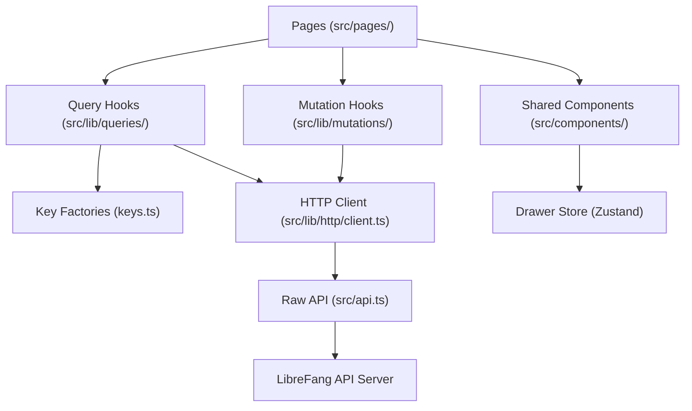

# Other — librefang-api-dashboard

# LibreFang Dashboard

## Overview

The LibreFang Dashboard is a single-page application built with **React 19**, **TanStack Router v1**, and **TanStack Query v5**. It provides a management interface for the LibreFang autonomous agent operating system — covering agents, sessions, approvals, channels, workflows, scheduling, analytics, memory, and runtime configuration.

- **Entry point**: `src/main.tsx`
- **Pages**: `src/pages/`
- **Package manager**: pnpm 10.33.0
- **Build tool**: Vite 8

## Architecture



## Data Layer

All data access from pages and components goes through the shared hooks layer. **Never call `fetch()` or `api.*` directly** inside a page or component file (except for documented exceptions).

### Directory Layout

```
src/lib/
  http/
    client.ts       # Thin wrapper over src/api.ts + typed re-exports
    errors.ts       # ApiError class used by the wrapper
  queries/
    keys.ts         # All query-key factories
    keys.test.ts    # Smoke tests for key factories
    <domain>.ts     # queryOptions + useXxx hooks per domain
  mutations/
    <domain>.ts     # useXxx mutation hooks with cache invalidation
```

### Current Domains

`agents`, `analytics`, `approvals`, `channels`, `config`, `goals`, `hands`, `mcp`, `media`, `memory`, `models`, `network`, `overview`, `plugins`, `providers`, `runtime`, `schedules`, `sessions`, `skills`, `workflows`.

### Query Key Factories

Every domain defines a hierarchical key factory in `src/lib/queries/keys.ts`. Sub-keys are always anchored to `[...fooKeys.all]` so broad invalidation works correctly:

```ts
export const fooKeys = {
  all: ["foo"] as const,
  lists: () => [...fooKeys.all, "list"] as const,
  list: (filters: FooFilters = {}) => [...fooKeys.lists(), filters] as const,
  details: () => [...fooKeys.all, "detail"] as const,
  detail: (id: string) => [...fooKeys.details(), id] as const,
};
```

### Query Hooks

Each domain file exports a `queryOptions` factory and a `useXxx` hook:

```ts
export const fooQueryOptions = (filters?: FooFilters) =>
  queryOptions({
    queryKey: fooKeys.list(filters ?? {}),
    queryFn: () => listFoo(filters),
    staleTime: 30_000,
  });

export function useFoo(filters?: FooFilters, options: UseFooOptions = {}) {
  const { enabled, staleTime, refetchInterval } = options;
  return useQuery({
    ...fooQueryOptions(filters),
    enabled,
    staleTime,
    refetchInterval,
  });
}
```

Hooks accept an optional `options` argument (`enabled`, `staleTime`, `refetchInterval`) so call sites can override per-page needs. Every override should have a short inline comment explaining why.

### Mutation Hooks

Every write operation **must invalidate** the relevant cache keys. Invalidation **must live inside the hook**, never at the call site.

Use the narrowest key set that covers what actually changed:

| Scenario | Keys to invalidate |
|---|---|
| Per-id update where list projection changes (patch, rename) | `fooKeys.lists()` + `fooKeys.detail(id)` |
| List-shape change, no existing detail (create, delete) | `fooKeys.lists()` |
| Scoped to one detail or nested sub-key, list unaffected | `fooKeys.detail(id)` or nested key |
| Bulk import / cache reset | `fooKeys.all` |

Call sites may attach per-call `onSuccess`/`onError` for UI feedback (toasts, modal dismissal) — that is orthogonal to invalidation.

### Adding a New Endpoint

1. Add the raw call in `src/api.ts` (or re-export via `src/lib/http/client.ts`).
2. Add a key factory in `src/lib/queries/keys.ts` following the hierarchical pattern.
3. Add query hooks in `src/lib/queries/<domain>.ts`.
4. Add mutation hooks in `src/lib/mutations/<domain>.ts` with appropriate invalidation.
5. Update `src/lib/queries/keys.test.ts` — add the factory to the "all factories exist" list, plus anchoring tests for non-trivial factories.

### Consuming in Pages

```tsx
import { useFoo } from "../lib/queries/foo";
import { useCreateFoo } from "../lib/mutations/foo";

function FooPage() {
  const { data, isLoading } = useFoo({ active: true });
  const createFoo = useCreateFoo();
}
```

Never build a `queryKey` inline — always call the factory. Never subscribe to the same endpoint with a different key just to get a subset; use `select` on the shared `queryOptions`.

### Exceptions (Uncached Data)

Streaming/SSE, imperative fire-and-forget control channels (e.g., terminal window lifecycle in `TerminalTabs.tsx`), and one-shot probes that must not be cached may call `fetch` directly. Keep these narrow and comment why.

## Authentication

Authentication tokens are stored in `sessionStorage` under the key `librefang-api-key` (never `localStorage`). The API layer sends tokens as:

- **HTTP requests**: `Authorization: Bearer <token>` header
- **WebSocket connections**: `Sec-WebSocket-Protocol: bearer.<token>` sub-protocol

The `verifyStoredAuth` function probes a protected endpoint and clears stale tokens on 401. The sign-in dialog is shown when the dashboard auth mode is `credentials` (detected via `/api/auth/dashboard-check`).

Key functions in `src/api.ts`: `setApiKey`, `verifyStoredAuth`, `buildAuthenticatedWebSocket`.

## Key Components

### DrawerPanel

`src/components/ui/DrawerPanel.tsx` — A global drawer slot backed by a Zustand store (`src/lib/drawerStore.ts`). Only one drawer can be open at a time. Ownership tracking prevents sibling drawers from collateral-closing each other when one transitions from open to closed in the same React commit (e.g., picker → config flow on ProvidersPage/ChannelsPage).

### MultiSelectCmdk

`src/components/ui/MultiSelectCmdk.tsx` — A combobox-style multi-select built on `cmdk`. Supports chip removal, backspace-to-remove, search filtering, and hides already-selected options from the dropdown.

### ToolCallsPanel

`src/components/ui/ToolCallsPanel.tsx` — Displays tool call history for an agent chat session. Shows a summary bar with count, running/error badges, and expands into a modal with per-call detail cards.

### PromptsExperimentsModal

`src/components/PromptsExperimentsModal.tsx` — Tabbed dialog for managing prompt versions and A/B experiments per agent. Uses mutation hooks from `src/lib/mutations/agents.ts` (`useCreatePromptVersion`, `useCreateExperiment`, `useActivatePromptVersion`, `useStartExperiment`, etc.).

### DeliveryTargetsEditor

`src/components/ui/DeliveryTargetsEditor.tsx` — Form editor for scheduler delivery targets (channel, webhook, local_file, email). Includes SSRF validation for webhook URLs (blocks localhost, loopback, link-local, metadata endpoints), path traversal checks for local_file, and strips empty optional fields.

## Utility Libraries

### `src/lib/agentManifest.ts`

TOML-based agent manifest parser and serializer using `smol-toml`. Handles:

- **Parsing**: `parseManifestToml(toml)` → structured form + extras (preserves unknown fields)
- **Serialization**: `serializeManifestForm(form, extras)` → valid TOML
- **Validation**: `validateManifestForm(form)` → error array
- **Round-trip safety**: Handles edge cases like exec_policy alias normalization, response_format mutual exclusion with preserved extras, nested-table section scoping, negative/out-of-range integer rejection, and per-fallback-model extra_params preservation.

### `src/lib/agentManifestMarkdown.ts`

Generates human-readable Markdown documentation from a manifest form. Used for agent detail views.

### `src/lib/chat.ts`

Chat message utilities:

- `normalizeRole` — normalizes API role strings to lowercase
- `asText` — converts unknown content to string
- `formatMeta` — formats token/cost/iteration metadata
- `normalizeToolOutput` — normalizes tool output events for display
- `extractAssistantHistoryParts` — separates text and thinking blocks from content block arrays, joining each with double newlines for paragraph breaks

### `src/lib/chatPicker.ts`

`groupedPicker(agents, hands, showHandAgents)` — Groups agents into standalone vs. hand-instance groups for the chat agent picker. Handles loading states (keeps `is_hand` agents visible while hand instances are loading), sorts groups alphabetically, orders roles with coordinator first.

### `src/lib/csvParser.ts`

RFC-4180-compliant CSV parser. Handles quoted fields with embedded newlines/commas, escaped double-quotes, BOM, CRLF/CR line endings. `parseUsersCsv` validates required columns (`name`, `role`) and maps unknown columns to channel bindings.

### `src/lib/trafficSplit.ts`

`buildEvenTrafficSplit(n)` — Distributes 100 traffic buckets as evenly as possible across `n` variants.

## Service Worker and PWA

The dashboard is an installable PWA:

- **Manifest**: `public/manifest.json` — standalone display mode, start URL `/dashboard/#/overview`
- **Service Worker**: `public/sw.js` — precaches `/dashboard/`, uses stale-while-revalidate for static assets, network-only for API requests
- **Icons**: `icon-192.png`, `icon-512.png`

## Internationalization

Uses `i18next` with `react-i18next`. Locale files live in `src/locales/` with `en.json` as the reference. Parity is enforced by:

- **Vitest**: `src/lib/__tests__/locale-parity.test.ts` (runs as part of `pnpm test`)
- **CLI script**: `scripts/i18n-parity.mjs` — standalone check for quick pre-commit verification

Both flatten each locale's keys and report missing/extra keys relative to `en.json`.

## Testing

### Unit Tests

- **Runner**: Vitest with jsdom
- **Libraries**: `@testing-library/react`, `@testing-library/user-event`
- **Location**: Co-located `*.test.ts(x)` files

### Test Utilities

`src/lib/test/query-client.tsx` exports `createQueryClientWrapper` — a React wrapper that provides a fresh `QueryClient` for hook tests and exposes it for spying on `invalidateQueries`.

### E2E Tests

- **Runner**: Playwright
- **Config**: `playwright.config.ts` — targets `http://127.0.0.1:4173`, starts dev server automatically
- **Location**: `e2e/`
- **Coverage**: Shell navigation (sidebar links, page headings), auth dialog appearance

### Key Test Patterns

- **Mutation invalidation**: Each mutation hook test verifies exact `invalidateQueries` calls with specific key factories (e.g., `agentKeys.detail(id)`, `sessionKeys.lists()`)
- **Component isolation**: Heavy mocks for `react-i18next` (returns key as text), `motion/react` (renders plain elements), and data hooks
- **Edge case coverage**: CSV parsing (BOM, embedded newlines), manifest round-trips (section scoping, alias normalization, mutual exclusion), drawer ownership races

## Build & Verify

```bash
pnpm typecheck          # tsc --noEmit — must be green
pnpm test --run         # vitest — all tests pass
pnpm build              # vite build — must succeed
```

Run all three after any change to `src/lib/queries/`, `src/lib/mutations/`, or `src/api.ts`. A passing typecheck alone is insufficient — key-factory tests catch anchoring regressions that the compiler does not.

### Additional Scripts

```bash
pnpm dev                          # Vite dev server
pnpm preview                      # Preview production build
pnpm openapi:types                # Generate types from OpenAPI spec
pnpm test:watch                   # Vitest in watch mode
pnpm test:i18n-parity             # Check locale key parity
pnpm e2e                          # Playwright end-to-end tests
```

## Conventions

- **TypeScript strict mode** — no `any` in new hooks; use types from `src/api.ts` or `openapi/generated.ts`
- **Hooks set sensible defaults** — shared `staleTime`/`refetchInterval` inherited by consumers; override per call site with inline comment
- **Mutation invalidation in the hook** — callers never need to know which keys a mutation touches
- **Commit convention**: `feat(dashboard/<area>):`, `refactor(dashboard/<area>):`, `fix(dashboard/<area>):` — never include `Co-Authored-By` footer

## Navigation Structure

The sidebar exposes these sections (verified by E2E):

Overview · Agents · Sessions · Approvals · Comms · Providers · Channels · Skills · Hands · Workflows · Scheduler · Goals · Analytics · Memory · Runtime · Logs