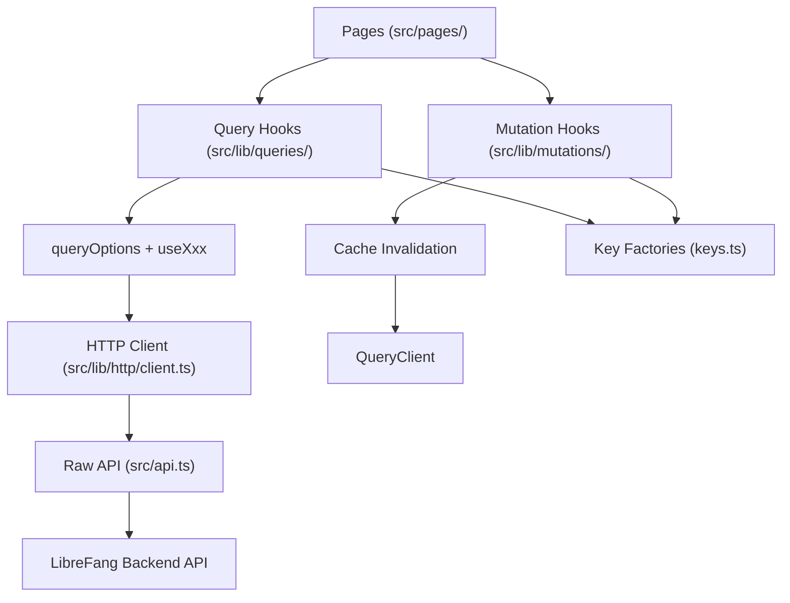

# Other — librefang-api-dashboard

# LibreFang API Dashboard

A single-page application for managing and monitoring the LibreFang autonomous agent operating system. Built with React 19, TanStack Router v1, TanStack Query v5, and Vite 7.

## Architecture Overview



All data flows through a strict layered pipeline. Pages and components never call `fetch()` or `src/api.ts` directly — they consume TanStack Query hooks from the `src/lib/` layer. The only exceptions are streaming/SSE connections and fire-and-forget control channels (e.g., `TerminalTabs.tsx`).

## Directory Structure

```
dashboard/
├── e2e/                          # Playwright end-to-end tests
├── public/
│   ├── manifest.json             # PWA manifest
│   ├── sw.js                     # Service worker (stale-while-revalidate for static assets)
│   ├── icon-192.png / icon-512.png
├── src/
│   ├── main.tsx                  # Application entry point
│   ├── api.ts                    # Raw fetch wrappers, auth helpers, type definitions
│   ├── pages/                    # Route page components
│   ├── components/               # Shared UI components
│   │   └── ui/                   # Primitives (MultiSelectCmdk, etc.)
│   ├── lib/
│   │   ├── http/
│   │   │   ├── client.ts         # Thin typed wrapper over api.ts
│   │   │   └── errors.ts         # ApiError class
│   │   ├── queries/
│   │   │   ├── keys.ts           # Query-key factories for all domains
│   │   │   ├── keys.test.ts      # Anchoring/hierarchy smoke tests
│   │   │   └── <domain>.ts       # queryOptions + useXxx hooks
│   │   ├── mutations/
│   │   │   └── <domain>.ts       # useXxx mutation hooks with invalidation
│   │   ├── agentManifest.ts      # TOML manifest parse/serialize/validate
│   │   ├── agentManifestMarkdown.ts
│   │   ├── chat.ts               # Message normalization utilities
│   │   ├── chatPicker.ts         # Agent/hand grouping for chat selectors
│   │   └── test/
│   │       └── query-client.tsx  # createQueryClientWrapper for hook tests
│   ├── openapi/
│   │   └── generated.ts          # Auto-generated types from OpenAPI schema
│   └── setupTests.ts
├── index.html
├── package.json
├── vite.config.ts
├── playwright.config.ts
└── AGENTS.md                     # Agent/contributor instructions
```

## Data Layer

### Query Key Factories

Every domain has a hierarchical key factory in `src/lib/queries/keys.ts`. All sub-keys are anchored to the domain's root key so broad invalidation works correctly.

```ts
export const fooKeys = {
  all: ["foo"] as const,
  lists: () => [...fooKeys.all, "list"] as const,
  list: (filters: FooFilters = {}) => [...fooKeys.lists(), filters] as const,
  details: () => [...fooKeys.all, "detail"] as const,
  detail: (id: string) => [...fooKeys.details(), id] as const,
};
```

Current domains: `agents`, `analytics`, `approvals`, `channels`, `config`, `cron`, `fanghub`, `goals`, `hands`, `mcp`, `media`, `memory`, `models`, `network`, `overview`, `plugins`, `providers`, `runtime`, `schedules`, `sessions`, `skills`, `triggers`, `workflows`.

Key factories are tested in `keys.test.ts` — at minimum every factory appears in the "all factories exist" list, and non-trivial hierarchies have anchoring tests. These tests catch regressions that TypeScript alone does not.

### Query Hooks

Each domain file in `src/lib/queries/` exports `queryOptions` and a `useXxx` hook:

```ts
export const fooQueryOptions = (filters?: FooFilters) =>
  queryOptions({
    queryKey: fooKeys.list(filters ?? {}),
    queryFn: () => listFoo(filters),
    staleTime: 30_000,
  });

type UseFooOptions = {
  enabled?: boolean;
  staleTime?: number;
  refetchInterval?: number | false;
};

export function useFoo(filters?: FooFilters, options: UseFooOptions = {}) {
  const { enabled, staleTime, refetchInterval } = options;
  return useQuery({
    ...fooQueryOptions(filters),
    enabled,
    staleTime,
    refetchInterval,
  });
}
```

Hooks set sensible defaults in `queryOptions` so consumers without special needs inherit a consistent policy. The `enabled`, `staleTime`, and `refetchInterval` overrides let call sites adjust per-page behavior — for example:

- `useApprovals({ enabled: open })` — gates polling to when the approval panel is open
- `useCommsEvents(50, { refetchInterval: 5_000 })` — polls at 5s for live events
- `useAgentTemplates({ enabled })` — lazy-loads templates only when a dialog opens
- `useApprovalCount({ refetchInterval: 5_000 })` — drives the bell icon badge

Every call-site override carries a short inline comment explaining why.

### Mutation Hooks

Mutations live in `src/lib/mutations/<domain>.ts`. **Every write operation must invalidate** affected query keys, and the invalidation logic must live inside the hook — callers never need to know which keys a mutation touches.

#### Invalidation Strategy

Choose the narrowest key set that covers what actually changed:

| Scenario | Keys to invalidate | Examples |
|----------|-------------------|---------|
| Per-id update that also changes the list projection | `detail(id)` + `lists()` | `usePatchAgentConfig`, `useUpdateWorkflow` |
| List-shape change with no existing detail | `lists()` | `useCreateWorkflow`, `useDeleteAgent` |
| Scoped to one detail or nested collection | `detail(id)` or nested sub-key | `useDeletePromptVersion` |
| Cross-domain or bulk reset | `.all` | `useSpawnAgent`, `useActivateHand` |

```ts
// Default template: per-id patch where the list projection also changes
export function useUpdateFoo() {
  const qc = useQueryClient();
  return useMutation({
    mutationFn: updateFoo,
    onSuccess: (_data, variables) => {
      qc.invalidateQueries({ queryKey: fooKeys.lists() });
      qc.invalidateQueries({ queryKey: fooKeys.detail(variables.id) });
    },
  });
}
```

Avoid over-invalidating with `.all` — it refetches every cached sub-key for every cached item. Reserve it for true bulk operations like `useImportFoos` or cache resets.

Call sites may additionally attach `onSuccess`/`onError` for UI feedback (toasts, modal dismissal, state resets). This is orthogonal to invalidation and stays at the call site.

## Navigation & Pages

The dashboard exposes these top-level routes (confirmed by the E2E shell test):

| Route | Purpose |
|-------|---------|
| Overview | System snapshot, key metrics |
| Agents | Agent management, config editing, prompt experiments |
| Sessions | Active and past agent sessions |
| Approvals | Pending human-approval requests |
| Comms | Communications events, channel testing |
| Providers | LLM provider configuration |
| Channels | Channel bridge management |
| Skills | Skill installation, FangHub/ClawHub browsing |
| Hands | Multi-agent hand orchestration |
| Workflows | Workflow builder, execution history |
| Scheduler | Cron schedules and triggers |
| Goals | Agent goal tracking |
| Analytics | Usage metrics and charts |
| Memory | Agent memory inspection and cleanup |
| Runtime | Backups, tasks, server controls |
| Logs | System log viewer |

## Authentication

The dashboard supports credentials-based authentication. When `GET /api/auth/dashboard-check` returns `{ mode: "credentials" }`, a sign-in dialog is presented. The API key is stored in `localStorage` under `librefang-api-key` and attached as a `Bearer` token on all subsequent requests via `buildHeaders()` / `authHeader()`.

Key auth helpers in `src/api.ts`:

- `setApiKey(key)` / `getStoredApiKey()` / `clearApiKey()` — manage the stored token
- `verifyStoredAuth()` — probes a protected endpoint; clears stale tokens on 401
- `buildAuthenticatedWebSocketUrl(path)` — appends `?token=` to WebSocket URLs

## Agent Manifest System

Agent configurations are defined in TOML manifests. The `src/lib/agentManifest.ts` module provides a full parse/serialize/validate pipeline with round-trip fidelity.

### Form State Model

The manifest form represents every known TOML field as a dedicated property (strings for numeric fields to handle partial input). Unknown fields are preserved in an `extras` structure, ensuring hand-edited TOML survives a round-trip through the dashboard editor.

Key capabilities:

- **`emptyManifestForm()`** — creates a blank form with all defaults
- **`parseManifestToml(toml)`** — parses TOML into `{ ok, form, extras, message? }`; normalizes aliases (e.g., `exec_policy: "none"` → `"deny"`)
- **`serializeManifestForm(form, extras?)`** — produces TOML with a deterministic field order; omits defaults and empty values
- **`validateManifestForm(form)`** — returns an array of field paths with errors (e.g., missing `name`, `model.provider`, `model.model`)

### Advanced Fields

First-class form fields include: `thinking` (budget, streaming), `autonomous` (iterations, heartbeats), `routing` (simple/medium/complex model tiers), `fallback_models[]`, `context_injection[]`, `response_format`, `schedule` (periodic/continuous), `exec_policy_shorthand`, and `workspace`/`priority`/`session_mode`.

### Markdown Preview

`generateManifestMarkdown(form, extras?)` in `agentManifestMarkdown.ts` produces a human-readable Markdown summary for agent detail views.

## Chat & Messaging Utilities

`src/lib/chat.ts` provides normalization helpers:

- **`normalizeRole(role)`** — maps API casing (`"User"`) to lowercase (`"user"`)
- **`asText(content)`** — converts string or JSON content to display text
- **`formatMeta(meta)`** — formats token usage and cost metadata
- **`normalizeToolOutput(event)`** — extracts tool name, content, and error status from tool result events

`src/lib/chatPicker.ts` provides `groupedPicker(agents, hands, showHandAgents)` which organizes agents into standalone vs. hand-grouped entries for chat target selection, with coordinator-first ordering and alphabetical fallback.

## Service Worker & PWA

The dashboard is a PWA with offline support:

- **`public/manifest.json`** — standalone display mode, dark theme (`#020617` background)
- **`public/sw.js`** — caches `/dashboard/` on install; uses stale-while-revalidate for static GETs; skips API requests entirely

## API Layer

`src/api.ts` contains all raw HTTP functions and type definitions. It handles:

- Bearer token injection via `buildHeaders()`
- Error parsing via `parseError()` → `ApiError`
- WebSocket URL construction with auth tokens
- Response normalization (e.g., `listTools` handles both `{ tools: [...] }` and bare `[...]` responses)

`src/lib/http/client.ts` re-exports these with tighter typing. Generated types from the backend OpenAPI schema live in `openapi/generated.ts` and are refreshed with `pnpm openapi:types`.

## Testing

### Unit Tests (Vitest)

```bash
pnpm test --run          # Run all vitest tests
pnpm test:watch          # Watch mode
```

Hook tests use `createQueryClientWrapper` from `src/lib/test/query-client.tsx`, which provides a real `QueryClient` with spyable `invalidateQueries`. The pattern:

```ts
const { queryClient, wrapper } = createQueryClientWrapper();
const invalidateSpy = vi.spyOn(queryClient, "invalidateQueries");
const { result } = renderHook(() => useMyMutation(), { wrapper });

await result.current.mutateAsync(payload);
expect(invalidateSpy).toHaveBeenCalledWith({ queryKey: expectedKey });
```

Test categories:
- **Key factory tests** (`keys.test.ts`) — anchoring and hierarchy verification
- **Query hook tests** — enabled/disabled guards, correct key usage, data flow
- **Mutation hook tests** — invalidation correctness, narrow key targeting
- **Utility tests** — TOML round-trips, chat normalization, chat picker grouping

### End-to-End Tests (Playwright)

```bash
pnpm e2e
```

Playwright runs against a dev server on `127.0.0.1:4173`. Tests cover:
- Shell navigation (all sidebar links visible and functional)
- Auth dialog appearance when credentials are required

### Type Checking

```bash
pnpm typecheck           # tsc --noEmit
```

TypeScript strict mode. No `any` in new hooks — lean on types from `api.ts` or `openapi/generated.ts`.

## Build & Verification

Run all three after any change to `src/lib/queries/`, `src/lib/mutations/`, or `src/api.ts`:

```bash
pnpm typecheck           # Must pass
pnpm test --run          # Must pass (catches key anchoring regressions tsc misses)
pnpm build               # vite build — must succeed
```

A passing typecheck alone is insufficient — the key-factory tests catch structural issues the compiler cannot.

## Adding a New Endpoint

1. Add the raw call in `src/api.ts` (or re-export via `src/lib/http/client.ts`)
2. Add a key factory in `src/lib/queries/keys.ts` following the hierarchical pattern, anchored to `.all`
3. Add `queryOptions` + `useXxx` in `src/lib/queries/<domain>.ts`
4. Add mutation hooks in `src/lib/mutations/<domain>.ts` with narrow invalidation
5. Add tests in `keys.test.ts` (minimum: factory existence) and corresponding mutation/query test files
6. Regenerate types if the API schema changed: `pnpm openapi:types`

## Commit Convention

```
feat(dashboard/<area>): ...
refactor(dashboard/queries): ...
fix(dashboard/<area>): ...
```

Never include a `Co-Authored-By` footer.