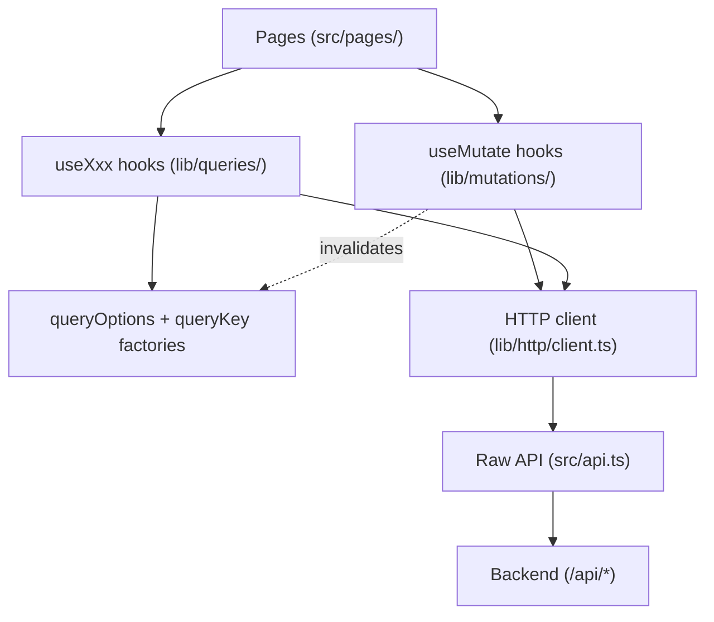

# Other — librefang-api-dashboard

# LibreFang API Dashboard

## Overview

The LibreFang Dashboard is a single-page application providing the web management interface for the LibreFang autonomous agent operating system. It is built on **React 19**, **TanStack Router v1**, and **TanStack Query v5**, with a strict layered data architecture that separates pages from API concerns through a shared hooks layer.

The dashboard covers every operational surface of the system: agent lifecycle management, session inspection, approval gates, channel configuration, skill installation, workflow execution, memory management, analytics, runtime control, and more.

## Architecture



### Directory Layout

```
src/
  main.tsx                    # Application entry point
  api.ts                      # Raw fetch wrappers, auth helpers, WebSocket URL builder
  index.css                   # Tailwind v4 theme, animation system, dark mode
  lib/
    http/
      client.ts               # Thin wrapper over api.ts + typed re-exports
      errors.ts               # ApiError class
    queries/
      keys.ts                 # All query-key factories (hierarchical)
      keys.test.ts            # Anchoring and smoke tests for key factories
      <domain>.ts             # queryOptions + useXxx hooks per domain
    mutations/
      <domain>.ts             # useXxx mutation hooks with cache invalidation
    agentManifest.ts          # TOML parse/serialize for agent manifests
    agentManifestMarkdown.ts  # Markdown generation from manifest form state
    chat.ts                   # Message normalization, usage formatting
    chatPicker.ts             # Agent/hand grouping for chat picker UI
    csvParser.ts              # RFC-4180 CSV parser for user imports
    test/
      query-client.tsx        # Shared TanStack Query test wrapper
  pages/                      # Route page components
  components/
    ui/                       # Reusable UI primitives (MultiSelectCmdk, DeliveryTargetsEditor, etc.)
e2e/
  dashboard.spec.ts           # Playwright end-to-end tests
public/
  sw.js                       # Service worker (stale-while-revalidate for static assets)
  manifest.json               # PWA manifest
```

## Data Layer

The dashboard enforces a strict unidirectional data flow. Pages and components never call `fetch()` or `api.*` directly — all data access goes through the hooks layer.

### Query Key Factories

Every domain has a hierarchical key factory in `src/lib/queries/keys.ts`. All sub-keys are anchored to the domain's `all` key so that broad invalidation works correctly:

```ts
export const agentKeys = {
  all:        ["agents"] as const,
  lists:      ()            => [...agentKeys.all, "list"] as const,
  list:       (filters)     => [...agentKeys.lists(), filters] as const,
  details:    ()            => [...agentKeys.all, "detail"] as const,
  detail:     (id: string)  => [...agentKeys.details(), id] as const,
  sessions:   (id: string)  => [...agentKeys.detail(id), "sessions"] as const,
  experiments:(id: string)  => [...agentKeys.detail(id), "experiments"] as const,
  promptVersions:(id:string)=> [...agentKeys.detail(id), "promptVersions"] as const,
};
```

**Why anchoring matters**: A mutation that invalidates `agentKeys.all` will refetch every cached sub-key (`detail(id)`, `sessions(id)`, `experiments(id)`, etc.) for every cached agent. This is why mutations default to the narrowest valid keys and reserve `all` for truly cross-cutting changes.

### Query Hooks

Each domain file exports `queryOptions` (for prefetching/suspense) and a `useXxx` hook:

```ts
export const agentQueryOptions = (filters?: AgentFilters) =>
  queryOptions({
    queryKey: agentKeys.list(filters ?? {}),
    queryFn:  () => listAgents(filters),
    staleTime: 30_000,
  });

export function useAgents(filters?: AgentFilters, options: UseAgentsOptions = {}) {
  const { enabled, staleTime, refetchInterval } = options;
  return useQuery({
    ...agentQueryOptions(filters),
    enabled,
    staleTime,
    refetchInterval,
  });
}
```

The options passthrough (`enabled`, `staleTime`, `refetchInterval`) lets call sites override polling/gating without rebuilding queries. Every override carries an inline comment explaining why. Examples in the codebase:

- `useApprovals({ enabled: open })` — only poll when the panel is open
- `useCommsEvents(50, { refetchInterval: 5_000 })` — fast poll for live events
- `useModels({}, { enabled: isModelArg })` — gate on tab state

### Mutation Hooks

Mutations encapsulate both the write operation **and** the cache invalidation logic. Call sites never need to know which keys are affected:

```ts
export function usePatchAgent() {
  const qc = useQueryClient();
  return useMutation({
    mutationFn: patchAgent,
    onSuccess: (_data, variables) => {
      qc.invalidateQueries({ queryKey: agentKeys.lists() });
      qc.invalidateQueries({ queryKey: agentKeys.detail(variables.agentId) });
    },
  });
}
```

**Invalidation scope guidelines** (from narrowest to broadest):

| Scope | When to use | Example |
|---|---|---|
| `domainKeys.detail(id)` + `domainKeys.lists()` | Per-id update where the list projection also changes (default template) | `usePatchAgent`, `useSetSessionLabel` |
| `domainKeys.lists()` | List-shape change, no existing detail is stale | `useCreateAgentSession`, `useDeleteSchedule` |
| `domainKeys.detail(id)` or nested sub-key | Change scoped to one detail or nested collection, list unaffected | `useDeletePromptVersion` → `agentKeys.promptVersions(id)` |
| `domainKeys.all` | Bulk import, cache reset, cross-cutting schema change | `useActivateHand` (affects agents + hands + overview) |

Call sites may attach their own `onSuccess`/`onError` for UI feedback (toasts, modal dismissal) — this is orthogonal to invalidation and stays at the call site.

### Adding a New Endpoint

1. Add the raw call in `src/api.ts` (or re-export via `src/lib/http/client.ts`).
2. Add a key factory in `src/lib/queries/keys.ts` anchored to `all`.
3. Add `queryOptions` + `useXxx` in `src/lib/queries/<domain>.ts`.
4. Add mutation(s) in `src/lib/mutations/<domain>.ts` with invalidation.
5. Update `src/lib/queries/keys.test.ts` with anchoring tests.
6. Run `pnpm typecheck && pnpm test --run && pnpm build`.

### Exceptions: Non-Cached Data

Streaming/SSE connections, imperative fire-and-forget control channels (e.g. terminal window lifecycle in `TerminalTabs.tsx`), and one-shot probes that must not be cached may call `fetch` directly. These are kept narrow and annotated with comments explaining why.

## Authentication

The dashboard authenticates to the backend using an API key stored in `localStorage` under the key `librefang-api-key`:

- `setApiKey(token)` — stores the key
- `getStoredApiKey()` — retrieves it
- `clearApiKey()` — removes it
- `verifyStoredAuth()` — probes a protected endpoint; clears the key on 401
- `buildAuthenticatedWebSocketUrl(path)` — appends `?token=...` for WebSocket connections

All API calls go through `buildHeaders()` → `authHeader()` which attaches `Authorization: Bearer <key>`.

The sign-in dialog appears when `/api/auth/dashboard-check` returns `{ mode: "credentials" }`.

## Agent Manifest System

`src/lib/agentManifest.ts` handles round-tripping agent configuration as TOML — the kernel's native format.

### Core Functions

| Function | Purpose |
|---|---|
| `parseManifestToml(toml)` | Parse TOML string → `{ ok, form, extras }` |
| `serializeManifestForm(form, extras?)` | Serialize form state → TOML string |
| `validateManifestForm(form)` | Return array of missing required field names |
| `emptyManifestForm()` | Create blank form with sensible defaults |
| `emptyManifestExtras()` | Create blank extras container for unknown fields |

### Key Design Decisions

**Form vs. Extras**: The form captures all first-class fields the UI knows about (name, model, resources, capabilities, thinking, autonomous, routing, fallback_models, context_injection, response_format, exec_policy, schedule, etc.). Anything the form doesn't understand (custom provider params, future schema extensions) is preserved in `extras` and re-serialized verbatim — so round-tripping through the dashboard never loses data.

**Mutual exclusion**: When the user picks a form-managed value (e.g., `exec_policy_shorthand = "deny"`), the serializer suppresses the preserved `[exec_policy]` table extras to avoid TOML key/table redefinition conflicts. The same applies to `response_format`.

**Number handling**: `parseInteger` rejects negative values and integers above `MAX_SAFE_INTEGER` — the kernel's u32/u64 deserializers would reject these, so the serializer omits them rather than emitting invalid TOML.

**Alias normalization**: `exec_policy` aliases (`none`/`disabled` → `deny`, `restricted` → `allowlist`, `all`/`unrestricted` → `full`) are normalized at parse time so the form dropdown always shows the canonical value.

### Markdown Generation

`src/lib/agentManifestMarkdown.ts` generates human-readable Markdown from manifest form state, used for agent detail views and export.

## UI Components

### MultiSelectCmdk

A command-palette-style multi-select built on `cmdk`. Supports:
- Chip display with per-item remove buttons
- Backspace to remove last selection
- Search filtering of available options
- Already-selected items hidden from the dropdown

### DeliveryTargetsEditor

Builder for scheduler delivery targets with four target types and validation:

| Type | Required fields | Validation |
|---|---|---|
| `channel` | `channel_type`, `recipient` | Optional `thread_id`, `account_id` stripped when empty |
| `webhook` | `url` | Must be http(s), blocks localhost/loopback/link-local/metadata IPs (SSRF protection) |
| `local_file` | `path` | Rejects absolute paths and `..` traversal |
| `email` | `to` | Optional `subject_template` stripped when empty |

## Chat and Picker Utilities

### `chat.ts`

- `normalizeRole(role)` — normalizes API PascalCase roles (`User` → `user`)
- `asText(value)` — converts unknown message content to string
- `formatMeta(usage)` — formats token counts, iterations, and cost
- `normalizeToolOutput(event)` — extracts persistent display data from tool output events

### `chatPicker.ts`

`groupedPicker(agents, hands, showHandAgents)` partitions agents into standalone agents and hand groups for the chat picker UI:

- When `showHandAgents` is false, returns a flat list (hand agents included as standalone)
- Active hands are grouped under their hand name, sorted alphabetically
- Within each group, the coordinator agent is listed first, then others alphabetically by role
- Paused/empty hands are hidden entirely

## CSV Parser

`csvParser.ts` implements RFC-4180 CSV parsing for user bulk imports:

- Strips UTF-8 BOM from input
- Preserves embedded newlines and commas inside quoted fields
- Handles CRLF, CR, and LF line endings
- `parseUsersCsv(csv, roles)` validates required `name`/`role` columns, flags invalid roles, and maps unknown columns to `channel_bindings`

## Styling and Theming

The dashboard uses **Tailwind CSS v4** with a semantic color palette defined as CSS custom properties:

```
--color-brand         → Semantic brand color (Sky 600 light / Sky 400 dark)
--color-success       → Emerald
--color-warning       → Amber
--color-error         → Rose
--color-accent        → Violet
--color-main          → Page background
--color-surface       → Card/panel background
--color-surface-hover → Hover state
--color-border-subtle → Subtle borders
--color-text-dim      → Muted text
```

Custom breakpoints extend Tailwind's defaults for QHD (1920px) and 4K (2560px) displays.

### Animation System

Apple-style spring physics animations are defined in `src/index.css`:

- `animate-fade-in-up` — page entrance (fade + rise + deblur, 600ms)
- `animate-fade-in-scale` — modal entrance (scale spring + deblur, 500ms)
- `animate-slide-in-right` — panel slide-in (280ms)
- `animate-message-in` — chat message entrance (220ms, no blur)
- `.stagger-children` — cascaded entrance with 40ms offset per child (disabled on mobile)
- `.card-glow` — hover depth effect with spring transitions

All animations respect `prefers-reduced-motion: reduce`.

## Service Worker

`public/sw.js` provides offline-capable caching:

- **API requests** (`/api/*`): network-only, never cached
- **Static assets**: stale-while-revalidate
- **Non-GET requests**: bypassed entirely
- Precaches `/dashboard/` on install

## Testing

### Unit Tests (Vitest + React Testing Library)

```bash
pnpm test --run        # Run all unit tests
pnpm test:watch        # Watch mode
```

Key test areas:
- **Mutation invalidation**: Every mutation hook has tests verifying the exact query keys it invalidates (see `src/lib/mutations/*.test.tsx`)
- **Key factory anchoring**: `keys.test.ts` verifies all factories exist and sub-keys are properly anchored to `all`
- **Agent manifest round-tripping**: `agentManifest.test.ts` covers parse → serialize → re-parse for full fidelity, including edge cases (negative integers, exec_policy aliases, response_format mutual exclusion, nested-table extras)
- **CSV parsing**: RFC-4180 compliance, BOM handling, embedded newlines
- **UI components**: `MultiSelectCmdk`, `DeliveryTargetsEditor` tested via Testing Library + userEvent

### E2E Tests (Playwright)

```bash
pnpm e2e               # Run Playwright tests against dev server
```

The E2E suite verifies:
- Dashboard shell loads with all navigation links visible (Overview, Agents, Sessions, Approvals, Comms, Providers, Channels, Skills, Hands, Workflows, Scheduler, Goals, Analytics, Memory, Runtime, Logs)
- Page navigation works (Comms → Hands → Goals)
- Sign-in dialog appears when credentials are required

Configuration in `playwright.config.ts` runs against `http://127.0.0.1:4173` with a 30-second timeout and trace-on-first-retry.

### Build Verification

After any change to queries, mutations, or `api.ts`, all three must pass:

```bash
pnpm typecheck         # tsc --noEmit
pnpm test --run        # vitest
pnpm build             # vite build
```

Typecheck alone is insufficient — the key-factory tests catch anchoring regressions that the compiler cannot.

## Build and Development

```bash
pnpm dev               # Vite dev server
pnpm build             # Production build
pnpm preview           # Preview production build
pnpm typecheck         # TypeScript check
pnpm openapi:types     # Generate types from OpenAPI spec at http://127.0.0.1:4545/api/openapi.json
```

The dashboard targets the LibreFang API at `http://127.0.0.1:4545` by default. OpenAPI types are generated via `openapi-typescript` into `openapi/generated.ts`.

## Connection to the Rest of the System

The dashboard is the primary operational interface for the LibreFang kernel. It communicates exclusively via the HTTP API (`/api/*`) and authenticated WebSocket connections:

- **Agent lifecycle**: spawn, clone, suspend, resume, delete agents; patch configs and tool allowlists
- **Session streaming**: real-time message streams via WebSocket (`/api/agents/{id}/ws`)
- **Approval gates**: approve/reject pending human-in-the-loop decisions
- **Channel bridges**: configure Telegram, Discord, and other channel integrations
- **Skill management**: install from FangHub, ClawHub, or SkillHub registries
- **Hand orchestration**: activate/deactivate/pause multi-agent hand instances
- **Workflow execution**: run and dry-run workflows with live status tracking
- **Runtime control**: create/restore backups, manage task queues, trigger session cleanup, shutdown server

All write operations flow through the mutation hooks layer, ensuring cache consistency across the SPA without manual refresh.