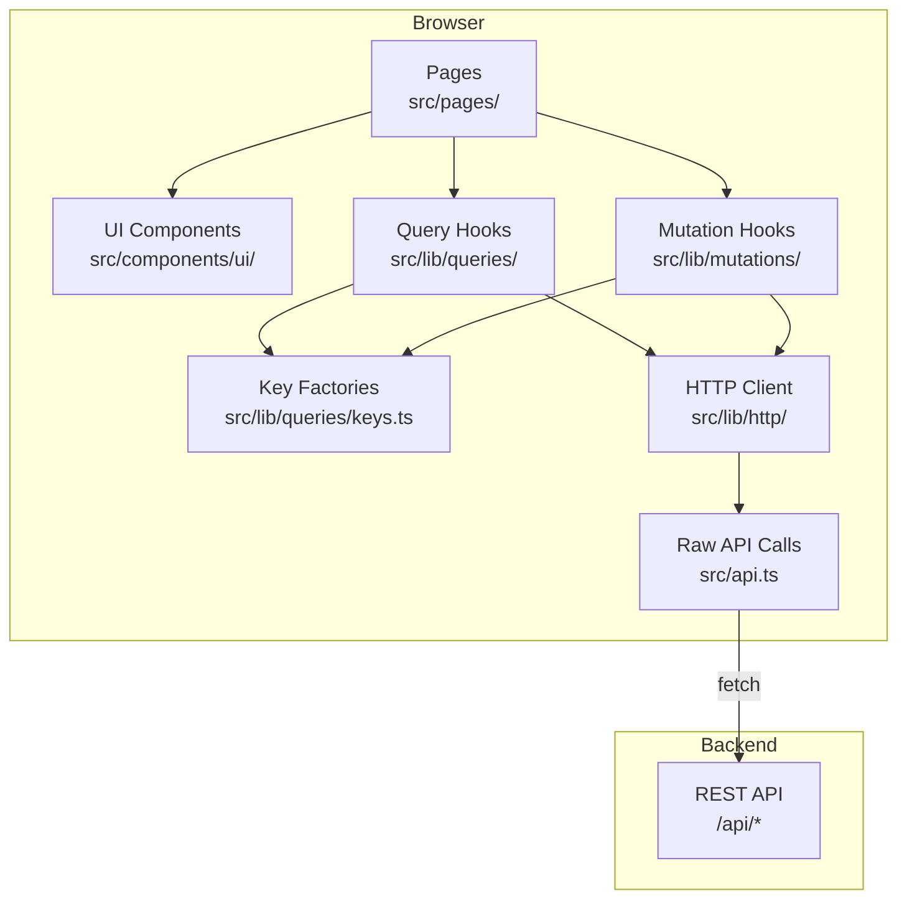

# Other — librefang-api-dashboard

# LibreFang API Dashboard

## Overview

The dashboard is a single-page application providing the management interface for the LibreFang autonomous agent operating system. It is built with React 19, TanStack Router v1 for routing, and TanStack Query v5 for server-state management. The entry point is `src/main.tsx`; route pages live in `src/pages/`.

The application supports 17+ domain areas including agents, sessions, approvals, channels, providers, skills, hands, workflows, scheduling, goals, analytics, memory, runtime, and more.

## Architecture



**Data flow rule**: Pages and components never call `fetch()` or `api.*` directly. All data access goes through the hooks layer (`src/lib/queries/` and `src/lib/mutations/`). The only exceptions are streaming/SSE endpoints, imperative terminal control channels, and one-shot probes that must not be cached — these are kept narrow with inline comments explaining the exception.

## Tech Stack

| Layer | Technology |
|-------|-----------|
| Framework | React 19 |
| Routing | TanStack Router v1 |
| Server state | TanStack Query v5 |
| Client state | Zustand |
| Styling | Tailwind CSS v4 |
| Animations | Motion (Framer Motion) |
| Markdown rendering | react-markdown + remark-gfm + remark-math + rehype-katex |
| Charts | Recharts |
| Workflow canvas | XYFlow (React) |
| Terminal | xterm.js |
| TOML handling | smol-toml |
| i18n | i18next + react-i18next |
| Command palette | cmdk |
| Build | Vite 8 |
| Type generation | openapi-typescript |
| Testing | Vitest + Testing Library + Playwright |
| Package manager | pnpm 10 |

## Data Layer

### Directory Layout

```
src/lib/
  http/
    client.ts     # Thin wrapper over src/api.ts + typed re-exports
    errors.ts     # ApiError class used by the wrapper
  queries/
    keys.ts       # All query-key factories
    keys.test.ts  # Smoke tests for key anchoring
    <domain>.ts   # queryOptions + useXxx hooks per domain
  mutations/
    <domain>.ts   # useXxx mutation hooks with cache invalidation
```

Current domain files: `agents`, `analytics`, `approvals`, `channels`, `config`, `goals`, `hands`, `mcp`, `media`, `memory`, `models`, `network`, `overview`, `plugins`, `providers`, `runtime`, `schedules`, `sessions`, `skills`, `workflows`.

### Query Key Factories

All query keys are defined in `src/lib/queries/keys.ts` using a hierarchical pattern. Every sub-key is anchored to the domain's `all` key so that broad invalidation works correctly:

```ts
export const fooKeys = {
  all: ["foo"] as const,
  lists: () => [...fooKeys.all, "list"] as const,
  list: (filters: FooFilters = {}) => [...fooKeys.lists(), filters] as const,
  details: () => [...fooKeys.all, "detail"] as const,
  detail: (id: string) => [...fooKeys.details(), id] as const,
};
```

Never construct a `queryKey` inline — always call the factory. Never subscribe to the same endpoint with a different key for a subset; use `select` on the shared `queryOptions` instead.

### Query Hooks

Each domain file exports a `queryOptions` factory and a corresponding `useXxx` hook:

```ts
export const fooQueryOptions = (filters?: FooFilters) =>
  queryOptions({
    queryKey: fooKeys.list(filters ?? {}),
    queryFn: () => listFoo(filters),
    staleTime: 30_000,
  });

export function useFoo(filters?: FooFilters, options: UseFooOptions = {}) {
  const { enabled, staleTime, refetchInterval } = options;
  return useQuery({
    ...fooQueryOptions(filters),
    enabled,
    staleTime,
    refetchInterval,
  });
}
```

Hooks set sensible defaults (`staleTime`, `refetchInterval`) so consumers without special needs inherit one policy. Call sites can override via an optional `options` argument for per-page needs (bell-icon polls fast, bulk pages poll slowly, tabs gate by active tab). Every call-site override carries a short inline comment explaining why.

### Mutation Hooks

Every write operation **must** invalidate relevant cache keys, and invalidation **must** live inside the hook. Call sites may additionally attach `onSuccess`/`onError` for UI feedback (toasts, modal dismissal), which is orthogonal to invalidation.

**Invalidate the narrowest set that covers what changed:**

| Scope | When to use | Example |
|-------|-------------|---------|
| `fooKeys.detail(id)` + `fooKeys.lists()` | Per-id update where the list projection also changes (default template) | `usePatchAgentConfig`, `useUpdateFoo` |
| `fooKeys.lists()` | List-shape change with no existing detail to refresh | `useCreateFoo`, `useDeleteFoo` |
| `fooKeys.detail(id)` or nested sub-key | Change genuinely scoped to one detail or nested collection | `useUpdateFooSettings` |
| `fooKeys.all` | Bulk import / cache reset / cross-cutting schema migration | `useImportFoos` |

Invalidating `fooKeys.all` when N items are cached refetches the list plus every cached sub-key (`detail(id)`, nested keys) for each of the N items. Use it only when that is the desired effect.

## Adding a New Endpoint

1. **Raw call**: Add in `src/api.ts` (or re-export via `src/lib/http/client.ts`).
2. **Key factory**: If a new domain, add a factory in `src/lib/queries/keys.ts` following the hierarchical pattern.
3. **Query hook**: Add `queryOptions` + `useXxx` in `src/lib/queries/<domain>.ts`.
4. **Mutation hook**: Add `useXxx` in `src/lib/mutations/<domain>.ts` with appropriate invalidation.
5. **Tests**: Update `src/lib/queries/keys.test.ts` — at minimum add the factory to the "all factories exist" list; add anchoring tests for non-trivial factories.

## Authentication

API key tokens are stored in `sessionStorage` (not `localStorage`) under the key `librefang-api-key`. The `setApiKey`/`clearApiKey` helpers in `src/api.ts` manage storage. All API calls include an `Authorization: Bearer <token>` header via `buildHeaders`.

For WebSocket connections, `buildAuthenticatedWebSocket` passes the token as a `Sec-WebSocket-Protocol` sub-protocol (`bearer.<token>`), which avoids custom headers that browsers reject on WebSocket handshakes.

`verifyStoredAuth` probes a protected endpoint — if it returns 401, stale credentials are cleared automatically.

The sign-in dialog appears when `GET /api/auth/dashboard-check` returns `{ mode: "credentials" }`. The e2e test in `e2e/dashboard.spec.ts` verifies this flow.

## UI Components

### Modal (`src/components/ui/Modal.tsx`)

Shared modal shell handling focus trapping, escape-to-close, backdrop dismissal, enter/exit animations, and accessibility (`role="dialog"`, `aria-modal`). Three layout variants:

| Variant | Shape | Backdrop | Click-outside | Use case |
|---------|-------|----------|---------------|----------|
| `modal` (default) | Centred, bottom-sheet on mobile | Dim + blur | Yes | Standard blocking dialog |
| `drawer-right` | Right-docked, full height | None | No (Esc + close button only) | Inspector panels where the underlying list stays interactive (Linear/Figma pattern) |
| `panel-right` | Right-docked, full height | Dim + blur | Yes | Forms/configuration where the user must commit or cancel |

The drawer variant intentionally leaves Tab unconstrained so keyboard users can navigate back to the underlying page without dismissing the drawer first.

`Modal` accepts `size` (sm through 7xl), `zIndex`, `hideCloseButton`, `disableBackdropClose`, and `overflowVisible` props.

### ConfirmDialog (`src/components/ui/ConfirmDialog.tsx`)

Replaces `window.confirm()` with a styled confirmation dialog. Supports a `tone` prop (`"default"` | `"destructive"`). Destructive dialogs require an explicit click (Enter does not confirm). Handles focus trapping and editable-field detection to prevent accidental confirmation when a textarea or input is focused.

### MultiSelectCmdk (`src/components/ui/MultiSelectCmdk.tsx`)

A multi-select combobox built on `cmdk`. Renders selected items as removable chips, supports keyboard Backspace to remove the last chip, filters the dropdown by search text, and hides already-selected options from the dropdown list.

### ToolCallsPanel (`src/components/ui/ToolCallsPanel.tsx`)

Displays a summary bar showing total tool call count, running count, and error count. Clicking opens a modal with individual `ToolCallCard` entries per tool invocation.

### DeliveryTargetsEditor

Validates delivery target configurations for scheduled jobs. Supports four target types — `channel`, `webhook`, `local_file`, and `email` — with validation rules:
- **Webhook**: rejects localhost, loopback IPs, link-local addresses, cloud metadata IPs (169.254.169.254), and `metadata.google.internal` to prevent SSRF.
- **Local file**: rejects absolute paths and path traversal (`..`).
- **Channel**: requires `channel_type` and `recipient`.
- **Email**: requires `to` address.

Empty optional fields are stripped before submission to avoid sending `Some("")` to the backend.

## Library Modules

### Agent Manifest (`src/lib/agentManifest.ts`)

Handles TOML parsing and serialization for agent configuration files. Provides:

- `parseManifestToml(toml)` — Parses TOML into a structured `form` + `extras` split. First-class fields (name, model, resources, capabilities, schedule, thinking, autonomous, routing, fallback_models, context_injection, response_format, exec_policy) populate the form; genuinely unknown keys ride along in `extras` so they survive round-trips.
- `serializeManifestForm(form, extras)` — Serializes back to TOML, merging extras alongside form fields. Handles mutual exclusion (e.g., if the user picks an `exec_policy` shorthand in the form, the old preserved `[exec_policy]` table is dropped to avoid TOML key/table redefinition conflicts).
- `validateManifestForm(form)` — Returns an array of field names that are missing required values (at minimum: `name`, `model.provider`, `model.model`).
- `emptyManifestForm()` / `emptyManifestExtras()` — Factory functions for blank state.

Key design decisions:
- Numeric fields stored as strings in the form (to represent empty state) and parsed during serialization, rejecting negatives and values above `MAX_SAFE_INTEGER`.
- `exec_policy` aliases (`none`, `disabled`, `restricted`, `all`, `unrestricted`) are normalized to canonical forms (`deny`, `allowlist`, `full`).
- `response_format` with `json_schema` preserves the nested schema body correctly (avoids the naive `stringify().split("\n")[0]` bug).

### Agent Manifest Markdown (`src/lib/agentManifestMarkdown.ts`)

`generateManifestMarkdown(form, extras?)` renders a human-readable Markdown summary of an agent configuration. Empty sections are omitted. Includes sections for model, resources (as a table), capabilities, skills, MCP servers, schedule, fallback models, extended thinking, autonomous guardrails, model routing, context injections, response format, lifecycle overrides, and advanced configuration (extras).

### Chat Utilities (`src/lib/chat.ts`)

- `normalizeRole(role)` — Normalizes API message roles to lowercase (`"user"`, `"system"`, `"assistant"`).
- `asText(value)` — Converts unknown values to text strings.
- `formatMeta(meta)` — Formats token usage metadata as `"X in / Y out | N iter | $Z"`.
- `normalizeToolOutput(event)` — Normalizes tool output events for persistent display, filtering malformed entries.
- `extractAssistantHistoryParts(content)` — Splits assistant message content into `{ text, thinking }` parts. Text blocks are joined with double newlines (paragraph breaks). Thinking blocks are collected independently. `tool_use` blocks are ignored. `redacted_thinking` and unknown block types are silently skipped for forward compatibility.

### Chat Picker (`src/lib/chatPicker.ts`)

`groupedPicker(agents, handInstances, showHandAgents)` organizes agents for the chat target picker:
- When `showHandAgents` is false, returns a flat `standalone` list.
- When true, groups `is_hand` agents under their active hand instances (sorted alphabetically by `hand_name`), with the coordinator agent first. Agents belonging to paused/inactive hands are hidden entirely — they do not fall back to standalone.
- While `handInstances` is still loading (`undefined`), `is_hand` agents remain visible in standalone to prevent URL-pinned selections from being dropped during bootstrap.

### CSV Parser (`src/lib/csvParser.ts`)

- `parseCsvText(text)` — RFC-4180-compliant CSV parser handling quoted fields with embedded newlines/commas, escaped double-quotes, CRLF/CR line endings, BOM stripping, and no phantom trailing records.
- `parseUsersCsv(text, roles)` — Parses user import CSVs, mapping `name` and `role` columns and treating all other columns as channel bindings. Validates role values, flags missing names, and skips blank rows.

## Styling System

### Theme

Dual light/dark theme driven by CSS custom properties on `:root` and `:root.dark`. The semantic palette uses `--color-brand`, `--color-surface`, `--color-border-subtle`, etc., mapped to concrete Tailwind color names via `@theme` in `src/index.css`.

### Animations

Apple-style spring animation system with custom easing curves (`--apple-spring`, `--apple-ease`, `--apple-bounce`). Animation variants are defined in `src/lib/motion.ts` and consumed by components. Key CSS utilities:

| Utility | Purpose |
|---------|---------|
| `card-glow` | Hover lift + sky-blue glow on cards |
| `surface-lit` | Subtle top-edge highlight |
| `animate-pulse-soft` | Status dot pulse (scale-based) |
| `animate-shimmer` | Skeleton loading placeholder |
| `animate-rise` | Toast/modal entry animation |
| `animate-glow-ring` | Approval waiting indicator |

Custom breakpoints `3xl` (1920px) and `4xl` (2560px) allow card grids to go 5-wide and 6-wide on high-resolution displays.

### Safe Area

Utilities (`pb-safe`, `pb-safe-2`, `pb-safe-4`, `pt-safe`, `pl-safe`, `pr-safe`) handle iOS safe-area insets for elements at screen edges.

## Internationalization

i18next with `i18next-browser-languagedetector`. Reference locale is `en.json` in `src/locales/`. The script `scripts/i18n-parity.mjs` (and its vitest mirror `src/lib/__tests__/locale-parity.test.ts`) checks that all other locale files have exact key parity with the reference — no missing or extra keys. Run `pnpm test:i18n-parity` for a quick pre-commit check.

## Progressive Web App

The dashboard is a PWA with:
- `public/manifest.json` — App name, icons, standalone display mode, start URL at `/dashboard/#/overview`.
- `public/sw.js` — Service worker that precaches `/dashboard/`, serves static assets with stale-while-revalidate, and bypasses the cache entirely for `/api/*` requests.

## Testing

### Unit Tests (Vitest)

```bash
pnpm test --run               # All unit tests
pnpm test:watch               # Watch mode
```

Mutation tests use `createQueryClientWrapper` from `src/lib/test/query-client.tsx` which provides a real `QueryClient` so `invalidateQueries` spy assertions work correctly.

### End-to-End Tests (Playwright)

```bash
pnpm e2e                      # Playwright tests against dev server
```

Configuration in `playwright.config.ts` — targets `http://127.0.0.1:4173`, starts a dev server automatically, 30-second timeout, trace on first retry.

The smoke test (`e2e/dashboard.spec.ts`) verifies:
- The dashboard shell loads with all navigation links (Overview, Agents, Sessions, Approvals, Comms, Providers, Channels, Skills, Hands, Workflows, Scheduler, Goals, Analytics, Memory, Runtime, Logs).
- Navigation between pages renders correct headings.
- The sign-in dialog appears when credentials are required.

## Build & Verification

Run all three after any change to `src/lib/queries/`, `src/lib/mutations/`, or `src/api.ts`:

```bash
pnpm typecheck                # tsc --noEmit — must be green
pnpm test --run               # vitest — all tests pass
pnpm build                    # vite build — must succeed
```

A passing typecheck alone is not sufficient — the key-factory tests in `keys.test.ts` catch anchoring regressions that the compiler cannot detect.

To regenerate TypeScript types from the backend OpenAPI schema:

```bash
pnpm openapi:types            # Generates openapi/generated.ts
```

## Commit Conventions

Follows the root repo pattern: `feat(dashboard/<area>):`, `refactor(dashboard/queries):`, `fix(dashboard/<area>):`. Never include a `Co-Authored-By` footer.