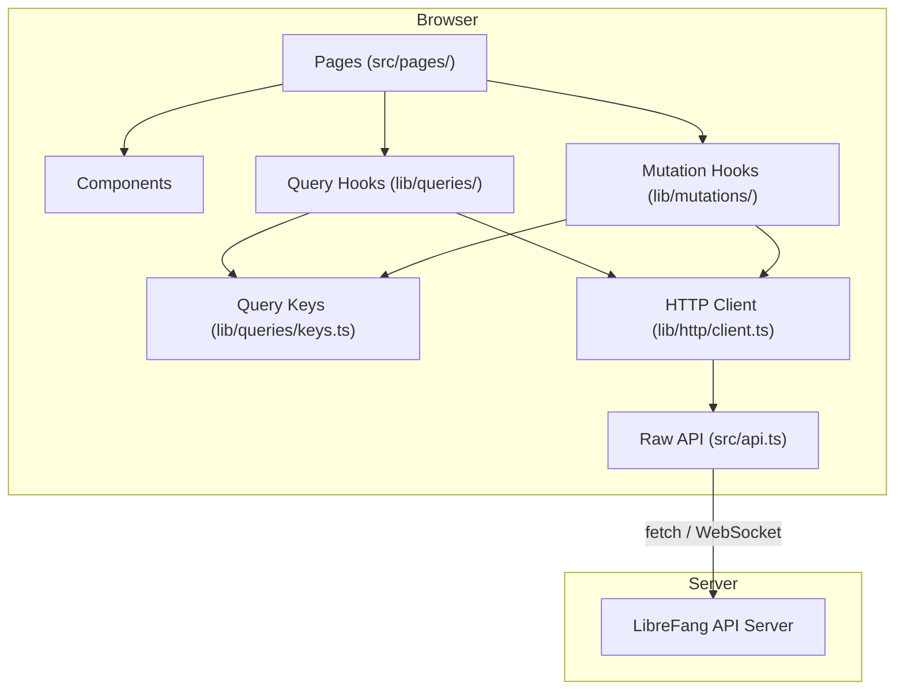

# Other — librefang-api-dashboard

# LibreFang Dashboard (`librefang-api/dashboard/`)

## Overview

The LibreFang Dashboard is a single-page application for managing and monitoring autonomous AI agents. It provides a real-time interface for agent configuration, session management, approval workflows, channel bridging, skill/plugin installation, workflow editing, scheduling, analytics, and memory management.

Built on **React 19** with **TanStack Router v1** (file-based routing) and **TanStack Query v5** (server-state caching), it compiles to a static bundle served by the LibreFang API server and works offline as a PWA.

## Architecture



**Data flows one way:** Pages call typed hooks, hooks call the HTTP client, the HTTP client delegates to `src/api.ts` for raw fetch/WebSocket calls. Pages never import `api.ts` or call `fetch` directly (with narrow exceptions for SSE/terminal streams).

## Tech Stack

| Layer | Technology |
|---|---|
| UI Framework | React 19 |
| Routing | TanStack Router v1 |
| Server-state | TanStack Query v5 |
| Local state | Zustand |
| HTTP | Native `fetch` (thin wrapper in `src/api.ts`) |
| Styling | Tailwind CSS v4 with CSS-first config |
| i18n | i18next + react-i18next |
| Charts | Recharts 3 |
| Workflow editor | @xyflow/react (React Flow) |
| Terminal | @xterm/xterm 6 |
| TOML | smol-toml |
| Markdown | react-markdown + remark-gfm + remark-math + rehype-katex |
| Command palette | cmdk |
| Build | Vite 7 |
| Types | TypeScript 5 (strict) |
| Unit tests | Vitest + Testing Library |
| E2E tests | Playwright |
| API types | openapi-typescript (`pnpm openapi:types`) |
| Package manager | pnpm 10 |

## Project Structure

```
dashboard/
├── public/
│   ├── manifest.json          # PWA manifest
│   ├── sw.js                  # Service worker (stale-while-revalidate)
│   ├── icon-192.png
│   └── icon-512.png
├── e2e/
│   └── dashboard.spec.ts      # Playwright smoke tests
├── openapi/
│   └── generated.ts           # Auto-generated API types
├── src/
│   ├── main.tsx               # App entry point
│   ├── api.ts                 # Raw fetch helpers, auth, WebSocket builders
│   ├── index.css              # Tailwind + theme + animation system
│   ├── pages/                 # TanStack Router page components
│   ├── components/            # Shared UI components
│   │   └── ui/                # Design-system primitives (MultiSelectCmdk, etc.)
│   └── lib/
│       ├── http/
│       │   ├── client.ts      # Typed re-exports over src/api.ts
│       │   └── errors.ts      # ApiError class
│       ├── queries/
│       │   ├── keys.ts        # Hierarchical query-key factories
│       │   ├── keys.test.ts   # Anchoring / existence smoke tests
│       │   ├── <domain>.ts    # useXxx query hooks per domain
│       │   └── ...            # agents, sessions, channels, etc.
│       ├── mutations/
│       │   └── <domain>.ts    # useXxx mutation hooks with invalidation
│       ├── agentManifest.ts   # TOML manifest parse/serialize/validate
│       ├── agentManifestMarkdown.ts  # Manifest → Markdown rendering
│       ├── chat.ts            # Chat message normalization utilities
│       ├── chatPicker.ts      # Agent/hand grouping for chat picker
│       └── test/
│           └── query-client.tsx  # Test helper: QueryClient wrapper
├── package.json
├── vite.config.ts
├── playwright.config.ts
├── tailwind.config.ts
└── tsconfig.json
```

## Data Layer

The data layer is the most architecturally significant part of the dashboard. It enforces a strict separation between raw API calls, cached queries, and cache-invalidating mutations.

### Query Key Factories (`src/lib/queries/keys.ts`)

Every query and mutation references keys produced by centralized factory objects. Each domain (agents, sessions, workflows, etc.) has a factory that produces hierarchical keys anchored on a root:

```ts
export const fooKeys = {
  all: ["foo"] as const,
  lists: () => [...fooKeys.all, "list"] as const,
  list: (filters: FooFilters = {}) => [...fooKeys.lists(), filters] as const,
  details: () => [...fooKeys.all, "detail"] as const,
  detail: (id: string) => [...fooKeys.details(), id] as const,
};
```

Because every sub-key spreads from `fooKeys.all`, invalidating the root refreshes every cached entry in that domain. The narrowest appropriate key should always be used for invalidation.

Current domains: `agents`, `analytics`, `approvals`, `channels`, `config`, `cron`, `fanghub`, `goals`, `hands`, `mcp`, `media`, `memory`, `models`, `network`, `overview`, `plugins`, `providers`, `runtime`, `schedules`, `sessions`, `skills`, `triggers`, `workflows`.

### Query Hooks (`src/lib/queries/<domain>.ts`)

Each domain file exports:
- `fooQueryOptions(filters?)` — a `queryOptions()` call with key, fetch function, and `staleTime`.
- `useFoo(filters?, options?)` — a `useQuery` wrapper that pages import.

Hooks accept an optional `options` bag (`enabled`, `staleTime`, `refetchInterval`) so call sites can override polling/gating per-page:

```ts
type UseFooOptions = {
  enabled?: boolean;
  staleTime?: number;
  refetchInterval?: number | false;
};

export function useFoo(filters?: FooFilters, options: UseFooOptions = {}) {
  return useQuery({
    ...fooQueryOptions(filters),
    enabled: options.enabled,
    staleTime: options.staleTime,
    refetchInterval: options.refetchInterval,
  });
}
```

The hook sets sensible defaults (shared `staleTime`, optional `refetchInterval`) so consumers without special needs inherit one consistent policy.

### Mutation Hooks (`src/lib/mutations/<domain>.ts`)

Every write operation is a `useMutation` hook. **Cache invalidation lives inside the hook** — call sites never need to know which keys are affected. Call sites may attach their own `onSuccess`/`onError` for UI feedback (toasts, dialog dismissal), which is orthogonal to invalidation.

**Invalidation strategy** — always prefer the narrowest key set:

| Pattern | Keys invalidated | When to use |
|---|---|---|
| Per-id update | `fooKeys.detail(id)` + `fooKeys.lists()` | Patch, rename, status change that affects list rows. **Default template.** |
| List-shape change | `fooKeys.lists()` | Create, delete, reorder — no existing detail to refresh. |
| Scoped change | `fooKeys.detail(id)` or nested sub-key | Change is genuinely local; list projection unaffected. |
| Bulk / cross-cutting | `fooKeys.all` | Bulk import, cache reset, schema migration. Not the default. |

Example — per-id patch where the list projection also changes:

```ts
export function useUpdateFoo() {
  const qc = useQueryClient();
  return useMutation({
    mutationFn: updateFoo,
    onSuccess: (_data, variables) => {
      qc.invalidateQueries({ queryKey: fooKeys.lists() });
      qc.invalidateQueries({ queryKey: fooKeys.detail(variables.id) });
    },
  });
}
```

### Adding a New Endpoint

1. **Raw call** — add the function in `src/api.ts` (or re-export via `src/lib/http/client.ts`).
2. **Key factory** — add a factory to `src/lib/queries/keys.ts` following the hierarchical pattern. Every sub-key must be anchored with `...fooKeys.all`.
3. **Query hook** — add `fooQueryOptions` and `useFoo` in `src/lib/queries/<domain>.ts`.
4. **Mutation hooks** — add `useXxx` hooks in `src/lib/mutations/<domain>.ts` with invalidation.
5. **Tests** — add the factory to the `all factories exist` test in `keys.test.ts`. Add anchoring tests for non-trivial factories.

Run all three verification commands after changes:

```bash
pnpm typecheck    # tsc --noEmit
pnpm test --run   # vitest
pnpm build        # vite build
```

### Exceptions: Uncached Data

Streaming/SSE connections, terminal window lifecycle, and one-shot probes that must not be cached may call `fetch` directly. These are kept narrow and commented. See `src/components/TerminalTabs.tsx` for the canonical example.

## Agent Manifest System

The dashboard includes a complete TOML-based agent manifest editor powered by `smol-toml`:

- **`src/lib/agentManifest.ts`** — `parseManifestToml()`, `serializeManifestForm()`, `validateManifestForm()`, plus `emptyManifestForm()` / `emptyManifestExtras()` factories.
- **`src/lib/agentManifestMarkdown.ts`** — `generateManifestMarkdown()` renders a manifest as human-readable Markdown for preview/export.

The form model handles:
- First-class fields: name, description, model config, resources, capabilities, schedule, thinking, autonomous guardrails, routing, fallback models, context injection, response format, exec policy, lifecycle overrides.
- **Extras preservation**: unknown TOML keys (custom provider params, future schema fields) are round-tripped in an `extras` bag so user edits never silently drop data.
- Mutual-exclusion guards prevent emitting both a shorthand form field and a preserved TOML table for the same key (e.g., `exec_policy` string vs. `[exec_policy]` table).
- Numeric field validation rejects negatives, out-of-range integers, and non-numeric garbage without throwing.

## Authentication

- **API key storage**: `src/api.ts` stores the bearer token in `localStorage` under `librefang-api-key`. All API calls attach it via `Authorization: Bearer <token>`.
- **WebSocket auth**: `buildAuthenticatedWebSocketUrl()` appends `?token=` to WebSocket URLs.
- **Credential check**: on load, the dashboard probes `/api/auth/dashboard-check`. If the server requires credentials, a sign-in dialog appears (validated in the Playwright e2e suite).
- **Stale auth cleanup**: `verifyStoredAuth()` makes a protected request; on 401 it clears the stored key so the user is re-prompted.

## PWA Support

- **`public/manifest.json`** — declares the app as standalone with `start_url: /dashboard/#/overview`.
- **`public/sw.js`** — service worker that precaches `/dashboard/`, uses network-only for `/api/` requests, and stale-while-revalidate for all other GETs.
- **`index.html`** — registers the service worker on load, sets mobile meta tags, and provides a dark theme-color.

## Styling & Theming

The dashboard uses Tailwind CSS v4 with a CSS-first configuration (`src/index.css`):

- **Semantic color tokens** via CSS custom properties: `--brand-color`, `--success-color`, `--bg-surface`, etc. Light and dark palettes are defined in `:root` and `:root.dark`.
- **Custom breakpoints**: `3xl` (1920px) and `4xl` (2560px) for QHD/UHD card grids.
- **Animation system**: spring-physics curves (`--apple-spring`), page entrance (`fade-in-up` with blur), modal entrance (`fade-in-scale`), staggered children, card glow hover effects. All respect `prefers-reduced-motion`.
- **Custom scrollbar**: `.scrollbar-thin` for minimal scroll indicators.

## Testing

### Unit / Integration Tests (Vitest)

Tests live alongside source files with a `.test.ts` / `.test.tsx` suffix. Key patterns:

- **`src/lib/test/query-client.tsx`** exports `createQueryClientWrapper()` which provides a real `QueryClient` for `renderHook` tests. Almost every query and mutation test uses this.
- **Mutation tests** spy on `queryClient.invalidateQueries` to verify exactly which keys are invalidated — no more, no less.
- **Query tests** verify `enabled` gating (disabled when IDs are empty), correct query keys, and data flow.
- **Agent manifest tests** cover round-trip parse→serialize→parse, TOML edge cases (nested tables, special characters, mutual exclusion), and numeric validation.

```bash
pnpm test --run      # Single run
pnpm test:watch      # Watch mode
```

### End-to-End Tests (Playwright)

```bash
pnpm e2e
```

Configured in `playwright.config.ts` — starts a dev server on `127.0.0.1:4173`, then:

- Verifies the dashboard shell loads with all primary navigation links (Overview, Agents, Sessions, Approvals, Comms, Providers, Channels, Skills, Hands, Workflows, Scheduler, Goals, Analytics, Memory, Runtime, Logs).
- Verifies page navigation renders the correct heading.
- Verifies the sign-in dialog appears when the auth endpoint returns `credentials` mode.

## Development Workflow

```bash
pnpm install                # Install dependencies
pnpm dev                    # Start Vite dev server
pnpm typecheck              # TypeScript check (tsc --noEmit)
pnpm test --run             # Run all Vitest tests
pnpm build                  # Production build
pnpm openapi:types          # Regenerate API types from OpenAPI spec
```

### Commit Convention

```
feat(dashboard/<area>): description
fix(dashboard/<area>): description
refactor(dashboard/<area>): description
```

### Key Conventions

- **TypeScript strict mode** — no `any` in new hooks. Use types from `src/api.ts` or `openapi/generated.ts`.
- **Never build `queryKey` inline** — always call the factory from `keys.ts`.
- **Never subscribe to the same endpoint with a different key** for a subset — use `select` on the shared `queryOptions`.
- **Every call-site override** of `enabled`/`staleTime`/`refetchInterval` must carry a short inline comment explaining why.