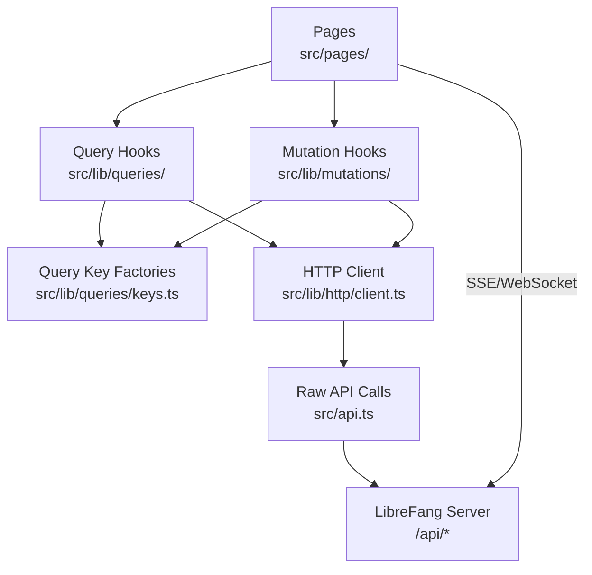

# Other — librefang-api-dashboard

# LibreFang API Dashboard

The admin dashboard for LibreFang — a single-page application built with React 19, TanStack Router v1, and TanStack Query v5. It provides real-time management of agents, sessions, workflows, channels, skills, and the full agent operating system.

## Architecture Overview



## Tech Stack

| Layer | Technology |
|---|---|
| Framework | React 19, TanStack Router v1 |
| Data fetching | TanStack Query v5 |
| State management | Zustand (client-side UI state) |
| Build | Vite 7, TailwindCSS 4 |
| Language | TypeScript strict mode |
| Routing | File-based via TanStack Router |
| Canvas | XYFlow (`@xyflow/react`) for workflow visual editor |
| Terminal | xterm.js (`@xterm/xterm`) for agent terminal sessions |
| Charts | Recharts |
| i18n | i18next + react-i18next |
| TOML parsing | smol-toml |
| PWA | Service worker with stale-while-revalidate caching |

## Data Layer Architecture

All server data flows through a layered hooks system. Pages and components never call `fetch()` or `api.*` directly (except documented exceptions for streaming/SSE).

### Directory Layout

```
src/
├── api.ts                         # Raw fetch wrappers, auth helpers
├── main.tsx                       # App entry point
├── pages/                         # Route pages
├── components/                    # Shared UI components
├── lib/
│   ├── http/
│   │   ├── client.ts              # Typed re-exports over api.ts
│   │   └── errors.ts              # ApiError class
│   ├── queries/
│   │   ├── keys.ts                # Query-key factories (all domains)
│   │   ├── keys.test.ts           # Anchoring/hierarchy smoke tests
│   │   ├── <domain>.ts            # queryOptions + useXxx hooks
│   │   └── ...
│   ├── mutations/
│   │   ├── <domain>.ts            # useXxx mutation hooks with invalidation
│   │   └── ...
│   ├── agentManifest.ts           # TOML manifest parser/serializer
│   ├── agentManifestMarkdown.ts   # Manifest → Markdown renderer
│   ├── chat.ts                    # Chat message normalization
│   ├── chatPicker.ts              # Agent/hand grouping for chat picker
│   └── test/
│       └── query-client.tsx        # createQueryClientWrapper for tests
├── openapi/
│   └── generated.ts               # Auto-generated types from OpenAPI schema
```

### Domains

The data layer is organized by domain. Current domains:

`agents`, `analytics`, `approvals`, `channels`, `config`, `goals`, `hands`, `mcp`, `media`, `memory`, `models`, `network`, `overview`, `plugins`, `providers`, `runtime`, `schedules`, `sessions`, `skills`, `workflows`

## Query Key Factories

Every domain has a hierarchical query-key factory in `src/lib/queries/keys.ts`. Keys are anchored to a root `all` array so that broad invalidation cascades correctly through `queryClient.invalidateQueries`.

```ts
export const fooKeys = {
  all: ["foo"] as const,
  lists: () => [...fooKeys.all, "list"] as const,
  list: (filters: FooFilters = {}) => [...fooKeys.lists(), filters] as const,
  details: () => [...fooKeys.all, "detail"] as const,
  detail: (id: string) => [...fooKeys.details(), id] as const,
};
```

Sub-keys like `agentKeys.sessions(agentId)`, `agentKeys.promptVersions(agentId)`, `agentKeys.experiments(agentId)`, and `agentKeys.experimentMetrics(experimentId)` extend the hierarchy for nested collections.

**Invariant**: Every sub-key MUST be anchored with `...domainKeys.all`. The smoke tests in `keys.test.ts` verify this — add a test case whenever you add a new factory.

## Query Hooks

Query hooks wrap `queryOptions` + `useQuery` and set sensible defaults for `staleTime` and `refetchInterval`. Consumers can override per-page:

```ts
type UseFooOptions = {
  enabled?: boolean;
  staleTime?: number;
  refetchInterval?: number | false;
};

export function useFoo(filters?: FooFilters, options: UseFooOptions = {}) {
  return useQuery({
    ...fooQueryOptions(filters),
    ...options,
  });
}
```

### Enabled Guards

Hooks that require a resource ID (e.g., `useAgentDetail(id)`, `useAgentSessions(id)`, `useExperiments(id)`) disable themselves when the ID is an empty string, preventing spurious fetches before route params resolve.

## Mutation Hooks

Mutations encapsulate write operations and **must invalidate** the affected query keys inside the hook. Call sites never need to know which keys are touched.

### Invalidation Strategy

Use the narrowest key set that covers what actually changed:

| Pattern | When to use | Example mutations |
|---|---|---|
| `detail(id)` + `lists()` | Per-id update where list projection also changes | `usePatchAgent`, `usePatchAgentConfig` |
| `lists()` only | List-shape change, no existing detail to refresh | `useCreateAgent`, `useCreateWorkflow` |
| `detail(id)` or nested sub-key | Change scoped to one detail or nested collection | `useSendHandMessage` → `handKeys.session(id)` |
| `domain.all` | Bulk import, cache reset, cross-cutting change | `useSpawnAgent`, `useDeleteAgent`, `useUninstallHand` |

Example — standard per-id patch:

```ts
export function usePatchAgent() {
  const qc = useQueryClient();
  return useMutation({
    mutationFn: patchAgent,
    onSuccess: (_data, variables) => {
      qc.invalidateQueries({ queryKey: agentKeys.lists() });
      qc.invalidateQueries({ queryKey: agentKeys.detail(variables.agentId) });
    },
  });
}
```

### Cross-Domain Invalidation

Some mutations touch multiple domains. For example:

- **`useActivateHand`** invalidates `handKeys.all`, `agentKeys.all`, and `overviewKeys.snapshot()` because activating a hand spawns new agents and changes system overview.
- **`useRunSchedule`** invalidates `scheduleKeys.all` and `cronKeys.all`.
- **`useSetDefaultProvider`** invalidates `providerKeys.all`, `modelKeys.lists()`, and `runtimeKeys.status`.
- **`useResolveApproval`** invalidates `approvalKeys.all`.
- **`useDeleteAgentSession`** branches: with an `agentId` it invalidates `agentKeys.sessions(id)`, `agentKeys.detail(id)`, and `sessionKeys.lists()`; without one it falls back to `agentKeys.all` + `sessionKeys.lists()`.

### Call-Site `onSuccess`/`onError`

Call sites MAY attach per-call `onSuccess`/`onError` handlers for UI feedback (toasts, modal dismissal, local state). This is orthogonal to the built-in invalidation. Reference: `MemoryPage` delete/cleanup, `ChannelsPage` configure/test.

## Authentication

The dashboard uses token-based auth stored in `localStorage` under the key `librefang-api-key`.

- **`setApiKey(token)`** — stores the token.
- **`authHeader()`** — reads the token and returns a `Bearer` authorization header.
- **`verifyStoredAuth()`** — probes a protected endpoint; clears the stored token on 401.
- **`buildAuthenticatedWebSocketUrl(path)`** — appends `?token=...` to WebSocket URLs.

The sign-in dialog appears when `/api/auth/dashboard-check` returns `{ mode: "credentials" }`. The E2E test in `e2e/dashboard.spec.ts` verifies this flow.

### Error Handling Flow

When any API call returns a non-2xx status:

1. `api.ts` calls `parseError()` to construct an `ApiError` from the response.
2. TanStack Query surfaces the error to the mutation/query hook.
3. For 401s specifically, the flow may call `clearApiKey()` to force re-authentication.

```
Page → useMutation → client function → api.ts fetch → parseError → ApiError
```

## Agent Manifest System

`src/lib/agentManifest.ts` handles parsing and serializing agent definition TOML files used by the LibreFang kernel.

### Core Functions

- **`parseManifestToml(toml)`** — parses a TOML string into a validated `{ form, extras, ok }` result. Form fields are first-class; anything the parser doesn't recognize is preserved in `extras`.
- **`serializeManifestForm(form, extras?)`** — converts form state back to TOML, merging extras while respecting section scoping.
- **`validateManifestForm(form)`** — returns an array of field paths with errors (e.g., missing `name`, `model.provider`, `model.model`).
- **`emptyManifestForm()`** / **`emptyManifestExtras()`** — factory functions for blank state.

### Key Design Decisions

1. **Mutual exclusion**: When a form field covers a TOML key that also exists in `extras`, the form field wins during serialization. This prevents duplicate key/table conflicts (e.g., `exec_policy` shorthand vs. `[exec_policy]` table, `response_format` mode vs. preserved `[response_format]` extras).

2. **Section scoping**: Nested TOML tables inside form-known sections (like `[model.exotic_subtable]`) are serialized after all form-known keys to avoid re-anchoring the section scope.

3. **Number validation**: `serializeManifestForm` silently omits negative values, non-numeric strings, and values exceeding `MAX_SAFE_INTEGER` rather than producing invalid TOML.

4. **Round-trip fidelity**: The test suite verifies that `parse(serialize(parse(toml)))` preserves both `form` and `extras` identically.

### Advanced Fields

The manifest supports: `schedule` (periodic/continuous), `thinking` (budget_tokens, stream_thinking), `autonomous` (max_iterations, heartbeat_channel), `routing` (simple/medium/complex model tiers), `fallback_models`, `context_injection`, `response_format` (text/json/json_schema with inline schemas), `exec_policy` (deny/allowlist/full with alias normalization), and lifecycle overrides (`priority`, `session_mode`, `web_search_augmentation`, `pinned_model`, `workspace`, `allowed_plugins`).

### Markdown Generation

`src/lib/agentManifestMarkdown.ts` renders a manifest form as human-readable Markdown with sections for model, resources, capabilities, skills, MCP servers, schedule, fallback models, extended thinking, autonomous guardrails, model routing, context injections, response format, lifecycle overrides, and advanced configuration (extras).

## Chat Utilities

`src/lib/chat.ts` provides message normalization for the chat interface:

- **`normalizeRole(role)`** — normalizes API role strings (`"User"` → `"user"`, etc.)
- **`asText(value)`** — converts unknown content blocks to displayable text
- **`formatMeta(meta)`** — formats usage metadata as `"N in / M out | K iter | $X.XXXX"`
- **`normalizeToolOutput(event)`** — extracts tool name, content, and error status from tool output events; returns `null` for malformed events

## Chat Picker Grouping

`src/lib/chatPicker.ts` provides `groupedPicker(agents, hands, showHandAgents)` which organizes agents for the chat interface:

- **Standalone agents**: Non-hand agents, always shown
- **Hand groups**: When `showHandAgents` is true, hand-spawned agents are grouped under their hand instance header, sorted alphabetically by hand name
- **Role ordering**: Within a hand group, the coordinator role comes first, then remaining roles alphabetically
- **Filtering**: Inactive/paused hand instances and empty hand groups are hidden entirely

## UI Components

### MultiSelectCmdk

A multi-select combobox built on `cmdk`. Features:
- Chip display with per-item remove buttons
- Backspace removes the last selected item
- Fuzzy search filtering of options
- Already-selected items are hidden from the dropdown
- Controlled via `value`/`onChange` props

## Navigation & Pages

The dashboard shell provides navigation to these primary sections (verified by E2E tests):

Overview, Agents, Sessions, Approvals, Comms, Providers, Channels, Skills, Hands, Workflows, Scheduler, Goals, Analytics, Memory, Runtime, Logs

## Service Worker & PWA

`public/sw.js` implements a caching strategy:

- **API requests** (`/api/*`): Network only — never cached
- **Static assets**: Stale-while-revalidate — serve from cache, update in background
- **Non-GET requests**: Bypassed (Cache API limitation)

The PWA manifest (`public/manifest.json`) configures standalone display with the LibreFang branding, theme color `#0284c7`, and background `#020617`.

## E2E Tests

Playwright tests in `e2e/dashboard.spec.ts` run against a dev server on `127.0.0.1:4173`:

1. **Shell load test**: Verifies all primary navigation links are visible and that clicking Comms, Hands, and Goals navigates correctly.
2. **Auth dialog test**: Mocks `/api/auth/dashboard-check` to return `{ mode: "credentials" }` and verifies the sign-in dialog with username/password fields appears.

## Unit Test Patterns

Tests use `createQueryClientWrapper` from `src/lib/test/query-client.tsx` which provides a test `QueryClient` and a React wrapper for `renderHook`. Key test patterns:

- **Query tests**: Verify hooks are disabled on empty IDs, fetch correctly on valid IDs, and cache under the expected query key.
- **Mutation tests**: Spy on `queryClient.invalidateQueries` and assert exact key sequences.
- **Mutation tests with cross-domain effects**: Verify all touched domains are invalidated (e.g., `useActivateHand` touches hands, agents, and overview).
- **Parser/serializer tests**: Round-trip verification, edge cases for TOML scoping, number validation, mutual exclusion of form fields vs. extras.

## Build & Verification

```bash
pnpm typecheck                # tsc --noEmit — must pass
pnpm test --run               # vitest — all tests must pass
pnpm build                    # vite build — must succeed
pnpm openapi:types            # Regenerate types from server OpenAPI schema
pnpm e2e                      # Playwright end-to-end tests
```

Run all three (`typecheck`, `test`, `build`) after any change to `src/lib/queries/`, `src/lib/mutations/`, or `src/api.ts`. The key-factory tests catch anchoring regressions that TypeScript alone does not.

## Adding a New Domain

1. Add the raw API call in `src/api.ts`.
2. Add a key factory in `src/lib/queries/keys.ts` following the hierarchical pattern.
3. Add the query file at `src/lib/queries/<domain>.ts` with `queryOptions` and `useXxx` hooks.
4. Add mutations at `src/lib/mutations/<domain>.ts` with correct invalidation.
5. Update `src/lib/queries/keys.test.ts` with factory existence and anchoring tests.

## Commit Conventions

Follow the root repo pattern scoped to the dashboard:

```
feat(dashboard/<area>): description
refactor(dashboard/queries): description
fix(dashboard/<area>): description
```

Never include a `Co-Authored-By` footer.