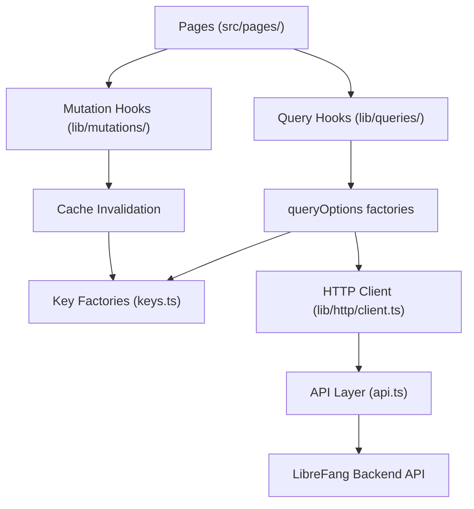

# Other — librefang-api-dashboard

# LibreFang API Dashboard

## Overview

The dashboard is a React 19 single-page application that provides the web-based management interface for the LibreFang autonomous agent operating system. It is built on TanStack Router v1 for routing and TanStack Query v5 for server-state management, bundled with Vite and styled with Tailwind CSS v4.

The application is a PWA (Progressive Web App) with offline static-asset caching via a service worker.

## Architecture



Pages never call `fetch()` or the raw API layer directly. All data flows through the hooks layer, ensuring consistent caching, invalidation, and authentication.

## Entry Points and Shell

- **HTML entry**: `index.html` — mounts `<div id="root">` and loads `src/main.tsx` as a module
- **App entry**: `src/main.tsx` — bootstraps React, TanStack Router, and TanStack Query providers
- **PWA manifest**: `public/manifest.json` — configures standalone display mode, theme colors, and app icons
- **Service worker**: `public/sw.js` — precaches `/dashboard/`, serves static assets via stale-while-revalidate, and bypasses caching entirely for `/api/` requests and non-GET methods

## Data Layer

The data layer enforces a strict separation between raw API calls and UI components. It lives under `src/lib/` with four subdirectories:

```
src/lib/
  http/
    client.ts      # Typed wrapper over api.ts
    errors.ts      # ApiError class
  queries/
    keys.ts        # Query-key factories for every domain
    keys.test.ts   # Anchoring and hierarchy smoke tests
    <domain>.ts    # queryOptions + useXxx hooks per domain
  mutations/
    <domain>.ts    # useXxx mutation hooks with invalidation
  test/
    query-client.tsx  # createQueryClientWrapper for hook tests
```

### Query Key Factories

Every domain has a key factory in `src/lib/queries/keys.ts` that produces hierarchical, anchored keys. Each sub-key spreads from the domain's `all` root so that broad invalidation cascades correctly:

```ts
export const fooKeys = {
  all: ["foo"] as const,
  lists: () => [...fooKeys.all, "list"] as const,
  list: (filters: FooFilters = {}) => [...fooKeys.lists(), filters] as const,
  details: () => [...fooKeys.all, "detail"] as const,
  detail: (id: string) => [...fooKeys.details(), id] as const,
};
```

The current domain factories are: `agents`, `analytics`, `approvals`, `channels`, `config`, `cron`, `fanghub`, `goals`, `hands`, `mcp`, `media`, `memory`, `models`, `network`, `overview`, `plugins`, `providers`, `runtime`, `schedules`, `sessions`, `skills`, `triggers`, `workflows`.

The test file `keys.test.ts` validates that every factory exists and that sub-keys are properly anchored. **Any change to `keys.ts` must be accompanied by a corresponding test update**, and a passing typecheck alone is insufficient — the key-factory tests catch anchoring regressions that TypeScript does not.

### Query Hooks

Each domain file under `src/lib/queries/` exports `queryOptions` factories and `useXxx` hooks:

```ts
export const fooQueryOptions = (filters?: FooFilters) =>
  queryOptions({
    queryKey: fooKeys.list(filters ?? {}),
    queryFn: () => listFoo(filters),
    staleTime: 30_000,
  });

export function useFoo(filters?: FooFilters, options?: UseFooOptions) {
  return useQuery({ ...fooQueryOptions(filters), ...options });
}
```

Hooks accept an optional `UseFooOptions` bag (`enabled`, `staleTime`, `refetchInterval`) so call sites can override per-page behavior without duplicating query logic. Every override at a call site must carry an inline comment explaining why. Examples from the codebase:

- `useApprovals({ enabled: open })` — gated by modal visibility
- `useCommsEvents(50, { refetchInterval: 5_000 })` — fast polling for live events
- `useModels({}, { enabled: isModelArg })` — gated by URL parameter
- `useApprovalCount({ refetchInterval: 5_000 })` — bell-icon badge polling

### Mutation Hooks

Mutations live in `src/lib/mutations/<domain>.ts`. Every mutation hook **must** perform its own cache invalidation inside `onSuccess`. Call sites may attach additional `onSuccess`/`onError` handlers for UI feedback (toasts, modal dismissal), but invalidation is never the caller's responsibility.

**Invalidation scope rules (narrowest first):**

| Scope | When to use | Example mutations |
|-------|------------|-------------------|
| `fooKeys.detail(id)` + `fooKeys.lists()` | Per-id update where the list projection also changes | `usePatchAgent`, `usePatchAgentConfig`, `useUpdateWorkflow` |
| `fooKeys.lists()` only | List-shape change with no existing detail to refresh | `useCreateFoo`, `useDeleteFoo` |
| `fooKeys.detail(id)` or nested sub-key | Change scoped to one detail, list unaffected | `useSendHandMessage` (invalidates `handKeys.session(instanceId)`) |
| `fooKeys.all` | Bulk import / cache reset / cross-cutting schema migration | `useSpawnAgent`, `useDeleteAgent`, `useSuspendAgent`, `useResumeAgent` |

Several mutations invalidate keys across multiple domains when the operation has cross-cutting effects:

- **Agent lifecycle mutations** (`useSpawnAgent`, `useCloneAgent`, `useSuspendAgent`, `useDeleteAgent`, `useResumeAgent`) invalidate both `agentKeys.all` and `overviewKeys.snapshot()` — because the overview dashboard reflects agent counts and states.
- **Hand lifecycle mutations** (`useActivateHand`, `useDeactivateHand`, `usePauseHand`, `useResumeHand`, `useUninstallHand`) invalidate `handKeys.all`, `agentKeys.all`, and `overviewKeys.snapshot()`.
- **Config mutations** (`useSetConfigValue`, `useBatchSetConfigValues`) invalidate `configKeys.all`. `useReloadConfig` additionally invalidates `overviewKeys.snapshot()`.
- **Provider mutations** (`useSetDefaultProvider`) invalidate `providerKeys.all`, `modelKeys.lists()`, and `runtimeKeys.status()`.
- **Workflow mutations** (`useRunWorkflow`) invalidate `workflowKeys.runs(workflowId)`, `workflowKeys.lists()`, and the returned `workflowKeys.runDetail(runId)`.
- **Schedule/trigger mutations** invalidate `scheduleKeys.all` + `cronKeys.all` (and `workflowKeys.lists()` for creates/updates/deletes).

### API Client Layer

`src/api.ts` contains the raw fetch calls that communicate with the LibreFang backend. Key behaviors:

- **Authentication**: `setApiKey` / `clearApiKey` / `verifyStoredAuth` manage a bearer token in `localStorage` under the key `librefang-api-key`. Every request includes an `Authorization: Bearer <token>` header built by `buildHeaders` / `authHeader`.
- **WebSocket auth**: `buildAuthenticatedWebSocketUrl` appends `?token=<key>` to WebSocket URLs.
- **Error handling**: `parseError` normalizes API error responses. On a 401, `verifyStoredAuth` clears the stored key.
- **Type generation**: `openapi:types` script generates `openapi/generated.ts` from the backend's OpenAPI schema at `http://127.0.0.1:4545/api/openapi.json`.

`src/lib/http/client.ts` re-exports these with typed wrappers and is the import target for query/mutation hooks.

## Agent Manifest System

The dashboard includes a complete TOML-based agent manifest serializer/parser for the agent creation and editing UI.

### Key Modules

- **`src/lib/agentManifest.ts`** — `emptyManifestForm()`, `emptyManifestExtras()`, `parseManifestToml(toml)`, `serializeManifestForm(form, extras?)`, `validateManifestForm(form)`
- **`src/lib/agentManifestMarkdown.ts`** — `generateManifestMarkdown(form, extras?)` renders a human-readable Markdown summary of a manifest

### Design

The manifest system separates **form state** (known, UI-editable fields) from **extras** (unknown/preserved fields that the form doesn't understand). This ensures round-trip fidelity: `parse(serialize(parse(toml)))` produces identical form state and extras.

Key design decisions enforced by the test suite:

1. **Numeric validation**: Negative values and numbers above `MAX_SAFE_INTEGER` are silently omitted from serialization rather than producing invalid TOML.
2. **Mutual exclusion**: When a user selects a form-mode value (e.g., `exec_policy` shorthand or `response_format` mode), any previously-preserved extras table for the same key is dropped to avoid TOML key/table redefinition conflicts.
3. **Section scoping**: Extras that produce nested tables inside form-known sections (like `[model.exotic_subtable]`) must not break TOML section scoping for subsequent sections like `[resources]`.
4. **Alias normalization**: `exec_policy` aliases accepted by the kernel (`none`/`disabled` → `deny`, `restricted` → `allowlist`, `all`/`unrestricted` → `full`) are normalized to canonical form.
5. **Fallback model extras**: Per-fallback-model `extra_params` (e.g., `enable_memory` for Qwen) survive round-trips.
6. **Response format schemas**: `json_schema` schemas are always stored as strings to avoid React uncontrolled→controlled warnings.

## Chat Utilities

`src/lib/chat.ts` provides helpers for the chat/terminal interface:

- **`normalizeRole(role)`** — normalizes API-provided roles (`"User"` → `"user"`)
- **`asText(value)`** — converts unknown content to displayable text
- **`formatMeta(meta)`** — formats usage metadata as `"N in / M out | X iter | $Y.ZZZZ"`
- **`normalizeToolOutput(event)`** — extracts tool name, content preview, and error status from tool output events, filtering malformed entries

## Chat Picker

`src/lib/chatPicker.ts` exports `groupedPicker(agents, hands, showHandAgents)` which partitions agents into standalone agents and hand-grouped agents for the chat target picker:

- When `showHandAgents` is `false`, all agents are returned flat as standalone.
- Active hand instances are grouped under their `hand_name`, sorted alphabetically.
- Within each group, the coordinator role appears first, then remaining roles alphabetically.
- Inactive hands and hands with empty `agent_ids` are hidden entirely.
- Hand-spawned agents never fall back to the standalone list — they are hidden when their hand is unavailable.

## UI Components

### MultiSelectCmdk

`src/components/ui/MultiSelectCmdk.tsx` is a multi-select dropdown built on `cmdk` (Command Menu). It supports:

- Chip-based display of selected values with per-chip remove buttons
- Keyboard backspace to remove the last selected item
- Search filtering of available options
- Already-selected items are excluded from the dropdown list
- Controlled via `value`/`onChange` props

## Navigation

The dashboard shell provides navigation links to these top-level pages (validated by the E2E suite):

Overview, Agents, Sessions, Approvals, Comms, Providers, Channels, Skills, Hands, Workflows, Scheduler, Goals, Analytics, Memory, Runtime, Logs.

## Authentication Flow

The E2E test `dashboard.spec.ts` validates the sign-in dialog flow: when `GET /api/auth/dashboard-check` returns `{ mode: "credentials" }`, the dashboard presents a username/password dialog before granting access.

## Testing

### Unit Tests (Vitest)

```bash
pnpm test                # run once
pnpm test:watch          # watch mode
```

The test suite covers:
- **API layer** (`src/api.test.ts`) — authentication helpers, bearer token injection, request body serialization, response unwrapping
- **Agent manifest** (`src/lib/agentManifest.test.ts`) — serialization, parsing, validation, round-trip fidelity, edge cases (negative numbers, alias normalization, mutual exclusion, section scoping)
- **Manifest markdown** (`src/lib/agentManifestMarkdown.test.ts`) — rendering of all manifest sections
- **Chat utilities** (`src/lib/chat.test.ts`) — role normalization, metadata formatting, tool output handling
- **Chat picker** (`src/lib/chatPicker.test.ts`) — grouping logic, sorting, filtering
- **MultiSelectCmdk** (`src/components/ui/MultiSelectCmdk.test.tsx`) — selection, removal, search, filtering
- **Query hooks** — enabled guards, correct query key usage, fetch behavior
- **Mutation hooks** — invalidation scope for every mutation, cross-domain cascade behavior

Hook tests use `createQueryClientWrapper` from `src/lib/test/query-client.tsx`, which provides a real TanStack Query client with retry disabled and a spy on `invalidateQueries`.

### E2E Tests (Playwright)

```bash
pnpm e2e
```

Playwright tests run against `http://127.0.0.1:4173` with the dev server started automatically. The config is in `playwright.config.ts` with a 30-second timeout and trace-on-first-retry.

### Type Checking

```bash
pnpm typecheck            # tsc --noEmit
```

## Build

```bash
pnpm build                # vite build
pnpm preview              # preview production build
```

All three verification steps must pass after any change to `src/lib/queries/`, `src/lib/mutations/`, or `src/api.ts`:

```bash
pnpm typecheck && pnpm test && pnpm build
```

## Adding a New Endpoint

1. Add the raw call in `src/api.ts`
2. Add/reuse a key factory in `src/lib/queries/keys.ts` — every sub-key must anchor from the domain's `all` root
3. Add `queryOptions` + `useXxx` in `src/lib/queries/<domain>.ts`
4. Add mutation hooks in `src/lib/mutations/<domain>.ts` with the narrowest valid invalidation scope
5. Update `src/lib/queries/keys.test.ts` — add the factory to the existence list, add anchoring tests for non-trivial factories

## Commit Convention

```
feat(dashboard/<area>): description
refactor(dashboard/queries): description
fix(dashboard/<area>): description
```

No `Co-Authored-By` footers.

## Key Dependencies

| Package | Purpose |
|---------|---------|
| `react` / `react-dom` v19 | UI framework |
| `@tanstack/react-router` v1 | File-based routing |
| `@tanstack/react-query` v5 | Server-state management |
| `@xyflow/react` | Workflow visual editor canvas |
| `@xterm/xterm` + addons | Embedded terminal |
| `recharts` | Analytics charts |
| `cmdk` | Command palette / multi-select |
| `zustand` | Client-side state management |
| `i18next` + `react-i18next` | Internationalization |
| `smol-toml` | TOML parsing/serialization for manifests |
| `katex` + `rehype-katex` + `remark-math` | Math rendering in markdown |
| `react-markdown` + `remark-gfm` | Markdown rendering |
| `lucide-react` | Icons |
| `qrcode` | QR code generation |
| `tailwindcss` v4 | Styling |