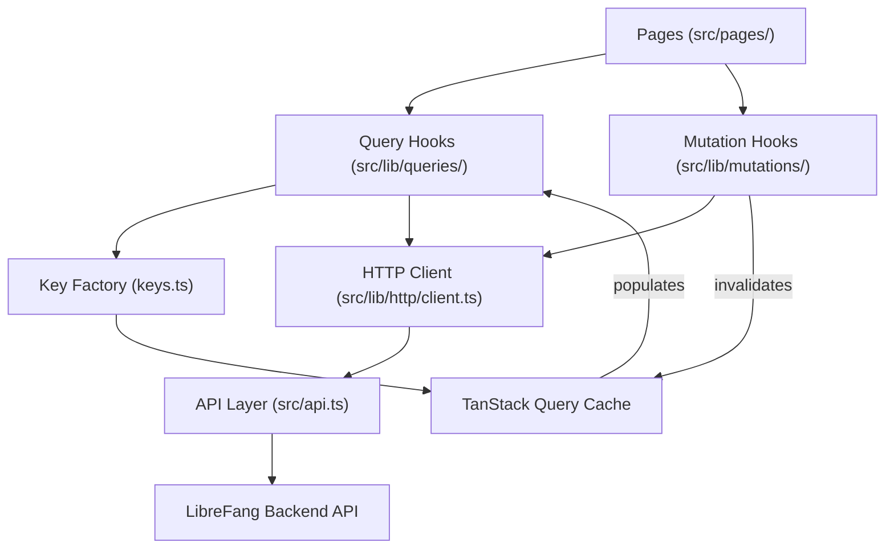

# Other — librefang-api-dashboard

# LibreFang API Dashboard

## Overview

The LibreFang Dashboard is a React 19 single-page application that provides the management interface for the LibreFang autonomous agent operating system. It exposes controls for agent lifecycle, session management, workflow orchestration, scheduling, analytics, memory, hands (multi-agent coordination), skills, channels, and runtime configuration.

**Tech stack:** React 19 · TanStack Router v1 · TanStack Query v5 · Tailwind CSS v4 · Vite 7 · TypeScript (strict) · Vitest + Playwright

## Architecture



All data access from pages and components flows through the shared hooks layer. Pages never call `fetch()` or `api.*` directly (streaming/SSE being the documented exception).

## Directory Layout

```
dashboard/
├── index.html                     # SPA shell with service worker registration
├── package.json                   # Dependencies and scripts
├── vite.config.ts                 # Build configuration
├── playwright.config.ts           # E2E test configuration
├── public/
│   ├── manifest.json              # PWA manifest
│   ├── sw.js                      # Service worker (stale-while-revalidate)
│   ├── icon-192.png
│   └── icon-512.png
├── e2e/
│   └── dashboard.spec.ts          # Playwright smoke tests
├── openapi/
│   └── generated.ts               # Auto-generated API types
├── src/
│   ├── main.tsx                   # Application entry point
│   ├── api.ts                     # Raw API calls + auth helpers
│   ├── index.css                  # Tailwind theme + animation system
│   ├── router.tsx                 # TanStack Router route tree
│   ├── pages/                     # Route page components
│   ├── components/                # Shared UI components
│   └── lib/
│       ├── http/
│       │   ├── client.ts          # Typed wrapper over api.ts
│       │   └── errors.ts          # ApiError class
│       ├── queries/
│       │   ├── keys.ts            # Hierarchical query-key factories
│       │   ├── keys.test.ts       # Factory smoke/anchoring tests
│       │   └── <domain>.ts        # Domain-specific queryOptions + useXxx hooks
│       ├── mutations/
│       │   └── <domain>.ts        # Domain-specific mutation hooks
│       ├── test/
│       │   └── query-client.tsx   # createQueryClientWrapper test utility
│       ├── agentManifest.ts       # TOML manifest serializer/parser/validator
│       ├── agentManifestMarkdown.ts # Manifest → Markdown renderer
│       ├── chat.ts                # Chat message normalization utilities
│       └── chatPicker.ts          # Agent/hand picker grouping logic
```

## Data Layer

### Query Key Factories

All query keys live in `src/lib/queries/keys.ts` as hierarchical factories. Every sub-key is anchored to the domain's `.all` key so that broad invalidation works correctly.

```ts
export const agentKeys = {
  all: ["agents"] as const,
  lists: () => [...agentKeys.all, "list"] as const,
  list: (filters: AgentFilters) => [...agentKeys.lists(), filters] as const,
  details: () => [...agentKeys.all, "detail"] as const,
  detail: (id: string) => [...agentKeys.details(), id] as const,
  sessions: (id: string) => [...agentKeys.detail(id), "sessions"] as const,
  promptVersions: (id: string) => [...agentKeys.detail(id), "promptVersions"] as const,
  experiments: (id: string) => [...agentKeys.detail(id), "experiments"] as const,
  experimentMetrics: (expId: string) => [...agentKeys.all, "experimentMetrics", expId] as const,
};
```

Existing domain factories: `agents`, `analytics`, `approvals`, `channels`, `config`, `goals`, `hands`, `mcp`, `media`, `memory`, `models`, `network`, `overview`, `plugins`, `providers`, `runtime`, `schedules`, `sessions`, `skills`, `workflows`.

### Query Hooks

Each domain file in `src/lib/queries/` exports `queryOptions` and `useXxx` hooks:

```ts
export const fooQueryOptions = (filters?: FooFilters) =>
  queryOptions({
    queryKey: fooKeys.list(filters ?? {}),
    queryFn: () => listFoo(filters),
    staleTime: 30_000,
  });

export function useFoo(filters?: FooFilters, options?: UseFooOptions) {
  return useQuery({
    ...fooQueryOptions(filters),
    enabled: options?.enabled,
    staleTime: options?.staleTime,
    refetchInterval: options?.refetchInterval,
  });
}
```

Hooks accept an optional `options` parameter for call-site overrides (`enabled`, `staleTime`, `refetchInterval`). Every override must carry an inline comment explaining the reason — e.g., bell-icon polls fast, bulk-management pages poll slowly, tabs gate by active tab.

### Mutation Hooks

Mutations live in `src/lib/mutations/<domain>.ts`. Cache invalidation is encapsulated inside the hook; callers never need to know which keys are touched.

Invalidation follows a specificity-first principle:

| Scenario | Keys invalidated | Example |
|---|---|---|
| Per-id update that changes list projection | `detail(id)` + `lists()` | `usePatchAgentConfig` |
| List-shape change (create, delete, reorder) | `lists()` only | `useCreateSchedule` |
| Scoped change, list projection unaffected | `detail(id)` or nested sub-key | `useActivatePromptVersion` → `promptVersions(id)` + `detail(id)` |
| Bulk import / cache reset | `.all` | `useSpawnAgent` |

Cross-domain invalidation occurs when mutations affect shared projections. For example, `useSpawnAgent` invalidates both `agentKeys.all` and `overviewKeys.snapshot()` because the overview dashboard shows agent counts.

Call sites may attach their own `onSuccess`/`onError` handlers for UI feedback (toasts, modal dismissal) — this is orthogonal to cache invalidation and stays at the call site.

### Adding a New Endpoint

1. Add the raw call in `src/api.ts`
2. Add (or extend) a factory in `src/lib/queries/keys.ts`
3. Add the query hook in `src/lib/queries/<domain>.ts`
4. Add mutation hooks in `src/lib/mutations/<domain>.ts`
5. Update `src/lib/queries/keys.test.ts` — add the factory to the existence list and anchoring tests

Run all three verification commands after any change to the data layer:
```bash
pnpm typecheck    # tsc --noEmit
pnpm test --run   # vitest
pnpm build        # vite build
```

A passing typecheck alone is insufficient — the key-factory tests catch anchoring regressions the compiler cannot.

## Authentication

The dashboard authenticates via bearer tokens stored in `localStorage` under the key `librefang-api-key`.

Key functions in `src/api.ts`:
- **`setApiKey(token)`** / **`clearApiKey()`** — manage the stored token
- **`getStoredApiKey()`** — retrieves the token (or `null`)
- **`authHeader()`** — returns a `Headers` object with `Authorization: Bearer <token>`
- **`verifyStoredAuth()`** — probes a protected endpoint; on 401, clears the stale token and returns `false`
- **`buildAuthenticatedWebSocketUrl(path)`** — appends `?token=...` to WebSocket URLs

The backend can operate in two modes: open (no credentials) or credentials-based. The E2E test verifies that when `GET /api/auth/dashboard-check` returns `{ mode: "credentials" }`, the dashboard presents a sign-in dialog.

## Agent Manifest System

`src/lib/agentManifest.ts` provides a full TOML round-trip for agent configuration files:

- **`parseManifestToml(toml)`** — parses TOML into a structured `ManifestForm` + `ManifestExtras` (preserves unknown fields)
- **`serializeManifestForm(form, extras?)`** — serializes back to deterministic TOML, with hand-tuned field ordering
- **`validateManifestForm(form)`** — returns an array of error field paths (empty = valid)
- **`emptyManifestForm()`** / **`emptyManifestExtras()`** — factory functions for blank state

The form captures first-class fields: `name`, `description`, `tags`, `model.*`, `resources.*`, `capabilities.*`, `skills`, `priority`, `session_mode`, `schedule`, `thinking`, `autonomous`, `routing`, `fallback_models`, `context_injection`, `response_format`, `exec_policy_shorthand`. Genuinely unknown keys ride along in `extras` and survive round-trips.

`src/lib/agentManifestMarkdown.ts` renders a form + extras into human-readable Markdown for documentation/export.

### Key design decisions

- **Alias normalization**: `exec_policy` accepts kernel aliases (`none`, `disabled`, `restricted`, `all`, `unrestricted`) and normalizes them to the 4 canonical forms (`deny`, `allowlist`, `full`).
- **Mutual exclusion**: When a form field covers a previously-preserved extras table (e.g., user picks a shorthand `exec_policy`), the old extras table is dropped to avoid TOML key/table redefinition conflicts.
- **Numeric validation**: Negative values and values exceeding `MAX_SAFE_INTEGER` are silently omitted rather than emitted as invalid TOML.
- **Fallback model extras**: Per-model `#[serde(flatten)]` extra params (e.g., Qwen's `enable_memory`) survive round-trips.

## Chat Utilities

`src/lib/chat.ts` provides normalization helpers used across the chat interface:

- **`normalizeRole(role)`** — lowercases API role strings (`"User"` → `"user"`)
- **`asText(content)`** — converts string or JSON content to display text
- **`formatMeta(meta)`** — formats token usage, iterations, and cost into a compact string
- **`normalizeToolOutput(event)`** — extracts persistent display data from tool output events; returns `null` for malformed events

`src/lib/chatPicker.ts` provides `groupedPicker(agents, hands, showHandAgents)` which groups agents into standalone agents and hand groups for the chat target picker. Hand groups sort alphabetically by name, with the coordinator role first.

## UI Components

### MultiSelectCmdk

A composable multi-select component built on `cmdk`:
- Chip-based display of selected values
- Type-to-filter dropdown with `listbox` role
- Backspace removes last chip
- Already-selected items are hidden from the dropdown
- Controlled via `value`/`onChange` props

### Animation System

`src/index.css` defines an Apple-inspired animation system with:
- **Spring curves**: `--apple-spring`, `--apple-ease`, `--apple-bounce`
- **Page entrance**: `animate-fade-in-up` (fade + rise + deblur)
- **Modal entrance**: `animate-fade-in-scale` (scale spring + deblur)
- **Chat messages**: `animate-message-in` (lighter — 220ms, no blur)
- **Staggered children**: `.stagger-children > *` with 40ms cascade delays
- **Card hover**: `.card-glow` with depth shadow and brand-color glow
- All animations respect `prefers-reduced-motion`

### Theming

The dashboard supports light and dark modes via CSS custom properties. The `:root.dark` class toggles between palettes. Semantic tokens (`--color-brand`, `--color-surface`, etc.) are mapped to Tailwind's theme system. Custom breakpoints (`3xl: 1920px`, `4xl: 2560px`) handle QHD and 4K displays.

## Service Worker

`public/sw.js` implements a stale-while-revalidate caching strategy:
- **API requests** (`/api/*`): network only, never cached
- **Static assets** (GET): serve from cache immediately, update cache in background
- Precaches `/dashboard/` on install

## Testing

### Unit Tests (Vitest)

Tests are co-located with source files using the `.test.ts`/`.test.tsx` convention. The shared test utility `src/lib/test/query-client.tsx` exports `createQueryClientWrapper()` which provides a TanStack Query client for hook testing.

Test categories:
- **Query key factories** (`keys.test.ts`) — verify factory existence and anchoring
- **Query hooks** (`queries/*.test.tsx`) — verify enabled guards, data fetching, and correct key usage
- **Mutation hooks** (`mutations/*.test.tsx`) — verify invalidation targets via spy on `queryClient.invalidateQueries`
- **API helpers** (`api.test.ts`) — verify auth headers, token management, request payloads
- **Serializers** (`agentManifest.test.ts`) — verify TOML round-trips, edge cases, and regression guards
- **UI components** (`MultiSelectCmdk.test.tsx`) — verify selection, search, and keyboard behavior

### E2E Tests (Playwright)

`e2e/dashboard.spec.ts` verifies:
- Dashboard shell loads with all navigation links visible
- Navigation to Comms, Hands, and Goals pages works
- Sign-in dialog appears when the backend requires credentials

Playwright runs against the Vite dev server on `127.0.0.1:4173`.

## Scripts

| Script | Command | Purpose |
|---|---|---|
| `dev` | `vite` | Start dev server |
| `build` | `vite build` | Production build |
| `preview` | `vite preview` | Preview production build |
| `typecheck` | `tsc --noEmit` | Type checking |
| `test` | `vitest run` | Run unit tests once |
| `test:watch` | `vitest` | Run unit tests in watch mode |
| `e2e` | `playwright test` | Run E2E tests |
| `openapi:types` | `openapi-typescript ...` | Regenerate API types from backend OpenAPI spec |

## Conventions

- **TypeScript strict mode** — no `any` in new hooks; use types from `src/api.ts` or `openapi/generated.ts`
- **No inline query keys** — always call the factory from `keys.ts`
- **No duplicate subscriptions** — use `select` on shared `queryOptions` for data subsets
- **Commit format**: `feat(dashboard/<area>):`, `fix(dashboard/<area>):`, `refactor(dashboard/<area>):`
- **Streaming exceptions**: SSE, imperative fire-and-forget channels, and one-shot probes may call `fetch` directly — keep these narrow and document why