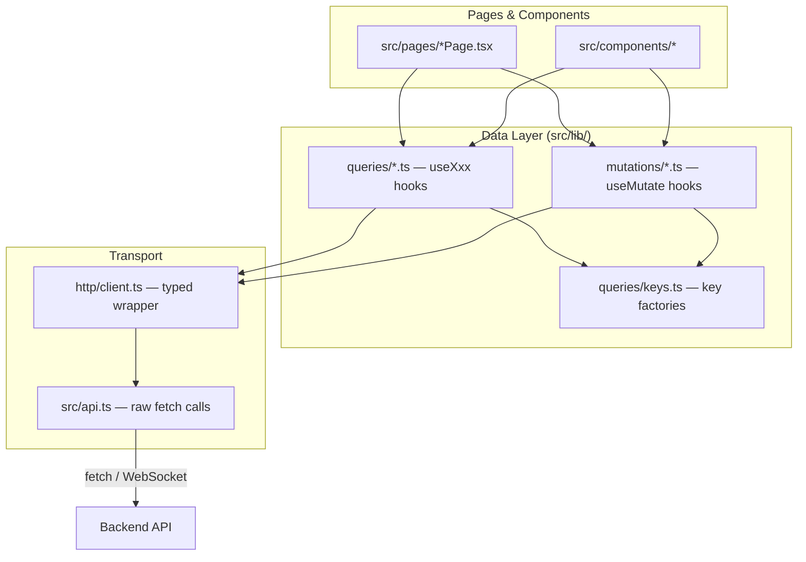

# Other — librefang-api-dashboard

# LibreFang API Dashboard

## Overview

The dashboard is a single-page application providing the web interface for the LibreFang autonomous agent operating system. It is built on **React 19**, **TanStack Router v1**, and **TanStack Query v5**, bundled with **Vite 8**, styled with **TailwindCSS 4**, and tested with **Vitest** and **Playwright**.

Entry point: `src/main.tsx`. Pages live in `src/pages/`. The app mounts into `<div id="root">` in `index.html` and registers a service worker (`public/sw.js`) for offline-capable static asset caching.

## Architecture


```mermaid
graph TD
    subgraph "Pages & Components"
        P[src/pages/*Page.tsx]
        C[src/components/*]
    end

    subgraph "Data Layer (src/lib/)"
        Q[queries/*.ts — useXxx hooks]
        M[mutations/*.ts — useMutate hooks]
        K[queries/keys.ts — key factories]
    end

    subgraph "Transport"
        HT[http/client.ts — typed wrapper]
        API[src/api.ts — raw fetch calls]
    end

    P --> Q
    P --> M
    C --> Q
    C --> M
    Q --> K
    M --> K
    Q --> HT
    M --> HT
    HT --> API
    API -->|fetch / WebSocket| BE[Backend API]
```

The critical rule: **pages and components never call `fetch()` or `api.*` directly.** All data access flows through the shared hooks layer in `src/lib/queries/` and `src/lib/mutations/`. The only exceptions are streaming/SSE endpoints and imperative fire-and-forget control channels (e.g., `TerminalTabs.tsx`), which are documented inline.

## Data Layer

### Directory Layout

```
src/lib/
  http/
    client.ts       # Thin wrapper over src/api.ts + typed re-exports
    errors.ts       # ApiError class
  queries/
    keys.ts         # All query-key factories
    keys.test.ts    # Anchoring / hierarchy smoke tests
    <domain>.ts     # queryOptions + useXxx hooks per domain
  mutations/
    <domain>.ts     # useXxx mutation hooks with cache invalidation
```

Current domains: `agents`, `analytics`, `approvals`, `channels`, `config`, `goals`, `hands`, `mcp`, `media`, `memory`, `models`, `network`, `overview`, `plugins`, `providers`, `runtime`, `schedules`, `sessions`, `skills`, `workflows`.

### Query Key Factories

All query keys are centralized in `src/lib/queries/keys.ts` using a hierarchical pattern. Every sub-key must anchor to the root so broad invalidation works:

```ts
export const fooKeys = {
  all: ["foo"] as const,
  lists: () => [...fooKeys.all, "list"] as const,
  list: (filters: FooFilters = {}) => [...fooKeys.lists(), filters] as const,
  details: () => [...fooKeys.all, "detail"] as const,
  detail: (id: string) => [...fooKeys.details(), id] as const,
};
```

Consumers must never construct `queryKey` inline—always call the factory. If you need a subset of data, use `select` on the shared `queryOptions` rather than subscribing with a different key.

`keys.test.ts` validates anchoring for every factory. Add the new factory to the "all factories exist" list when adding a domain, plus hierarchy tests for non-trivial structures.

### Query Hooks

Each domain file exports a `queryOptions` factory and a corresponding `useXxx` hook:

```ts
export const fooQueryOptions = (filters?: FooFilters) =>
  queryOptions({
    queryKey: fooKeys.list(filters ?? {}),
    queryFn: () => listFoo(filters),
    staleTime: 30_000,
  });

export function useFoo(filters?: FooFilters) {
  return useQuery(fooQueryOptions(filters));
}
```

Hooks accept an optional `options` argument for per-call overrides (`enabled`, `staleTime`, `refetchInterval`). Every override at a call site must carry an inline comment explaining why.

```ts
type UseFooOptions = {
  enabled?: boolean;
  staleTime?: number;
  refetchInterval?: number | false;
};

export function useFoo(filters?: FooFilters, options: UseFooOptions = {}) {
  const { enabled, staleTime, refetchInterval } = options;
  return useQuery({
    ...fooQueryOptions(filters),
    enabled,
    staleTime,
    refetchInterval,
  });
}
```

### Mutation Hooks

Every write operation must invalidate relevant cache entries. **Invalidation logic lives inside the hook**, not at call sites. Call sites may attach their own `onSuccess`/`onError` for UI feedback (toasts, modal dismissal), but that is orthogonal to cache invalidation.

Choose the **narrowest** key set that covers what actually changed:

| Scenario | Keys to invalidate | Example |
|---|---|---|
| Per-id update where list projection changes | `detail(id)` + `lists()` | Patch, rename, status toggle |
| List membership change, no existing detail stale | `lists()` | Create, delete, reorder |
| Genuinely scoped to one detail or nested collection | `detail(id)` or nested sub-key | Field update not shown in list |
| Bulk import / cache reset | `all` | Bulk import, schema migration |

`fooKeys.all` is **not** the default. It refetches the list plus every cached `detail(id)` and nested sub-key for each of N cached items—use only when that fan-out is intended.

### Adding a New Endpoint

1. Add the raw API call in `src/api.ts` (or re-export via `src/lib/http/client.ts`).
2. If new domain: add a key factory in `src/lib/queries/keys.ts` following the hierarchical pattern.
3. Add query in `src/lib/queries/<domain>.ts`.
4. Add mutations in `src/lib/mutations/<domain>.ts`.
5. Update `src/lib/queries/keys.test.ts` with the new factory.

## Transport Layer

### `src/api.ts`

The canonical, hand-maintained source of API types and raw `fetch` calls. All types consumed by the SPA come from here.

`openapi/generated.ts` (regenerated via `pnpm openapi:types`) is a cross-reference only—**never import from it**.

### Authentication

- `setApiKey(token)` stores the bearer token in `sessionStorage` (key: `librefang-api-key`), not `localStorage`.
- `verifyStoredAuth()` probes a protected endpoint; on 401 it clears stored credentials and returns `false`.
- `buildAuthenticatedWebSocket(path)` returns `{ url, protocols }` where `protocols` is `["bearer.<token>"]` when a token is present, or `[]` otherwise.
- All HTTP helpers (`listTools`, `getMetricsText`, `patchAgentConfig`, etc.) attach the `Authorization: Bearer <token>` header automatically.

### Service Worker (`public/sw.js`)

- Precaches `/dashboard/` on install.
- API requests (`/api/*`): **network only** (never cached).
- Static GET assets: **stale-while-revalidate** strategy.
- Non-GET and non-http(s) requests are passed through without caching.

## UI Components

### Layout & Navigation

- **PWA manifest** (`public/manifest.json`): standalone display, starts at `/dashboard/#/overview`, dark theme (`#020617` background, `#0284c7` accent).
- The e2e test (`e2e/dashboard.spec.ts`) verifies the shell loads with navigation links to all major sections: Overview, Agents, Sessions, Approvals, Comms, Providers, Channels, Skills, Hands, Workflows, Scheduler, Goals, Analytics, Memory, Runtime, Logs.

### Drawer System

The dashboard uses a global drawer slot managed by a Zustand store (`src/lib/drawerStore.ts`):

- **`DrawerPanel`** — pushes content into the global slot. Tracks ownership to prevent sibling drawers from collateral-closing each other during picker→config transitions (regression #4714).
- **`PushDrawer`** — renders the global slot. Responds to the `lg` breakpoint (CSS `--breakpoint-lg: 1000px`, JS `matchMedia("(max-width: 999px)")`) for mobile overlay vs. desktop side-panel. On mobile, Esc is handled only when the nearest `[role="dialog"]` is the drawer-root itself, allowing nested `Modal` instances to capture Esc first (regression #5254).

### Modal

`src/components/ui/Modal` supports variants (`panel-right`, `drawer-right`, default centered). Focus management:

| Variant | Default focus target |
|---|---|
| `panel-right` / `drawer-right` | Close button |
| Centred | First focusable descendant |
| With `hideCloseButton` | Falls back to first focusable |

Overridable via `autoFocus` prop (`"first"` or `"close"`).

### MultiSelectCmdk

A combobox-based multi-select built on `cmdk`. Supports:

- Chip-based selected values with individual remove buttons.
- Backspace to remove last chip.
- Search filtering with description metadata (`optionMeta`).
- `allowFreeText` mode for values outside the catalog (deduplicates on Enter).
- Already-selected items are excluded from the dropdown.

### Other Key Components

- **`NotificationCenter`** — bell icon with pending approval count. Implements WAI-ARIA menu button pattern with roving tabindex, ArrowUp/Down/Home/End navigation, and Escape/Tab dismissal.
- **`AgentManifestForm`** — agent creation/editing form. Uses catalog-driven comboboxes for tools, skills, and MCP servers (falls back to free-text `TagInput` when no catalog is supplied).
- **`AgentSchedulePanel`** — schedule mode card (manual, continuous, periodic, proactive). Periodic/proactive modes show a "manifest-controlled" label and hide the toggle. Non-cron schedule kinds (`every`, `at`) disable the edit pencil to prevent silent kind conversion.
- **`ToolCallsPanel`** — expandable panel showing tool call history with running/error badges.
- **`WorkflowStepImageGallery`** — renders image refs extracted from workflow output JSON.
- **`DeliveryTargetsEditor`** — validates delivery targets (channel, webhook, local_file, email) with SSRF protection (blocks localhost, loopback, link-local, cloud metadata IPs).

## Internationalization

- Powered by `i18next` + `react-i18next` + `i18next-browser-languagedetector`.
- Locale files live in `src/locales/`. `en.json` is the reference.
- **Parity enforcement**: `scripts/i18n-parity.mjs` (and its vitest mirror `src/lib/__tests__/locale-parity.test.ts`) flatten and diff every locale against `en.json`. CI fails on missing or extra keys.

## Build & Verification

Run all four commands after any change to `src/lib/queries/`, `src/lib/mutations/`, or `src/api.ts`:

```bash
pnpm lint          # ESLint 9 flat config — errors fail CI, warnings allowed
pnpm typecheck     # tsc --noEmit
pnpm test --run    # Vitest — includes key-factory anchoring tests
pnpm build         # Vite production build
```

A passing typecheck alone is insufficient—the key-factory tests catch anchoring regressions that the compiler does not.

### Lint Policy

`eslint.config.js` runs ESLint 9 flat config with two security rules at `error`:

- **`react/jsx-no-target-blank`** — blocks `target="_blank"` without `rel="noopener noreferrer"`. Prevents regression of the vulnerability class cleaned up in #5390.
- **`react/no-danger-with-children`** — rejects `dangerouslySetInnerHTML` combined with `children`.

Known baseline violations (`react-hooks/rules-of-hooks`, `no-unused-expressions`, `no-irregular-whitespace`, `no-control-regex`) are demoted to `warn` for incremental cleanup. Do not add `eslint-disable` comments; fix the violations or flip the rule to `error` once baseline is zero.

### E2E Tests

```bash
pnpm e2e           # Playwright against http://127.0.0.1:4173
```

`playwright.config.ts` starts the dev server on port 4173 and runs tests from `e2e/`. The primary spec (`e2e/dashboard.spec.ts`) verifies the shell loads with all navigation links and the sign-in dialog appears when credentials are required.

## Dependency Audit

`pnpm.auditConfig.ignoreGhsas` in `package.json` lists deliberately ignored advisories. Each entry must have a matching section in `AUDIT_IGNORES.md` documenting:

- **Why ignored** — the advisory's affected range is overly broad, or the pinned version is clean.
- **Risk if wrong** — typically "none" because the lockfile pins to a safe version.
- **Unlock condition** — advisory narrowed upstream, dependency bumped, or dependency removed.
- **Owner / last review** — PR that introduced the ignore and when to re-evaluate.

Currently ignored: `GHSA-rmmr-r34h-pfm5` (`@tanstack/history` supply-chain advisory with `>= 0` range that flags the clean `1.161.6` we resolve to).

## Conventions

- **TypeScript strict mode.** No `any` in new hooks. Types come from `src/api.ts`.
- **Commit format**: `feat(dashboard/<area>):`, `refactor(dashboard/queries):`, `fix(dashboard/<area>):`. No `Co-Authored-By` footer.
- **Mutation invalidation** is encapsulated in hooks. Callers never need to know which keys a mutation touches.
- **Page consumption pattern**:
  ```tsx
  import { useFoo } from "../lib/queries/foo";
  import { useCreateFoo } from "../lib/mutations/foo";
  ```