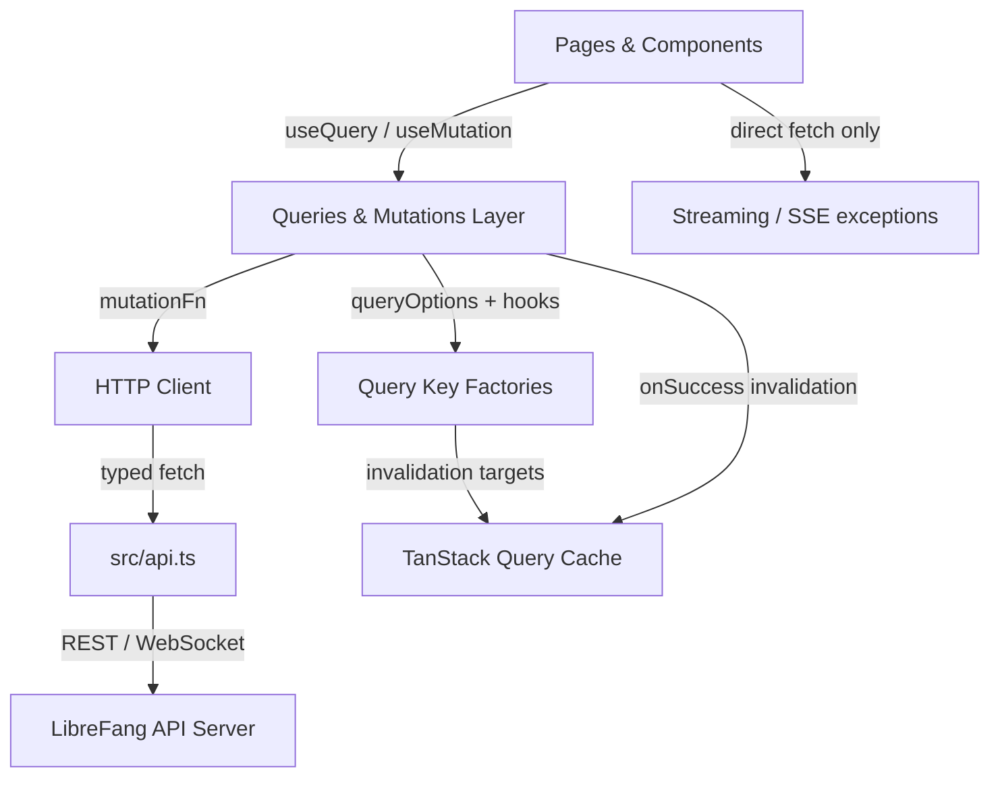

# Other — librefang-api-dashboard

# LibreFang Dashboard

## Overview

The dashboard is a single-page application for managing the LibreFang autonomous agent operating system. Built on **React 19**, **TanStack Router v1**, and **TanStack Query v5**, it provides real-time visibility and control over agents, sessions, workflows, channels, skills, schedules, and more.

**Entry point:** `src/main.tsx`  
**Pages:** `src/pages/`  
**PWA manifest:** `public/manifest.json`  
**Service worker:** `public/sw.js` (stale-while-revalidate for static assets; network-only for `/api/`)

---

## Architecture


```mermaid
graph TD
    A[Pages & Components] -->|useQuery / useMutation| B[Queries & Mutations Layer]
    B -->|queryOptions + hooks| C[Query Key Factories]
    B -->|mutationFn| D[HTTP Client]
    D -->|typed fetch| E[src/api.ts]
    E -->|REST / WebSocket| F[LibreFang API Server]
    A -->|direct fetch only| G[Streaming / SSE exceptions]
    C -->|invalidation targets| H[TanStack Query Cache]
    B -->|onSuccess invalidation| H
```

Pages and components never call `fetch()` or `api.*` directly. All data access flows through the shared hooks layer in `src/lib/queries/` and `src/lib/mutations/`. The only exceptions are streaming/SSE connections and imperative fire-and-forget control channels (e.g., `TerminalTabs.tsx`), which may call `fetch` directly with an explanatory comment.

---

## Data Layer

The data layer is the most structurally important part of this codebase. It is organized under `src/lib/` with a strict separation of concerns.

### Directory Layout

```
src/lib/
  http/
    client.ts        # Thin wrapper over src/api.ts + typed re-exports
    errors.ts        # ApiError class used by the wrapper
  queries/
    keys.ts          # All query-key factories — edit when adding a domain
    keys.test.ts     # Smoke tests — add cases when adding a factory
    <domain>.ts      # queryOptions + useXxx hooks per domain
  mutations/
    <domain>.ts      # useXxx mutation hooks with invalidation
```

**Current domains:** `agents`, `analytics`, `approvals`, `channels`, `config`, `goals`, `hands`, `mcp`, `media`, `memory`, `models`, `network`, `overview`, `plugins`, `providers`, `runtime`, `schedules`, `sessions`, `skills`, `workflows`.

### Query Key Factories

Every domain has a hierarchical key factory in `src/lib/queries/keys.ts`. All sub-keys are anchored with `...fooKeys.all` so broad invalidation works correctly:

```ts
export const fooKeys = {
  all: ["foo"] as const,
  lists: () => [...fooKeys.all, "list"] as const,
  list: (filters: FooFilters = {}) => [...fooKeys.lists(), filters] as const,
  details: () => [...fooKeys.all, "detail"] as const,
  detail: (id: string) => [...fooKeys.details(), id] as const,
};
```

Never construct a `queryKey` inline — always call the factory. Never subscribe to the same endpoint with a different key just to get a subset; use `select` on the shared `queryOptions`.

### Query Hooks

Each domain file (`src/lib/queries/<domain>.ts`) exports a `queryOptions` factory and a `useFoo` hook:

```ts
export const fooQueryOptions = (filters?: FooFilters) =>
  queryOptions({
    queryKey: fooKeys.list(filters ?? {}),
    queryFn: () => listFoo(filters),
    staleTime: 30_000,
  });

export function useFoo(filters?: FooFilters, options: UseFooOptions = {}) {
  const { enabled, staleTime, refetchInterval } = options;
  return useQuery({
    ...fooQueryOptions(filters),
    enabled,
    staleTime,
    refetchInterval,
  });
}
```

The `UseFooOptions` parameter (`{ enabled?, staleTime?, refetchInterval? }`) allows call sites to override polling/gating behavior per-page. Examples:

| Hook | Override | Reason |
|------|----------|--------|
| `useApprovals({ enabled: open })` | `enabled` | Only poll when the approvals panel is open |
| `useCommsEvents(50, { refetchInterval: 5_000 })` | `refetchInterval` | Fast polling for live comms |
| `useModels({}, { enabled: isModelArg })` | `enabled` | Gate on context |
| `useApprovalCount({ refetchInterval: 5_000 })` | `refetchInterval` | Bell-icon badge polling |

Every call-site override must carry a short inline comment explaining why.

### Mutation Hooks and Cache Invalidation

Mutations live in `src/lib/mutations/<domain>.ts`. **Every write must invalidate**, and invalidation must live inside the hook, not at the call site. Call sites may additionally attach `onSuccess`/`onError` for UI feedback (toasts, modal dismissal), which is orthogonal to cache invalidation.

**Prefer the narrowest matching keys.** Use `fooKeys.all` only when the mutation truly dirties every sub-key in the domain:

| Invalidation scope | When to use |
|---|---|
| `fooKeys.detail(id)` + `fooKeys.lists()` | **Default template** — per-id update where the list projection also changes (patch, rename, status flag) |
| `fooKeys.lists()` | List-shape change with no existing detail to refresh (create, delete, reorder) |
| `fooKeys.detail(id)` or nested sub-key | Change is genuinely scoped to one detail and list projection is unaffected |
| `fooKeys.all` | Bulk import, cache reset, cross-cutting schema migration — **not the default** |

Fan-out trade-off: invalidating `fooKeys.all` while N items are cached will refetch the list plus every cached sub-key for each of the N items. Use it only when that is the desired effect.

### Adding a New Endpoint

1. Add the raw call in `src/api.ts` (or re-export via `src/lib/http/client.ts`).
2. If it's a new domain, add a factory in `src/lib/queries/keys.ts` following the hierarchical pattern above.
3. Add the query in `src/lib/queries/<domain>.ts`.
4. Add mutations in `src/lib/mutations/<domain>.ts` with invalidation.
5. Update `src/lib/queries/keys.test.ts` — add the new factory to the "all factories exist" list and add anchoring/hierarchy tests for non-trivial factories.

### Type Source

`src/api.ts` is the canonical, hand-maintained type source for the SPA. Do not import from `openapi/generated.ts` — it is a regenerable cross-reference only (refresh via `pnpm openapi:types`).

---

## Navigation & Pages

The dashboard uses TanStack Router for client-side routing. The sidebar exposes these top-level sections (verified by E2E in `e2e/dashboard.spec.ts`):

Overview, Agents, Sessions, Approvals, Comms, Providers, Channels, Skills, Hands, Workflows, Scheduler, Goals, Analytics, Memory, Runtime, Logs

Authentication is handled via a sign-in dialog that appears when the backend requires credentials (mode `credentials` from `/api/auth/dashboard-check`). Tokens are stored in `sessionStorage` (not `localStorage`) under the key `librefang-api-key`.

---

## UI Component Library

### Shared Components

The `src/components/ui/` directory contains reusable primitives:

- **`Button`** — Variants: `primary`, `secondary`, `ghost`, `danger`, `success`. Sizes: `sm`, `md`, `lg`. Supports `isLoading` spinner and `leftIcon`/`rightIcon` slots.
- **`Modal`** — Supports `centered`, `panel-right`, and `drawer-right` variants. Auto-focus defaults to the close button for side panels and first focusable descendant for centered modals. Overridable via `autoFocus` prop.
- **`PushDrawer`** — Global drawer slot powered by Zustand (`src/lib/drawerStore`). Renders desktop `<aside>` on `≥1000px` and mobile overlay on `<1000px`. The breakpoint literal (`999px`) is locked to the CSS `--breakpoint-lg: 1000px` override.
- **`DrawerPanel`** — Declarative wrapper around `PushDrawer`'s global slot. Handles parent-driven open/close, external close (Esc/X/backdrop), and ownership arbitration when sibling drawers transition in the same React commit (see issue #4714).
- **`MultiSelectCmdk`** — Combobox-based multi-select with chip removal, search filtering, optional `optionMeta` descriptions, and `allowFreeText` mode for free-form entries.

### Domain Components

- **`NotificationCenter`** — Bell-icon dropdown with WAI-ARIA menu button pattern, roving tabindex, Home/End jumps, and wrap-around Arrow key navigation.
- **`AgentManifestForm`** — Form for agent manifests with catalog-driven comboboxes for tools, skills, and MCP servers. Falls back to `TagInput` when no catalog is supplied.
- **`AgentSchedulePanel`** — Displays and edits agent schedule modes (manual, continuous, periodic, proactive). Supports cron job and trigger CRUD. Non-cron schedule kinds (`every`, `at`) disable the edit pencil with a tooltip directing users to `agent.toml`.
- **`PromptsExperimentsModal`** — Tabbed modal for prompt version management and A/B experiments with traffic splitting.
- **`WorkflowStepImageGallery`** — Renders image galleries from workflow step output when `image_urls` are present.

---

## Authentication & WebSocket

The `src/api.ts` module handles auth token management:

- **`setApiKey(token)`** — Stores the token in `sessionStorage`.
- **`verifyStoredAuth()`** — Probes a protected endpoint; clears stale tokens on 401.
- **`buildAuthenticatedWebSocket(path)`** — Returns `{ url, protocols }` with the token as a `Sec-WebSocket-Protocol` bearer sub-protocol (`bearer.<token>`).

All HTTP helper functions attach `Authorization: Bearer <token>` automatically.

---

## Testing Strategy

### Unit & Integration Tests (Vitest)

```bash
pnpm test --run    # Run all vitest tests
pnpm test:watch    # Watch mode
```

Test infrastructure:
- **`src/lib/test/query-client.tsx`** — Exports `createQueryClientWrapper` for React Query hook tests. Disables retry, sets `gcTime: 0`, and disables structural sharing.
- **`src/lib/__tests__/locale-parity.test.ts`** — Gates CI; ensures all locale files have key parity with `en.json`.
- Query key factory tests in `src/lib/queries/keys.test.ts` verify anchoring (all sub-keys contain `...fooKeys.all`).

Common test patterns:
- `vi.mock("react-i18next", ...)` — Returns `defaultValue` when supplied, otherwise the key.
- `vi.mock("../lib/store", ...)` — Replaces `useUIStore` with a no-op `addToast` to avoid zustand persist errors in jsdom.
- `vi.mock("motion/react", ...)` — Shims `AnimatePresence` and `motion.*` as pass-through elements for jsdom.

### E2E Tests (Playwright)

```bash
pnpm e2e
```

Configured in `playwright.config.ts` — starts the dev server on `127.0.0.1:4173`, runs tests from `e2e/`. The smoke test (`e2e/dashboard.spec.ts`) verifies the shell loads with all sidebar navigation links and that the sign-in dialog appears when credentials are required.

### i18n Parity

```bash
pnpm test:i18n-parity    # Standalone CLI check (no vitest needed)
```

The script (`scripts/i18n-parity.mjs`) flattens each locale JSON, compares key sets against `en.json`, and reports missing/extra keys with a non-zero exit code on drift.

---

## Build & Verification

Run all four commands after any change to `src/lib/queries/`, `src/lib/mutations/`, or `src/api.ts`:

```bash
pnpm lint        # ESLint 9 — errors must be green; warnings allowed
pnpm typecheck   # tsc --noEmit — must be green
pnpm test --run  # vitest — all tests pass
pnpm build       # vite build — must succeed
```

A passing typecheck alone is not sufficient — the key-factory tests catch anchoring regressions that the compiler does not.

### ESLint Policy

`eslint.config.js` uses ESLint 9 flat config. The two security-critical rules are **`error`**:

- `react/jsx-no-target-blank` — Prevents `target="_blank"` without `rel="noopener noreferrer"` (regression guard for issue #5390).
- `react/no-danger-with-children` — Rejects `dangerouslySetInnerHTML` combined with `children`.

Baseline violations (`react-hooks/rules-of-hooks`, `no-unused-expressions`, `no-irregular-whitespace`, `no-control-regex`) are demoted to `warn` for the initial bootstrap. Clean them up incrementally rather than adding `eslint-disable` comments.

---

## Service Worker

`public/sw.js` implements a basic cache-first strategy:

- **API requests (`/api/*`)**: Network only (no caching).
- **Static GET requests**: Stale-while-revalidate — serves from cache, updates in background.
- **Non-GET requests**: Not cached.
- Precaches `/dashboard/` on install.

---

## Dependency Audit Management

Audit ignores are documented in `AUDIT_IGNORES.md`. Each ignored GHSA entry includes:

- **Why ignored** — rationale for the false positive or accepted risk.
- **Risk if wrong** — impact assessment.
- **Unlock condition** — specific criteria for removing the ignore.
- **Owner / last review** — PR reference and re-evaluation trigger.

Currently ignored: `GHSA-rmmr-r34h-pfm5` (`@tanstack/history`) — the advisory's `>= 0` range flags the clean `1.161.6` version we pin to via `@tanstack/react-router`.

---

## Commit Convention

Follows the root repo format with dashboard-scoped paths:

```
feat(dashboard/<area>): ...
refactor(dashboard/queries): ...
fix(dashboard/<area>): ...
```

Never include a `Co-Authored-By` footer.