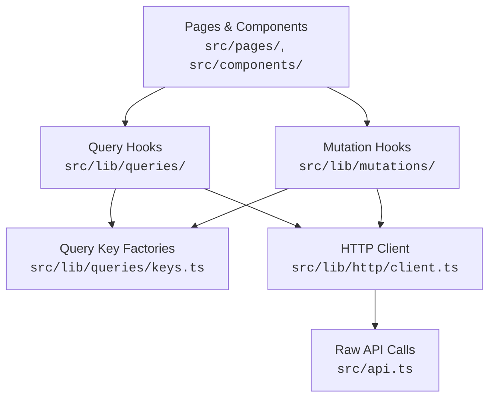

# Other — librefang-api-dashboard

# LibreFang Dashboard

React 19 single-page application for managing and monitoring LibreFang agents. Built on TanStack Router v1 (routing) and TanStack Query v5 (server state), bundled with Vite, and linted with ESLint 9 flat config.

## Architecture


```mermaid
graph TD
    P["Pages & Components<br/><code>src/pages/</code>, <code>src/components/</code>"] --> Q["Query Hooks<br/><code>src/lib/queries/</code>"]
    P --> M["Mutation Hooks<br/><code>src/lib/mutations/</code>"]
    Q --> K["Query Key Factories<br/><code>src/lib/queries/keys.ts</code>"]
    Q --> C["HTTP Client<br/><code>src/lib/http/client.ts</code>"]
    M --> C
    M --> K
    C --> A["Raw API Calls<br/><code>src/api.ts</code>"]
```

Pages and components never call `fetch()` or `api.*` directly — all data access flows through the shared hooks layer. The only exceptions are streaming/SSE endpoints, imperative fire-and-forget control channels (e.g. `TerminalTabs.tsx`), and one-shot probes that must not be cached.

## Data Layer

### Directory Layout

```
src/
  api.ts                      # Raw fetch wrappers — canonical type source
  lib/
    http/
      client.ts               # Thin wrapper over api.ts + typed re-exports
      errors.ts               # ApiError class
    queries/
      keys.ts                 # All query-key factories
      keys.test.ts            # Smoke tests for factory anchoring
      <domain>.ts             # queryOptions + useXxx hooks per domain
    mutations/
      <domain>.ts             # useXxx mutation hooks with invalidation
```

Active domain files: `agents`, `analytics`, `approvals`, `channels`, `config`, `goals`, `hands`, `mcp`, `media`, `memory`, `models`, `network`, `overview`, `plugins`, `providers`, `runtime`, `schedules`, `sessions`, `skills`, `workflows`.

### Query Key Factories

All query keys live in `src/lib/queries/keys.ts` and follow a hierarchical pattern. Every sub-key **must** be anchored with `...fooKeys.all` so broad invalidation works:

```ts
export const fooKeys = {
  all: ["foo"] as const,
  lists: () => [...fooKeys.all, "list"] as const,
  list: (filters: FooFilters = {}) => [...fooKeys.lists(), filters] as const,
  details: () => [...fooKeys.all, "detail"] as const,
  detail: (id: string) => [...fooKeys.details(), id] as const,
};
```

Never build a `queryKey` inline — always call the factory. Never subscribe to the same endpoint with a different key to get a subset; use `select` on the shared `queryOptions`.

### Query Hooks

Each domain file exports a `queryOptions` factory and a corresponding `useFoo` hook:

```ts
export const fooQueryOptions = (filters?: FooFilters) =>
  queryOptions({
    queryKey: fooKeys.list(filters ?? {}),
    queryFn: () => listFoo(filters),
    staleTime: 30_000,
  });

export function useFoo(filters?: FooFilters) {
  return useQuery(fooQueryOptions(filters));
}
```

Hooks accept an optional `options` argument for per-call-site overrides (`enabled`, `staleTime`, `refetchInterval`). Every override must carry a short inline comment explaining why:

```ts
type UseFooOptions = {
  enabled?: boolean;
  staleTime?: number;
  refetchInterval?: number | false;
};

export function useFoo(filters?: FooFilters, options: UseFooOptions = {}) {
  const { enabled, staleTime, refetchInterval } = options;
  return useQuery({
    ...fooQueryOptions(filters),
    enabled,
    staleTime,
    refetchInterval,
  });
}
```

Reference examples in the codebase: `useApprovals({ enabled: open })`, `useCommsEvents(50, { refetchInterval: 5_000 })`, `useModels({}, { enabled: isModelArg })`, `useAgentTemplates({ enabled })`, `useApprovalCount({ refetchInterval: 5_000 })`.

### Mutation Hooks

Every mutation **must** invalidate the relevant cache keys, and invalidation **must** live inside the hook. Call sites may additionally attach per-call `onSuccess`/`onError` for UI feedback (toasts, modal dismissal), but that is orthogonal to invalidation.

Pick the **narrowest** key set that covers what changed:

| Scenario | Keys to invalidate | When to use |
|---|---|---|
| Per-id update where list projection also changes | `fooKeys.detail(id)` + `fooKeys.lists()` | **Default template** — patch, rename, status flag surfaced in list row |
| List-shape change, no existing detail to refresh | `fooKeys.lists()` | Create, delete, reorder |
| Change scoped to one detail, list unaffected | `fooKeys.detail(id)` or nested sub-key | Genuinely local update |
| Bulk import / cache reset | `fooKeys.all` | Only when *every* cached sub-key is potentially stale |

Invalidating `fooKeys.all` when N items are cached refetches the list plus every cached sub-key (`detail(id)`, nested keys like `sessions(id)`, `experiments(id)`) for each item. Use it only when that is the desired effect.

## Adding a New Endpoint

1. **Raw call** — Add the function in `src/api.ts` (or re-export via `src/lib/http/client.ts`).
2. **Key factory** — If it is a new domain, add a factory in `src/lib/queries/keys.ts` following the hierarchical pattern above.
3. **Query hook** — Add `queryOptions` + `useFoo` in `src/lib/queries/<domain>.ts`.
4. **Mutation hook** — Add `useCreateFoo` / `useUpdateFoo` in `src/lib/mutations/<domain>.ts` with the narrowest invalidation keys.
5. **Tests** — Add the factory to the `all factories exist` list in `src/lib/queries/keys.test.ts`. Add anchoring/hierarchy tests for non-trivial factories.

## Authentication

Tokens are stored in `sessionStorage` under the key `librefang-api-key` (never `localStorage`). The `setApiKey` function writes the token; `verifyStoredAuth` validates it against the backend and clears stale tokens on 401. WebSocket connections pass the token as a `Sec-WebSocket-Protocol` bearer sub-protocol (`bearer.<token>`).

## Type System

`src/api.ts` is the **canonical, hand-maintained type source** consumed by the SPA. `openapi/generated.ts` is a regenerable cross-reference only — do not import from it. TypeScript strict mode is enforced; no `any` in new hooks.

## Internationalization

Locale files live in `src/locales/` with `en.json` as the reference. Parity is enforced by:

- **Unit test**: `src/lib/__tests__/locale-parity.test.ts` (gates CI via `pnpm test`)
- **CLI script**: `node scripts/i18n-parity.mjs` (quick pre-commit check)

Both flatten each JSON file and compare key sets against `en.json`. Missing or extra keys cause failure.

## Build & Verification

Run all four commands after any change to `src/lib/queries/`, `src/lib/mutations/`, or `src/api.ts`. A passing typecheck alone is insufficient — the key-factory tests catch anchoring regressions that the compiler does not:

```bash
pnpm lint          # ESLint — errors fail CI, warnings allowed
pnpm typecheck     # tsc --noEmit
pnpm test --run    # Vitest — unit + integration tests
pnpm build         # Vite production build
```

End-to-end tests use Playwright against a dev server on port 4173:

```bash
pnpm e2e
```

### Lint Policy

`eslint.config.js` uses ESLint 9 flat config. The security-critical rules promoted to `error`:

- `react/jsx-no-target-blank` — blocks `target="_blank"` without `rel="noopener noreferrer"`
- `react/no-danger-with-children` — rejects `dangerouslySetInnerHTML` combined with `children`

Noisy or pre-existing baseline violations (`react-hooks/rules-of-hooks`, `no-unused-expressions`, `no-irregular-whitespace`, `no-control-regex`) are demoted to `warn`. Clean them up incrementally rather than adding `eslint-disable` comments. Flip a rule to `error` only after existing violations reach zero.

## Progressive Web App

- `public/manifest.json` — PWA manifest with `standalone` display mode, dark theme (`#020617` background, `#0284c7` theme)
- `public/sw.js` — Service worker with stale-while-revalidate for static assets, network-only for `/api/` requests, skip for non-GET methods
- `index.html` — Registers the service worker on load

## Dependency Audit Ignores

Every GHSA listed under `pnpm.auditConfig.ignoreGhsas` in `package.json` must have a matching section in `AUDIT_IGNORES.md` explaining the rationale, risk if wrong, and unlock condition. Currently tracked:

- **GHSA-rmmr-r34h-pfm5** (`@tanstack/history`) — Advisory covers a supply-chain hijack but its affected range (`>= 0`) also flags the clean `1.161.6` pinned in the lockfile. The malicious versions are never installed. Drops when the advisory is narrowed upstream, `@tanstack/react-router` bumps to a non-flagged version, or the dashboard drops the dependency.

When adding a new ignore: verify the advisory doesn't apply to the resolved version, add the GHSA to `package.json`, document it in `AUDIT_IGNORES.md`, and reference both files in the PR body.

## Conventions

- **Commit format**: `feat(dashboard/<area>):`, `refactor(dashboard/queries):`, `fix(dashboard/<area>):`. Never include a `Co-Authored-By` footer.
- **Mutation invalidation** lives in the hook — callers never need to know which keys a mutation touches.
- **DrawerPanel** pushes content into a global drawer slot (`useDrawerStore`). Each instance tracks ownership to prevent sibling drawers from colliding when one closes in the same React commit another opens. See `DrawerPanel.test.tsx` for the edge cases.
- **Modal focus management**: `panel-right` and `drawer-right` variants default focus to the close button; centred modals focus the first focusable descendant. Override with `autoFocus="first"` or `autoFocus="close"`.
- **NotificationCenter** implements WAI-ARIA menu button pattern with roving tabindex, wrap-around arrow navigation, and Home/End jumps.
- **MultiSelectCmdk** supports `optionMeta` for descriptions, `allowFreeText` for free-entry, and filters by both option name and description text.