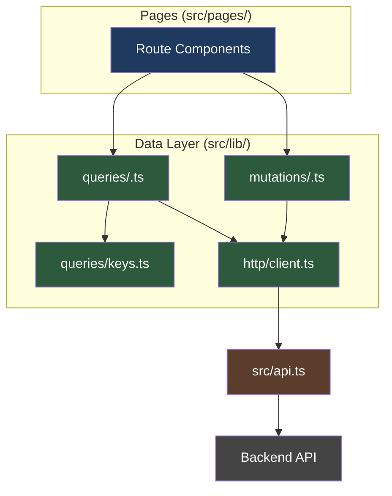

# Other — librefang-api-dashboard

# LibreFang Dashboard

React 19 single-page application for managing and monitoring the LibreFang agent operating system. Built on TanStack Router v1 (routing) and TanStack Query v5 (server-state caching), bundled with Vite 8.

## Architecture Overview


```mermaid
graph TD
    subgraph "Pages (src/pages/)"
        P[Route Components]
    end
    subgraph "Data Layer (src/lib/)"
        Q[queries/<domain>.ts]
        M[mutations/<domain>.ts]
        K[queries/keys.ts]
        H[http/client.ts]
    end
    API[src/api.ts]
    BE[Backend API]

    P --> Q
    P --> M
    Q --> K
    Q --> H
    M --> H
    H --> API
    API --> BE

    style P fill:#1e3a5f,color:#fff
    style Q fill:#2d5a3d,color:#fff
    style M fill:#2d5a3d,color:#fff
    style K fill:#2d5a3d,color:#fff
    style H fill:#2d5a3d,color:#fff
    style API fill:#5a3d2d,color:#fff
    style BE fill:#444,color:#fff
```

## Entry Point and Routing

- **Entry**: `src/main.tsx` — mounts the React tree into `#root` (see `index.html`).
- **Router**: TanStack Router v1 with file-based routes in `src/pages/`.
- **Shell navigation** includes: Overview, Agents, Sessions, Approvals, Comms, Providers, Channels, Skills, Hands, Workflows, Scheduler, Goals, Analytics, Memory, Runtime, Logs.

## Data Layer

All server-state access flows through a structured hooks layer. Pages and components never call `fetch()` or `api.*` directly (exceptions noted below).

### Directory Layout

```
src/lib/
  http/
    client.ts       # thin wrapper over src/api.ts + typed re-exports
    errors.ts       # ApiError class
  queries/
    keys.ts         # hierarchical query-key factories for every domain
    keys.test.ts    # anchoring/smoke tests
    <domain>.ts     # queryOptions + useXxx hooks per domain
  mutations/
    <domain>.ts     # useXxx mutation hooks with cache invalidation
```

**Active domains**: `agents`, `analytics`, `approvals`, `channels`, `config`, `goals`, `hands`, `mcp`, `media`, `memory`, `models`, `network`, `overview`, `plugins`, `providers`, `runtime`, `schedules`, `sessions`, `skills`, `workflows`.

### Query Key Factories

Every domain defines a hierarchical key factory in `src/lib/queries/keys.ts`. Sub-keys spread from `all` so that broad invalidation works correctly:

```ts
export const fooKeys = {
  all: ["foo"] as const,
  lists: () => [...fooKeys.all, "list"] as const,
  list: (filters: FooFilters = {}) => [...fooKeys.lists(), filters] as const,
  details: () => [...fooKeys.all, "detail"] as const,
  detail: (id: string) => [...fooKeys.details(), id] as const,
};
```

**Rules**:
- Never construct a `queryKey` inline — always call the factory.
- Never subscribe to the same endpoint under a different key for a subset; use `select` on the shared `queryOptions` instead.

### Query Hooks

Each domain exports `queryOptions` (for router integration / prefetching) and a `useXxx` convenience hook:

```ts
export const fooQueryOptions = (filters?: FooFilters) =>
  queryOptions({
    queryKey: fooKeys.list(filters ?? {}),
    queryFn: () => listFoo(filters),
    staleTime: 30_000,
  });

export function useFoo(filters?: FooFilters, options: UseFooOptions = {}) {
  const { enabled, staleTime, refetchInterval } = options;
  return useQuery({
    ...fooQueryOptions(filters),
    enabled,
    staleTime,
    refetchInterval,
  });
}
```

The optional `options` argument (`enabled`, `staleTime`, `refetchInterval`) lets call sites override defaults without forking the query — used for bell-icon polls, gated tabs, and slow-refresh bulk pages.

### Mutation Hooks and Invalidation

Every mutation hook contains its own invalidation logic. Callers never need to know which keys are affected. Call sites may attach their own `onSuccess`/`onError` for UI feedback (toasts, modal dismissal) — that is orthogonal to cache invalidation.

**Invalidation strategy** (use the narrowest set that covers what changed):

| Scenario | Keys to invalidate | Example |
|---|---|---|
| Per-id update affecting list projection | `detail(id)` + `lists()` | Patch, rename, status flag |
| List-shape change, no existing detail stale | `lists()` | Create, delete, reorder |
| Change scoped to one detail or nested collection | `detail(id)` or nested sub-key | Field update not in list row |
| Bulk import / cross-cutting reset | `all` | Bulk import, schema migration |

Invalidating `all` refetches every cached sub-key (list + all `detail(id)` entries + nested keys like `sessions(id)`) for all N cached items. Reserve for when that fan-out is genuinely needed.

### Adding a New Endpoint

1. Add the raw call in `src/api.ts` (or re-export via `src/lib/http/client.ts`).
2. If it's a new domain, add a key factory in `src/lib/queries/keys.ts`.
3. Add query options + hook in `src/lib/queries/<domain>.ts`.
4. Add mutation hook(s) in `src/lib/mutations/<domain>.ts`.
5. Add at minimum a factory-existence test in `src/lib/queries/keys.test.ts`.

### Exceptions (Uncached Data)

Streaming/SSE connections, imperative fire-and-forget control channels (e.g. `TerminalTabs.tsx`), and one-shot probes that must not be cached may call `fetch` directly. Keep these narrow and comment why.

## Authentication

- **Token storage**: `sessionStorage` (key: `librefang-api-key`), set via `setApiKey()`.
- **HTTP requests**: Bearer token in the `Authorization` header.
- **WebSocket connections**: Token passed as `Sec-WebSocket-Protocol: bearer.<token>` sub-protocol.
- **Validation**: `verifyStoredAuth()` probes a protected endpoint; clears stale tokens on 401.
- **Sign-in flow**: When the backend requires credentials, a sign-in dialog renders (validated in e2e tests).

## Key Components

### UI Primitives

| Component | Purpose |
|---|---|
| `Modal` | Dialog with variants (`centered`, `panel-right`, `drawer-right`). Manages focus trap with configurable auto-focus target. |
| `DrawerPanel` | Declarative drawer that pushes content into a global Zustand-managed slot (`useDrawerStore`). Handles ownership tracking so sibling drawer transitions don't collide. |
| `PushDrawer` | Host component that renders the global drawer slot. Responsive: mobile overlay (`role="dialog"`) vs. desktop `<aside>`. Breakpoint synced with CSS `--breakpoint-lg` at 999px. |
| `MultiSelectCmdk` | cmdk-based multi-select with chip display, search filtering, option metadata descriptions, and optional free-text entry. |
| `DeliveryTargetsEditor` | Delivery target builder for scheduler jobs with SSRF validation (blocks localhost, loopback, link-local, cloud metadata IPs). |
| `Sparkline` | Lightweight inline chart for metric visualizations. |

### Domain Components

| Component | Purpose |
|---|---|
| `NotificationCenter` | Bell-icon dropdown with WAI-ARIA Menu Button pattern. Keyboard navigation (ArrowUp/Down, Home/End, Escape, Tab) with roving tabindex. Shows pending approvals and skill candidates. |
| `AgentManifestForm` | Catalog-driven form for agent creation/editing. Uses `MultiSelectCmdk` for tools, skills, and MCP server selection with catalog-driven dropdowns (falls back to free-text `TagInput` when no catalog). |
| `AgentSchedulePanel` | Schedule mode display (manual/continuous/periodic/proactive) with cron job and trigger CRUD. Periodic/proactive modes render as "manifest-controlled" with no UI toggle to prevent silently overwriting manifest-driven schedules. |
| `AgentSkillItem` | Inline skill assignment row with add/remove actions, description display, and busy-state disable. |
| `PromptsExperimentsModal` | Prompt versioning and A/B experiment management with traffic split builder (`buildEvenTrafficSplit`). |
| `TaintPolicyEditor` | Per-MCP-server taint scanning configuration. Syncs local state via `useEffect` when the `server` prop changes (regression guard for cross-server state leakage). |
| `WorkflowStepImageGallery` | Renders image references extracted from workflow output JSON. |

### Utility Libraries

| Module | Purpose |
|---|---|
| `src/lib/agentManifest.ts` | Manifest form state management, validation, and `emptyManifestForm`/`emptyManifestExtras` factories. |
| `src/lib/agentManifestMarkdown.ts` | Generates TOML/Markdown from manifest form state. |
| `src/lib/triggerPattern.ts` | Trigger pattern formatting/parsing for the schedule system. |
| `src/lib/workflowOutputImages.ts` | Extracts `image_urls` and `revised_prompt` from workflow output JSON. |
| `src/lib/csvParser.ts` | CSV text parser (references Unicode whitespace classes). |
| `src/lib/chatPicker.ts` | Chat selection logic. |
| `src/lib/canvas.ts` | XYFlow canvas node/edge helpers for the workflow visual editor. |
| `src/lib/useListNav.ts` | Keyboard navigation hook for list UIs. |
| `src/lib/safeUrl.ts` | URL sanitization. |
| `src/lib/store.ts` | Zustand store for UI state (toasts, theme) with `persist` middleware. |
| `src/lib/drawerStore.ts` | Zustand singleton managing the global drawer slot (`isOpen`, `content`, `close`). |

## Internationalization

- **Library**: i18next + `react-i18next` with browser language detection.
- **Reference locale**: `src/locales/en.json`.
- **Parity enforcement**: `pnpm test:i18n-parity` (or `node scripts/i18n-parity.mjs`) checks all locale files against `en.json` for missing or extra keys. Also validated by `src/lib/__tests__/locale-parity.test.ts` in CI.
- Tests mock `useTranslation` to return `defaultValue` when provided, keeping assertions readable.

## Service Worker

`public/sw.js` provides offline-capable static asset caching:

- **Install**: Precaches `/dashboard/`.
- **Strategy**: Stale-while-revalidate for GET requests on static assets.
- **Exclusions**: API requests (`/api/*`) always use network; non-GET requests are never cached.
- Registered from `index.html` on load.

## Build and Verification

Run all four checks after changes to `src/lib/queries/`, `src/lib/mutations/`, or `src/api.ts`:

```bash
pnpm lint          # ESLint 9 flat config — errors fail CI, warnings allowed
pnpm typecheck     # tsc --noEmit — strict mode
pnpm test --run    # Vitest — key-factory anchoring tests catch regressions tsc cannot
pnpm build         # Vite production build
```

### Lint Policy

Security-critical rules are `error`-level:
- `react/jsx-no-target-blank` — blocks `target="_blank"` without `rel="noopener noreferrer"`.
- `react/no-danger-with-children` — rejects `dangerouslySetInnerHTML` combined with children.

Several rules are demoted to `warn` during the bootstrap phase (e.g. `@typescript-eslint/no-explicit-any`, `react-hooks/rules-of-hooks`). Clean up incrementally rather than adding `eslint-disable`.

## End-to-End Testing

Playwright tests in `e2e/dashboard.spec.ts` validate:
- Shell rendering (LibreFang branding and all navigation links).
- Page navigation (Comms, Hands, Goals).
- Sign-in dialog appearance when credentials are required.

Config: `playwright.config.ts` runs against `pnpm dev` on `127.0.0.1:4173`, 30s timeout, trace on first retry.

## Type Sources

- **Canonical types**: `src/api.ts` — hand-maintained, imported throughout the SPA.
- **Reference types**: `openapi/generated.ts` — auto-generated via `pnpm openapi:types`. Used for cross-reference only; **never imported** by application code.

## Dependency Audit Management

`pnpm.auditConfig.ignoreGhsas` in `package.json` lists deliberately ignored security advisories. Each entry must have a matching section in `AUDIT_IGNORES.md` documenting:

- **Why ignored** — why the advisory doesn't apply to the pinned version.
- **Risk if wrong** — blast radius if the assessment is incorrect.
- **Unlock condition** — when the ignore can be dropped.
- **Owner / last review** — PR origin and next review trigger.

## Commit Conventions

```
feat(dashboard/<area>): ...
refactor(dashboard/<area>): ...
fix(dashboard/<area>): ...
```

No `Co-Authored-By` footers in dashboard commits.