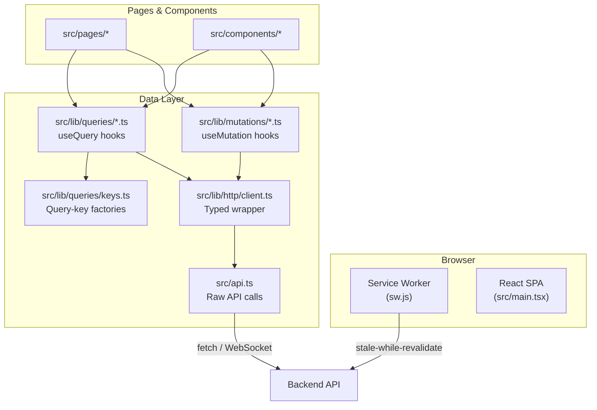

# Other — librefang-api-dashboard

# LibreFang Dashboard

## Overview

The LibreFang Dashboard is a single-page application providing the web management interface for the LibreFang autonomous agent operating system. Built on React 19 with TanStack Router v1 and TanStack Query v5, it manages 20+ domain areas including agents, sessions, approvals, channels, skills, workflows, scheduling, and analytics.

**Entry point:** `src/main.tsx`
**Pages directory:** `src/pages/`


```mermaid
graph TD
    subgraph "Browser"
        SW["Service Worker<br/>(sw.js)"]
        SPA["React SPA<br/>(src/main.tsx)"]
    end

    subgraph "Data Layer"
        API["src/api.ts<br/>Raw API calls"]
        HTTP["src/lib/http/client.ts<br/>Typed wrapper"]
        QK["src/lib/queries/keys.ts<br/>Query-key factories"]
        Q["src/lib/queries/*.ts<br/>useQuery hooks"]
        M["src/lib/mutations/*.ts<br/>useMutation hooks"]
    end

    subgraph "Pages & Components"
        P["src/pages/*"]
        C["src/components/*"]
    end

    P --> Q
    P --> M
    C --> Q
    C --> M
    Q --> QK
    Q --> HTTP
    M --> HTTP
    HTTP --> API
    API -->|"fetch / WebSocket"| Backend["Backend API"]
    SW -->|"stale-while-revalidate"| Backend
```

## Technology Stack

| Layer | Technology | Version |
|---|---|---|
| UI Framework | React | 19.x |
| Routing | TanStack Router | 1.x |
| Server State | TanStack Query | 5.x |
| Client State | Zustand | 5.x |
| Bundler | Vite | 8.x |
| Styling | Tailwind CSS | 4.x |
| Language | TypeScript | 5.9 (strict) |
| i18n | i18next + react-i18next | 26.x / 17.x |
| Terminal | xterm.js | 6.x |
| Flow Editor | ReactFlow (xyflow) | 12.x |
| Charts | Recharts | 3.x |
| Animations | Motion (Framer Motion) | 12.x |
| Package Manager | pnpm | 10.33.0 |

## Data Layer Architecture

All data access from pages and components must go through the shared hooks layer. Direct `fetch()` or `api.*` calls inside page or component files are prohibited.

### Directory Layout

```
src/lib/
  http/
    client.ts          # Thin wrapper over src/api.ts + typed re-exports
    errors.ts          # ApiError class used by the wrapper
  queries/
    keys.ts            # All query-key factories
    keys.test.ts       # Smoke tests for key factories
    <domain>.ts        # queryOptions + useXxx hooks per domain
  mutations/
    <domain>.ts        # useXxx mutation hooks with cache invalidation
```

**Active domains:** `agents`, `analytics`, `approvals`, `channels`, `config`, `goals`, `hands`, `mcp`, `media`, `memory`, `models`, `network`, `overview`, `plugins`, `providers`, `runtime`, `schedules`, `sessions`, `skills`, `workflows`.

### Query-Key Factories

Query keys use a hierarchical pattern anchored to a root key. This enables broad invalidation (e.g., "all agent queries") and narrow invalidation (e.g., "one agent's detail").

```ts
export const fooKeys = {
  all: ["foo"] as const,
  lists: () => [...fooKeys.all, "list"] as const,
  list: (filters: FooFilters = {}) => [...fooKeys.lists(), filters] as const,
  details: () => [...fooKeys.all, "detail"] as const,
  detail: (id: string) => [...fooKeys.details(), id] as const,
};
```

Every sub-key must be anchored with `...fooKeys.all` so that invalidating the root cascades correctly. Tests in `src/lib/queries/keys.test.ts` verify this anchoring — run them after any changes to the key factories.

### Query Hooks

Each domain exposes a `queryOptions` factory and a `useXxx` hook:

```ts
export const fooQueryOptions = (filters?: FooFilters) =>
  queryOptions({
    queryKey: fooKeys.list(filters ?? {}),
    queryFn: () => listFoo(filters),
    staleTime: 30_000,
  });

export function useFoo(filters?: FooFilters, options: UseFooOptions = {}) {
  const { enabled, staleTime, refetchInterval } = options;
  return useQuery({
    ...fooQueryOptions(filters),
    enabled,
    staleTime,
    refetchInterval,
  });
}
```

Hooks accept an optional `options` bag (`enabled`, `staleTime`, `refetchInterval`) for per-page overrides. Every override must carry an inline comment explaining why. Examples: `useApprovals({ enabled: open })` gates polling to when the panel is open; `useApprovalCount({ refetchInterval: 5_000 })` polls the badge icon; `useModels({}, { enabled: isModelArg })` defers loading.

### Mutation Hooks and Cache Invalidation

Every write operation must invalidate cache, and invalidation must live inside the mutation hook. Callers never need to know which keys a mutation touches.

**Prefer the narrowest matching keys.** The invalidation scope hierarchy:

| Scope | When to use | Example |
|---|---|---|
| `fooKeys.detail(id)` + `fooKeys.lists()` | Per-id update where the list projection also changes (default) | Patch, rename, status flag |
| `fooKeys.lists()` | List-shape change with no existing detail to refresh | Create, delete, reorder |
| `fooKeys.detail(id)` or nested sub-key | Change scoped to one detail, list projection unaffected | Edit a field not shown in list |
| `fooKeys.all` | Bulk import, cache reset, cross-cutting schema migration | Mass import |

Invalidating `fooKeys.all` refetches every cached sub-key for every cached item — only use it when that is explicitly desired.

```ts
// Default template: per-id patch
export function useUpdateFoo() {
  const qc = useQueryClient();
  return useMutation({
    mutationFn: updateFoo,
    onSuccess: (_data, variables) => {
      qc.invalidateQueries({ queryKey: fooKeys.lists() });
      qc.invalidateQueries({ queryKey: fooKeys.detail(variables.id) });
    },
  });
}
```

Call sites may attach per-call `onSuccess`/`onError` handlers for UI feedback (toasts, modal dismissal) — this is orthogonal to invalidation. See `MemoryPage` delete/cleanup and `ChannelsPage` configure/test for reference patterns.

### Adding a New Endpoint

1. Add the raw call in `src/api.ts` (or re-export via `src/lib/http/client.ts`).
2. If it is a new domain, add a key factory in `src/lib/queries/keys.ts`.
3. Create `src/lib/queries/<domain>.ts` with `queryOptions` and `useXxx` hook.
4. Create `src/lib/mutations/<domain>.ts` with mutation hooks and invalidation.
5. Update `src/lib/queries/keys.test.ts` — add the factory to the existence list and anchoring tests.

### Exceptions — Direct Fetch

Streaming/SSE connections, imperative fire-and-forget control channels (e.g., `TerminalTabs.tsx` terminal window lifecycle), and one-shot probes that must not be cached may call `fetch` directly. These must be narrow in scope and commented.

## Authentication

Authentication tokens are stored in `sessionStorage` under `librefang-api-key` (never `localStorage`). The function `buildAuthenticatedWebSocket` passes the token as a `Sec-WebSocket-Protocol` sub-protocol (`bearer.<token>`). Protected HTTP helpers attach an `Authorization: Bearer <token>` header automatically.

If a protected probe returns 401, stored auth is cleared. The dashboard supports a credentials-based sign-in dialog gated by `GET /api/auth/dashboard-check`.

## UI Components

### Drawer System

The dashboard uses a singleton drawer slot managed by `useDrawerStore` (Zustand). `DrawerPanel` pushes content into this global slot; `PushDrawer` (the host) renders it.

Key behaviors:
- **Ownership tracking**: Each `DrawerPanel` only fires `close()` when the slot still holds the content it pushed, preventing sibling drawers from collaterally closing each other (regression #4714).
- **Parent-driven close**: When a parent flips `isOpen` from true→false, `onClose` is not invoked (the parent initiated it). External closes (Esc, X button, backdrop) bubble via `onClose`.
- **Breakpoint sync**: PushDrawer queries `matchMedia` with `(max-width: 999px)` to mirror the CSS `--breakpoint-lg: 1000px` override.

### Modal

`Modal` supports variants (`panel-right`, `drawer-right`, centered) with a focus trap. The `autoFocus` prop controls initial focus:
- Panel/drawer variants default to the close button.
- Centered modals default to the first focusable descendant.
- `autoFocus="first"` overrides to the first focusable element.

### NotificationCenter

A menu-button pattern with WAI-ARIA compliance:
- Trigger exposes `aria-haspopup="menu"`, `aria-expanded`, `aria-controls`.
- Roving tabindex inside the menu with wrap-around arrow-key navigation.
- Home/End jump to first/last items. Escape/Tab close and restore focus.

### MultiSelectCmdk

A combobox-based multi-select using `cmdk`. Supports:
- Chip-based value display with remove buttons.
- Backspace to remove the last chip.
- Search filtering with description metadata (`optionMeta`).
- `allowFreeText` mode for free-form entries not in the catalog.

### AgentManifestForm

Declarative form for agent manifests with catalog-driven comboboxes for tools, skills, and MCP servers. When an MCP catalog is supplied, the MCP servers field renders as a `MultiSelectCmdk`; otherwise it falls back to a free-text `TagInput`.

### TaintPolicyEditor

Edits per-MCP-server taint scanning policies. Synchronizes local state via `useEffect` when the `server` prop changes (regression #5799) and uses `key={server.id ?? server.name}` in the parent for full remount.

## Pages

The dashboard provides pages for these areas (matching the navigation sidebar):

| Page | Route | Key concerns |
|---|---|---|
| Overview | `/overview` | System dashboard |
| Agents | `/agents` | Agent CRUD, config, tools, manifest |
| Sessions | `/sessions` | Session management, terminal |
| Approvals | `/approvals` | Approval queue with TOTP |
| Comms | `/comms` | Communication channels |
| Providers | `/providers` | LLM provider configuration |
| Channels | `/channels` | Channel setup and testing |
| Skills | `/skills` | Skill assignment UI |
| Hands | `/hands` | Hand agent management |
| Workflows | `/workflows` | Flow editor (ReactFlow) |
| Scheduler | `/scheduler` | Cron jobs, triggers, delivery targets |
| Goals | `/goals` | Goal management |
| Analytics | `/analytics` | Metrics and charts |
| Memory | `/memory` | Memory management with delete/cleanup mutations |
| Runtime | `/runtime` | Runtime configuration |
| Logs | `/logs` | Log viewer |
| MCP Servers | `/mcp-servers` | MCP server configuration and taint policies |
| Models | `/models` | Model browser |
| Plugins | `/plugins` | Plugin management |
| Tasks | `/tasks` | Task management |
| Settings | `/settings` | Dashboard settings, TOTP |
| Users | `/users` | User management, policies, budgets |

## Service Worker

`public/sw.js` implements a basic offline strategy:
- **Precache**: `/dashboard/` on install.
- **API requests**: Network only (no caching).
- **Static assets**: Stale-while-revalidate — serves from cache, updates in background.
- Only handles GET requests over HTTP(S).

The service worker is registered in `index.html` with a silent catch on failure.

## Internationalization

Translations live in `src/locales/` with `en.json` as the reference. The `scripts/i18n-parity.mjs` script checks that all other locale files have key parity with `en.json`. CI runs this via `pnpm test` (the vitest suite includes `locale-parity.test.ts`). Run the standalone script for a quick pre-commit check:

```bash
node scripts/i18n-parity.mjs
```

## Testing

### Unit Tests (Vitest)

```bash
pnpm test              # single run
pnpm test:watch        # watch mode
```

Test infrastructure:
- `src/lib/test/query-client.tsx` provides `createQueryClientWrapper` for React Query tests.
- i18n is mocked to return `defaultValue` (or the key) for predictable assertions.
- `useUIStore` is mocked to avoid Zustand persistence issues in jsdom.
- HTTP client layer is mocked at the module level for mutation tests.

### End-to-End Tests (Playwright)

```bash
pnpm e2e
```

Configuration in `playwright.config.ts` starts a dev server on `127.0.0.1:4173`. Tests in `e2e/dashboard.spec.ts` verify:
- The dashboard shell loads with all navigation links visible.
- The sign-in dialog appears when credentials are required.

### Key Test Patterns

**Component rendering**: Page tests use a `renderPage` helper that wraps the page with providers (QueryClient, Router, i18n, DrawerSlot).

**Mutation testing**: Mutation hooks are tested in isolation with `createQueryClientWrapper`, verifying that `invalidateQueries` is called with the correct key scope.

**Static contract tests**: Some tests read source files directly to pin wire-format contracts (e.g., `AgentSchedulePanel` trigger pattern preset shape).

## Build and Verification

After any change to `src/lib/queries/`, `src/lib/mutations/`, or `src/api.ts`, run all four checks:

```bash
pnpm lint          # ESLint — errors fail, warnings allowed
pnpm typecheck     # tsc --noEmit
pnpm test --run    # Vitest — all tests pass
pnpm build         # Vite build — must succeed
```

A passing typecheck alone is insufficient — the key-factory tests catch anchoring regressions that the compiler does not detect.

### Lint Policy

ESLint 9 flat config (`eslint.config.js`). Security-critical rules at `error`:
- `react/jsx-no-target-blank` — blocks `target="_blank"` without `rel="noopener noreferrer"`.
- `react/no-danger-with-children` — rejects `dangerouslySetInnerHTML` with children.

Baseline noise rules are demoted to `warn` for the initial bootstrap (e.g., `react-hooks/rules-of-hooks`, `no-unused-expressions`, `no-irregular-whitespace`, `no-control-regex`). Clean up incrementally rather than adding `eslint-disable` comments.

## Type System

- TypeScript strict mode. No `any` in new hooks.
- **Canonical type source**: `src/api.ts` — hand-maintained types consumed by the SPA.
- **Reference only**: `openapi/generated.ts` — regenerable cross-reference from the OpenAPI schema. Do not import from it. Refresh via `pnpm openapi:types`.

## Dependency Audit

Audit ignores are documented in `AUDIT_IGNORES.md`. Each entry under `pnpm.auditConfig.ignoreGhsas` in `package.json` must have a matching section explaining the rationale, risk, and unlock condition. The current ignore (`GHSA-rmmr-r34h-pfm5`) covers a false-positive flag on `@tanstack/history@1.161.6` caused by an overly broad affected-range expression for the supply-chain hijack advisory.

## Commit Conventions

Follow the root repo format:

```
feat(dashboard/<area>): ...
refactor(dashboard/<area>): ...
fix(dashboard/<area>): ...
```

Never include a `Co-Authored-By` footer.