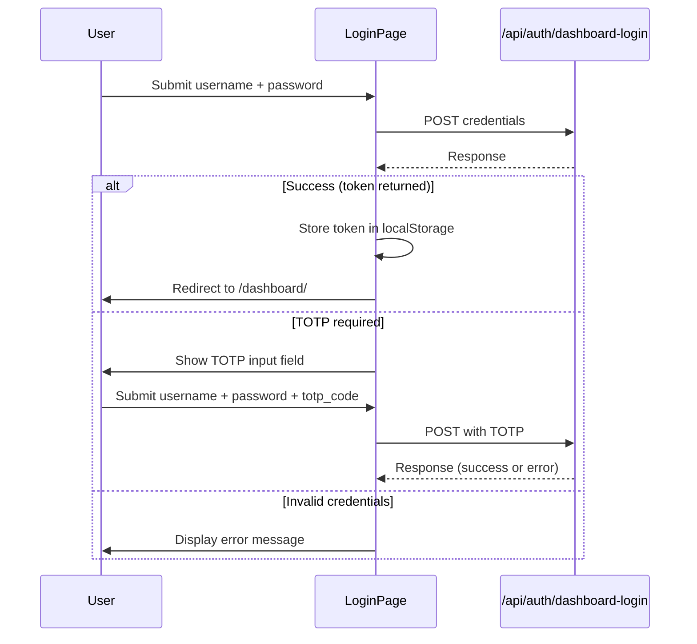

# Other — librefang-api-src

# Login Page (`librefang-api/src/login_page.html`)

## Overview

A self-contained, single-file HTML login page served by the LibreFang API server. It handles username/password authentication with optional TOTP two-factor support, stores the resulting session token client-side, and redirects the user to the dashboard.

The page is intentionally standalone — no external CSS frameworks, no build step, no JavaScript dependencies. Everything is inlined for zero-latency serving.

## Authentication Flow



## Key Components

### HTML Structure

The page is organized into a single centered card (`<main class="card">`) containing:

| Element | ID | Purpose |
|---------|----|---------|
| Username input | `#u` | Captures the username with `autocomplete="username"` |
| Password input | `#p` | Password field with `autocomplete="current-password"` |
| TOTP input | `#t` | Hidden by default; revealed when the backend signals `requires_totp` |
| Submit button | `#btn` | Triggers the form submission handler; disabled during in-flight requests |
| Error display | `#err` | Live region (`aria-live="polite"`) for error messages |

### CSS Styling

The styling is dark-mode by default with a **light-mode fallback** via `@media (prefers-color-scheme: light)`. Key design decisions:

- **Dark palette**: `#0b0d12` background, `#12151c` card, `#e6e8ee` text
- **Light palette**: `#f6f7fb` background, `#fff` card, `#1a1c22` text
- The `:root { color-scheme: light dark; }` declaration ensures native form controls respect the user's preference
- Layout uses `display: grid; place-items: center` for dead-center card placement
- The card caps at `min(92vw, 380px)` for mobile responsiveness
- Focus states use the brand accent color `#7c8cff` with a matching box-shadow ring

### JavaScript Logic

All behavior lives in an IIFE at the bottom of the page. There are no imports or dependencies.

#### State

- **`requiresTotp`** — A boolean flag, initially `false`. Once the server indicates TOTP is required for the account, this is set to `true` so subsequent submission attempts include the `totp_code` field.

#### Form Submission Handler

The `submit` event listener on `#f`:

1. **Prevents default** form submission (no page reload).
2. **Disables the button** to prevent double-submission.
3. **Constructs the payload**:
   - Always includes `username` (trimmed) and `password` (raw).
   - Includes `totp_code` only if `requiresTotp` is `true`.
4. **Sends** `POST /api/auth/dashboard-login` with `Content-Type: application/json` and `credentials: 'same-origin'`.
5. **Handles the response**:
   - **`d.ok && d.token`** — Stores the token in `localStorage` under the key `librefang-api-key`, then redirects. The redirect target is the current `location.pathname + location.search + location.hash`, defaulting to `/dashboard/` if the user was at the root. This preserves any original destination the user was trying to reach before being intercepted by the login page.
   - **`d.requires_totp`** — Reveals the TOTP input row, sets `requiresTotp = true`, focuses the TOTP field, and prompts the user.
   - **All other cases** — Displays `d.error` or a generic fallback message.
6. **Network errors** display a `"Network error."` message.
7. **`finally`** re-enables the button regardless of outcome.

#### Error Display

The `setError(msg)` function writes to `#err`. The element has `aria-live="polite"` so screen readers announce changes automatically. The container has a `min-height: 1.2em` to prevent layout shift when an error appears.

## API Contract

The page expects the backend endpoint to behave as follows:

**`POST /api/auth/dashboard-login`**

Request body:
```json
{
  "username": "string",
  "password": "string",
  "totp_code": "123456"  // optional, 6 digits
}
```

Success response:
```json
{ "ok": true, "token": "jwt-or-api-key-string" }
```

TOTP required response:
```json
{ "requires_totp": true }
```

Error response:
```json
{ "ok": false, "error": "Human-readable error message" }
```

## Token Storage

On successful login, the token is written to:

```
localStorage['librefang-api-key']
```

Other parts of the application (the dashboard, API client code) must read from this same key to authenticate subsequent requests. The `try/catch` around `localStorage.setItem` gracefully handles cases where storage is disabled or full.

## Redirect Behavior

After storing the token, the page uses `location.replace()` to navigate to the originally requested URL. This is important because:

- `replace()` does not create a browser history entry, so the user can't accidentally navigate back to the login page.
- The page uses the full `pathname + search + hash`, so deep links and query parameters are preserved through the authentication redirect.
- If the user was already at `/` (the login page itself), the fallback is `/dashboard/`.

## Integration Points

This file is served directly by the LibreFang API server for unauthenticated requests to dashboard routes. The server should:

1. Detect that the user lacks a valid session/token.
2. Return this HTML page (likely as a fallback or via a specific route like `/login`).
3. After login, the stored token is sent with future requests (presumably via an `Authorization` header or similar mechanism handled by the dashboard's JavaScript).

The footer text references `config.toml`, indicating that authentication requirements are configurable by the server administrator.