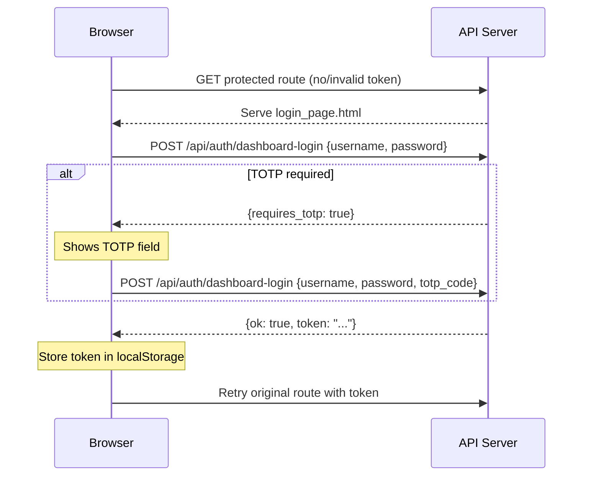

# Other — librefang-api-src

# Login Page (`librefang-api/src/login_page.html`)

## Purpose

A self-contained HTML page that provides the authentication gate for the LibreFang dashboard. It ships as a single file with no external dependencies — all styling and logic is embedded inline. The backend serves this page to unauthenticated users, and upon successful login, it stores the resulting session token in `localStorage` and redirects into the dashboard.

## When It Is Served

The page is intended to be returned by the API server whenever a request to a protected route lacks valid credentials (e.g., an expired or missing `librefang-api-key`). It is referenced by the server, not a standalone file users open directly.

## Authentication Flow



## Key Components

### HTML Form (`<form id="f">`)

| Field | ID | Name | Notes |
|---|---|---|---|
| Username | `#u` | `username` | `required`, auto-focused |
| Password | `#p` | `password` | `type="password"`, `required` |
| TOTP code | `#t` | `totp_code` | Hidden by default; shown only when the server responds with `requires_totp`. Accepts 6 numeric digits. |

The form has `autocomplete="on"`, allowing browsers to populate saved credentials. Each field uses standard `autocomplete` attributes (`username`, `current-password`, `one-time-code`) for correct browser autofill behavior.

### TOTP Challenge Handling

The TOTP row (`#totp-row`) starts hidden. After the first login attempt, if the server response contains `requires_totp: true`, the JavaScript:

1. Sets the internal `requiresTotp` flag to `true`.
2. Unhides the TOTP input field.
3. Focuses the TOTP input.
4. Displays a prompt: *"Enter your 6-digit TOTP code."*

All subsequent submissions include `totp_code` in the payload alongside `username` and `password`.

### JavaScript Submission Logic

The inline `<script>` block handles form submission via `fetch`:

- **Endpoint:** `POST /api/auth/dashboard-login`
- **Content type:** `application/json`
- **Credentials:** `same-origin` (sends cookies for CSRF/session purposes)
- **Payload shape:**
  ```json
  {
    "username": "...",
    "password": "...",
    "totp_code": "123456"   // only if required
  }
  ```

#### Server Response Handling

| Response condition | Client behavior |
|---|---|
| `d.ok === true` and `d.token` is present | Stores `d.token` under `localStorage` key `librefang-api-key`, then calls `location.replace()` to navigate to the originally requested URL (or `/dashboard/` as fallback). |
| `d.requires_totp === true` | Reveals the TOTP field and prompts the user. |
| Any other failure | Displays `d.error` or a generic *"Sign in failed."* message in the `#err` element. |
| Network error | Displays *"Network error."* |

The submit button (`#btn`) is disabled during the in-flight request and re-enabled in the `finally` block to prevent double-submission.

### Redirect Behavior

After successful authentication, the script preserves the user's original destination:

```javascript
var target = location.pathname + location.search + location.hash;
if (!target || target === '/') target = '/dashboard/';
location.replace(target);
```

This means if the login page was served at `/dashboard/settings?tab=alerts`, the user lands back on `/dashboard/settings?tab=alerts` after logging in. When the login page is the root (`/`), it redirects to `/dashboard/` by default.

### Theming and Styling

The page supports both dark and light color schemes via `prefers-color-scheme`:

- **Dark mode (default):** Dark background (`#0b0d12`), dark card (`#12151c`), light text (`#e6e8ee`).
- **Light mode:** White card on light gray (`#f6f7fb`), dark text (`#1a1c22`). Overridden via a `@media (prefers-color-scheme: light)` block.

The layout uses CSS Grid (`place-items: center`) to center the card both horizontally and vertically. The card is capped at `380px` width and scales down via `min(92vw, 380px)` on small screens.

## Integration with the Rest of the Codebase

### Token Storage Contract

On success, the token is written to `localStorage` under the key **`librefang-api-key`**. Any dashboard client code or middleware that needs to authenticate API requests should read the token from this same key and include it in request headers (typically `Authorization: Bearer <token>` or a custom header).

### Backend Endpoint Dependency

This page depends on the backend exposing:

- **`POST /api/auth/dashboard-login`** — Accepts `{username, password[, totp_code]}`, returns `{ok: true, token: "..."}` on success or `{requires_totp: true}` / `{error: "..."}` on failure.

### Configuration Reference

The footer line — *"Auth required — configured in `config.toml`."* — is a static hint to administrators. The actual authentication configuration (credentials, TOTP settings) lives in the server-side `config.toml`, not in this file.

## Accessibility Notes

- The error region uses `aria-live="polite"` so screen readers announce login failures without interrupting.
- The `<main>` element has `role="main"`.
- The `robots` meta tag is set to `noindex, nofollow` to prevent search engine indexing of the login page.