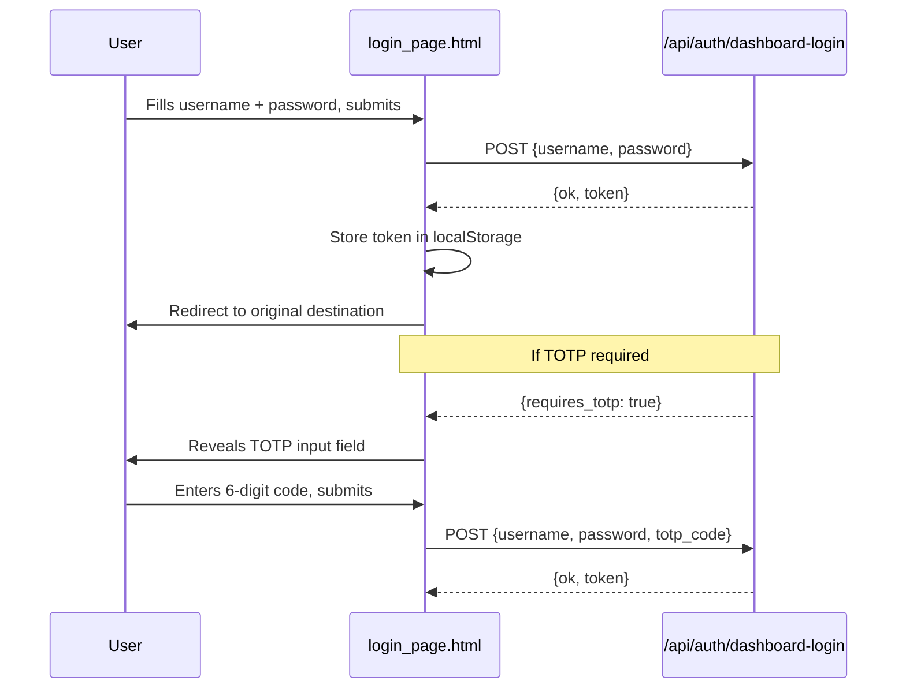

# Other — librefang-api-src

# login_page.html — Dashboard Authentication UI

## Purpose

This is the gatekeeper page for the LibreFang dashboard. It is a fully self-contained HTML file — styles, markup, and client logic are all inline — designed to be served directly by the API server whenever an unauthenticated request hits a protected route. No build step, no framework, no external dependencies.

Its sole job: collect credentials, POST them to the backend, receive a token, stash it in `localStorage`, and redirect the user to whatever page they originally requested.

---

## Authentication Flow



### Step-by-step

1. **Initial submit.** The user enters a username and password. The form intercepts the `submit` event, disables the button to prevent double-posts, and sends a `POST` to `/api/auth/dashboard-login` with `Content-Type: application/json`.

2. **Token received.** If the response contains `{ ok: true, token: "..." }`, the token is written to `localStorage` under the key **`librefang-api-key`**. The page then redirects to the original destination (falling back to `/dashboard/` if the user landed on `/`).

3. **TOTP challenge.** If the server responds with `{ requires_totp: true }`, the page sets an internal flag, unhides the `#totp-row` input, focuses it, and prompts the user. On the next submit, `totp_code` is included in the payload alongside the credentials.

4. **Failure.** Any other response displays `d.error` (or a generic fallback) in the `#err` element, which is an `aria-live="polite"` region so screen readers announce it automatically.

---

## DOM Structure

| Element | ID | Role |
|---|---|---|
| `<form>` | `f` | Wraps all inputs; sole event target for `submit` |
| Username input | `u` | `autocomplete="username"`, required |
| Password input | `p` | `type="password"`, `autocomplete="current-password"`, required |
| TOTP row wrapper | `totp-row` | Hidden by default (`hidden` attribute); revealed on 2FA challenge |
| TOTP input | `t` | `inputmode="numeric"`, `pattern="[0-9]{6}"`, `maxlength="6"` |
| Submit button | `btn` | Disabled during in-flight requests |
| Error display | `err` | `aria-live="polite"` region for validation/server errors |

---

## API Contract

The page expects a single endpoint:

### `POST /api/auth/dashboard-login`

**Request body** (JSON):

```json
{
  "username": "string",
  "password": "string",
  "totp_code": "string   // included only on second submit"
}
```

**Response shapes the page handles:**

| Response | Page behavior |
|---|---|
| `{ ok: true, token: "..." }` | Store token → redirect |
| `{ requires_totp: true }` | Show TOTP input → re-submit |
| `{ error: "..." }` | Display error text |
| Non-JSON / network failure | Show "Network error." |

The token is expected to be whatever the dashboard frontend uses for subsequent authenticated requests (typically a JWT or API key). The page does not inspect or decode it — it just stores and redirects.

---

## Styling and Theming

The page supports **light and dark mode** via `prefers-color-scheme`, with dark as the default:

- **Dark (default):** Dark background (`#0b0d12`), card at `#12151c`, light text.
- **Light:** Activated through a `@media (prefers-color-scheme: light)` block that overrides body background, card style, input styling, and muted text color.

CSS variables are not used for the color palette; the theming is done entirely through the media query override pattern. No external stylesheet is loaded.

The layout centers the card both horizontally and vertically using `display: grid; place-items: center` on the body. The card is capped at `min(92vw, 380px)` to remain usable on mobile.

---

## Integration Notes

### How it gets served

This file is not a template — it contains no server-side interpolation. The API server should serve it verbatim (with `Content-Type: text/html`) whenever:

- A request to a protected route lacks a valid token, or
- A user explicitly navigates to the login URL.

The footer hint (`configured in config.toml`) suggests the server's auth requirement is toggled from the main configuration file.

### Token consumption

Downstream dashboard code must read the token from:

```js
localStorage.getItem('librefang-api-key')
```

and include it in authenticated requests (typically as an `Authorization` header or query parameter, depending on the API server's expectations).

### Redirect preservation

After login, the page attempts to preserve the user's original destination:

```js
var target = location.pathname + location.search + location.hash;
if (!target || target === '/') target = '/dashboard/';
location.replace(target);
```

This means the server should serve the login page **at the same URL** the user requested (e.g., `/dashboard/settings`), so the pathname is retained. A `302` redirect to a dedicated `/login` URL would lose the original path.

### Security considerations

| Aspect | Detail |
|---|---|
| `robots` meta tag | Set to `noindex, nofollow` to prevent search engine indexing |
| `credentials: 'same-origin'` | Cookies are sent with the login request for CSRF/session support |
| No inline secrets | The page contains no hardcoded keys or API URLs beyond the single endpoint path |
| `localStorage` try/catch | Wrapped in try/catch to fail gracefully in restricted browser contexts (e.g., private browsing in some older browsers) |
| TOTP input | Uses `autocomplete="one-time-code"` to trigger browser/OS autofill from authenticator apps |