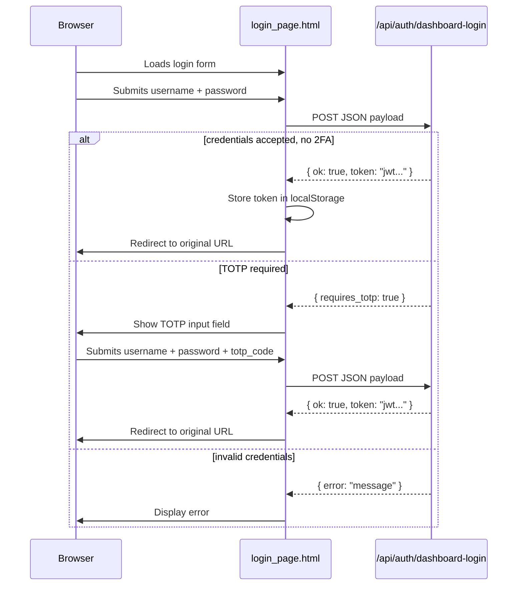

# Other — librefang-api-src

# LibreFang API Login Page

## Overview

`login_page.html` is a self-contained, single-file authentication UI served by the LibreFang API. It provides the dashboard sign-in flow, including optional TOTP two-factor authentication. The page ships with no external dependencies — all styles and logic are inlined.

## Purpose

When a request hits a protected dashboard route without a valid session, the API server returns this page (typically as a `401` response or via a redirect). The user authenticates, receives a JWT token, and is forwarded to the originally requested URL.

## Authentication Flow



## Key Components

### HTML Structure

| Element | ID | Purpose |
|---------|-----|---------|
| `<form>` | `f` | The sign-in form, intercepts submit events |
| Username input | `u` | Collects `username`, auto-completed |
| Password input | `p` | Collects `password`, auto-completed |
| TOTP input | `t` | Collects 6-digit `totp_code`, hidden by default |
| Submit button | `btn` | Triggers authentication, disabled during requests |
| Error display | `err` | Shows error messages with `aria-live="polite"` |
| TOTP row | `totp-row` | Container for TOTP field, toggled via `hidden` attribute |

### API Interaction

**Endpoint:** `POST /api/auth/dashboard-login`

**Request body (basic auth):**
```json
{
  "username": "user",
  "password": "pass"
}
```

**Request body (with TOTP):**
```json
{
  "username": "user",
  "password": "pass",
  "totp_code": "123456"
}
```

**Expected responses:**

| Response | Meaning |
|----------|---------|
| `{ ok: true, token: "jwt..." }` | Success — token stored, user redirected |
| `{ requires_totp: true }` | Credentials valid but 2FA required — TOTP field shown |
| `{ error: "message" }` | Authentication failure — error displayed |

### Token Storage

On successful authentication, the JWT is persisted to `localStorage` under the key `librefang-api-key`. Downstream dashboard pages must read this key and include it in API requests (typically as an `Authorization: Bearer <token>` header).

### Redirect Behavior

After successful login, the page redirects to the URL the user originally requested:

```javascript
var target = location.pathname + location.search + location.hash;
if (!target || target === '/') target = '/dashboard/';
location.replace(target);
```

This means the server must preserve the original path in the URL when serving the login page (e.g., redirecting `/dashboard/settings` to `/login?next=/dashboard/settings`, or serving the login page at the same URL with a `401` status). If the pathname is just `/`, the fallback destination is `/dashboard/`.

## Theming

The page supports light and dark mode via `prefers-color-scheme`:

- **Dark mode (default):** Dark background (`#0b0d12`), card background `#12151c`, light text.
- **Light mode:** Light background (`#f6f7fb`), white card, dark text.

The `:root` declaration `color-scheme: light dark` ensures native form controls also respect the user's preference.

## Styling Notes

- The layout uses CSS Grid (`place-items: center`) to vertically and horizontally center the card.
- The card width is clamped to `min(92vw, 380px)` for mobile responsiveness.
- The TOTP input uses `inputmode="numeric"` to trigger a numeric keyboard on mobile devices, with `pattern="[0-9]{6}"` and `maxlength="6"` for validation.
- Focus states use a blue ring (`#7c8cff`) with a soft glow for accessibility.

## Integration with the Server

The server should serve this file when:

1. An unauthenticated request hits a protected dashboard route.
2. The server responds with this HTML (either as a `401` response body or via a `302` redirect to a login route).

The server must also implement the `/api/auth/dashboard-login` endpoint that this page calls. See the API module documentation for the server-side handler.

## Configuration

The footer references `config.toml` as the source of authentication configuration. This is informational only — the page itself does not read any configuration.

## Accessibility

- Form inputs have associated `<label>` elements.
- The error container uses `aria-live="polite"` so screen readers announce errors.
- The main card has `role="main"`.
- The `autofocus` attribute on the username input allows immediate typing.
- `autocomplete` attributes are set correctly for password managers (`username`, `current-password`, `one-time-code`).
- The page uses `<meta name="robots" content="noindex, nofollow">` to prevent search engine indexing.