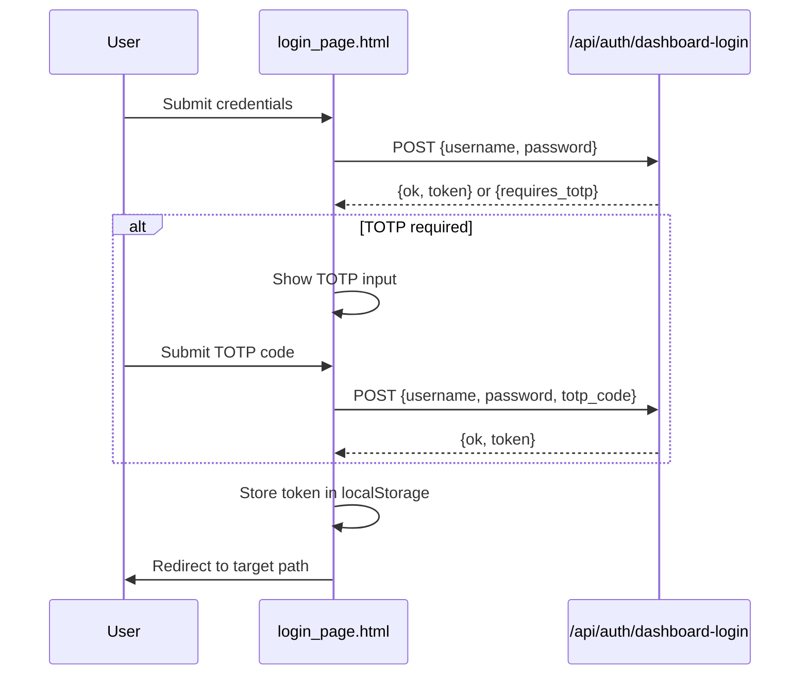

# Other — librefang-api-src

# LibreFang Login Page (`login_page.html`)

## Overview

A self-contained, single-file HTML page that serves as the authentication gate for the LibreFang dashboard. It includes inline CSS and vanilla JavaScript — no external dependencies, no build step, no framework. The page is served at `/dashboard` and `/dashboard/` and acts as the entry point before the SPA shell loads.

## Purpose

- Collect user credentials (username + password)
- Optionally collect a TOTP code when two-factor authentication is required
- Authenticate against the backend API at `POST /api/auth/dashboard-login`
- Persist the returned session token in `localStorage`
- Redirect the user to the SPA root (`/`) upon success

## Architecture



## Two-Factor Authentication Flow

The TOTP field (`#totp-row`) is hidden by default. The flow is:

1. User submits username and password.
2. The API responds with `{ "requires_totp": true }`.
3. The `#totp-row` element is unhidden, the TOTP input receives focus, and a prompt message is shown.
4. On the next submission, `totp_code` is included in the payload alongside the credentials.
5. A successful response returns `{ "ok": true, "token": "..." }`.

The TOTP input is constrained to 6 numeric digits via `inputmode="numeric"`, `pattern="[0-9]{6}"`, and `maxlength="6"`.

## Token Storage

On a successful login, the JWT or session token returned by the API is stored under the key **`librefang-api-key`** in `localStorage`. The write is wrapped in a `try/catch` to gracefully handle environments where `localStorage` is unavailable (e.g., Safari private browsing).

Any downstream SPA or API client should read the token from this same key.

## Redirect Logic

After storing the token, the page determines the redirect target:

```
current path = "/"           → redirect to "/"
current path = "/dashboard"  → redirect to "/"
current path = "/dashboard/" → redirect to "/"
any other path               → redirect to path + search + hash
```

The special-casing of `/dashboard` and `/dashboard/` exists because those paths host the inline login page itself — redirecting back to them would land on a 404 or re-render the login form. All other paths are preserved with their query string and fragment intact, allowing deep-linking into the SPA after authentication.

## Styling

The page supports both dark and light color schemes via `prefers-color-scheme`:

- **Dark mode** (default): Dark background (`#0b0d12`), card background (`#12151c`), light text.
- **Light mode**: Light background (`#f6f7fb`), white card, dark text, adjusted via a `@media` block.

The `:root` declaration `color-scheme: light dark` ensures native form controls also adapt. The layout centers the card vertically and horizontally using CSS Grid (`display: grid; place-items: center`). The card is capped at `380px` wide with `width: min(92vw, 380px)`.

## API Contract

The page expects the backend endpoint `POST /api/auth/dashboard-login` to accept and return the following shapes:

**Request:**
```json
{
  "username": "string",
  "password": "string",
  "totp_code": "string (optional, 6 digits)"
}
```

**Response — success:**
```json
{
  "ok": true,
  "token": "string"
}
```

**Response — TOTP required:**
```json
{
  "requires_totp": true
}
```

**Response — failure:**
```json
{
  "ok": false,
  "error": "string (human-readable message)"
}
```

All responses are expected to have `Content-Type: application/json`. The page sends `credentials: 'same-origin'` to include cookies if the backend uses them.

## Error Handling

Errors are displayed in the `#err` element with `aria-live="polite"` for screen reader announcements. There are three error paths:

| Condition | Message shown |
|---|---|
| API returns `{ error: "..." }` | The `error` string from the response |
| API returns a non-ok response with no `error` field | Generic "Sign in failed." |
| `fetch` throws a network error | "Network error." |

The submit button is disabled during the in-flight request and re-enabled in the `finally` block to prevent duplicate submissions.

## Integration Notes

- This file is not part of the SPA build. It is served directly by the backend as a static HTML page at `/dashboard` and `/dashboard/`.
- The `<meta name="robots" content="noindex, nofollow">` tag prevents search engine indexing.
- The `autocomplete` attributes are set to `username`, `current-password`, and `one-time-code` to ensure password managers and browser autofill work correctly.
- The form `action` is not set; submission is handled entirely by the JavaScript `submit` event listener which calls `e.preventDefault()`.