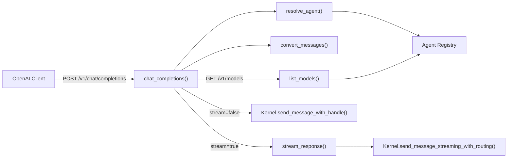
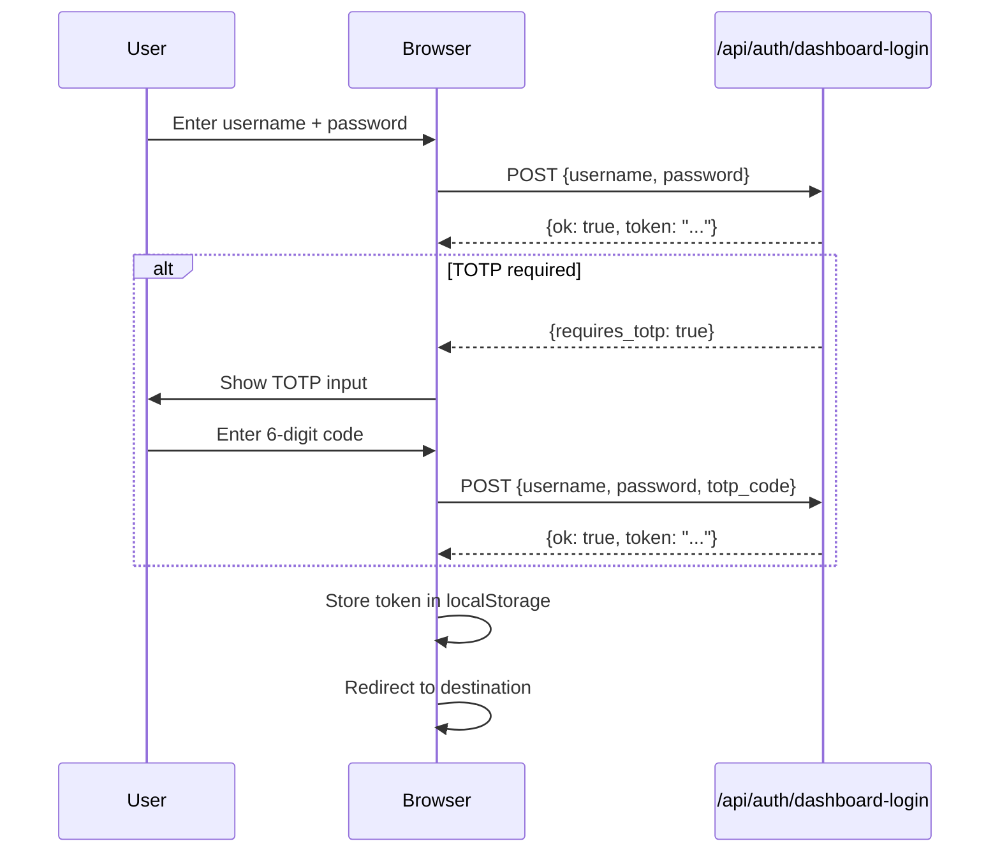

# Other — librefang-api-src

# LibreFang API Source — OpenAI Compatibility Layer & Login UI

## Overview

This module contains two standalone components that serve as external-facing interfaces to LibreFang:

1. **`openai_compat.rs`** — An OpenAI-compatible API surface (`/v1/chat/completions`, `/v1/models`) that lets any OpenAI client library interact with LibreFang agents as if they were models.
2. **`login_page.html`** — A self-contained, zero-dependency HTML login page for the dashboard, served directly by the API server.

---

## OpenAI Compatibility Layer (`openai_compat.rs`)

### Purpose

LibreFang agents are not LLM models in the traditional sense — they are conversational loops backed by LLMs, tools, and memory. This module translates the OpenAI Chat Completions API protocol into LibreFang agent interactions, enabling tools like `curl`, the OpenAI Python SDK, LangChain, or any OpenAI-compatible client to talk to a LibreFang agent without custom integration code.

### Architecture



### Endpoints

#### `POST /v1/chat/completions` — `chat_completions()`

The primary endpoint. Accepts an OpenAI-style `ChatCompletionRequest` and routes it to a LibreFang agent.

**Request body:**

| Field | Type | Required | Description |
|-------|------|----------|-------------|
| `model` | `string` | Yes | Agent identifier (see resolution rules below) |
| `messages` | `OaiMessage[]` | Yes | Conversation messages |
| `stream` | `bool` | No | Enable SSE streaming (default: `false`) |
| `max_tokens` | `u32` | No | Passed through (currently advisory) |
| `temperature` | `f32` | No | Passed through (currently advisory) |

**Agent resolution** (`resolve_agent`) attempts three lookup strategies in order:

1. **`librefang:<name>`** — Explicit prefix. Calls `agent_registry().find_by_name()` with the stripped suffix.
2. **UUID string** — Parses as `AgentId` and calls `agent_registry().get()`.
3. **Plain string** — Falls back to treating the entire string as an agent name via `find_by_name()`.

If no agent is found, returns a `404` with an OpenAI-style `model_not_found` error object.

**Non-streaming path:** Calls `kernel.send_message_with_handle()` with the last user message's text content. The full agent response (potentially spanning multiple LLM iterations and tool calls) is returned as a single `ChatCompletionResponse`. The `strip_think_tags()` helper from `crate::ws` removes internal thinking markers from the output.

**Streaming path:** Delegates to `stream_response()`, which:
1. Calls `kernel.send_message_streaming_with_routing()` to obtain a `StreamEvent` receiver.
2. Sends an initial chunk with `role: "assistant"`.
3. Spawns a Tokio task that forwards `StreamEvent` variants as `ChatCompletionChunk` objects over SSE.
4. Terminates with a final chunk carrying `finish_reason: "stop"` and a `[DONE]` sentinel.

**Error responses** follow the OpenAI error shape:
```json
{
  "error": {
    "message": "...",
    "type": "invalid_request_error",
    "code": "model_not_found"
  }
}
```

#### `GET /v1/models` — `list_models()`

Returns all registered agents as OpenAI model objects. Each agent appears as:
```json
{
  "id": "librefang:<agent-name>",
  "object": "model",
  "created": <unix_timestamp>,
  "owned_by": "librefang"
}
```

### Message Conversion

`convert_messages()` transforms OpenAI-format messages into LibreFang `Message` structs:

- **Role mapping:** `"user"` → `Role::User`, `"assistant"` → `Role::Assistant`, `"system"` → `Role::System`, anything else defaults to `Role::User`.
- **Content handling** via the `OaiContent` enum:
  - `OaiContent::Text` — Simple string content becomes `MessageContent::Text`.
  - `OaiContent::Parts` — An array of typed content parts:
    - `OaiContentPart::Text` → `ContentBlock::Text`
    - `OaiContentPart::ImageUrl` → `ContentBlock::Image` (only `data:` URIs with base64 encoding; remote URLs are dropped)
  - `OaiContent::Null` — The message is filtered out entirely.

Messages with `Null` content or parts arrays that resolve to zero blocks are silently excluded.

### Streaming Event Mapping

The spawned forwarder task in `stream_response()` handles these `StreamEvent` variants:

| StreamEvent | Chunk Output |
|-------------|-------------|
| `TextDelta` | Delta with `content` field |
| `ToolUseStart` | Delta with `tool_calls[i]` containing `id`, `type`, and `function.name` |
| `ToolInputDelta` | Delta with `tool_calls[i]` containing incremental `function.arguments` |
| `ContentComplete` (with `StopReason::ToolUse`) | Resets tool index for next iteration, no chunk emitted |
| `ContentComplete` (other reasons) | No chunk emitted, waits for channel close |
| All others (`ToolUseEnd`, `ToolExecutionResult`, `ThinkingDelta`, `PhaseChange`) | Silently skipped |

The tool call index increments per tool within each agent iteration and resets to zero when a `ToolUse` stop reason triggers a new iteration.

### Key Types

**Request types:** `ChatCompletionRequest`, `OaiMessage`, `OaiContent` (untagged enum), `OaiContentPart` (internally tagged), `OaiImageUrlRef`

**Response types:** `ChatCompletionResponse`, `Choice`, `ChoiceMessage`, `UsageInfo`, `ChatCompletionChunk`, `ChunkChoice`, `ChunkDelta`, `OaiToolCall`, `OaiToolCallFunction`, `ModelObject`, `ModelListResponse`

Serialization uses `skip_serializing_if = "Option::is_none"` throughout to maintain backward compatibility — `tool_calls` and `content` fields are absent from JSON when `None`, matching OpenAI's behavior.

### Dependencies on Other Modules

- **`crate::routes::AppState`** — Shared application state containing the kernel handle.
- **`crate::ws::strip_think_tags`** — Strips internal `<think/>` markers from non-streaming responses.
- **`librefang_runtime::kernel_handle::KernelHandle`** — Trait object for interacting with the agent kernel.
- **`librefang_runtime::llm_driver::StreamEvent`** — Enum of streaming events from the LLM driver.
- **`librefang_types::agent::AgentId`** — Agent identifier type (UUID-based).
- **`librefang_types::message`** — `Message`, `MessageContent`, `ContentBlock`, `Role`, `StopReason`.

---

## Login Page (`login_page.html`)

### Purpose

A fully self-contained HTML/CSS/JS login page served at the root of the API server. It has zero external dependencies — no CDN links, no build step, no framework. This is the authentication gate for the LibreFang dashboard.

### Authentication Flow



### Behavior Details

**Form submission** (`#f` submit handler):
1. Prevents default form submission.
2. Clears any previous error message.
3. Disables the submit button (`#btn`).
4. Builds a JSON payload with `username` and `password`. If `requiresTotp` is `true` (set after a previous attempt indicated TOTP is needed), includes `totp_code`.
5. Sends a `POST` to `/api/auth/dashboard-login` with `credentials: 'same-origin'`.

**On success** (`d.ok && d.token`):
- Stores the token under `localStorage` key `librefang-api-key` (wrapped in try/catch to handle storage unavailability).
- Redirects to the original request path. If the path is just `/`, redirects to `/dashboard/`. Uses `location.replace()` to avoid leaving the login page in history.

**On TOTP required** (`d.requires_totp`):
- Sets the internal `requiresTotp` flag.
- Unhides the `#totp-row` element.
- Focuses the TOTP input.
- Displays the prompt "Enter your 6-digit TOTP code."

**On failure:**
- Displays `d.error` if present, otherwise "Sign in failed."
- Network errors display "Network error."

**Cleanup:** The submit button is re-enabled in the `finally` block regardless of outcome.

### TOTP Input

The TOTP field (`#t`) has `inputmode="numeric"`, `pattern="[0-9]{6}"`, and `maxlength="6"` for mobile-friendly entry. It also specifies `autocomplete="one-time-code"` for browser autofill support. The field is hidden by default and only revealed when the server responds with `requires_totp: true`.

### Design

- **Dark theme by default** (`#0b0d12` background), with a `prefers-color-scheme: light` media query that switches to a light palette.
- Single centered card (`width: min(92vw, 380px)`) using CSS Grid `place-items: center`.
- Input focus state uses a blue ring (`#7c8cff` with `box-shadow`).
- The error area uses `aria-live="polite"` for screen reader announcements.
- The page sets `<meta name="robots" content="noindex, nofollow">` to prevent search engine indexing.
- Footer text references `config.toml` as the configuration source for auth settings.