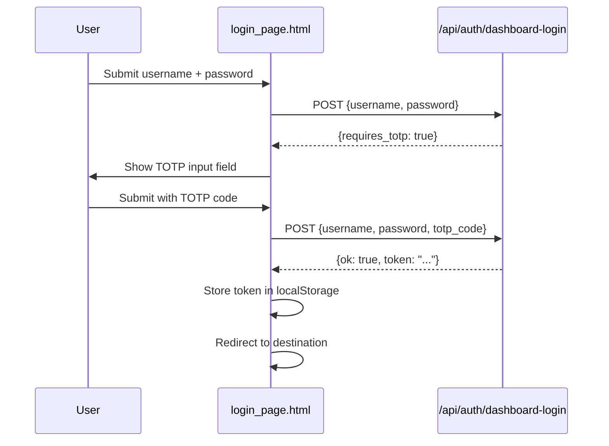

# Other — librefang-api-src

# LibreFang API — Login Page

## Overview

`login_page.html` is a self-contained, single-file login interface for the LibreFang dashboard. It bundles its own markup, styles, and client-side logic with zero external dependencies — no CSS framework, no JS library, no build step.

The page handles username/password authentication and optional TOTP-based two-factor authentication against the backend endpoint `/api/auth/dashboard-login`.

---

## Authentication Flow



### Step-by-step

1. The user enters their **username** and **password** and clicks **Sign in**.
2. The page `POST`s a JSON payload to `/api/auth/dashboard-login`.
3. **If the server requires TOTP** (`{requires_totp: true}`), the TOTP input row is revealed, the field is auto-focused, and an inline prompt appears.
4. On the next submission, the `totp_code` field is included in the payload alongside credentials.
5. **On success** (`{ok: true, token: "..."}`), the JWT is persisted to `localStorage` under the key `librefang-api-key`, and the browser is redirected to the original destination (or `/dashboard/` as a fallback).
6. **On failure**, the `error` message from the response is displayed in the `.err` element.

---

## Form Fields

| Field | HTML `name` | Type | Behavior |
|---|---|---|---|
| Username | `username` | text | Required, auto-trimmed, autofocus on page load |
| Password | `password` | password | Required |
| TOTP code | `totp_code` | numeric (`inputmode="numeric"`) | Hidden by default; revealed only when the backend responds with `requires_totp`. Accepts exactly 6 digits. |

---

## API Contract

The page expects `POST /api/auth/dashboard-login` with `Content-Type: application/json` and `credentials: 'same-origin'` (cookies are sent for session affinity if needed).

**Request body (password-only):**

```json
{
  "username": "admin",
  "password": "s3cret"
}
```

**Request body (with TOTP):**

```json
{
  "username": "admin",
  "password": "s3cret",
  "totp_code": "123456"
}
```

**Expected response shapes:**

| Scenario | Response |
|---|---|
| Success | `{"ok": true, "token": "<jwt>"}` |
| TOTP required | `{"requires_totp": true}` |
| Failure | `{"error": "<message>"}` |

The page does not inspect HTTP status codes beyond reading the response body; it defers to the `ok`, `requires_totp`, and `error` fields.

---

## Token Storage

On successful authentication the token is written to:

```
localStorage key: librefang-api-key
```

Other dashboard pages or API client code should read from this same key when attaching the token to subsequent requests (typically as an `Authorization: Bearer <token>` header).

---

## Redirect Behavior

After storing the token, the page calls:

```js
location.replace(target)
```

where `target` is derived from:

```
location.pathname + location.search + location.hash
```

This means if a user navigates to a protected route (e.g., `/dashboard/settings?tab=general`) and gets intercepted by the login page, the original full URL is preserved and restored after login. If the path is bare (`/`) or empty, the redirect falls back to `/dashboard/`.

`location.replace` is used instead of `location.href` so the login page is not retained in browser history — the user cannot press Back to return to the login form.

---

## Theming

The page supports both dark and light modes via `prefers-color-scheme`:

- **Dark** (default): Dark background (`#0b0d12`), card (`#12151c`), light text (`#e6e8ee`).
- **Light**: Overridden via `@media (prefers-color-scheme: light)` — white card, light background (`#f6f7fb`), dark text (`#1a1c22`).

The `:root` declaration `{ color-scheme: light dark; }` tells the browser to adapt native form controls (scrollbars, focus rings) to the active scheme.

No user toggle is provided — the page follows the OS preference.

---

## Layout and Responsiveness

- The card is centered using `display: grid; place-items: center` on the body.
- Maximum width is capped at `380px` via `width: min(92vw, 380px)`, ensuring it remains usable on narrow mobile viewports.
- The viewport meta tag sets `width=device-width, initial-scale=1`.

---

## Security Considerations

- **`autocomplete` attributes** are set appropriately (`username`, `current-password`, `one-time-code`) so password managers and browser autofill work correctly.
- **`robots` meta tag** is set to `noindex, nofollow` to prevent search engine indexing.
- The form uses `aria-live="polite"` on the error container so screen readers announce validation/login errors.
- The TOTP input constrains input to numeric characters only (`inputmode="numeric"`, `pattern="[0-9]{6}"`, `maxlength="6"`).
- The `localStorage.setItem` call is wrapped in a `try/catch` to silently handle cases where storage is disabled (e.g., Safari private browsing).

---

## Relationship to the Rest of the Codebase

This page is served by the LibreFang API server as the gateway to the dashboard. It is the only client-side file in the `librefang-api` module — the rest of the codebase is server-side. The page's sole integration point is the `/api/auth/dashboard-login` endpoint. Beyond that endpoint, it is fully decoupled.

Configuration note shown at the bottom of the card:

> Auth required — configured in `config.toml`.

This refers to the server-side TOML config that enables/disables dashboard authentication.