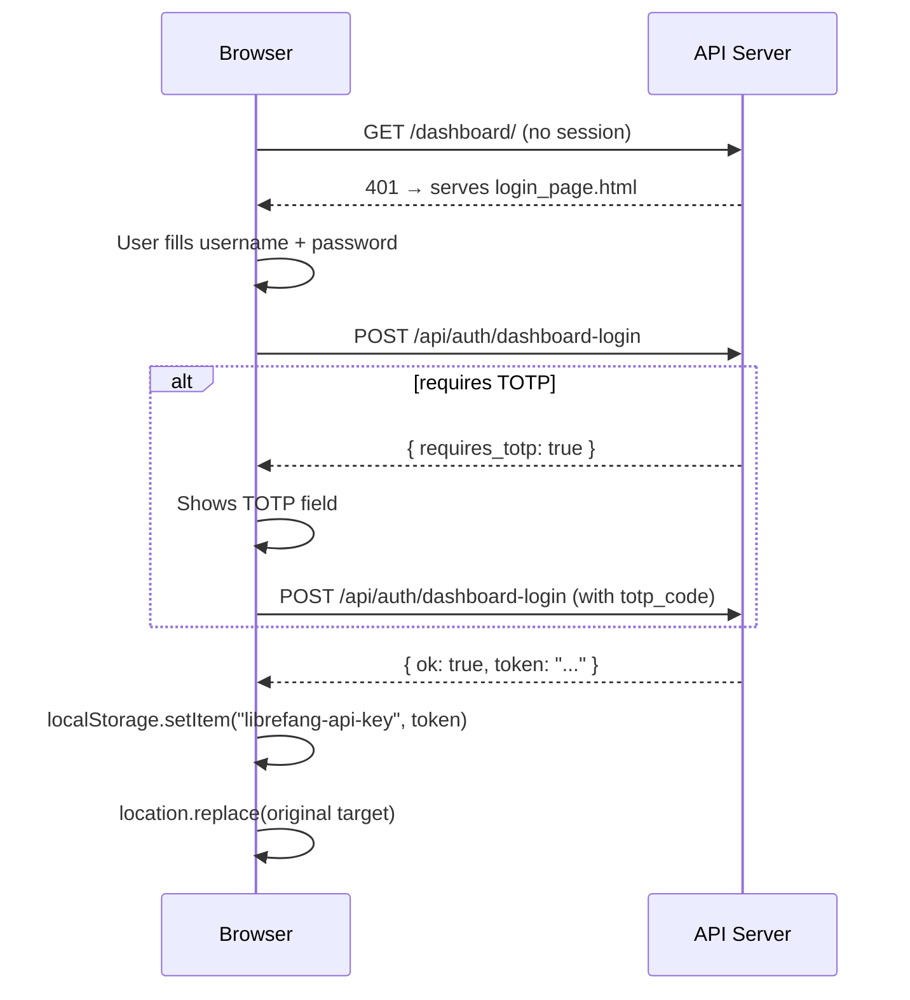

# Other — librefang-api-src

# LibreFang API Login Page (`login_page.html`)

## Purpose

A self-contained, zero-dependency HTML page that serves as the authentication gate for the LibreFang dashboard. It collects user credentials (and optionally a TOTP code), submits them to the backend API, stores the returned session token in `localStorage`, and redirects the user to the dashboard.

The page is served directly by the API server when an unauthenticated request hits a protected route — there is no build step, no framework, and no external asset loading.

## Architecture



## Key Components

### Form Fields

| Field | Element ID | Name Attribute | Behavior |
|---|---|---|---|
| Username | `#u` | `username` | Text input, trimmed before submission, autofocus on load |
| Password | `#p` | `password` | Password input, sent as-is |
| TOTP code | `#t` | `totp_code` | Hidden by default. Shown when the server responds with `requires_totp: true`. Accepts exactly 6 digits, numeric input mode. |

### Authentication Flow

The JavaScript in the `<script>` block at the bottom of the page drives the entire flow:

1. **Intercept submit** — The form's `submit` event is captured and prevented from performing a full-page POST.
2. **Build payload** — Constructs a JSON object with `username` and `password`. If `requiresTotp` is `true` (set by a prior attempt), the trimmed value of the TOTP field is included as `totp_code`.
3. **POST to `/api/auth/dashboard-login`** — Sent with `Content-Type: application/json` and `credentials: 'same-origin'` so cookies accompany the request.
4. **Handle response** — Three branches:
   - **Success** (`d.ok && d.token`): Stores `d.token` under `localStorage` key `librefang-api-key`, then redirects to the originally requested path (falling back to `/dashboard/`).
   - **TOTP required** (`d.requires_totp`): Sets `requiresTotp = true`, unhides `#totp-row`, focuses the TOTP input, and prompts the user.
   - **Failure**: Displays `d.error` (or a generic message) in the `#err` element.
5. **Error/cleanup** — Network errors show "Network error." The submit button is re-enabled in the `finally` block regardless of outcome.

### Token Storage

On successful authentication, the token is written to:

```js
localStorage.setItem('librefang-api-key', d.token);
```

All subsequent dashboard API calls are expected to read from this same `localStorage` key. The `try/catch` around the `setItem` call guards against cases where `localStorage` is unavailable (e.g., private browsing in some older browsers).

### Redirect Logic

```js
var target = location.pathname + location.search + location.hash;
if (!target || target === '/') target = '/dashboard/';
location.replace(target);
```

This preserves the user's original destination. When the server serves this login page in response to a `401`, the browser's URL bar still holds the path the user originally requested. After login, the page replaces itself with that same path, allowing the now-authenticated request to proceed. If the user landed on `/` (the root), they are sent to `/dashboard/` instead.

## Styling

The page uses a dark theme by default and adapts to light mode via a `@media (prefers-color-scheme: light)` rule block. Key visual details:

- **Card**: Centered via CSS Grid (`place-items: center`), capped at `380px` wide with `92vw` fallback for small screens.
- **Inputs**: Dark background with a subtle border; focus state highlights with a blue ring (`#7c8cff`).
- **Button**: Full-width, uses the same accent blue (`#7c8cff`) with dark text for contrast.
- **Error messages**: Rendered in `#ff7a7a` inside an `aria-live="polite"` region so screen readers announce changes automatically.

## Integration Points

| Integration | Detail |
|---|---|
| **Backend endpoint** | `POST /api/auth/dashboard-login` — expects JSON `{ username, password, totp_code? }`, returns `{ ok, token }` or `{ requires_totp }` or `{ error }`. |
| **Token consumer** | Other dashboard pages or JS modules read the token from `localStorage.getItem('librefang-api-key')`. |
| **Configuration** | The footer references `config.toml`, indicating the server's auth requirements are driven by its TOML config file. |
| **Serving** | The API server is expected to serve this HTML file on `401` responses for protected routes, or when the user navigates to the login path directly. |

## Security Notes

- The page sets `<meta name="robots" content="noindex, nofollow">` to prevent search engine indexing.
- `autocomplete` attributes are set appropriately (`username`, `current-password`, `one-time-code`) to work with browser password managers and autofill.
- The TOTP input uses `inputmode="numeric"` with a `pattern` of `[0-9]{6}` and `maxlength="6"` to constrain input on mobile keyboards.
- Credentials are sent exclusively via a `POST` request with JSON — never as URL parameters.