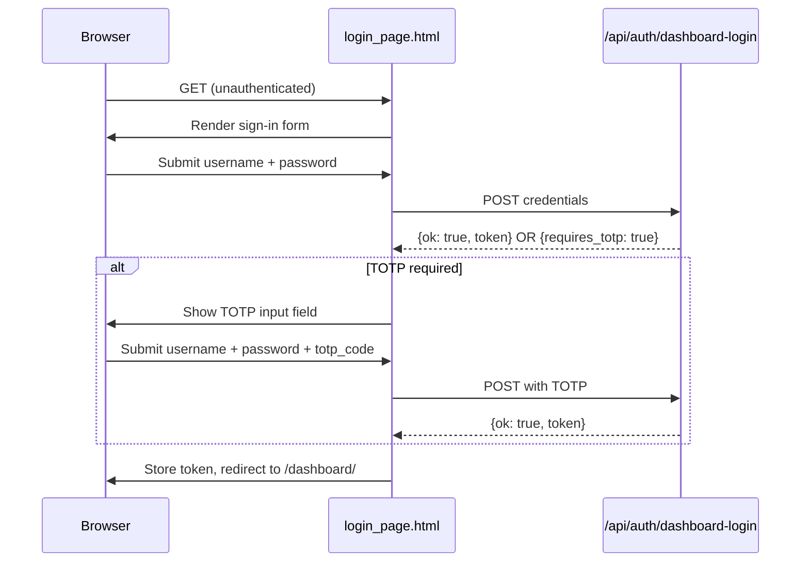

# Other — librefang-api-src

# LibreFang API — Login Page

## Overview

`login_page.html` is a self-contained, single-file authentication page for the LibreFang dashboard. It ships as a static HTML document with inline CSS and JavaScript — no build step, no external dependencies, no framework. The server serves this page to unauthenticated requests that need dashboard access.

## Purpose

This page acts as the gateway to the LibreFang dashboard. It collects credentials, optionally handles two-factor authentication (TOTP), and stores the resulting API token in the browser's `localStorage` for downstream use by the dashboard.

## Architecture



## Key Components

### Form Fields

| Field | HTML ID | `name` attribute | Behavior |
|---|---|---|---|
| Username | `u` | `username` | Text input, required, auto-focused on load |
| Password | `p` | `password` | Password input, required |
| TOTP code | `t` | `totp_code` | Numeric input, hidden by default, revealed only when the server responds with `requires_totp: true` |

### Authentication Flow

The JavaScript IIFE attached to the form handles a two-phase login:

1. **Initial submission** — Sends `username` and `password` as JSON to `POST /api/auth/dashboard-login`.
2. **TOTP challenge** — If the response contains `{ requires_totp: true }`, the TOTP input row is unhidden, the user enters a 6-digit code, and the next submission includes `totp_code` in the payload alongside the credentials.

On success (`{ ok: true, token: "..." }`), the token is written to `localStorage` under the key **`librefang-api-key`**, and the browser is redirected to the originally requested path (or `/dashboard/` as a fallback).

### Token Storage

```javascript
localStorage.setItem('librefang-api-key', d.token);
```

The dashboard and other authenticated pages read the API key from this same `localStorage` key. The login page's redirect preserves the user's intended destination by reconstructing it from `location.pathname + location.search + location.hash`.

### Error Handling

Errors are displayed in the `#err` element (an `aria-live="polite"` region for accessibility). Three error categories are handled:

| Scenario | Message shown |
|---|---|
| Server returns an error | `d.error` from the response body, or `"Sign in failed."` as fallback |
| Server requires TOTP | `"Enter your 6-digit TOTP code."` (informational, not a failure) |
| Network failure | `"Network error."` |

The submit button is disabled during in-flight requests to prevent double submission, and re-enabled in the `finally` block.

## Styling and Theming

The page uses CSS custom properties and `prefers-color-scheme` media queries to support both dark and light modes:

- **Dark mode (default):** Dark background (`#0b0d12`), card with `#12151c` fill, light text.
- **Light mode:** Triggered by `@media (prefers-color-scheme: light)`, overrides body background, card styling, input fields, and subtitle color.

The `:root` declaration `color-scheme: light dark` signals to the browser that both modes are supported, ensuring native form controls (scrollbars, focus rings) also adapt.

The card is centered using `display: grid; place-items: center` on the body and constrained to `min(92vw, 380px)` for mobile responsiveness.

## Security Considerations

- **`noindex, nofollow`** — The `<meta name="robots">` tag prevents search engine indexing of the login page.
- **`credentials: 'same-origin'`** — Cookies and auth headers are sent only to the same origin, preventing credential leakage in cross-origin contexts.
- **`autocomplete` attributes** — Username and password fields use standard `autocomplete` values (`username`, `current-password`), allowing password managers to function correctly. The TOTP field uses `autocomplete="one-time-code"` for browser autofill of SMS/authenticator codes.

## Integration Points

This page depends on exactly one backend endpoint:

- **`POST /api/auth/dashboard-login`** — Accepts `{ username, password }` or `{ username, password, totp_code }`, returns `{ ok: true, token }` on success or `{ requires_totp: true }` / `{ error: string }` on failure.

The page is a static asset with no server-side rendering. The backend should serve it for any unauthenticated request to dashboard routes, allowing the client-side redirect logic to return the user to their intended destination after login.

Configuration is referenced in the footer text: `config.toml`. This points operators to the server configuration file where authentication settings are defined.