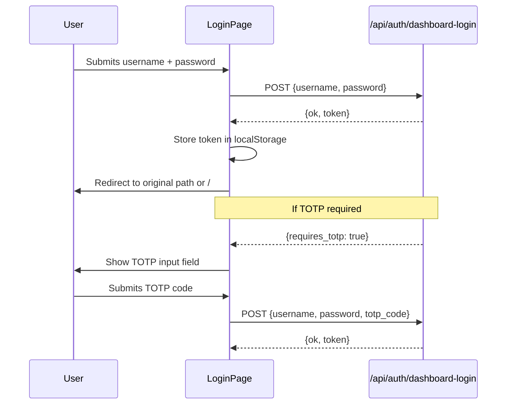

# Other — librefang-api-src

# Login Page (`librefang-api/src/login_page.html`)

## Overview

This is a self-contained, single-file HTML login page served by the LibreFang API server. It handles dashboard authentication for users, including optional TOTP-based two-factor authentication. The page requires no build step, no external dependencies, and no JavaScript framework — it ships as-is from the API source.

## Purpose

When the API server requires authentication before serving the dashboard SPA, it renders this page inline at `/dashboard` or `/dashboard/`. The user authenticates, receives a JWT token, and is redirected to the SPA root at `/`.

## Authentication Flow



The flow is a two-step process orchestrated entirely client-side:

1. **Initial submission** — The user provides username and password. The page POSTs these as JSON to `/api/auth/dashboard-login`.
2. **TOTP challenge** (conditional) — If the server responds with `{requires_totp: true}`, the TOTP input row is revealed and focused. The user enters a 6-digit code.
3. **Re-submission** — On the next form submit, the payload includes `totp_code` alongside the credentials.
4. **Success** — The server returns `{ok: true, token: "..."}`. The token is persisted to `localStorage` under the key `librefang-api-key`, and the browser redirects.

## Token Storage

The JWT is stored in:

```
localStorage['librefang-api-key']
```

Any downstream SPA or API client must read the token from this same key. The `try/catch` around `localStorage.setItem` guards against environments where storage is disabled or full.

## Redirect Logic

After successful authentication, the page preserves the user's original destination when possible:

```javascript
var path = location.pathname;
var target = path + location.search + location.hash;
if (path === '/' || path === '/dashboard' || path === '/dashboard/') {
  target = '/';
}
location.replace(target);
```

- **Paths like `/some/deep/page`** — search and hash are preserved; the user returns to where they were.
- **Paths `/`, `/dashboard`, `/dashboard/`** — these are collapsed to `/` because the SPA shell is served only at the root. The `/dashboard` path exists solely to host this login page and SPA build assets. Redirecting back to `/dashboard` would hit a 404. Search and hash are intentionally dropped here (see issue #4860).

## UI Behavior

### Dark/Light Mode

The page respects the user's system preference via `prefers-color-scheme`. A CSS custom property `color-scheme: light dark` on `:root` enables native form element theming, while a `@media (prefers-color-scheme: light)` block overrides the dark-mode defaults.

### Accessibility

- Error messages use `aria-live="polite"` so screen readers announce validation and server errors.
- All inputs have associated `<label>` elements.
- `autocomplete` attributes are set to `username`, `current-password`, and `one-time-code` for proper browser autofill and password manager support.
- The username input has `autofocus`.

### Responsive Layout

The card is constrained to `min(92vw, 380px)`, centered via CSS grid `place-items: center`. This ensures usability on both narrow mobile screens and desktop viewports.

## API Contract

The page communicates with a single endpoint:

### `POST /api/auth/dashboard-login`

**Request body:**

```json
{
  "username": "string",
  "password": "string",
  "totp_code": "string (optional, 6 digits)"
}
```

**Response — success:**

```json
{
  "ok": true,
  "token": "jwt-token-string"
}
```

**Response — TOTP required:**

```json
{
  "requires_totp": true
}
```

**Response — failure:**

```json
{
  "ok": false,
  "error": "Human-readable error message"
}
```

The page reads `d.error` for the displayed error text. If the field is missing, it falls back to `"Sign in failed."`. Network-level failures display `"Network error."`.

## Integration Notes

- **No build step required.** This file is served directly by the API server as a static string or template.
- **No external dependencies.** All CSS and JS is inline. There are no CDN links, no frameworks, and no fetch polyfills (assumes modern browsers).
- **The `credentials: 'same-origin'` option** on the fetch call ensures cookies (e.g., session cookies) are included with the request, which may be relevant depending on server-side session handling.
- **The `<meta name="robots" content="noindex, nofollow">` tag** prevents search engines from indexing the login page.