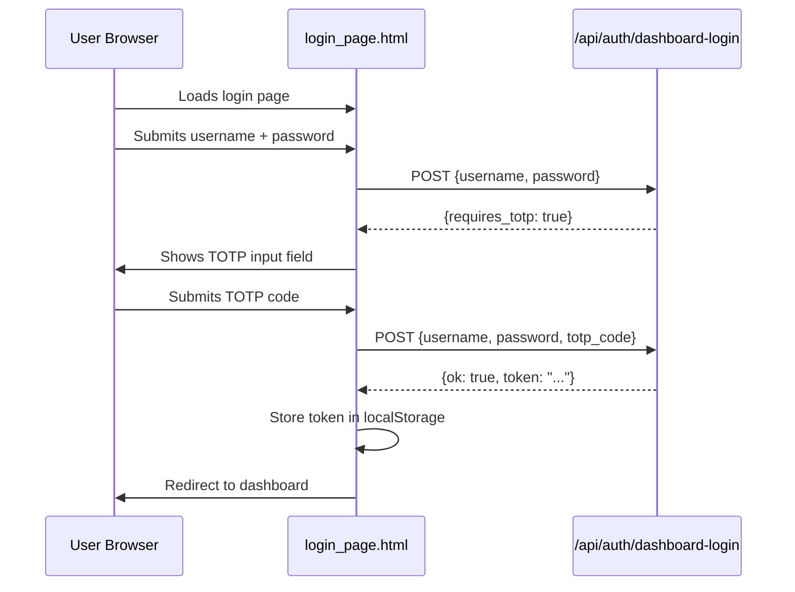

# Other — librefang-api-src

# librefang-api-src — Login Page

## Overview

`login_page.html` is a self-contained, single-file login interface for the LibreFang dashboard. It ships as a static HTML document with embedded CSS and JavaScript — no build step, no external dependencies. The page handles credential collection, optional TOTP two-factor authentication, and client-side token persistence.

## Purpose in the System

This page acts as the authentication gate for the LibreFang dashboard. When unauthenticated users hit a protected route, the server serves this page. After successful authentication, users are redirected to their originally requested destination (or `/dashboard/` by default).

## Architecture



## Key Components

### HTML Form (`#f`)

The form contains three input fields, only two of which are visible initially:

| Element | ID | Purpose |
|---|---|---|
| Username input | `#u` | Collects the user's username. Has `autocomplete="username"` and `autofocus`. |
| Password input | `#p` | Collects the user's password. Type is `password` with `autocomplete="current-password"`. |
| TOTP code input | `#t` | Hidden by default (`#totp-row` has `hidden` attribute). Shown only when the API responds with `requires_totp: true`. Accepts exactly 6 numeric digits. |

The submit button (`#btn`) is disabled during in-flight requests to prevent double submission.

### JavaScript Logic

All logic runs inside an immediately-invoked function expression (IIFE), keeping the global scope clean. Key behaviors:

**State tracking:**
- `requiresTotp` — a boolean flag, set to `true` when the server indicates TOTP is required for this account.

**`setError(msg)`**
- Sets or clears the text content of the `#err` element. The element has `aria-live="polite"` so screen readers announce error messages automatically.

**Form submission handler:**
1. Prevents default form submission (`e.preventDefault()`).
2. Clears any existing error and disables the button.
3. Builds a JSON payload with `username` and `password`. If `requiresTotp` is true, includes `totp_code`.
4. Sends a `POST` request to `/api/auth/dashboard-login` with `Content-Type: application/json` and `credentials: 'same-origin'` (includes cookies for session context).
5. On success (`d.ok && d.token`):
   - Stores the token in `localStorage` under the key `librefang-api-key` (wrapped in a `try/catch` to handle cases where localStorage is unavailable).
   - Redirects to the current `location.pathname + location.search + location.hash`, falling back to `/dashboard/` if the path is `/`.
6. If the response includes `requires_totp`:
   - Sets `requiresTotp = true`, reveals the TOTP row, and focuses the TOTP input.
   - Displays a prompt to enter the 6-digit code.
7. Otherwise, displays the error from `d.error` or a generic fallback.
8. On network failure, displays "Network error."
9. Re-enables the button in the `finally` block regardless of outcome.

### Styling

The page uses a dark theme by default (`#0b0d12` background) with a light theme triggered by `prefers-color-scheme: light`. The card is centered using CSS Grid (`place-items: center`). All styling is done via embedded `<style>` with CSS custom properties for color scheme toggling.

Notable design decisions:
- `:root { color-scheme: light dark; }` ensures native form controls adapt to the active scheme.
- The card has a max width of 380px with responsive scaling via `min(92vw, 380px)`.
- Input focus states use a blue ring (`#7c8cff`) for clear visibility.
- The `robots` meta tag is set to `noindex, nofollow` to prevent search engine indexing.

## API Contract

The page communicates with a single endpoint:

**`POST /api/auth/dashboard-login`**

Request body:
```json
{
  "username": "string",
  "password": "string",
  "totp_code": "123456"    // optional, required on second step
}
```

Expected responses:

| Condition | Response Shape |
|---|---|
| Successful login | `{ "ok": true, "token": "<jwt-or-api-key>" }` |
| TOTP required | `{ "requires_totp": true }` |
| Any failure | `{ "error": "<human-readable message>" }` |

## Token Storage

On successful authentication, the token is written to `localStorage` under the key **`librefang-api-key`**. Downstream dashboard pages or API clients should read from this key when making authenticated requests. The `try/catch` wrapper accounts for environments where localStorage access is blocked (e.g., Safari in private browsing mode or quota limits).

## Configuration Reference

The footer message references `config.toml` as the location where authentication requirements are configured. This is a display-only hint to the operator — the page itself does not read any configuration file.

## Integration Notes

- **No build step required.** This file can be served directly by any static file server or embedded in a Go binary via `embed.FS` or equivalent.
- **No external JavaScript or CSS dependencies.** Everything is self-contained.
- **The page is locale-fixed to English** (`lang="en"`). Internationalization would require externalizing the strings.
- **The `credentials: 'same-origin'` fetch option** ensures cookies (e.g., CSRF or session cookies) are included in the request, matching the expectation that the API lives on the same origin.