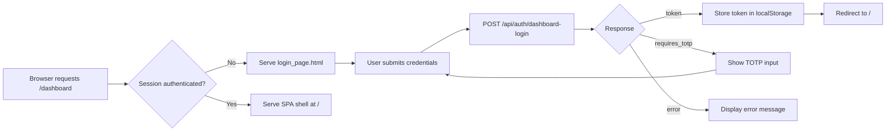

# Other — librefang-api-src

# librefang-api-src — Login Page

## Overview

`login_page.html` is a self-contained, single-file authentication page for the LibreFang dashboard. It bundles its own markup, styles, and client-side logic with zero external dependencies — no CSS framework, no JS runtime, no build step. The server delivers it as-is to unauthenticated visitors.

The page handles two-stage authentication: a standard username/password flow, followed optionally by a TOTP code challenge if the user's account has two-factor authentication enabled.

## Where It Lives in the Request Flow


```mermaid
flowchart LR
    A[Browser requests /dashboard] --> B{Session authenticated?}
    B -- No --> C[Serve login_page.html]
    C --> D[User submits credentials]
    D --> E[POST /api/auth/dashboard-login]
    E --> F{Response}
    F -- token --> G[Store token in localStorage]
    G --> H[Redirect to /]
    F -- requires_totp --> I[Show TOTP input]
    I --> D
    F -- error --> J[Display error message]
    B -- Yes --> K[Serve SPA shell at /]
```

The login page is **not** part of the SPA. It is served at `/dashboard` and `/dashboard/` specifically to host the inline login form and any SPA build assets under `/dashboard/<asset>`. Once authenticated, the user is redirected to `/` where the main SPA shell lives.

## Authentication Flow

### Stage 1 — Username and Password

The form collects a `username` and `password`. On submit, the client POSTs a JSON payload to:

```
POST /api/auth/dashboard-login
Content-Type: application/json
```

```json
{
  "username": "alice",
  "password": "s3cret"
}
```

### Stage 2 — TOTP Challenge (Conditional)

If the server responds with `{ "ok": false, "requires_totp": true }`, the page:

1. Sets the internal `requiresTotp` flag to `true`.
2. Reveals the hidden TOTP input row (`#totp-row`).
3. Focuses the TOTP input field.
4. Displays the prompt: *"Enter your 6-digit TOTP code."*

Subsequent submissions include the `totp_code` field:

```json
{
  "username": "alice",
  "password": "s3cret",
  "totp_code": "123456"
}
```

The TOTP input is constrained to exactly 6 numeric digits via `inputmode="numeric"`, `pattern="[0-9]{6}"`, and `maxlength="6"`.

### Success Handling

On a successful response (`{ "ok": true, "token": "..." }`):

1. The JWT token is stored under `localStorage` key `librefang-api-key`.
2. The page computes a redirect target based on `location.pathname`:
   - If the path is `/`, `/dashboard`, or `/dashboard/`, redirect to `/`.
   - Otherwise, redirect back to the original path + search + hash (preserving deep-link destination).
3. `location.replace(target)` navigates the user, replacing the login page from history.

Search and hash are intentionally dropped for the `/`, `/dashboard`, `/dashboard/` paths because those URLs were 404s before a routing fix — see issue #4860.

### Error Handling

Errors are displayed in the `#err` element with `aria-live="polite"` for screen reader announcements. Three error categories are handled:

| Condition | Message Shown |
|---|---|
| Server returns `{ "error": "..." }` | The server-provided error string |
| Server returns `{ ok: false }` without `error` | *"Sign in failed."* |
| Network failure / fetch throws | *"Network error."* |

The submit button is disabled during the in-flight request and re-enabled in the `finally` block to prevent double-submission.

## Key DOM Elements

| ID | Element | Role |
|---|---|---|
| `f` | `<form>` | The authentication form |
| `u` | `<input>` | Username field, auto-focused on load |
| `p` | `<input type="password">` | Password field |
| `t` | `<input>` | TOTP code field, hidden by default |
| `totp-row` | `<div>` | Container for the TOTP input, toggled via `hidden` attribute |
| `btn` | `<button type="submit">` | Submit button |
| `err` | `<div aria-live="polite">` | Error message container |

## Styling

The page uses CSS custom properties and `prefers-color-scheme` to support both dark and light modes. The dark theme is the default. The light theme overrides are scoped inside a `@media (prefers-color-scheme: light)` block that adjusts background, card, input, and text colors.

The layout centers a single `.card` element using `display: grid; place-items: center` on the body. The card is capped at `380px` wide with a `min(92vw, 380px)` responsive fallback.

## Configuration Reference

The footer message reads: *"Auth required — configured in `config.toml`."* This refers to the server-side LibreFang configuration file where dashboard authentication is enabled or disabled.

## Security Considerations

- **No inline secrets.** Credentials exist only in the POST body and are never written to DOM attributes or `localStorage`.
- **`autocomplete` attributes** are set to `username`, `current-password`, and `one-time-code` so browsers and password managers can fill them correctly.
- **`credentials: 'same-origin'`** on the fetch call ensures cookies are sent only to the same origin.
- **`robots` meta tag** is set to `noindex, nofollow` to prevent search engine indexing.
- **Token storage** uses `localStorage` inside a `try/catch` to gracefully handle environments where storage is disabled or full.