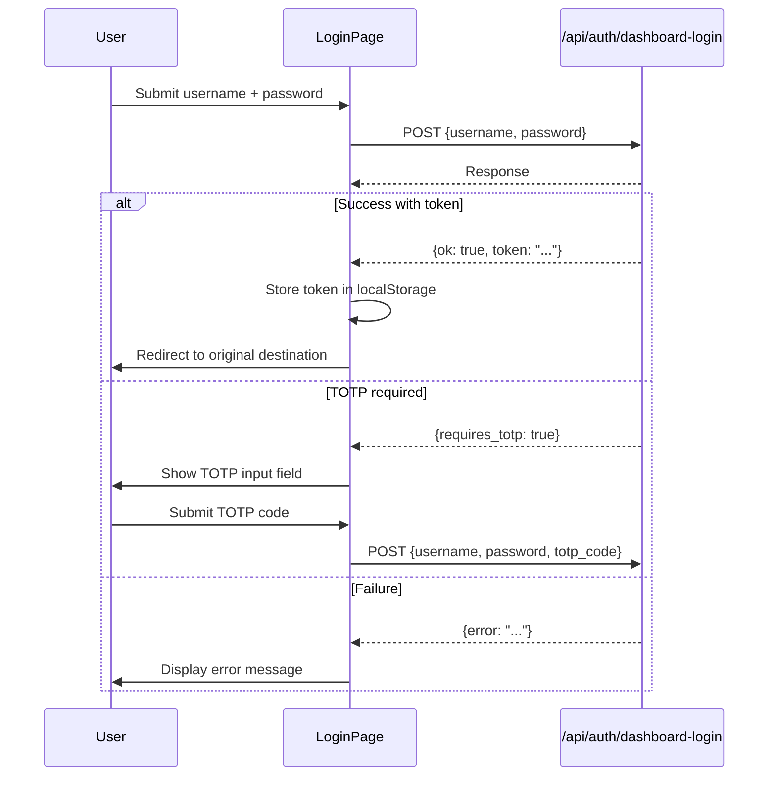

# Other — librefang-api-src

# LibreFang Login Page (`librefang-api/src/login_page.html`)

## Purpose

This is the authentication entry point for the LibreFang dashboard. It is a fully self-contained, single-file HTML page with inline CSS and JavaScript — no external dependencies, no build step, and no framework. It is served directly by the API server to unauthenticated users and handles credential collection, optional TOTP two-factor authentication, token storage, and post-login redirect.

## When This Page Is Served

The server renders this page at `/dashboard` and `/dashboard/` (and potentially `/` depending on configuration) when the requesting user lacks a valid session. After successful authentication, the user is redirected to `/`, where the main SPA shell is served.

## Authentication Flow


```mermaid
sequenceDiagram
    participant User
    participant LoginPage
    participant API as /api/auth/dashboard-login

    User->>LoginPage: Submit username + password
    LoginPage->>API: POST {username, password}
    API-->>LoginPage: Response

    alt Success with token
        API-->>LoginPage: {ok: true, token: "..."}
        LoginPage->>LoginPage: Store token in localStorage
        LoginPage->>User: Redirect to original destination
    else TOTP required
        API-->>LoginPage: {requires_totp: true}
        LoginPage->>User: Show TOTP input field
        User->>LoginPage: Submit TOTP code
        LoginPage->>API: POST {username, password, totp_code}
    else Failure
        API-->>LoginPage: {error: "..."}
        LoginPage->>User: Display error message
    end
```

## Key Components

### HTML Structure

| Element | ID | Role |
|---------|----|------|
| `<form>` | `f` | The single form wrapping all inputs and the submit button |
| Username input | `u` | Collects the username, with `autocomplete="username"` |
| Password input | `p` | Password field with `autocomplete="current-password"` |
| TOTP row | `totp-row` | Container for the TOTP input, hidden by default |
| TOTP input | `t` | 6-digit numeric code input, `inputmode="numeric"`, `pattern="[0-9]{6}"` |
| Submit button | `btn` | Disabled during in-flight requests to prevent double submission |
| Error display | `err` | `aria-live="polite"` region for accessible error announcements |

### Two-Step TOTP Handling

The login flow is **two-step**, not two-phase. There is no separate "does this user require TOTP?" probe. Instead:

1. The user submits username + password.
2. If the backend responds with `{requires_totp: true}`, the JavaScript unhides the `totp-row`, focuses the TOTP input, and prompts the user.
3. On the next submission, the payload includes `totp_code` alongside the credentials.
4. The `requiresTotp` flag is tracked in closure scope so subsequent retries continue sending the TOTP field.

### Token Storage

On a successful response containing `{ok: true, token: "..."}`:

```javascript
localStorage.setItem('librefang-api-key', d.token);
```

The token is stored under the key **`librefang-api-key`**. The surrounding `try/catch` silently ignores failures (e.g., localStorage is full or disabled in private browsing).

### Post-Login Redirect Logic

The redirect logic handles a historical edge case documented in issue **#4860**:

```javascript
var path = location.pathname;
var target = path + location.search + location.hash;
if (path === '/' || path === '/dashboard' || path === '/dashboard/') {
    target = '/';
}
location.replace(target);
```

- **Normal case**: If the user was deep-linked to a specific path (e.g., `/dashboard/settings?tab=alerts#smtp`), they are redirected back to that exact URL after login, preserving query string and hash.
- **Collapse case**: If the path is `/`, `/dashboard`, or `/dashboard/`, the redirect target collapses to `/` with no search or hash. These paths only exist to host the inline login page (or SPA build assets under `/dashboard/<asset>`), so any query/hash on them is not meaningful application state.

`location.replace()` is used instead of `location.href` assignment so the login page is not retained in browser history — the user cannot press Back to return to the login form.

## API Contract

The page communicates with a single endpoint:

**`POST /api/auth/dashboard-login`**

Request body (JSON):

| Field | Type | Required | Description |
|-------|------|----------|-------------|
| `username` | `string` | Yes | Trimmed before sending |
| `password` | `string` | Yes | Sent as-is (no trimming) |
| `totp_code` | `string` | On retry | 6-digit numeric string, included only after the server has indicated TOTP is required |

Expected response shapes:

```json
// Success
{ "ok": true, "token": "<jwt-or-api-key>" }

// TOTP required
{ "requires_totp": true }

// Failure
{ "ok": false, "error": "Human-readable message" }
```

Credentials are sent via `credentials: 'same-origin'` so cookies (if any) are included, but the auth mechanism itself is token-based — the token goes into `localStorage`, not a cookie.

## Styling and Theming

The page supports both dark and light modes via `prefers-color-scheme`:

- **Dark mode** (default): Dark background (`#0b0d12`), card background `#12151c`, light text.
- **Light mode**: Light background (`#f6f7fb`), white card, dark text, adjusted border and shadow colors.

The `:root { color-scheme: light dark; }` declaration ensures native form controls (scrollbars, focus rings) also adapt. All transitions between states are handled purely through CSS — no JavaScript class toggling.

The layout uses `display: grid; place-items: center` on the body to vertically and horizontally center the card. The card width is constrained to `min(92vw, 380px)` for mobile responsiveness.

## Security Considerations

- The page sets `<meta name="robots" content="noindex, nofollow">` to prevent search engine indexing.
- The form uses `autocomplete="username"` and `autocomplete="current-password"` so password managers can correctly identify and fill credentials.
- The TOTP field uses `autocomplete="one-time-code"` to trigger browser autofill from authenticator apps on supported devices.
- `aria-live="polite"` on the error container ensures screen readers announce authentication failures without interrupting.
- The button is disabled during the `fetch` call (set in the submit handler, re-enabled in `.finally()`) to prevent duplicate submissions.
- The password value is **not** trimmed (`document.getElementById('p').value` is sent as-is), while the username and TOTP code are trimmed. This preserves passwords that intentionally contain leading/trailing whitespace.

## Integration Notes

- This file is embedded directly in the API binary at compile time (not served from disk).
- It has **no external dependencies** — no CDN links, no frameworks, no icon libraries. This ensures the login page loads reliably even in restricted network environments.
- The `<code>config.toml</code>` reference in the footer tells administrators where to modify authentication settings, but this is purely informational.
- There are no outgoing or incoming code-level calls within the project — this module is entirely self-contained, interacting with the backend only through the HTTP endpoint.