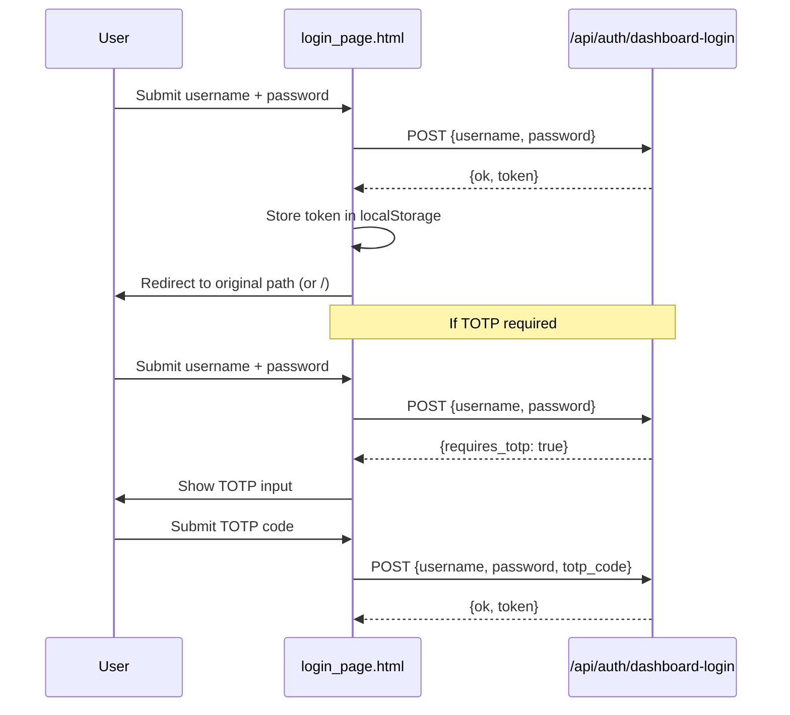

# Other — librefang-api-src

# LibreFang API Login Page (`login_page.html`)

## Overview

A self-contained, single-file HTML login page for the LibreFang dashboard. It collects credentials, handles optional two-factor authentication (TOTP), stores the resulting session token in `localStorage`, and redirects the user into the single-page application shell.

No build step, no external dependencies, no framework. Pure HTML/CSS/JS delivered as-is by the API server.

## Purpose in the Architecture

This file is served at `/dashboard` and `/dashboard/` — paths that exist **solely** to host this login page and any SPA build assets under `/dashboard/<asset>`. Once authenticated, the user is redirected to `/`, where the main SPA shell lives. This separation means unauthenticated users never load the full SPA bundle.

## Authentication Flow


```mermaid
sequenceDiagram
    participant U as User
    participant LP as login_page.html
    participant API as /api/auth/dashboard-login

    U->>LP: Submit username + password
    LP->>API: POST {username, password}
    API-->>LP: {ok, token}
    LP->>LP: Store token in localStorage
    LP->>U: Redirect to original path (or /)

    Note over LP,API: If TOTP required
    U->>LP: Submit username + password
    LP->>API: POST {username, password}
    API-->>LP: {requires_totp: true}
    LP->>U: Show TOTP input
    U->>LP: Submit TOTP code
    LP->>API: POST {username, password, totp_code}
    API-->>LP: {ok, token}
```

### Two-Phase Login

The form starts with only username and password fields. The TOTP field (`#totp-row`) is hidden by default.

1. **First submission** — sends `{ username, password }` to `POST /api/auth/dashboard-login`.
2. If the server responds with `{ requires_totp: true }`, the TOTP row is revealed, the user is prompted for their 6-digit code, and `requires_totp` is set to `true` for all subsequent submissions.
3. **Second submission** — sends `{ username, password, totp_code }`.
4. If the server responds with `{ ok: true, token: "..." }`, the token is persisted and the user is redirected.

## Token Storage

On successful authentication, the JWT is written to:

```
localStorage.setItem('librefang-api-key', token)
```

The rest of the SPA reads from this same key to authorize API requests.

## Redirect Logic

After storing the token, the page redirects using `location.replace()` to preserve the user's original destination when possible:

```javascript
var path = location.pathname;
var target = path + location.search + location.hash;

if (path === '/' || path === '/dashboard' || path === '/dashboard/') {
  target = '/';
}

location.replace(target);
```

- **If the user landed on `/dashboard` or `/dashboard/`**: redirect to `/` (the SPA shell). Search params and hash are intentionally dropped because those paths were 404s before the login page was added — any query/hash on them is not meaningful application state. See issue **#4860**.
- **Any other path**: redirect back to `pathname + search + hash`, so deep-linking into protected routes works correctly.

`location.replace()` is used instead of `location.href` to prevent the login page from staying in browser history (the back button skips it).

## UI / UX Details

### Theming

The page supports both dark and light mode via `prefers-color-scheme`:

| Mode    | Background   | Card background | Text       |
|---------|-------------|-----------------|------------|
| Dark    | `#0b0d12`   | `#12151c`       | `#e6e8ee`  |
| Light   | `#f6f7fb`   | `#fff`          | `#1a1c22`  |

The `:root` declares `color-scheme: light dark` so native form controls also adapt.

### Error Display

Errors are rendered into `#err` (with `aria-live="polite"` for screen reader announcement). Sources:

| Scenario                | Message shown                  |
|------------------------|-------------------------------|
| Server returns error    | `d.error` from the response   |
| TOTP required           | `"Enter your 6-digit TOTP code."` |
| Generic failure         | `"Sign in failed."`           |
| Network/fetch error     | `"Network error."`            |

### Accessibility Notes

- All inputs have associated `<label>` elements.
- The `aria-live="polite"` region announces errors without interrupting.
- Autocomplete attributes (`username`, `current-password`, `one-time-code`) help password managers and browser autofill.
- The username field has `autofocus`.

## DOM Structure Reference

| Element       | ID        | Role                                      |
|--------------|-----------|-------------------------------------------|
| Form         | `f`       | Wraps all inputs and the submit button    |
| Username     | `u`       | `name="username"`, required               |
| Password     | `p`       | `name="password"`, `type="password"`, required |
| TOTP row     | `totp-row`| Container, `hidden` until needed          |
| TOTP input   | `t`       | `name="totp_code"`, numeric, max 6 chars  |
| Submit button| `btn`     | Disabled during in-flight requests        |
| Error display| `err`     | `aria-live="polite"` text region          |

## Server-Side Integration Contract

The page expects the backend endpoint `POST /api/auth/dashboard-login` to accept JSON with the following shapes:

**Request (phase 1):**
```json
{ "username": "string", "password": "string" }
```

**Request (phase 2, if TOTP required):**
```json
{ "username": "string", "password": "string", "totp_code": "123456" }
```

**Response — success:**
```json
{ "ok": true, "token": "jwt-string" }
```

**Response — TOTP required:**
```json
{ "requires_totp": true }
```

**Response — failure:**
```json
{ "ok": false, "error": "Human-readable message" }
```

The page does not check HTTP status codes for business logic — it reads only the JSON body. Any non-200 status that still returns valid JSON with the above shape will work correctly.

## Configuration

The footer text references `config.toml`, indicating that authentication is a configurable feature. The page itself is static and requires no configuration — all behavior is determined by the server's response.