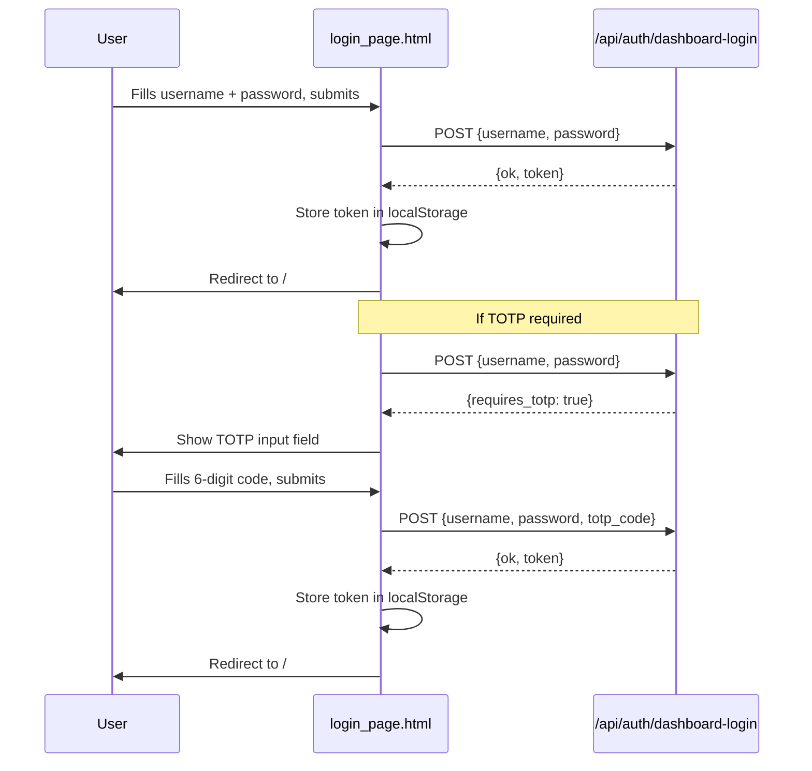

# Other — librefang-api-src

# librefang-api-src — Login Page

## Overview

`login_page.html` is a fully self-contained, single-file login page served by the LibreFang API server. It handles username/password authentication and optional TOTP two-factor authentication for dashboard access. There are no external dependencies — all CSS and JavaScript are inlined.

## Purpose

When a user navigates to `/dashboard` (or `/dashboard/`) without a valid session, the API server serves this page. It collects credentials, POSTs them to the API, stores the returned token client-side, and redirects the user into the SPA shell at `/`.

## Authentication Flow


```mermaid
sequenceDiagram
    participant U as User
    participant LP as login_page.html
    participant API as /api/auth/dashboard-login

    U->>LP: Fills username + password, submits
    LP->>API: POST {username, password}
    API-->>LP: {ok, token}
    LP->>LP: Store token in localStorage
    LP->>U: Redirect to /

    Note over LP,API: If TOTP required
    LP->>API: POST {username, password}
    API-->>LP: {requires_totp: true}
    LP->>U: Show TOTP input field
    U->>LP: Fills 6-digit code, submits
    LP->>API: POST {username, password, totp_code}
    API-->>LP: {ok, token}
    LP->>LP: Store token in localStorage
    LP->>U: Redirect to /
```

## Key Components

### HTML Form (`#f`)

The form contains three input fields, the third hidden by default:

| Element | ID | Name | Purpose |
|---------|----|------|---------|
| Username | `#u` | `username` | Account username |
| Password | `#p` | `password` | Account password |
| TOTP code | `#t` | `totp_code` | 6-digit one-time code (hidden until needed) |

The TOTP row (`#totp-row`) is revealed only when the API responds with `requires_totp: true`. On reveal, focus is automatically moved to the TOTP input.

### JavaScript Submission Handler

The `submit` event listener on `#f`:

1. **Prevents default** form submission.
2. **Disables the button** (`#btn`) to prevent double-submits.
3. **Builds a payload** object with `username` and `password`. If `requiresTotp` is `true`, appends `totp_code`.
4. **POSTs to `/api/auth/dashboard-login`** with `Content-Type: application/json` and `credentials: 'same-origin'` (sends cookies for CSRF/session).
5. **Handles the response**:
   - `{ ok: true, token }` — stores `d.token` under `localStorage` key `librefang-api-key`, then redirects.
   - `{ requires_totp: true }` — sets `requiresTotp`, unhides the TOTP field, focuses it, shows a prompt message.
   - Any other response — displays `d.error` or a generic failure message in `#err`.
6. **Catches network errors** with a generic "Network error." message.
7. **Re-enables the button** in `finally`.

### Redirect Logic

After successful token storage, the page determines the redirect target:

```javascript
var path = location.pathname;
var target = path + location.search + location.hash;
if (path === '/' || path === '/dashboard' || path === '/dashboard/') {
  target = '/';
}
location.replace(target);
```

- If the user originally landed on `/`, `/dashboard`, or `/dashboard/`, redirect to `/` (the SPA shell root). Query strings and hash fragments are intentionally dropped for these paths — see issue #4860 for rationale.
- For any other path (e.g., a deep link the user bookmarked), the full path + search + hash is preserved so the SPA can route to it after loading.

### Styling

- **Dark mode by default** (`#0b0d12` background, `#12151c` card).
- **Light mode** via `@media (prefers-color-scheme: light)` — overrides background, card, input, and text colors.
- The card is centered using `display: grid; place-items: center` on `<body>`, capped at `min(92vw, 380px)` for mobile responsiveness.
- Focus states use a blue ring (`#7c8cff`) on inputs.

### Error Display

The `#err` element uses `aria-live="polite"` so screen readers announce error messages when they appear. Errors are cleared at the start of each submission attempt.

## Integration Points

| Integration | Detail |
|-------------|--------|
| **API endpoint** | `POST /api/auth/dashboard-login` — expected to return `{ ok, token }`, `{ requires_totp: true }`, or `{ error: string }` |
| **Token storage** | `localStorage` key `librefang-api-key` — other parts of the application (SPA shell, API client) read from this key |
| **Server config** | Auth behavior is controlled via `config.toml` (noted in the page footer) |
| **SPA shell** | Lives at `/`; this login page is served at `/dashboard` or `/dashboard/` by the API server |

## Developer Notes

- **No build step required.** The file is served as-is. All CSS is in `<style>`, all JS is in `<script>`.
- **No external dependencies.** No frameworks, no CSS libraries, no CDN links. Pure vanilla HTML/CSS/JS.
- **robots meta tag** is set to `noindex, nofollow` to prevent search engine indexing.
- **`autocomplete` attributes** are set for browser password manager compatibility (`username`, `current-password`, `one-time-code`).
- **Token storage fallback**: `localStorage.setItem` is wrapped in `try/catch` to handle cases where storage is disabled or full.