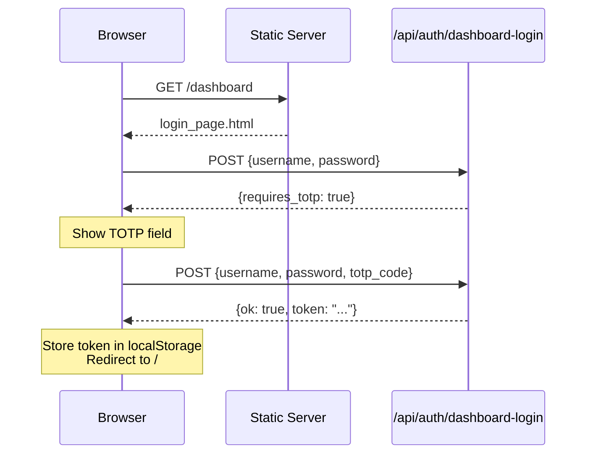

# Other — librefang-api-src

# librefang-api — Login Page (`login_page.html`)

## Overview

A self-contained, single-file HTML login page for the LibreFang dashboard. It ships no external dependencies — all CSS and JavaScript are inlined. The page collects username/password credentials (and optionally a TOTP code), authenticates against the backend API, stores the returned token in `localStorage`, and redirects the user to the dashboard SPA.

This page is served at `/dashboard` and `/dashboard/` (see routing notes below).

## Architecture


```mermaid
sequenceDiagram
    participant Browser
    participant Server as Static Server
    participant API as /api/auth/dashboard-login

    Browser->>Server: GET /dashboard
    Server-->>Browser: login_page.html
    Browser->>API: POST {username, password}
    API-->>Browser: {requires_totp: true}
    Note over Browser: Show TOTP field
    Browser->>API: POST {username, password, totp_code}
    API-->>Browser: {ok: true, token: "..."}
    Note over Browser: Store token in localStorage<br/>Redirect to /
```

## Authentication Flow

### 1. Credential Submission

When the user submits the form, the JavaScript handler:

1. Prevents default form submission.
2. Disables the submit button to prevent double-posts.
3. Builds a JSON payload with `username` and `password`.
4. If TOTP has been requested by a prior attempt, includes `totp_code` in the payload.
5. POSTs to `/api/auth/dashboard-login` with `Content-Type: application/json` and `credentials: 'same-origin'`.

### 2. Response Handling

The API response is a JSON object. Three outcomes are handled:

| Response Shape | Behavior |
|---|---|
| `{ ok: true, token: "..." }` | Store token in `localStorage` under key `librefang-api-key`, then redirect. |
| `{ requires_totp: true }` | Reveal the TOTP input field, set `requiresTotp = true`, focus the TOTP input, and prompt the user. |
| Any other response | Display `d.error` or a fallback `"Sign in failed."` message in the error div. |

Network-level failures display `"Network error."`

### 3. Token Storage

On successful authentication, the token is written to:

```
localStorage['librefang-api-key']
```

The `try/catch` around `localStorage.setItem` silently handles cases where storage is unavailable (e.g., Safari private browsing).

### 4. Post-Login Redirect

After storing the token, the page redirects via `location.replace()`. The redirect target is determined by the current `location.pathname`:

- **`/`, `/dashboard`, `/dashboard/`** — redirects to `/`. These paths host the inline login page (and SPA build assets under `/dashboard/<asset>`), not meaningful application destinations. Redirecting back to them would land on a 404. See issue **#4860**.
- **Any other path** — redirects to `pathname + search + hash`, preserving the original destination the user was trying to reach before being intercepted by the login gate.

> **Note:** Search and hash fragments are intentionally dropped on the collapse branches (`/`, `/dashboard`, `/dashboard/`) because those URLs were 404s before the fix — any query string or hash on them is not meaningful application state.

## UI Components

### Form Fields

| Element | ID | Name | Notes |
|---|---|---|---|
| Username input | `u` | `username` | `autofocus`, `autocomplete="username"` |
| Password input | `p` | `password` | `type="password"`, `autocomplete="current-password"` |
| TOTP input | `t` | `totp_code` | Hidden by default. `inputmode="numeric"`, `pattern="[0-9]{6}"`, `maxlength="6"` |
| Submit button | `btn` | — | Disabled during in-flight requests |
| Error display | `err` | — | `aria-live="polite"` for screen reader announcements |

### Theming

The page supports both dark and light mode via `prefers-color-scheme`:

- **Dark (default):** Dark background (`#0b0d12`), card (`#12151c`), light text (`#e6e8ee`).
- **Light:** Inverted via `@media (prefers-color-scheme: light)` override block. Background `#f6f7fb`, card `#fff`.

The `:root { color-scheme: light dark; }` declaration ensures native form controls (scrollbars, focus rings) also respect the user's preference.

### Responsive Behavior

The card container uses `width: min(92vw, 380px)` to fit small mobile screens while capping at 380px on wider viewports. The page body uses `display: grid; place-items: center` for vertical and horizontal centering.

## Key DOM Elements and IDs

All element IDs are minimal single-character names (`f`, `u`, `p`, `t`, `btn`, `err`, `totp-row`). This is intentional — the page is self-contained and these IDs are not referenced outside this file. If this page is ever templated or embedded, these IDs should be namespaced to avoid collisions.

## Integration Points

### Backend API Contract

The page expects the endpoint `POST /api/auth/dashboard-login` to accept and return:

**Request:**
```json
{
  "username": "string",
  "password": "string",
  "totp_code": "string (optional, 6 digits)"
}
```

**Response (success):**
```json
{ "ok": true, "token": "jwt-token-here" }
```

**Response (TOTP required):**
```json
{ "requires_totp": true }
```

**Response (error):**
```json
{ "error": "Human-readable error message" }
```

### Token Consumption

Other parts of the LibreFang system (likely the dashboard SPA and/or API client helpers) read the token from `localStorage.getItem('librefang-api-key')` and attach it to subsequent API requests, presumably as an `Authorization` header.

## Configuration Reference

The footer of the login page displays:

> Auth required — configured in `config.toml`.

This is a static hint to administrators. Authentication behavior (enabled/disabled, user credentials, TOTP enforcement) is controlled by the backend's `config.toml`, not by this page.

## Security Considerations

- **`autocomplete` attributes** are set appropriately (`username`, `current-password`, `one-time-code`) to work with password managers and browser autofill.
- **`robots` meta tag** is set to `noindex, nofollow` to prevent search engine indexing of the login page.
- **Credentials** are sent via `fetch` with `credentials: 'same-origin'`, ensuring cookies (if any) are included but credentials are not leaked to cross-origin requests.
- **No inline secrets** — the page contains no hardcoded API keys, secrets, or tokens.
- **The token in localStorage** is accessible to any JavaScript running on the same origin. This is standard for SPAs but be aware of XSS implications.

## Maintenance Notes

- This file has **no build step** and **no external dependencies**. It can be edited directly.
- The `#4860` reference in the redirect logic comments tracks a bug where post-login redirects to `/dashboard` or `/dashboard/` resulted in a 404. Do not change the redirect collapse logic without understanding that history.
- The `<meta name="robots">` tag and inline styles are intentional — this page is deliberately standalone to avoid loading external CSS/JS on the login screen, reducing attack surface and eliminating external dependency failures on the authentication critical path.