# Other — librefang-api-static

# LibreFang Dashboard Internationalization (i18n) — Static Locale Files

## Purpose

The `librefang-api/static/locales/` directory contains the translation catalogs for the LibreFang web dashboard. These JSON files provide every user-facing string used across all dashboard pages, components, dialogs, and toast notifications. The frontend's i18n runtime loads the appropriate file based on the user's language preference and resolves translation keys at render time.

Currently supported languages:

| File | Language | Code |
|------|----------|------|
| `en.json` | English | `en` |
| `ja.json` | Japanese | `ja` |

## How It Works

The dashboard uses an i18n library (bundled as `i18n-4qyNqnlA.js`) that:

1. **Loads locale files** from `/static/locales/{lang}.json` at application boot
2. **Resolves keys** via `t("key.path")` or the `getFixedT` function for scoped translations
3. **Interpolates parameters** using `{variableName}` placeholders (e.g., `"agentsStopped": "{count} agent(s) stopped"`)

### Interpolation Syntax

Placeholders in strings use curly braces. The frontend substitutes them at runtime:

```json
"entriesCount": "{filtered} of {total} entries"
```

Given `{ filtered: 3, total: 50 }`, this renders as: `3 of 50 entries`.

## File Structure

Each locale file is a flat JSON object with **top-level namespace keys** that map to dashboard sections. The structure is identical across all language files — every key present in `en.json` must also exist in `ja.json`.

### Namespace Map

```
locales/
├── en.json
└── ja.json
```



```mermaid
graph TD
    A[Locale File] --> B[Navigation & Shell]
    A --> C[Feature Pages]
    A --> D[Setup & Onboarding]
    A --> E[Shared Components]
    
    B --> B1[nav]
    B --> B2[status]
    B --> B3[btn]
    B --> B4[label]
    B --> B5[theme]
    B --> B6[sidebar]
    B --> B7[auth]
    
    C --> C1[overview]
    C --> C2[agentChat]
    C --> C3[agentsPage]
    C --> C4[sessionsPage]
    C --> C5[settingsPage]
    C --> C6[channelsPage]
    C --> C7[skillsPage]
    C --> C8[handsPage]
    C --> C9[pluginsPage]
    C --> C10[logsPage]
    C --> C11[runtimePage]
    C --> C12[approvals]
    C --> C13[commsPage]
    C --> C14[workflowsPage]
    C --> C15[schedulerPage]
    C --> C16[goalsPage]
    C --> C17[analyticsPage]
    C --> C18[memoryPage]
    
    D --> D1[onboarding]
    D --> D2[setupWizard]
    D --> D3[provider]
    
    E --> E1[time]
    E --> E2[mode]
    E --> E3[profile]
    E --> E4[template]
    E --> E5[category]
    E --> E6[security]
    E --> E7[confirm]
```

### Key Namespaces Reference

#### Shell & Navigation (`nav`, `status`, `btn`, `label`, `auth`, `theme`, `sidebar`)

Reusable strings for the application chrome — sidebar items, connection status indicators, standard button labels, form field labels, the API key authentication screen, theme selector, and sidebar keyboard shortcut hints.

```json
{
  "nav": { "chat": "Chat", "agents": "Agents", ... },
  "btn": { "refresh": "Refresh", "save": "Save", ... },
  "status": { "connecting": "Connecting...", "ready": "ready", ... }
}
```

#### Agent Chat (`agentChat`)

The largest namespace (~150 keys). Covers the entire chat interface including:

- **Chat states**: `"ready"`, `"generating"`, `"thinking"`, `"thinkingWithLevel"`, `"usingTool"`, `"working"`
- **Sessions**: `"sessions"`, `"newSession"`, `"sessionDefault"`, `"switchSessionFailed"`
- **Slash commands** (`agentChat.cmd.*`): 18 commands from `/help` to `/a2a`
- **Toast notifications** (`agentChat.toast.*`): success/failure messages for model switches, session resets, compaction
- **System messages** (`agentChat.sys.*`): responses to commands like `/status`, `/budget`, `/peers`
- **File handling**: drag-and-drop, upload errors, size limits
- **Voice recording**: `"recordingRelease"`, `"transcribingAudio"`, `"microphoneDenied"`
- **Welcome tips**: Markdown-formatted help text shown to new users

#### Agent Management (`agentsPage`, `detail`, `profile`, `template`, `mode`, `category`)

Strings for creating, configuring, and managing agents:

- **Creation**: wizard mode, raw TOML mode, spawn confirmation
- **Detail view**: info/files/config tabs, tool filters (allowlist/blocklist), fallback chains
- **Profiles** (`profile.*`): 9 tool profiles from `minimal` to `full`, each with a label and description
- **Templates** (`template.*`): 10 pre-built agent templates (GeneralAssistant, CodeHelper, Researcher, etc.)
- **Archetypes** (`agentsPage.archetype.*`): assistant, researcher, coder, writer, devops, support, analyst, custom
- **Vibes** (`agentsPage.vibe.*`): professional, friendly, technical, creative, concise, mentor

#### Settings (`settingsPage`)

The second-largest namespace, organized into sub-sections:

| Sub-namespace | Content |
|---------------|---------|
| LLM providers | API key forms, connection testing, custom provider setup |
| Model catalog | Search, filtering, custom models, catalog sync |
| Tools | Tool listing and search |
| Security (`coreFeatures`, `configurableFeatures`, `monitoringFeatures`) | 8 core protections, 4 configurable controls, 3 monitoring systems |
| Network (`peerNetworkingTitle`, `a2aExternalAgents`) | OFP mesh, peer discovery, A2A agents |
| Budget | Hourly/daily/monthly limits, alert thresholds, top spenders |
| Proactive Memory | Auto-memorize, auto-retrieve, extraction config, decay rates |
| Migration | OpenClaw/OpenFang import workflow |
| System | Runtime configuration, raw JSON editor |

The security features sub-namespaces (`coreFeatures.*`, `configurableFeatures.*`, `monitoringFeatures.*`) are particularly detailed — each feature includes a `name`, `description`, and either a `threat` (for core features) or a `hint` (for configurable/monitoring features).

#### Workflow System (`workflowsPage`, `workflowBuilder`)

Strings for the workflow list view and the visual drag-and-drop builder:

- **Builder** (`workflowBuilder.nodeType.*`): 7 node types (agentStep, parallelFanOut, condition, loop, collect, start, end)
- **Node configuration**: agent selection, prompt templates, fan-out count, strategy (all/first/majority)
- **TOML export**: generated TOML display and copy

#### Scheduler (`schedulerPage`)

Covers three tabs:

- **Scheduled Jobs**: cron expressions, quick presets (`schedulerPage.cron.*` — 20+ presets from "every minute" to "Mondays at midnight"), run history
- **Event Triggers** (`schedulerPage.triggerType.*`): lifecycle, system, memory events
- **Run History**: execution log with time, type, and status

#### Channels (`channelsPage`)

Messaging channel configuration with a 3-step wizard (configure → verify → ready):

- **Categories**: messaging, social, enterprise, developer, notifications
- **Channel statuses**: notConfigured, missingToken, ready, configured
- **WhatsApp-specific**: QR code flow, Business API alternative
- **Connection testing** and credential management

#### Skills (`skillsPage`)

Four tabs with distinct content:

- **Installed**: local and ClawHub skills
- **ClawHub**: search, browse by category (`skillsPage.category.*` — 18 categories), sort (trending/downloads/stars/updated)
- **MCP Servers**: connected/configured server lists, tool counts
- **Quick Start** (`skillsPage.quickStartSkill.*`): 4 one-click prompt-only skills
- **Security**: scan results, install warnings, blocked notifications

#### Hands (`handsPage`)

Autonomous capability packages with a 3-step setup (dependencies → configure → launch):

- Dependency detection and installation
- Agent configuration and activation
- Browser session viewing (for browser-capable hands)
- Status: active, paused, inactive, error

#### Other Pages

| Namespace | Content |
|-----------|---------|
| `sessionsPage` | Conversation history and per-agent key-value memory store |
| `approvals` | Execution approval queue with pending/approved/rejected/expired states |
| `logsPage` | Live log stream and tamper-evident audit trail with chain verification |
| `runtimePage` | System info, platform details, provider status, model list |
| `commsPage` | Inter-agent messaging, task posting, topology view, live event feed |
| `goalsPage` | Goal tracking with sub-goals, status (pending/inProgress/completed/cancelled) |
| `analyticsPage` | Token usage, cost breakdown, daily cost charts, per-model/per-agent stats |
| `memoryPage` | Proactive memory system browser with search, CRUD, version history |
| `pluginsPage` | Plugin management with registry, local path, and Git URL install sources |

## Adding a New Language

To add a new language (e.g., French):

1. Copy `en.json` to `fr.json`
2. Translate all string values (not keys) to French
3. Keep the JSON structure and key names **identical** to `en.json`
4. Register the new language in the frontend's i18n configuration

### Translation Checklist

When translating, pay attention to:

- **Interpolation tokens** (`{count}`, `{name}`, `{message}`) must be preserved exactly
- **Markdown formatting** in strings like `agentChat.welcomeTips` must be preserved
- **Keyboard shortcuts** (`Ctrl+Shift+F`, `Ctrl+/`) are typically not translated
- **Technical terms** (TOML, MCP, WASM, Ed25519, GCRA) are generally kept as-is

## Adding New Translation Keys

When adding a new UI feature:

1. Add the key to **both** `en.json` and `ja.json` (and any other language files)
2. Use dot-separated namespaces that match the page/component: e.g., a new analytics feature goes under `analyticsPage.*`
3. Use `{variableName}` for dynamic values — avoid positional placeholders
4. For pluralization-sensitive strings, use a form that works for both singular and plural (e.g., `"{count} agent(s) stopped"`)

## Relationship to the Rest of the Codebase

```
┌──────────────────────┐         ┌─────────────────────┐
│  librefang-api       │         │  React Dashboard    │
│  (Rust backend)      │         │  (SPA frontend)     │
│                      │  serves │                     │
│  static/locales/  ───┼────────►│  i18n runtime       │
│    en.json           │  HTTP   │    ↓                │
│    ja.json           │         │  t("key.path")      │
└──────────────────────┘         └─────────────────────┘
```

- The **Rust API server** (`librefang-api`) serves these files as static assets under `/static/locales/`
- The **React dashboard** fetches them during initialization and uses the i18n library's `getFixedT` for scoped translation resolution
- Route handlers in the API (e.g., `src/routes/*.rs`) do not consume these files directly — they are purely frontend resources
- Test harnesses call `nest` on the router, which mounts the static file serving; this is why integration tests reference the same static asset path

### Key Interactions

| Consumer | Usage |
|----------|-------|
| `ChatPage` component | `agentChat.*` keys for the entire chat interface |
| `AgentsPage` component | `agentsPage.*`, `detail.*`, `profile.*` keys |
| `SettingsPage` component | `settingsPage.*` with its ~200+ keys across 10 tabs |
| `LogsPage` component | `logsPage.*` for live stream and audit trail |
| `SetupWizard` component | `setupWizard.*` for the 5-step guided setup |
| All pages | `btn.*`, `status.*`, `confirm.*` for shared UI elements |

## Key Count Summary

The English locale file contains approximately **1,200+ translation keys** across **30+ top-level namespaces**, covering every user-facing string in the LibreFang dashboard. The Japanese file mirrors this structure with full translations for all keys.