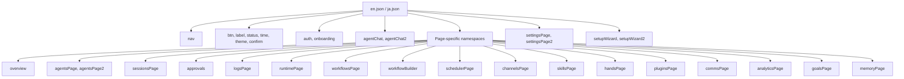

# Other — librefang-api-static

# librefang-api-static — Static Frontend Assets (Locales)

## Purpose

This module provides the internationalization (i18n) locale files for the LibreFang web dashboard. All user-facing text displayed in the frontend UI — labels, button captions, status messages, toast notifications, page descriptions, error messages, and onboarding copy — is defined here rather than hardcoded in components. This allows the dashboard to be presented in multiple languages without modifying application logic.

Currently supported languages:

| Locale | File | Language |
|--------|------|----------|
| `en` | `locales/en.json` | English (default) |
| `ja` | `locales/ja.json | Japanese |

## File Structure

```
static/
└── locales/
    ├── en.json
    └── ja.json
```

The JSON files are flat key-value maps organized into nested namespaces by feature area. The frontend's i18n library resolves translation keys at render time using dot-path notation (e.g., `agentsPage.spawnAgent`, `agentChat.cmd.help`).

## Translation Key Architecture

### Interpolation

Strings use `{variableName}` placeholders that the i18n runtime replaces with dynamic values:

```json
"agentsStopped": "{count} agent(s) stopped"
```

Rendered as: `"3 agent(s) stopped"` when `{count}` is `3`.

Common interpolation variables across the locale files:

| Variable | Used For |
|----------|----------|
| `{count}` | Numeric counts (agents, tokens, entries, files) |
| `{name}` | Agent, channel, schedule, or skill names |
| `{message}` | Error/detail message strings |
| `{provider}` | LLM provider name (anthropic, openai, etc.) |
| `{model}` | Model identifier |
| `{time}` | Timestamp display |
| `{key}` | Memory key name |
| `{tool}` | Tool name |
| `{old}`, `{new}` | Previous and updated values in memory conflicts |
| `{filtered}`, `{total}` | Filtered vs total result counts |
| `{configured}`, `{total}` | Configured vs total providers/channels |

### Namespace Organization

Each JSON file is organized into top-level namespaces corresponding to dashboard sections and shared UI components:



## Key Sections

### Shared UI Elements

**`nav`** — Sidebar navigation labels for all dashboard sections (Chat, Monitor, Overview, Analytics, Logs, Agents, Sessions, Approvals, Comms, Automation, Workflows, Scheduler, Goals, Extensions, Channels, Skills, Hands, Plugins, System, Runtime, Settings, Memory).

**`btn`** — Generic button labels reused across the entire UI: `refresh`, `unlock`, `retry`, `send`, `stop`, `cancel`, `save`, `delete`, `edit`, `add`, `close`, `back`, `next`, `skip`, `test`, `go`, `chat`, `copy`, `copied`.

**`label`** — Common field labels: `status`, `version`, `provider`, `model`, `agent`, `messages`, `actions`, `name`, `key`, `value`.

**`status`** — Connection state indicators: `connecting`, `reconnecting`, `disconnected`, `ready`, `error`, `notConfigured`, `unknown`.

**`time`** — Relative time formatting strings with `{count}` interpolation: `now`, `secondsAgo`, `minutesAgo`, `hoursAgo`, `daysAgo`.

**`confirm`** — Shared confirmation dialog buttons: `cancel`, `confirm`.

### Authentication and Onboarding

**`auth`** — API key gate screen shown when the instance requires authentication: title, description, placeholder, and hint pointing users to `~/.librefang/config.toml`.

**`onboarding`** — First-launch banner: welcome message, "Launch Setup Wizard" and "Configure Manually" options, dismiss action.

**`setupWizard` / `setupWizard2`** — Multi-step guided setup flow covering provider configuration, agent creation, test message, optional channel connection, and completion summary. Contains ~60 keys covering every label, toast, and error message in the wizard flow.

### Agent Chat

**`agentChat`** — The largest single namespace (~100+ keys). Covers:
- Session management (create, switch, list)
- Message rendering states (`generating`, `processing`, `thinking`, `thinkingWithLevel`, `usingTool`, `working`)
- Slash command definitions (`cmd.help`, `cmd.new`, `cmd.model`, `cmd.think`, `cmd.context`, `cmd.verbose`, etc.)
- File attachment and voice recording UX
- Toast notifications for model switches, session resets, compaction results
- System status output (`sys.systemStatus`, `sys.budgetStatus`, `sys.ofpNetwork`)
- Welcome tips and keyboard shortcut hints

### Agent Management

**`agentsPage`** — Agent creation (wizard and raw TOML modes), spawning, stopping, cloning, model switching, history clearing, tool filter management, archetype and vibe labels.

**`detail`** — Agent detail panel: info tab, files tab, config tab, tool filters (allowlist/blocklist), fallback chain management.

**`profile`** — Tool profile descriptions: `minimal`, `coding`, `research`, `messaging`, `automation`, `balanced`, `precise`, `creative`, `full`.

**`template`** — Built-in agent template names and descriptions: `GeneralAssistant`, `CodeHelper`, `Researcher`, `Writer`, `DataAnalyst`, `DevOpsEngineer`, `CustomerSupport`, `Tutor`, `APIDesigner`, `MeetingNotes`.

### Settings

**`settingsPage`** — The second-largest namespace, covering nine settings tabs:

| Sub-namespace | Content |
|---------------|---------|
| Provider config | API key management, OAuth flows, custom provider setup |
| Model catalog | Browsing, filtering, custom model addition, catalog sync |
| Tools | Tool listing and search |
| Security | Full descriptions of 15 security features organized into `coreFeatures`, `configurableFeatures`, `monitoringFeatures` |
| Network / OFP | Peer networking, A2A agent discovery |
| Budget | Spending limits (hourly/daily/monthly), alert thresholds, top spenders |
| Proactive Memory | mem0-style auto-memorize/auto-retrieve configuration |
| System | Raw config JSON editing |
| Migration | OpenClaw/OpenFang data import flow |

The security feature descriptions include structured objects with `name`, `description`, and either `threat` (for core features) or `hint` (for configurable features):

```json
"coreFeatures": {
  "ssrf_protection": {
    "name": "SSRF Protection",
    "description": "Blocks outbound requests to private IPs...",
    "threat": "Internal network reconnaissance, cloud credential theft"
  }
}
```

### Automation

**`workflowsPage`** — Workflow CRUD, step definition, execution, and run history.

**`workflowBuilder`** — Visual drag-and-drop workflow editor: node palette (Agent Step, Parallel Fan-out, Condition, Loop, Collect, Start, End), connection management, TOML export, node configuration labels.

**`schedulerPage`** — Cron-based scheduled jobs and event triggers. Includes human-readable cron presets (`cron.everyMinute`, `cron.daily9am`, `cron.weekdays9am`, etc.), trigger type labels, and run history.

**`goalsPage`** — Hierarchical goal tracking with sub-goals, status progression (Pending → In Progress → Completed/Cancelled), and progress tracking.

### Extensions

**`channelsPage`** — Messaging channel configuration (Telegram, Discord, Slack, WhatsApp, etc.). Three-step setup flow (Configure → Verify → Ready), QR code management for WhatsApp, Business API fallback, connection testing.

**`skillsPage`** — Installed skills, ClawHub browsing and search, MCP server management, quick-start skill creation. Category labels covering 18 domains (coding, git, web, devops, browser, search, ai, data, productivity, communication, media, notes, security, cli, marketing, finance, smart-home, docs).

**`handsPage`** — Curated autonomous capability packages. Three-step activation flow (Dependencies → Configure → Launch), browser session viewing, pause/resume/deactivate controls.

**`pluginsPage`** — Plugin management with install sources (Registry, Local Path, Git URL), plugin scaffolding, and hook type labels (`ingest`, `after_turn`).

### Monitoring and Analytics

**`logsPage`** — Live log streaming and tamper-evident audit trail. States: `paused`, `live`, `polling`, `disconnected`. Chain verification output: `valid` / `broken`.

**`approvals`** — Execution approval workflow: pending/approved/rejected/expired statuses, approval and rejection actions with confirmations.

**`analyticsPage`** — Usage analytics with four tabs: Summary, By Model, By Agent, Costs. Token breakdowns, cost tracking, daily cost charts, provider/model cost breakdowns, tier classifications (Frontier, Smart, Balanced, Fast).

**`runtimePage`** — Runtime information display: platform, architecture, API listen address, provider status with latency, uptime formatting.

### Memory

**`memoryPage`** — Proactive memory system UI: search, filtering by agent/level/category, version history display, CRUD operations, memory-level breakdown (User, Session, Agent).

## Adding a New Locale

To add support for a new language:

1. **Copy `en.json`** as the starting template:
   ```
   cp locales/en.json locales/<locale-code>.json
   ```

2. **Translate all values** — Do not modify keys or structural nesting. Only translate the string values.

3. **Preserve interpolation placeholders** — Keep `{count}`, `{name}`, `{message}`, etc. exactly as-is. Reorder surrounding text as needed for target-language grammar.

4. **Preserve Markdown formatting** — Some strings contain Markdown (e.g., `agentChat.welcomeTips` uses `**bold**` and `- ` list markers). Maintain these verbatim.

5. **Register the locale** in the frontend's i18n configuration (outside this module).

## Adding New Translation Keys

When adding a new UI feature or page:

1. **Namespace by page/component** — Create a new top-level key matching the page or component name (e.g., `"graphsPage"` for a new Graphs page).

2. **Group related strings** — Use shallow nesting for sub-sections (e.g., `filter`, `status`, `toast` within a page namespace).

3. **Use consistent suffixes** across namespaces:
   - `*Title` — Dialog/section titles
   - `*Desc` / `*Description` — Descriptive text
   - `*Placeholder` — Input placeholders
   - `*Failed` — Error toast messages
   - `*Toast` — Success toast messages
   - `*Confirm` — Confirmation dialog body text

4. **Update all locale files** — Every key in `en.json` must have a corresponding entry in every other locale file, even if the initial value is the English string (to be translated later).