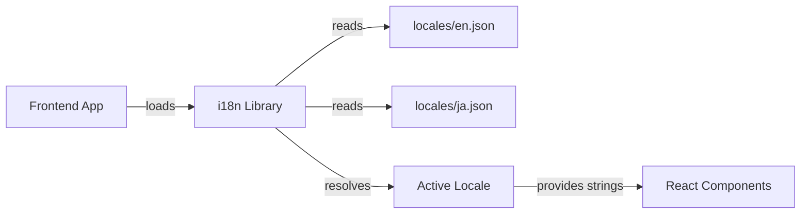

# Other — librefang-api-static

# Static Locales — `librefang-api/static/`

## Purpose

This directory contains the **i18n (internationalization) locale files** for the LibreFang web dashboard. Every user-facing string in the UI is defined here, organized as flat JSON key–value maps under semantic namespaces. The frontend loads the appropriate locale at runtime based on the user's language preference.

## Supported Languages

| File | Language | Code |
|---|---|---|
| `locales/en.json` | English (default) | `en` |
| `locales/ja.json` | Japanese | `ja` |

## File Format

Each locale file is a single JSON object. Keys are dot-path navigable namespaces (e.g. `agentsPage.createAgent`), and values are the translated strings. Some strings contain **interpolation placeholders** in curly braces (e.g. `{count}`, `{name}`, `{message}`) that the frontend replaces at render time.

```jsonc
{
  "agentsPage": {
    "agentSpawned": "Agent \"{name}\" spawned",
    "agentsStopped": "{count} agent(s) stopped"
  }
}
```

## Namespace Map

The key namespaces and the UI sections they serve:

| Namespace | UI Section |
|---|---|
| `nav` | Sidebar navigation labels |
| `status` | Connection / system status indicators |
| `btn` | Shared button labels (Refresh, Save, Delete, etc.) |
| `label` | Generic field labels |
| `auth` | API key authentication gate |
| `page` | Page title overrides |
| `health` | Health check status text |
| `stat` | Dashboard stat card labels |
| `card` | Dashboard card titles |
| `agents` | Agent list / quick-start area |
| `detail` | Agent detail panel (Info, Files, Config tabs) |
| `mode` | Agent mode labels (Observe / Assist / Full) |
| `profile` | Tool profile names and descriptions |
| `template` | Agent template names and descriptions |
| `time` | Relative time formatting |
| `onboarding` | First-run onboarding banners |
| `provider` | LLM provider setup UI |
| `overview` | Main dashboard / overview page |
| `security` | Security feature labels |
| `agentChat` | Chat interface, commands, toasts, system messages |
| `sessionsPage` | Session management and agent memory browser |
| `agentsPage` | Agent creation wizard, TOML editor, controls |
| `approvals` | Execution approval queue |
| `logsPage` | Live log viewer and audit trail |
| `runtimePage` | Runtime information display |
| `settingsPage` | Full settings panel (providers, models, tools, security, network, budget, proactive memory, migration) |
| `workflowsPage` | Workflow list and runner |
| `workflowBuilder` | Visual workflow builder (drag-and-drop canvas) |
| `schedulerPage` | Cron jobs, event triggers, run history |
| `channelsPage` | Channel configuration (Telegram, Discord, Slack, WhatsApp, etc.) |
| `skillsPage` | Skills browser, ClawHub integration, MCP servers |
| `handsPage` | Hands — curated autonomous capability packages |
| `pluginsPage` | Plugin management and registry |
| `commsPage` | Inter-agent communication and topology |
| `setupWizard` | Guided first-time setup wizard |
| `goalsPage` | Goals and sub-goals tracking |
| `analyticsPage` | Token usage, cost analytics, daily breakdowns |
| `memoryPage` | Proactive memory browser and management |
| `theme` | Theme selector labels |
| `sidebar` | Sidebar shortcut hints |
| `confirm` | Shared confirmation dialog buttons |

## Interpolation Placeholders

Strings use `{variableName}` placeholders. The frontend is responsible for substituting these with runtime values. Common placeholders:

| Placeholder | Used For |
|---|---|
| `{count}` | Numeric counts (agents, tokens, entries, etc.) |
| `{name}` | Agent, workflow, or channel names |
| `{message}` | Error messages from the API |
| `{provider}` | LLM provider name |
| `{model}` | Model identifier |
| `{time}` | Formatted timestamp |
| `{old}`, `{new}` | Previous and updated memory values |
| `{filtered}`, `{total}` | Search result counts |
| `{configured}`, `{total}` | Configuration progress |
| `{level}` | Thinking level |
| `{tool}` | Tool name |
| `{key}` | Memory key identifier |
| `{file}` | File name |
| `{url}` | URL |
| `{env}` | Environment variable name |
| `{cost}` | Formatted cost value |
| `{date}` | Date string |
| `{calls}` | API call count |
| `{algorithm}` | Cryptographic algorithm name |
| `{fuel}`, `{epoch}`, `{timeout}` | WASM sandbox parameters |
| `{max}`, `{idle}`, `{size}` | WebSocket limit parameters |

## Adding a New Locale

1. Copy `locales/en.json` to `locales/<code>.json` (e.g. `locales/de.json`).
2. Translate all values while preserving:
   - The exact key structure (do not rename keys).
   - All `{placeholder}` tokens with identical names.
   - Markdown formatting where present (e.g. `**bold**`, bullet lists).
3. Register the new locale in the frontend's i18n initialization code so it appears in the language selector.

## Adding New Strings

When adding new UI features:

1. Choose the appropriate existing namespace, or create a new top-level key matching the page/component.
2. Add the key to **all** locale files (`en.json` first, then `ja.json` and any others).
3. Use descriptive, hierarchical keys: `settingsPage.coreFeatures.path_traversal.name`.
4. For error messages, include a `{message}` placeholder so the API error text can flow through.
5. For pluralizable counts, use the `{count}` pattern and let the translation handle plurality in a natural way for that language.

## Architecture Notes



- The locale files are **static assets** served alongside the frontend bundle.
- They contain **no executable code**, no templates, and no conditional logic — all rendering decisions happen in the frontend.
- The `*Page` namespaces (e.g. `settingsPage`, `agentsPage`) generally map 1:1 to top-level routes/views.
- Shared/global strings live in root-level namespaces (`nav`, `btn`, `label`, `status`, `theme`).
- Some namespaces have deeply nested sub-objects (e.g. `settingsPage.coreFeatures.path_traversal`) for large enumerated lists like security features or cron presets.