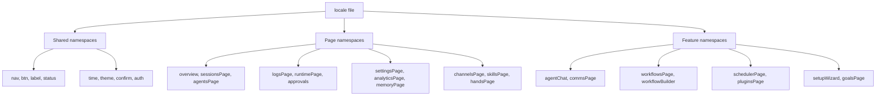
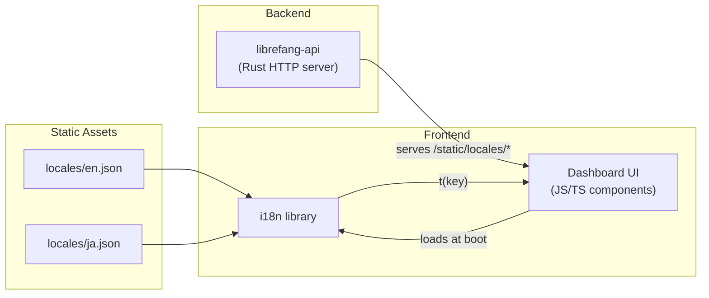

# Other — librefang-api-static

# librefang-api-static — Static Locale Assets

## Purpose

This module holds the **internationalization (i18n) locale files** for the LibreFang web dashboard. Every user-visible string in the UI — navigation labels, button text, error messages, tooltips, page headings, confirmation dialogs, toast notifications — is defined here rather than hardcoded in components. The frontend loads the appropriate JSON file at runtime based on the user's language preference.

Currently shipped languages:

| File | Language |
|------|----------|
| `locales/en.json` | English (default) |
| `locales/ja.json` | Japanese |

---

## Structure

Each locale file is a single flat-ish JSON object with **top-level namespace keys** that map 1:1 to dashboard pages, feature areas, or shared UI categories. This keeps translations discoverable and avoids deeply nested paths.

### Top-level namespaces

| Namespace | Scope |
|-----------|-------|
| `nav` | Sidebar and top-level navigation labels |
| `status` | Connection/status indicator strings |
| `btn` | Shared button labels (Refresh, Save, Delete, etc.) |
| `label` | Generic field labels (Status, Name, Key, Value) |
| `auth` | API key gate screen |
| `page` | Page title overrides |
| `health` | Health check status text |
| `stat` | Stat card titles (Agents Running, Tokens Used, etc.) |
| `card` | Card headings on the overview page |
| `agents` | Agent list area (sidebar) |
| `detail` | Agent detail tabs (Info, Files, Config) |
| `mode` | Agent mode labels (Observe, Assist, Full) |
| `category` | Agent category filters |
| `profile` | Tool profile descriptions (Minimal → Full) |
| `template` | Agent template names and descriptions (10 built-in) |
| `time` | Relative time strings |
| `onboarding` | First-run onboarding banner |
| `provider` | LLM provider setup UI |
| `overview` | Dashboard overview page |
| `security` | Security feature short names |
| `agentChat` | Chat interface — commands, toasts, system messages, tips |
| `sessionsPage` | Sessions and memory browser |
| `agentsPage` | Agent creation and management |
| `approvals` | Execution approval queue |
| `logsPage` | Live logs and audit trail |
| `runtimePage` | Runtime info display |
| `settingsPage` | Full settings panel — providers, models, tools, security, network, budget, proactive memory, migration |
| `workflowsPage` | Workflow list and execution |
| `workflowBuilder` | Visual drag-and-drop workflow builder |
| `schedulerPage` | Cron jobs and event triggers |
| `channelsPage` | Messaging channel configuration |
| `skillsPage` | Skills marketplace, MCP servers, quick-start skills |
| `handsPage` | Curated autonomous capability packages |
| `pluginsPage` | Plugin management |
| `commsPage` | Inter-agent communication |
| `setupWizard` | First-run setup wizard (5 steps) |
| `goalsPage` | Goal tracking with sub-goals |
| `analyticsPage` | Usage analytics and cost breakdown |
| `memoryPage` | Proactive memory browser |
| `theme` | Theme switcher labels |
| `sidebar` | Sidebar shortcut hints |
| `confirm` | Shared confirm dialog buttons |

Additionally, several **extension namespaces** (suffixed `2`) provide supplementary keys used by newer or refactored components: `agentChat2`, `settingsPage2`, `agentsPage2`, `schedulerPage2`, `analyticsPage2`, `memoryPage2`, `setupWizard2`.

---

## String Interpolation

Locale values use `{curly brace}` placeholders for dynamic data. These are resolved at render time by the frontend's i18n library.

| Pattern | Example Key | Example Output |
|---------|-------------|----------------|
| `{count}` | `"sessionsPage.keysCount": "{count} key(s)"` | `"12 key(s)"` |
| `{name}` | `"agentsPage.agentSpawned": "Agent \"{name}\" spawned"` | `Agent "researcher" spawned` |
| `{provider}` | `"overview.providerReady": "{provider} - ready"` | `"anthropic - ready"` |
| `{model}` | `"agentChat.toast.modelSwitched": "Switched to {model}"` | `"Switched to claude-3-opus"` |
| `{message}` | `"agentChat.errorPrefix": "Error: {message}"` | `"Error: connection refused"` |
| Multiple | `"overview.providersConfigured": "{configured}/{total} configured"` | `"3/12 configured"` |
| `{old}` / `{new}` | `"agentChat.memoryConflict"` | Memory conflict resolution display |

There is no pluralization framework in the JSON itself — the UI layer handles that logic or uses generic forms like `"key(s)"`.

---

## Key Naming Conventions

| Suffix | Meaning |
|--------|---------|
| `Placeholder` | Input field placeholder text |
| `Desc` / `Description` | Longer explanatory text below a heading |
| `Title` | Dialog or section title |
| `Confirm` | Confirmation dialog body text |
| `Toast` | Transient notification message |
| `Failed` | Error message for a failed action |
| `Short` | Abbreviated form for compact displays |
| `Prefix` / `Suffix` | Text fragments composed with other strings |
| `Tab` | Tab label within a multi-tab view |

Error toast keys follow the pattern `<namespace>.<action>Failed` (e.g., `agentsPage.spawnAgentFailed`, `sessionsPage.deleteSessionFailed`).

---

## Adding a New Language

1. **Copy `en.json`** to `locales/<locale-code>.json` (e.g., `fr.json`).
2. **Translate all values** — leave the keys identical. Do not add or remove keys; the English file is the canonical schema.
3. **Preserve `{placeholder}` tokens** exactly as they appear. A missing placeholder will cause a runtime interpolation error.
4. **Preserve inline Markdown** where present (e.g., `agentChat.welcomeTips` contains `**bold**` and backtick-wrapped commands).
5. **Register the locale** in the frontend's i18n configuration (outside this static module) so the app knows to offer it.

### Validation checklist

- [ ] Same key count as `en.json`
- [ ] All `{placeholder}` tokens present in every translated value
- [ ] No untranslated keys left as English (grep for common English words if translating to a non-Latin script)
- [ ] JSON is valid (no trailing commas, properly escaped quotes)

---

## Coverage by Dashboard Area

The locale files cover the complete UI surface:

- **22 navigation items** (`nav.*`)
- **10 agent templates** with name + description (`template.*`)
- **9 tool profiles** with label + description (`profile.*`)
- **15 security features** with name, description, and threat/hint text (`settingsPage.coreFeatures.*`, `configurableFeatures.*`, `monitoringFeatures.*`)
- **18 slash commands** with descriptions (`agentChat.cmd.*`)
- **20+ cron preset labels** (`schedulerPage.cron.*`)
- **18 skill categories** (`skillsPage.category.*`)
- **20+ activity action types** (`overview.action*`)
- **Full setup wizard** across 5 steps (`setupWizard.*`)

---

## Relationship to the Rest of the Codebase

The Rust API server (`librefang-api`) serves these JSON files as static assets under `/static/locales/`. The frontend fetches the appropriate file during initialization, registers it with its i18n adapter, and all components reference strings via translation keys (e.g., `t('agentsPage.createAgent')`). No backend code parses these files — they are pure static assets consumed entirely by the client.