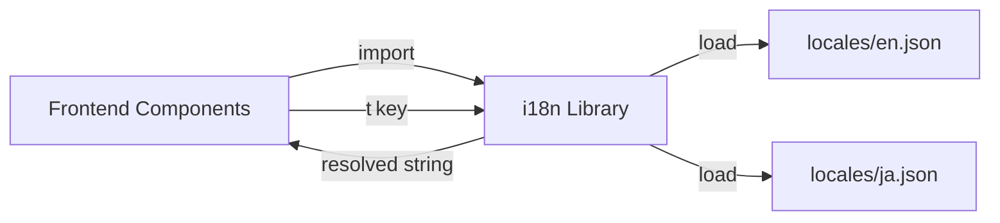

# Other — librefang-api-static

# librefang-api-static — Static Locale Assets

## Overview

This module provides the internationalization (i18n) translation files for the LibreFang web dashboard. It contains static JSON locale files that map hierarchical translation keys to human-readable strings in each supported language.

The frontend loads these files at runtime based on the user's language preference, and all UI labels, messages, error strings, button text, and toast notifications resolve through this key→value lookup system.

## Supported Languages

| File | Language | Code |
|------|----------|------|
| `locales/en.json` | English | `en` |
| `locales/ja.json` | Japanese | `ja` |

## Key Structure

All locale files share an identical key hierarchy. Every top-level key corresponds to a UI feature area, page, or shared component. The structure uses dot-notation access in the frontend (e.g., `agentChat.cmd.help` → `"Show available commands"`).

### Top-Level Sections

| Key | Scope | Purpose |
|-----|-------|---------|
| `nav` | Sidebar navigation | Labels for all dashboard pages (Overview, Agents, Sessions, Logs, etc.) |
| `status` | Shared status indicators | Connection states: connecting, reconnecting, disconnected, ready, error |
| `btn` | Shared buttons | Common action labels: Refresh, Save, Delete, Cancel, Copy, etc. |
| `label` | Shared field labels | Generic form labels: Status, Version, Provider, Model, Name, Key, Value |
| `auth` | API key gate | Title, description, placeholder, and hint for the authentication screen |
| `page` | Page titles | Short page identifiers used in breadcrumbs and headers |
| `health` | Health indicators | Healthy / Unreachable system states |
| `stat` | Overview statistics | Dashboard stat card labels (Agents Running, Tokens Used, Total Cost, etc.) |
| `card` | Overview cards | Card titles on the dashboard (Getting Started, LLM Providers, System Health) |
| `agents` | Agent list panel | Sidebar and list labels (New Agent, Stop All, Your Agents) |
| `detail` | Agent detail panel | Info/Files/Config tabs, tool filters, fallbacks, clone, and clear history |
| `mode` | Agent modes | Observe / Assist / Full |
| `category` | Agent categories | All, General, Development, Research, Writing, Business |
| `profile` | Tool profiles | Nine profiles (Minimal through Full) each with `label` and `desc` |
| `template` | Agent templates | Ten built-in agent templates (GeneralAssistant, CodeHelper, Researcher, etc.) |
| `time` | Relative timestamps | `now`, `{count}s ago`, `{count}m ago`, `{count}h ago`, `{count}d ago` |
| `onboarding` | First-run banner | Welcome message, Launch Setup Wizard, Configure Manually, Dismiss |
| `provider` | Provider setup | Banner text, tier labels, Ollama detection, activation messages |
| `overview` | Dashboard page | All overview cards, quick actions, recent activity, provider states, setup steps |
| `security` | Security subsystems | Named security features (Merkle Audit, Taint Tracking, WASM Sandbox, etc.) |
| `agentChat` | Chat interface | Full chat UX including sessions, commands, toasts, system messages, tool states |
| `sessionsPage` | Sessions page | Session list, agent memory store, CRUD operations |
| `agentsPage` | Agents page | Agent creation (wizard + raw TOML), spawning, stopping, archetype/vibe selectors |
| `approvals` | Approvals page | Pending/approved/rejected filters, approve/reject actions |
| `logsPage` | Logs page | Live log stream, audit trail, chain verification, pause/resume/clear/export |
| `runtimePage` | Runtime page | System info, providers, models, latency display, time formatting |
| `settingsPage` | Settings page | Providers, Models, Tools, Security, Network, Budget, Proactive Memory, Migration |
| `workflowsPage` | Workflows page | Workflow CRUD, step types (sequential, fan-out, conditional, loop), execution |
| `workflowBuilder` | Visual workflow editor | Node palette, canvas interactions, TOML export, node types (agent step, condition, loop, etc.) |
| `schedulerPage` | Scheduler page | Cron jobs, event triggers, run history, cron presets and formatting |
| `channelsPage` | Channels page | Channel setup wizard steps, WhatsApp QR flow, status tracking, categories |
| `skillsPage` | Skills page | Installed skills, ClawHub browsing, MCP servers, quick-start skills, security scanning |
| `handsPage` | Hands page | Hand activation/deactivation, dependency installation, setup wizard, browser state |
| `pluginsPage` | Plugins page | Plugin registry, install from registry/local/git, scaffold new plugin |
| `commsPage` | Agent comms page | Inter-agent messaging, task posting, topology, live event feed |
| `setupWizard` | Setup wizard | 6-step wizard (Welcome → Provider → Agent → Try It → Channel → Done) |
| `goalsPage` | Goals page | Goal CRUD, sub-goals, status tracking (Pending, In Progress, Completed, Cancelled) |
| `analyticsPage` | Analytics page | Token/cost summary, breakdown by model and agent, daily cost chart |
| `memoryPage` | Memory page | Proactive memory viewer, search, CRUD, version history |
| `theme` | Theme selector | Light / Dark / System |
| `sidebar` | Sidebar footer | Keyboard shortcut hints |
| `agentChat2` | Chat toolbar | Focus mode, model switcher, vision/tools toggles |
| `settingsPage2` | Settings extras | Proactive memory master toggle |
| `agentsPage2` | Agent form extras | Model placeholder text |
| `schedulerPage2` | Scheduler extras | Trigger delete label |
| `analyticsPage2` | Analytics extras | Total label |
| `memoryPage2` | Memory extras | Bulk delete label |
| `confirm` | Confirmation dialog | Confirm / Cancel buttons |
| `setupWizard2` | Wizard extras | Provider configure heading |

## Interpolation

Many strings contain `{variable}` placeholders that the frontend substitutes at render time. The interpolation syntax follows a simple `{key}` pattern:

```json
"secondsAgo": "{count}s ago"
"providerModels": "{count} model(s) available"
"agentStopped": "Agent \"{name}\" stopped"
```

The number and names of variables per key are consistent across all locale files.

## Adding a New Language

1. Copy `locales/en.json` to `locales/<code>.json` (e.g., `locales/fr.json`)
2. Translate all values — do **not** modify any keys
3. Preserve all `{variable}` placeholders exactly as they appear
4. Register the new locale in the frontend's i18n configuration

## Adding New Translation Keys

1. Add the key to **every** locale file under the same path
2. Group new keys under the appropriate top-level section — create a new section if the feature is distinct enough
3. Use the `*2` naming convention (e.g., `newPage2`) for supplementary keys added to an existing page, following the pattern already in use
4. For feature subsections with repeated structure, use nested objects (see `profile`, `template`, `agentsPage.archetype`, `agentsPage.vibe`)

## Conventions

- **Button labels** go under `btn.*` if reused globally, or under the page section if page-specific
- **Toast/notification messages** are nested under `<section>.toast.*` or inline with a descriptive key
- **Error messages** follow the pattern `"failedAction": "Failed to do X: {message}"` or `"loadError": "Could not load X."`
- **Confirmation dialogs** include `<action>Title` and `<action>Confirm` pairs
- **Enum/status labels** are grouped under `<section>.status.*`, `<section>.filter.*`, or `<section>.state.*`
- **Descriptions** use keys ending in `Desc` (e.g., `proactiveMemoryDesc`, `noWorkflowsDesc`)

## Relationship to the Codebase



The frontend framework (typically Svelte in the LibreFang stack) imports an i18n library that loads these JSON files. Components call a translation function (commonly `t("agentChat.cmd.help")`) which resolves to the correct string based on the active locale. The static module has no runtime code — it is pure data consumed by the frontend build.