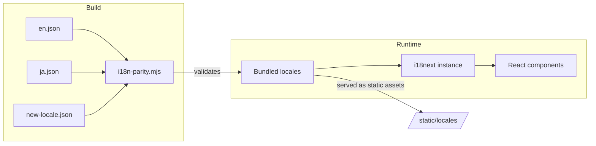

# Other — librefang-api-static

# Static Locale Files (`librefang-api/static/locales/`)

## Purpose

This directory contains the internationalization (i18n) translation catalogs for the LibreFang web dashboard. The JSON files provide every user-facing string rendered by the React frontend, organized into nested key namespaces that mirror the dashboard's page and component hierarchy.

The catalog is consumed by the dashboard's i18n library (likely `react-i18next` or equivalent) at build time and runtime. Locale files are served as static assets under `/static/locales/`.

## Supported Languages

| File | Language | Code |
|------|----------|------|
| `en.json` | English (default) | `en` |
| `ja.json` | Japanese | `ja` |

## String Interpolation

Translation values use `{variableName}` placeholders for dynamic content. For example:

```json
"stepsCompleted": "{count} of 5 steps completed"
```

The frontend passes a `count` value at render time. The Japanese equivalent:

```json
"stepsCompleted": "5 ステップ中 {count} ステップ完了"
```

All interpolation placeholders must have identical names across every locale file.

## Key Namespace Structure

The root keys group translations by feature area. Each namespace corresponds to a dashboard page, a shared UI concern, or a reusable component:

```
├── nav              Sidebar navigation labels
├── status           Connection status indicators
├── btn              Universal button labels (Refresh, Save, Delete, etc.)
├── label            Generic field labels (Status, Version, Provider, etc.)
├── auth             API key authentication prompt
├── page             Page-level titles
├── health           Health check labels
├── stat             Dashboard stat card labels
├── card             Dashboard card titles
├── agents           Agent list page (sidebar labels)
├── detail           Agent detail panel (Info, Files, Config tabs)
├── mode             Agent operation modes
├── category         Agent categories
├── profile          Tool profile definitions (minimal, coding, full, etc.)
├── template         10 built-in agent templates
├── time             Relative time formatting
├── onboarding       First-run onboarding banner
├── provider         LLM provider configuration UI
├── overview         Overview dashboard page
├── security         Security feature display names
├── agentChat        Chat interface, slash commands, toast messages
├── sessionsPage     Sessions list and agent memory store
├── agentsPage       Agent creation wizard, spawning, config editing
├── approvals        Execution approval workflow
├── logsPage         Live logs and audit trail
├── runtimePage      Runtime information display
├── settingsPage     Settings tabs (providers, models, tools, security, network, budget, proactive memory, migration)
├── workflowsPage    Workflow list and execution
├── workflowBuilder  Visual drag-and-drop workflow builder
├── schedulerPage    Cron jobs, event triggers, run history
├── channelsPage     Messaging channel configuration
├── skillsPage       Skills browser, ClawHub integration, MCP servers
├── handsPage        Hands capability packages
├── pluginsPage      Plugin registry and management
├── commsPage        Inter-agent communication
├── setupWizard      Guided setup wizard (5 steps)
├── goalsPage        Goals and sub-goals
├── analyticsPage    Usage analytics and cost breakdown
├── memoryPage       Proactive memory browser
├── theme            Theme selector labels
├── sidebar          Sidebar shortcut hints
├── confirm          Generic confirm dialog
├── *Page2           Supplementary keys for v2 UI variants
└── setupWizard2     Supplementary wizard keys
```

### Deeply Nested Sections

Some namespaces contain multiple nesting levels. Notable examples:

**`settingsPage.coreFeatures`** — Descriptions of the 8 core security protections that cannot be disabled:
- `path_traversal`, `ssrf_protection`, `capability_system`, `privilege_escalation_prevention`, `subprocess_isolation`, `security_headers`, `wire_hmac_auth`, `request_id_tracking`
- Each has `name`, `description`, and `threat` sub-keys.

**`settingsPage.configurableFeatures`** — Tunable security controls:
- `rate_limiter`, `websocket_limits`, `wasm_sandbox`, `auth`
- Each has `name`, `description`, and `hint`.

**`agentChat.cmd`** — Slash command descriptions exposed to users:
- `help`, `agents`, `new`, `reboot`, `compact`, `model`, `stop`, `usage`, `think`, `context`, `verbose`, `queue`, `status`, `clear`, `exit`, `budget`, `peers`, `a2a`

**`template`** — 10 agent template definitions with `name` and `desc`:
- `GeneralAssistant`, `CodeHelper`, `Researcher`, `Writer`, `DataAnalyst`, `DevOpsEngineer`, `CustomerSupport`, `Tutor`, `APIDesigner`, `MeetingNotes`

**`schedulerPage.cron`** — Human-readable cron preset labels (22 presets).

## Parity Validation

The build includes a parity-check script at `dashboard/scripts/i18n-parity.mjs` that validates locale files share identical key structures. This prevents:

- Missing keys in a non-English locale causing fallback-to-English rendering bugs
- Stale keys left over after removing a UI feature
- Placeholder name mismatches between locales

To run the check:

```bash
node dashboard/scripts/i18n-parity.mjs
```

## Adding a New Locale

1. Copy `en.json` to a new file named with the target language code (e.g., `fr.json`).
2. Translate all string values while preserving:
   - The exact JSON key hierarchy
   - All `{placeholder}` names unchanged
   - Markdown formatting (`**bold**`, backtick code, etc.)
3. Register the new locale in the dashboard's i18n configuration.
4. Run the parity script to verify key alignment.

## Adding New Translation Keys

When adding a UI feature that needs new strings:

1. Add keys under the appropriate namespace in `en.json` first.
2. Add matching keys (translated or copied) in every other locale file.
3. Run the parity script before committing.
4. Use the namespace pattern `{pageName}.{subSection}.{field}` to keep keys organized.

Keys with a `2` suffix (e.g., `agentsPage2`, `settingsPage2`) are supplementary additions for updated UI variants — they extend rather than replace the base namespace keys.

## Architecture Diagram



## Key Count Reference

The English catalog contains approximately **1,100+ translation keys** across all namespaces. The largest namespaces by key count are:

| Namespace | Purpose |
|-----------|---------|
| `settingsPage` | ~350 keys — providers, models, tools, security, budget, migration |
| `agentChat` | ~140 keys — chat UI, commands, toasts, system messages |
| `skillsPage` | ~80 keys — ClawHub browser, MCP, quick-start skills |
| `channelsPage` | ~60 keys — channel setup flows, WhatsApp QR, status |
| `agentsPage` | ~60 keys — agent creation, config, spawning |
| `schedulerPage` | ~80 keys — cron jobs, triggers, presets, history |
| `setupWizard` | ~80 keys — guided 5-step wizard |