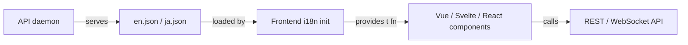

# Other — librefang-api-static

# librefang-api/static/locales

Static internationalization (i18n) locale files for the LibreFang web dashboard. These JSON files provide every user-facing string used across the UI, organized by page and component.

## Purpose

The locales directory contains translation catalogs consumed by the frontend's i18n layer. Each file is a flat-to-nested JSON object keyed by logical section (page, component, or feature), with leaf values being the translated strings. The frontend resolves keys at render time—no server-side rendering of text is involved.

Currently provided locales:

| File | Language |
|------|----------|
| `en.json` | English (default) |
| `ja.json` | Japanese |

## Key Structure

Keys follow a `section.subsection.leaf` hierarchy that mirrors the UI's component tree. Top-level sections correspond to pages or major UI areas:

```
nav          → sidebar / top-level navigation labels
status       → connection status indicators
btn          → shared button labels
label        → shared field labels
auth         → API key authentication prompt
health       → health check status text
stat         → dashboard stat card labels
card         → dashboard card titles
agents       → agents list actions
detail       → agent detail panel fields
mode         → agent mode labels (observe / assist / full)
category     → agent categories
profile      → tool profile labels and descriptions
template     → built-in agent template names/descriptions
time         → relative time formatting
onboarding   → first-run onboarding banner
provider     → LLM provider setup UI
overview     → overview/dashboard page
security     → security feature labels
agentChat    → chat interface (largest section)
sessionsPage → sessions and memory browser
agentsPage   → agent creation and management
approvals    → execution approval queue
logsPage     → live logs and audit trail
runtimePage  → runtime information display
settingsPage → settings panels (providers, models, tools, security, network, budget, memory, migration)
workflowsPage → workflow list and execution
workflowBuilder → visual workflow builder
schedulerPage → cron jobs and event triggers
channelsPage → messaging channel setup
skillsPage   → skills and MCP servers
handsPage    → curated capability packages
pluginsPage  → plugin management
commsPage    → inter-agent communication
setupWizard  → guided setup wizard
goalsPage    → goals tracking
analyticsPage → usage analytics and cost tracking
memoryPage   → proactive memory browser
theme        → theme selector labels
sidebar      → sidebar hints
confirm      → shared confirmation dialog
```

Numbered suffixes (e.g., `agentsPage2`, `settingsPage2`, `analyticsPage2`) denote secondary or supplemental keys for the same feature area—typically used when a newer UI revision added keys that should not overwrite existing ones during a transition period.

## Interpolation

Strings use `{placeholder}` syntax for dynamic values. The frontend i18n library (typically something like `t('key', { count: 5 })`) substitutes these at render time.

Common placeholders:

| Placeholder | Used in | Example |
|---|---|---|
| `{count}` | Counters, pagination | `"{count} agent(s) running"` |
| `{name}` | Entity names | `"Agent \"{name}\" stopped"` |
| `{message}` | Error propagation | `"Failed: {message}"` |
| `{provider}` | Provider names | `"{provider} - ready"` |
| `{model}` | Model identifiers | `"Switched to {model}"` |
| `{time}` | Timestamps | `"Last synced: {time}"` |
| `{filtered}`, `{total}` | Search/filter results | `"{filtered} of {total}"` |
| `{configured}`, `{total}` | Setup progress | `"{configured}/{total} configured"` |
| `{old}`, `{new}` | Memory conflict display | `"Previously '{old}', now '{new}'"` |
| `{level}` | Thinking level | `"Thinking ({level})..."` |
| `{tool}` | Tool names | `"Using {tool}..."` |
| `{key}` | Memory key names | `"Delete key \"{key}\"?"` |
| `{file}` | File names | `"{file} saved"` |

There is no pluralization framework embedded in these files—English uses explicit forms like `"agent(s)"` or `"{count} key(s)"`. The Japanese locale uses counters like `"{count} 個のキー"`.

## Adding a New Locale

1. Copy `en.json` to a new file named with the appropriate [BCP 47](https://tools.ietf.org/html/bcp47) tag (e.g., `fr.json`, `zh-CN.json`, `ko.json`).
2. Translate all leaf string values. Do **not** translate keys or structural nesting.
3. Preserve all `{placeholder}` tokens exactly as they appear—these are resolved at runtime.
4. Register the new locale in the frontend's i18n configuration (outside this directory).

Example minimal diff for `fr.json`:

```json
{
  "nav": {
    "chat": "Discussion",
    "agents": "Agents",
    ...
  }
}
```

## Adding New UI Strings

When adding a new feature to the frontend:

1. Add the key under the appropriate top-level section. If the feature is a new page, create a new top-level section (e.g., `"myNewPage": { ... }`).
2. Use the same key path in **all** locale files. Missing keys fall back to the `en.json` value in most i18n libraries, but maintaining parity avoids blank strings.
3. Use `{placeholder}` interpolation rather than string concatenation.
4. For toast/notification messages, include both a success and failure variant:

```json
"someAction": "Action completed",
"someActionFailed": "Action failed: {message}"
```

## Key Naming Conventions

| Pattern | Meaning | Example |
|---|---|---|
| `*Title` | Dialog or section heading | `"deleteScheduleTitle"` |
| `*Confirm` | Confirmation prompt body | `"stopAgentConfirm"` |
| `*Desc` | Description text | `"proactiveMemoryDesc"` |
| `*Placeholder` | Input placeholder text | `"agentNamePlaceholder"` |
| `*Toast` | Toast notification text | `"approvedToast"` |
| `*Failed` | Error message | `"saveConfigFailed"` |
| `load*Failed` | Data load error | `"loadAgentsFailed"` |
| `tab*` | Tab label | `"budgetTab"` |
| `cmd.*` | Slash command description | `"cmd.help"` |

## Relationship to the Codebase



- The API daemon (Rust `librefang-api`) serves these files as static assets under a `/locales/` or equivalent route.
- The frontend's i18n layer fetches the appropriate JSON file based on the user's language preference (browser locale, stored preference, or explicit selection).
- Components call `t('section.key', { param: value })` to resolve strings. There is no server-side string interpolation.
- All user-facing text in the dashboard should originate from these files. The only hardcoded English that may appear in the frontend is developer-oriented console output or debug labels.

## Maintenance Notes

- **Key parity**: After editing `en.json`, ensure `ja.json` (and any future locales) receive corresponding entries. A CI check or pre-commit hook comparing key sets is recommended.
- **No executable content**: These files contain only static strings. No JavaScript, HTML, or template logic.
- **Size**: `en.json` contains approximately 1,000+ unique keys. Keep sections well-organized to avoid key collisions.
- **Numbered section variants** (`settingsPage2`, `agentsPage2`, etc.) are temporary migration artifacts. They should be merged into the primary section once the UI transition is complete, then removed.