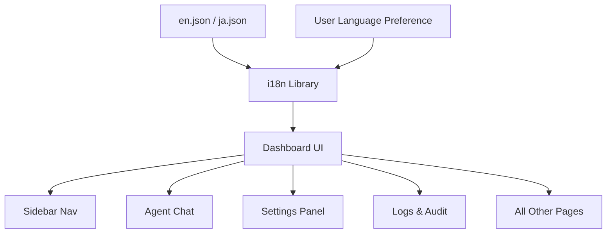

# Other — librefang-api-static

# librefang-api-static — Static Frontend Localization

## Purpose

This module provides the internationalization (i18n) locale data for the LibreFang web dashboard. It contains JSON translation files loaded by the frontend at runtime to render all user-facing text in the appropriate language.

There is no executable code in this module — it is pure static data consumed by the dashboard's i18n layer.

## File Layout

```
librefang-api/static/locales/
├── en.json    # Primary locale (English) — canonical source of truth
└── ja.json    # Japanese translation (partial)
```

Additional locales follow the same pattern: one `<code>.json` file per language, keyed by ISO 639-1 code.

## How It Connects to the Codebase

The locale files sit inside the API server's static asset tree. When the browser loads the dashboard, the frontend i18n library (typically loaded via `librefang-api/static/js/`) fetches the appropriate JSON file based on the user's language preference and replaces all translatable strings in the UI.

The API server serves these files as static content — no backend processing occurs.

## Translation Key Structure

All keys are organized hierarchically by page or functional area. The top-level namespace corresponds to a UI domain:

| Namespace | Scope |
|---|---|
| `nav` | Sidebar/top navigation labels |
| `status` | Connection and system status indicators |
| `btn` | Reusable button labels |
| `label` | Generic form and column labels |
| `auth` | API key authentication gate |
| `page` | Page title overrides |
| `health` | Health-check status text |
| `stat` | Dashboard statistic card headers |
| `card` | Card titles on the overview page |
| `agents` | Agent list prompts |
| `detail` | Agent detail panel (info, files, config tabs) |
| `mode` | Agent mode labels (observe, assist, full) |
| `category` | Filter categories |
| `profile` | Tool profile names and descriptions |
| `template` | Built-in agent template metadata |
| `time` | Relative time formatting |
| `onboarding` | First-run onboarding banner |
| `provider` | LLM provider setup UI |
| `overview` | Dashboard overview page |
| `security` | Security feature labels |
| `agentChat` | Chat interface — messages, commands, toasts |
| `sessionsPage` | Session management page |
| `agentsPage` | Agent creation and management page |
| `approvals` | Execution approval workflow |
| `logsPage` | Live logs and audit trail |
| `runtimePage` | Runtime information page |
| `settingsPage` | Full settings panel (providers, models, tools, security, network, budget, memory, migration) |
| `workflowsPage` | Workflow list and execution |
| `workflowBuilder` | Visual workflow builder |
| `schedulerPage` | Cron jobs and event triggers |
| `channelsPage` | Messaging channel configuration |
| `skillsPage` | Skills marketplace and MCP servers |
| `handsPage` | Hands — curated autonomous capability packages |
| `pluginsPage` | Plugin management |
| `commsPage` | Inter-agent communication |
| `setupWizard` | First-run setup wizard (multi-step) |
| `goalsPage` | Goals and sub-goals |
| `analyticsPage` | Usage analytics and cost tracking |
| `memoryPage` | Proactive memory browser |
| `theme` | Theme switcher labels |
| `sidebar` | Sidebar shortcut hints |
| `agentChat2`, `settingsPage2`, etc. | Supplementary keys for secondary UI states |
| `confirm` | Generic confirm/cancel dialog |

### Interpolation

Strings use `{variable}` placeholders for dynamic values. The frontend i18n library replaces these at render time. Examples:

```json
"minutesAgo": "{count}m ago"
"providerConnected": "{provider} connected ({latency}ms)"
"entriesCount": "{filtered} of {total} entries"
```

### Deep Nesting

Some namespaces nest two or three levels deep to scope related keys:

```json
"agentChat": {
  "cmd": {
    "help": "Show available commands",
    "model": "Show or switch model (/model [name])"
  },
  "toast": {
    "modelSwitched": "Switched to {model}"
  },
  "sys": {
    "thinkStatus": "Extended thinking"
  }
}
```



## Adding a New Locale

1. Copy `en.json` to a new file named `<iso-code>.json` (e.g., `de.json`).
2. Translate all string values while preserving keys and `{variable}` placeholders exactly.
3. Place the file in `librefang-api/static/locales/`.
4. Register the locale in the frontend's i18n configuration (typically in the dashboard's JavaScript initialization).

## Adding New Keys

When new UI text is needed:

1. Add the key to `en.json` first — it is the canonical source.
2. Mirror the key path in every other locale file (even if the translation is pending, include the key with the English value as a fallback).
3. Use the key in the frontend via the i18n library's lookup function (e.g., `t('agentsPage.spawnAgentFailed')`).

## Key Naming Conventions

- **camelCase** for all key names.
- **PascalCase** reserved for agent template IDs (e.g., `GeneralAssistant`, `DevOpsEngineer`).
- Toast/notification messages live under a `toast` sub-namespace within their page namespace.
- Error messages typically include a `{message}` placeholder for the backend error string.
- Confirmation dialogs are paired as `<action>Title` / `<action>Confirm` (e.g., `deleteSessionTitle`, `deleteSessionConfirm`).

## Notable Content Areas

### Agent Templates (`template.*`)

Ten built-in agent templates ship with the dashboard. Each has a `name` and `desc` key:

- `GeneralAssistant`, `CodeHelper`, `Researcher`, `Writer`, `DataAnalyst`, `DevOpsEngineer`, `CustomerSupport`, `Tutor`, `APIDesigner`, `MeetingNotes`

### Chat Commands (`agentChat.cmd.*`)

All slash commands available in the chat interface are documented here, including `/think`, `/model`, `/compact`, `/reboot`, `/budget`, `/peers`, and `/a2a`.

### Security Features (`settingsPage.coreFeatures.*`, `configurableFeatures.*`, `monitoringFeatures.*`)

The settings page enumerates all 15 security features with their names, descriptions, threats prevented, and (where applicable) tuning hints. This is the single source of truth for the security documentation displayed in the UI.

### Time Formatting (`time.*`)

Relative timestamps use `{count}` interpolation: `secondsAgo`, `minutesAgo`, `hoursAgo`, `daysAgo`, plus `now`.

## Maintenance Notes

- The Japanese locale (`ja.json`) is a partial translation — many later-added keys (especially under `settingsPage.securityDependency`, `channelsPage`, and later pages) may still carry English values or be truncated.
- When the source file is truncated (as seen in the provided `ja.json`), the i18n layer falls back to the `en.json` value for any missing key.
- There are no build steps or compilation for these files — they are served as-is by the API server's static file handler.