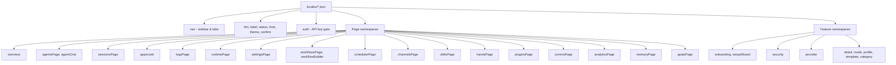

# Other — librefang-api-static

# Static Locale Files — `librefang-api/static/locales/`

## Purpose

This directory holds the internationalization (i18n) translation catalogs for the LibreFang dashboard. Each JSON file provides a complete set of user-facing strings for one language, organized by page and feature area. The React frontend loads the appropriate catalog at runtime based on the user's locale preference and interpolates values into template strings.

## Supported Languages

| File | Language |
|------|----------|
| `en.json` | English (default) |
| `ja.json` | Japanese |

Adding a new language requires creating a new `<locale>.json` file with the same key structure. A parity-check script (`dashboard/scripts/i18n-parity.mjs`) validates that all locale files share the same key set.

## How It Connects to the Codebase

```
locales/en.json ──► i18n-4qyNqnlA.js ──► React components (all pages)
                   (i18next runtime)
```

The dashboard's i18n layer (powered by i18next) loads these JSON files as translation bundles. Every page component calls the `t()` function with a dotted key path (e.g., `t('agentsPage.spawnAgent')`) to resolve the localized string. This means every user-visible label, toast message, placeholder, and error string flows through these files.

## Key Structure

Translation keys are organized into top-level namespaces that correspond to dashboard pages, shared UI elements, and cross-cutting concerns:


```mermaid
graph TD
    Root[locales/*.json] --> Nav[nav - sidebar & tabs]
    Root --> Shared[btn, label, status, time, theme, confirm]
    Root --> Auth[auth - API key gate]
    Root --> Pages[Page namespaces]
    Root --> Features[Feature namespaces]
    
    Pages --> Overview[overview]
    Pages --> Agents[agentsPage, agentChat]
    Pages --> Sessions[sessionsPage]
    Pages --> Approvals[approvals]
    Pages --> Logs[logsPage]
    Pages --> Runtime[runtimePage]
    Pages --> Settings[settingsPage]
    Pages --> Workflows[workflowsPage, workflowBuilder]
    Pages --> Scheduler[schedulerPage]
    Pages --> Channels[channelsPage]
    Pages --> Skills[skillsPage]
    Pages --> Hands[handsPage]
    Pages --> Plugins[pluginsPage]
    Pages --> Comms[commsPage]
    Pages --> Analytics[analyticsPage]
    Pages --> Memory[memoryPage]
    Pages --> Goals[goalsPage]
    
    Features --> Onboarding[onboarding, setupWizard]
    Features --> Security[security]
    Features --> Provider[provider]
    Features --> Config[detail, mode, profile, template, category]
```

### Namespace Reference

| Namespace | Scope | Key count (approx.) | Description |
|-----------|-------|---------------------|-------------|
| `nav` | Global | 22 | Sidebar navigation labels |
| `btn` | Global | 17 | Shared button labels (save, delete, cancel, etc.) |
| `label` | Global | 10 | Generic field labels |
| `status` | Global | 6 | Connection/state indicator strings |
| `time` | Global | 5 | Relative time formats |
| `theme` | Global | 3 | Theme selector labels |
| `confirm` | Global | 2 | Confirmation dialog buttons |
| `auth` | Login gate | 4 | API key authentication screen |
| `onboarding` | First-run | 4 | Welcome banner actions |
| `setupWizard` | Setup flow | 80+ | Multi-step wizard (provider → agent → test → channel → done) |
| `overview` | Dashboard | 45+ | Overview cards, quick actions, recent activity |
| `provider` | LLM config | 10 | Provider setup banners and status |
| `agentsPage` | Agent management | 55+ | Agent creation, spawning, stopping, configuration |
| `agentChat` | Chat interface | 90+ | Messages, sessions, commands, tool status, toasts |
| `detail` | Agent detail panel | 25+ | Info/files/config tabs, tool filters |
| `mode` | Agent mode | 3 | Observe / Assist / Full |
| `category` | Agent category | 6 | General, Development, Research, etc. |
| `profile` | Tool profiles | 9 | Minimal through Full, each with label + description |
| `template` | Agent templates | 10 | Pre-built agent definitions (name + description) |
| `sessionsPage` | Session browser | 30+ | Session listing, memory key-value editing |
| `approvals` | Approval queue | 15+ | Pending/approved/rejected filters and actions |
| `logsPage` | Log viewer | 25+ | Live stream, audit trail, chain verification |
| `runtimePage` | Runtime info | 15+ | System stats, providers, models |
| `settingsPage` | Settings | 180+ | Providers, models, tools, security, network, budget, proactive memory, migration |
| `workflowsPage` | Workflows | 20+ | Workflow CRUD and execution |
| `workflowBuilder` | Visual builder | 35+ | Node palette, canvas controls, TOML export |
| `schedulerPage` | Scheduler | 80+ | Cron jobs, event triggers, run history, presets |
| `channelsPage` | Channel config | 45+ | Messaging channel setup (WhatsApp, Telegram, etc.) |
| `skillsPage` | Skills browser | 55+ | Installed skills, ClawHub search, MCP servers |
| `handsPage` | Hands packages | 45+ | Autonomous capability packages, activation flow |
| `pluginsPage` | Plugin manager | 20+ | Plugin install, registry, scaffolding |
| `commsPage` | Agent comms | 25+ | Inter-agent messaging, tasks, event feed |
| `analyticsPage` | Usage analytics | 30+ | Token counts, cost breakdown, daily charts |
| `memoryPage` | Proactive memory | 20+ | Memory CRUD, search, version history |
| `goalsPage` | Goal tracking | 20+ | Hierarchical goals with status and progress |
| `security` | Security summary | 9 | Security feature display names |

## String Interpolation

Many strings contain `{variable}` placeholders that the i18n runtime replaces with dynamic values. Examples:

```json
"stepsCompleted": "{count} of 5 steps completed"
"providerCoolingDown": "{provider} - cooling down (rate limited)"
"agentsStopped": "{count} agent(s) stopped"
"time.minutesAgo": "{count}m ago"
```

These are consumed via i18next's interpolation:

```typescript
t('overview.stepsCompleted', { count: 3 })
// → "3 of 5 steps completed"
```

## Adding or Modifying Translations

### Adding a new string

1. Add the key to `en.json` in the appropriate namespace.
2. Add the same key to every other locale file (`ja.json`, etc.).
3. Run the i18n parity script to verify no keys are missing:

```bash
node dashboard/scripts/i18n-parity.mjs
```

4. Reference the key in the React component using `t('namespace.key')`.

### Adding a new locale

1. Copy `en.json` to `<locale>.json` (e.g., `fr.json`).
2. Translate all string values while preserving the key structure exactly.
3. Register the new locale in the i18n configuration (typically in `src/i18n.ts` or equivalent).
4. Run the parity script to confirm key alignment.

### Adding a new page namespace

When a new dashboard page is created, its strings should live under a new top-level key matching the page name (e.g., `newPageName`). Follow the existing convention:

- **Loading states**: `loading`, `loadError`
- **CRUD toasts**: `created`, `createFailed`, `deleted`, `deleteFailed`
- **Filter/tab labels**: nested `filter.*` or `tab.*` objects
- **Status values**: nested `status.*` object
- **Confirmation dialogs**: `deleteXxxTitle`, `deleteXxxConfirm`

## Naming Conventions

- **camelCase** for all keys and sub-keys.
- **PascalCase** for template IDs that reference agent archetypes (e.g., `GeneralAssistant`, `CodeHelper`).
- **Toast messages** follow the pattern `<action><Result>`: `agentStopped`, `saveFailed`, `keyDeleted`.
- **Error keys** end with `Failed` or use `errorMessage` / `loadError` / `unknownError`.
- **Confirmation dialogs** use paired `xxxTitle` + `xxxConfirm` keys.
- **Pluralizable counts** accept a `{count}` interpolation parameter.

## Notes for Developers

- The `*Page2` namespaces (`agentsPage2`, `settingsPage2`, `schedulerPage2`, `analyticsPage2`, `memoryPage2`, `setupWizard2`) contain supplementary keys for UI revisions. These are not duplicate pages — they hold additional strings needed by updated component variants.
- The `agentChat.cmd` sub-object contains descriptions for all slash commands (`/help`, `/model`, `/think`, etc.). These are displayed in the command palette and help output.
- Security-related strings in `settingsPage.coreFeatures`, `configurableFeatures`, and `monitoringFeatures` include both a human-readable `description` and a `threat` or `hint` field used in the security dashboard.
- Cron preset labels in `schedulerPage.cron` cover common schedules from "every minute" to "first of month" and are displayed in the quick-pick UI.
- The `profile` namespace defines nine tool profiles (Minimal through Full), each with a `label` and `desc`. These are referenced when creating or configuring agents.