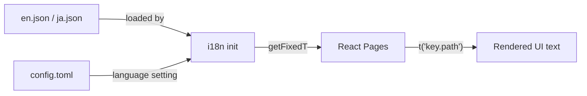

# Other — librefang-api-static

# librefang-api/static — Frontend Static Assets

## Overview

The `librefang-api/static/` directory holds static assets served by the LibreFang API's HTTP server. Currently it contains the **internationalization (i18n) locale files** that power all user-facing text in the LibreFang web dashboard.

```
static/
└── locales/
    ├── en.json    ← English (primary)
    └── ja.json    ← Japanese
```

These JSON files are consumed by the React frontend's i18n layer (`react/assets/i18n-4qyNqnlA.js`), which exposes a `getFixedT` function and `t()` / `off()` bindings that every page component uses to resolve translated strings at render time.

## Locale File Architecture


```mermaid
graph LR
    A["en.json / ja.json"] -->|loaded by| B[i18n init]
    B -->|getFixedT| C[React Pages]
    C -->|"t('key.path')"| D[Rendered UI text]
    E[config.toml] -->|language setting| B
```

Each locale file is a flat JSON object where top-level keys serve as **namespaces** that map 1:1 to dashboard pages or shared UI domains. The i18n library resolves keys via dot-path lookup (e.g. `t('agentChat.cmd.help')`).

## Namespace Reference

The following table lists every top-level key in the locale files, what it covers, and which pages consume it.

| Namespace | Scope | Primary Consumers |
|---|---|---|
| `nav` | Sidebar navigation labels | App shell, sidebar component |
| `status` | Connection/state indicators | Header, overview, any page with status badges |
| `btn` | Shared button labels (Refresh, Save, Delete, etc.) | Every page |
| `label` | Generic field labels (Status, Name, Key, etc.) | Forms, detail panels |
| `auth` | API key authentication screen | Login gate component |
| `page` | Page-level titles (subset) | Page headers |
| `health` | Health check labels | Overview, runtime |
| `stat` | Dashboard statistic card labels | Overview page |
| `card` | Dashboard card titles | Overview page |
| `agents` | Agent list/sidebar labels | Agents page, sidebar |
| `detail` | Agent detail panel (Info/Files/Config tabs) | Agent detail view |
| `mode` | Agent mode labels (Observe/Assist/Full) | Agent config |
| `category` | Filter categories | Agent templates |
| `profile` | Tool profile names and descriptions | Agent creation, settings |
| `template` | Built-in agent template names/descriptions | Agent creation wizard |
| `time` | Relative time formatting (e.g. `{count}m ago`) | Activity feeds, logs |
| `onboarding` | First-run onboarding banner | Overview page |
| `provider` | LLM provider setup strings | Provider configuration, overview |
| `overview` | Overview dashboard page | OverviewPage |
| `security` | Security feature short names | Overview, settings |
| `agentChat` | Chat interface (messages, commands, toasts) | ChatPage |
| `sessionsPage` | Session list and agent memory browser | SessionsPage |
| `agentsPage` | Agent creation and management | AgentsPage |
| `approvals` | Execution approval queue | ApprovalsPage |
| `logsPage` | Live logs and audit trail | LogsPage |
| `runtimePage` | Runtime info display | RuntimePage |
| `settingsPage` | Settings (providers, models, tools, security, network, budget, memory, migration) | SettingsPage |
| `workflowsPage` | Workflow list and execution | WorkflowsPage |
| `workflowBuilder` | Visual workflow builder canvas | WorkflowBuilderPage |
| `schedulerPage` | Cron jobs and event triggers | SchedulerPage |
| `channelsPage` | Messaging channel configuration | ChannelsPage |
| `skillsPage` | Skills and MCP server management | SkillsPage |
| `handsPage` | Hands (autonomous capability packages) | HandsPage |
| `pluginsPage` | Plugin management | PluginsPage |
| `commsPage` | Inter-agent communication | CommsPage |
| `setupWizard` | First-run setup wizard (5 steps) | SetupWizardPage |
| `goalsPage` | Goals and sub-goals | GoalsPage |
| `analyticsPage` | Usage analytics and cost tracking | AnalyticsPage |
| `memoryPage` | Proactive memory browser | MemoryPage |
| `theme` | Theme switcher labels (Light/Dark/System) | Theme toggle |
| `sidebar` | Sidebar keyboard shortcut hints | Sidebar |
| `agentChat2` | Additional chat UI labels (focus mode, vision) | ChatPage extended controls |
| `settingsPage2` | Supplementary settings labels | SettingsPage extended |
| `agentsPage2` | Supplementary agent labels | AgentsPage extended |
| `schedulerPage2` | Supplementary scheduler labels | SchedulerPage extended |
| `analyticsPage2` | Supplementary analytics labels | AnalyticsPage extended |
| `memoryPage2` | Supplementary memory labels | MemoryPage extended |
| `confirm` | Generic confirm dialog buttons | Shared confirm modal |
| `setupWizard2` | Supplementary wizard labels | SetupWizardPage extended |

## Interpolation Syntax

Strings use `{variable}` placeholders for dynamic values. The i18n layer substitutes these at runtime. Examples:

```json
"overview.providersConfigured": "{configured}/{total} configured"
"agentChat.queueCount": "+{count} queued"
"sessionsPage.keysCount": "{count} key(s)"
"time.minutesAgo": "{count}m ago"
```

Usage in React components follows the pattern `t('key.path', { count: 5 })`.

### Nested Interpolation

Some strings nest other translation keys or combine multiple interpolations:

```json
"settingsPage.auditTrailValue": "{state} | {algorithm} | {count} entries logged"
"agentChat.memoryConflict": "Memory updated: Previously '{old}', now '{new}'"
"agentsPage.providerSuffix": " (provider: {provider})"
```

## Key Design Patterns

### Page-Scoped Namespaces

Each dashboard page has its own namespace (e.g. `agentsPage`, `logsPage`, `channelsPage`). This prevents key collisions and makes it straightforward to identify which page a string belongs to. Shared UI elements use generic namespaces (`btn`, `label`, `status`).

### Sub-Namespaces for Complex Features

Complex features use nested objects to group related strings:

- `agentChat.cmd` — Slash command descriptions (help, model, think, budget, etc.)
- `agentChat.toast` — Toast notification messages
- `agentChat.sys` — System messages rendered in chat
- `settingsPage.coreFeatures` — Security feature descriptions
- `settingsPage.configurableFeatures` — Tunable security controls
- `settingsPage.monitoringFeatures` — Monitoring subsystem descriptions
- `schedulerPage.triggerType` — Event trigger type labels
- `schedulerPage.cron` — Cron preset human-readable labels
- `skillsPage.category` — Skill category names
- `channelsPage.category` — Channel category names
- `channelsPage.status` — Channel connection statuses

### Numbered Suffix Namespaces

Namespaces ending in `2` (`agentChat2`, `settingsPage2`, etc.) contain supplementary labels that were added incrementally. These are functionally identical to their base namespaces — the split exists because the locale files evolved alongside the UI without refactoring existing keys.

## Adding a New Language

1. Copy `en.json` to `locales/<locale>.json` (e.g. `fr.json` for French).
2. Translate all string values while preserving:
   - Key names (left side of each `:`)
   - `{variable}` interpolation placeholders
   - Markdown formatting (e.g. `**bold**` in `agentChat.welcomeTips`)
3. Register the new locale in the frontend's i18n initialization code.

## Adding New Strings

When adding UI features:

1. **Identify the correct namespace.** If it's page-specific, use that page's namespace. If shared, use `btn`, `label`, or `status`.
2. **Add the key to `en.json` first**, then `ja.json` (and any other locales).
3. **Use `{placeholder}` syntax** for any dynamic values — do not concatenate strings in code.
4. **Keep keys flat within a namespace.** Nesting beyond 2–3 levels makes lookups harder to trace.

## Connection to the Rest of the Codebase

The locale files are the **sole source of user-visible text** for the web dashboard. The React build pipeline bundles them into hashed assets (e.g. `react/assets/i18n-4qyNqnlA.js`), and the i18n library initializes from these JSON structures at application boot.

The Rust API server (`librefang-api`) serves these files as static assets. The integration test suite verifies the i18n setup by calling `nest()` on the i18n module during test boot sequences (visible in `boot()` calls across integration tests like `workflows_routes_integration.rs`, `terminal_routes_test.rs`, `users_test.rs`, etc.).

Frontend pages reference these translations via `t()` calls. For example, the Agents page uses `t('agentsPage.createAgent')` for the create button label, and the Logs page uses `t('logsPage.auditTitle')` for the audit trail heading. When a test or runtime component needs to invalidate data after a mutation, it calls `invalidateQueries` which triggers a re-fetch and re-render with fresh translations applied.