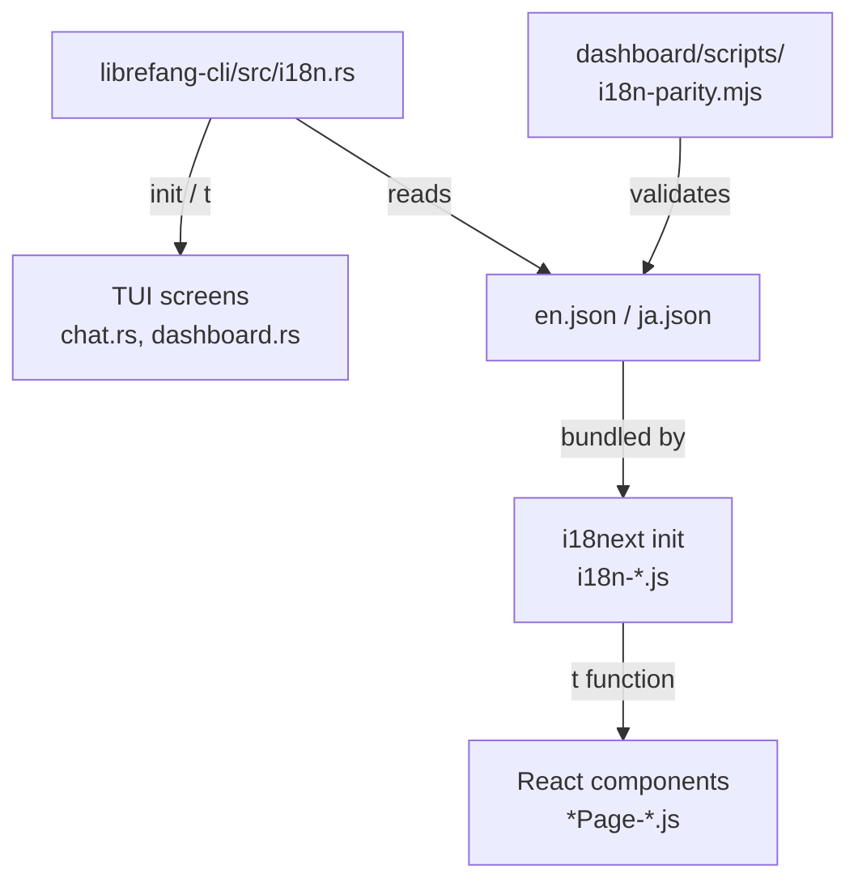

# Other — librefang-api-static

# librefang-api-static — Static Assets & Internationalization

## Overview

This module provides the static file tree served by the LibreFang API server, primarily containing the internationalization (i18n) locale files that power the web dashboard's multi-language UI. The locale data uses the **i18next** JSON format consumed by the React frontend and also by the TUI (Terminal UI) via Rust-side i18n bindings.

## File Structure

```
librefang-api/static/
└── locales/
    ├── en.json          # English (primary/source locale)
    └── ja.json          # Japanese translation
```

All static assets are embedded or served by the API server at runtime. The dashboard's bundler resolves these files through the i18n initialization pipeline.

## Locale File Architecture

### Format

Each locale file is a flat-ish JSON object keyed by **page/component namespace**. Values are UTF-8 strings that may contain interpolation placeholders in curly braces:

```json
"secondsAgo": "{count}s ago",
"providerConnected": "{provider} connected ({latency}ms)"
```

The frontend's i18n runtime (i18next) substitutes these at render time. The number and names of placeholders must be identical across all locales for a given key.

### Namespace Organization

Keys are grouped into top-level namespaces that map directly to UI pages, shared components, or cross-cutting concerns:

| Namespace | Scope | Example Keys |
|---|---|---|
| `nav` | Sidebar navigation labels | `chat`, `agents`, `settings` |
| `status` | Connection/state badges | `connecting`, `ready`, `error` |
| `btn` | Reusable button labels | `refresh`, `save`, `delete` |
| `label` | Generic field labels | `name`, `status`, `model` |
| `auth` | API key gate screen | `title`, `placeholder`, `hint` |
| `overview` | Dashboard overview page | `connectionError`, `recentActivity` |
| `agentChat` | Chat interface (largest namespace) | `cmd.*`, `sys.*`, `toast.*` |
| `agentsPage` | Agent management CRUD | `spawnAgent`, `archetype.*` |
| `settingsPage` | Settings with security features | `coreFeatures.*`, `configurableFeatures.*` |
| `workflowsPage` | Workflow list & runner | `steps`, `mode.*` |
| `workflowBuilder` | Visual node editor | `nodeType.*`, `nodePalette` |
| `schedulerPage` | Cron jobs & event triggers | `cron.*`, `triggerType.*` |
| `sessionsPage` | Session history & agent memory | `conversationSessions`, `agentMemory` |
| `channelsPage` | Messaging channel config | `step.*`, `category.*` |
| `skillsPage` | Skill marketplace & MCP servers | `source.*`, `category.*` |
| `handsPage` | Autonomous capability packages | `status.*`, `step.*` |
| `pluginsPage` | Plugin registry & install | `source*`, `hooks` |
| `commsPage` | Inter-agent messaging | `event.*`, `state.*` |
| `approvals` | Execution approval queue | `filter.*`, `status.*` |
| `logsPage` | Live logs & audit trail | `liveTab`, `auditTab` |
| `runtimePage` | Runtime info display | `platform`, `architecture` |
| `goalsPage` | Goal tracking with sub-goals | `statTotal`, `statusInProgress` |
| `analyticsPage` | Usage & cost analytics | `tabSummary`, `costByProvider` |
| `memoryPage` | Proactive memory browser | `level`, `category`, `versionHistory` |
| `setupWizard` | First-run setup flow | `welcomeStep` through `doneStep` |
| `security` | Security feature labels (card) | `merkleAudit`, `wasmSandbox` |
| `profile` | Tool profile descriptions | `minimal.*`, `coding.*`, `full.*` |
| `template` | Agent template catalog | `GeneralAssistant.*`, `CodeHelper.*` |
| `time` | Relative time formatting | `now`, `minutesAgo`, `hoursAgo` |
| `onboarding` | First-visit banner | `welcome`, `launchWizard` |
| `provider` | LLM provider setup | `tierFree`, `ollamaDetected` |
| `theme` | Theme switcher | `light`, `dark`, `system` |
| `sidebar` | Sidebar footer hints | `shortcutHint` |
| `confirm` | Shared confirm dialog | `cancel`, `confirm` |

Secondary namespaces (`agentChat2`, `settingsPage2`, etc.) contain supplemental keys for UI refinements that overlay the primary namespace — typically used in alternate layout variants or feature-flagged views.

## Interpolation Patterns

All placeholder tokens follow the `{identifier}` convention recognized by i18next. Common patterns:

| Pattern | Purpose | Example |
|---|---|---|
| `{count}` | Numeric quantities | `"{count} agent(s) stopped"` |
| `{name}` | Entity names | `"Agent \"{name}\" spawned"` |
| `{message}` | Error details | `"Failed: {message}"` |
| `{provider}` | LLM provider name | `"{provider} connected"` |
| `{model}` | Model identifier | `"Switched to {model}"` |
| `{key}` | Memory/config key | `"Delete key \"{key}\"?"` |
| `{time}` | Timestamp | `"Activated: {time}"` |
| `{count}/{total}` | Fractions | `"{filtered} of {total} entries"` |
| `{old}` / `{new}` | Before/after values | `"Previously '{old}', now '{new}'"` |

## Connection to the Rest of the Codebase


```mermaid
graph TD
    A[en.json / ja.json] -->|bundled by| B[i18next init<br>i18n-*.js]
    B -->|t function| C[React components<br>*Page-*.js]
    D[librefang-cli/src/i18n.rs] -->|init / t| E[TUI screens<br>chat.rs, dashboard.rs]
    D -->|reads| A
    F[dashboard/scripts/<br>i18n-parity.mjs] -->|validates| A
```

- **Frontend**: The React app initializes i18next with these JSON files at boot (`index-D7Z5I_nR.js` → `use` from `i18n-4qyNqnlA.js`). Every page component calls `t("namespace.key")` to resolve strings.
- **TUI / CLI**: The Rust binary (`librefang-cli/src/i18n.rs`) also reads these locale files so the terminal interface shares the same translations. The `init()` and `t()` functions in that module load and resolve keys from the same JSON structure.
- **Parity validation**: `i18n-parity.mjs` runs as a build/test script to detect missing or extra keys between locales, preventing translation drift.

## Adding a New Locale

1. Copy `en.json` to a new file (e.g., `fr.json` for French).
2. Translate all string values. **Do not** change keys or alter placeholder names (`{count}`, `{name}`, etc.).
3. Keep structural nesting identical — every key in `en.json` must exist in the new file.
4. Register the new locale in the i18n initialization config (the `resources` object in the frontend's i18n module and in `librefang-cli/src/i18n.rs`).
5. Run `i18n-parity.mjs` to verify key parity between the new file and `en.json`.

## Adding New UI Strings

1. Add the key under the appropriate namespace in `en.json` first — this is the source of truth.
2. Add the same key (with translated value) to every other locale file.
3. Use interpolation (`{variable}`) for dynamic content rather than string concatenation.
4. For entirely new pages, create a new top-level namespace matching the page component name (e.g., `newPage`).

## Key Design Decisions

- **Flat namespace per page**: Rather than deeply nested keys, namespaces use one or two levels of nesting (e.g., `agentsPage.archetype.assistant`). This keeps JSON path lookups fast and avoids brittle deep merging.
- **Separate `btn` / `label` namespaces**: Shared UI primitives (buttons, form labels) live in global namespaces so they can be reused across pages without duplication.
- **Error messages in-page**: Each page namespace includes its own error/toast strings (e.g., `agentsPage.spawnFailed`) rather than centralizing them, because error context is page-specific and the interpolated values differ.
- **`*2` namespaces**: Secondary namespaces (e.g., `settingsPage2`) hold keys for incremental UI changes without modifying the primary namespace, allowing progressive rollout.