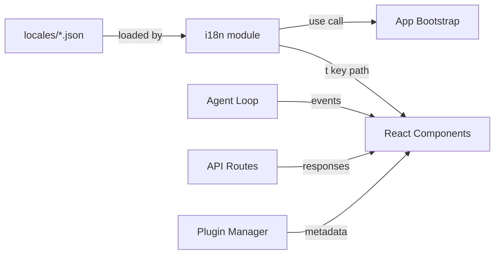

# Other — librefang-api-static

# librefang-api-static — Static Frontend Assets (Locales)

## Overview

This module provides the **internationalization (i18n) locale files** for the LibreFang dashboard UI. It contains all user-facing text strings as structured JSON, organized by page and component. The dashboard's React frontend loads these files at boot via an i18n library, enabling full multi-language support without embedding strings in component code.

## File Structure

```
librefang-api/static/
└── locales/
    ├── en.json    # English (primary/default)
    └── ja.json    # Japanese
```

## How It Works

The i18n initialization sequence ties into the application boot flow. The main bundle (`index-D7Z5I_nR.js`) calls `use()` on the i18n module (`i18n-4qyNqnlA.js`) during startup. Various server-side boot functions (test harnesses, integration tests) invoke `nest()` on the i18n module to register locale resources before the dashboard is served.

Components reference translations by dot-path keys (e.g., `agentChat.cmd.help`). Interpolation parameters like `{count}`, `{name}`, and `{message}` are replaced at render time by the i18n library.

## Locale Key Hierarchy

The JSON is organized into top-level namespaces that map to dashboard sections. Below is a structural reference for all namespaces.

### Global UI Elements

| Namespace | Purpose |
|---|---|
| `nav` | Sidebar navigation labels (chat, agents, sessions, settings, etc.) |
| `status` | Connection status indicators (`connecting`, `ready`, `error`, `notConfigured`) |
| `btn` | Reusable button labels (`refresh`, `save`, `delete`, `send`, `copy`, `copied`) |
| `label` | Generic field labels (`status`, `provider`, `model`, `agent`, `name`, `key`, `value`) |
| `auth` | API key authentication prompt and hint text |
| `page` | Page-level titles used in headers |
| `health` | Health check status labels (`healthy`, `unreachable`) |
| `time` | Relative time formatting (`now`, `{count}s ago`, `{count}m ago`, etc.) |
| `confirm` | Confirmation dialog buttons (`cancel`, `confirm`) |
| `theme` | Theme selector labels (`light`, `dark`, `system`) |
| `sidebar` | Sidebar shortcut hints |

### Statistics & Cards

| Namespace | Purpose |
|---|---|
| `stat` | Dashboard stat card labels (agents running, tokens used, total cost, uptime, etc.) |
| `card` | Dashboard card titles (Getting Started, LLM Providers, System Health, etc.) |

### Agent System

| Namespace | Purpose |
|---|---|
| `agents` | Agent list actions (new agent, stop all, start chatting) |
| `detail` | Agent detail view (info, files, config tabs; tool filters with allowlist/blocklist) |
| `mode` | Agent operation modes: `observe`, `assist`, `full` |
| `category` | Agent categories: `general`, `development`, `research`, `writing`, `business` |
| `profile` | Tool profile descriptions (9 profiles from `minimal` to `full`) |
| `template` | 10 built-in agent templates with name and description each |

**Tool Profiles** — Each profile defines a capability set:

```
minimal → read-only file access
coding  → files + shell + web fetch
research → web search + file read/write
messaging → agents + memory access
automation → all tools except custom
balanced → general-purpose tool set
precise → focused tool set for accuracy
creative → full tools with creative emphasis
full → all 35+ tools
```

**Agent Templates** — Predefined starting points: `GeneralAssistant`, `CodeHelper`, `Researcher`, `Writer`, `DataAnalyst`, `DevOpsEngineer`, `CustomerSupport`, `Tutor`, `APIDesigner`, `MeetingNotes`.

### Chat Interface (`agentChat`)

The largest namespace. Covers the full agent chat experience:

- **Session management**: create, switch, reset, reboot sessions
- **Message display**: generating states, tool usage indicators, thinking/reasoning panels
- **Slash commands** (`agentChat.cmd`): 17 commands — `/help`, `/new`, `/reboot`, `/compact`, `/model`, `/stop`, `/usage`, `/think`, `/context`, `/verbose`, `/queue`, `/status`, `/clear`, `/exit`, `/budget`, `/peers`, `/a2a`
- **File handling**: drag-and-drop uploads, size/type validation (10MB limit)
- **Voice input**: recording indicator, transcription, microphone permission errors
- **Toast notifications** (`agentChat.toast`): model switches, session resets, failures
- **System messages** (`agentChat.sys`): compaction status, usage stats, thinking mode descriptions, budget/OFP/A2A status displays

### Page-Level Namespaces

Each page has its own namespace with loading states, error messages, CRUD toasts, and empty-state descriptions:

| Namespace | Page | Key Sub-sections |
|---|---|---|
| `sessionsPage` | Sessions | Conversation sessions, agent memory key-value store |
| `agentsPage` | Agents | Create wizard, raw TOML, archetype/vibe selectors, clone/history |
| `approvals` | Approvals | Pending/approved/rejected filter, approve/reject actions |
| `logsPage` | Logs | Live stream + audit trail, chain verification |
| `runtimePage` | Runtime | System info, providers, models, latency display |
| `workflowsPage` | Workflows | Sequential/fan-out/conditional/loop step modes |
| `workflowBuilder` | Visual Builder | Node palette (7 node types), canvas controls, TOML export |
| `schedulerPage` | Scheduler | Cron jobs, event triggers, run history, cron presets |
| `channelsPage` | Channels | Setup steps (configure → verify → ready), WhatsApp QR, categories |
| `skillsPage` | Skills | Installed/ClawHub/MCP/Quick Start tabs, security scanning |
| `handsPage` | Hands | Available/Active tabs, dependency installer, setup wizard steps |
| `pluginsPage` | Plugins | Installed/Registry tabs, install sources (registry/local/git) |
| `commsPage` | Agent Comms | Topology, live event feed, message/task posting |
| `goalsPage` | Goals | Hierarchical goals with sub-goals, status tracking |
| `analyticsPage` | Analytics | Token/cost breakdown by model, agent, provider, daily costs |
| `memoryPage` | Memory | Proactive memory browser, search, CRUD, version history |

### Settings (`settingsPage`)

The most complex namespace, reflecting the settings page's multi-tab layout:

- **Providers**: API key management for 12+ LLM providers, custom provider support (OpenAI-compatible), GitHub Copilot OAuth flow
- **Models**: Model catalog with sync, search/filter, custom model addition, cost tiers
- **Tools**: Tool registry browser with search
- **Security** (`settingsPage.coreFeatures`, `configurableFeatures`, `monitoringFeatures`): 15 security features documented with descriptions and threat models
- **Network**: OFP peer networking, A2A external agent discovery
- **Budget**: Hourly/daily/monthly cost limits, per-agent token limits, alert thresholds, top spenders
- **Proactive Memory**: Auto-memorize, auto-retrieve, extraction thresholds, confidence decay, duplicate detection
- **Migration**: Import from OpenClaw/OpenFang installations

### Onboarding (`setupWizard`)

5-step wizard flow: **Welcome → Provider → Agent → Try It → Channel → Done**

Each step has its own strings for instructions, validation errors, and success states.

## Interpolation Parameters

Strings use `{param}` placeholders resolved at runtime. Common parameters:

| Parameter | Usage |
|---|---|
| `{count}` | Numeric counts (agents, sessions, tokens, entries) |
| `{name}` | Entity names (agents, channels, skills, schedules) |
| `{message}` | Error messages from API responses |
| `{provider}` | LLM provider names |
| `{model}` | Model identifiers |
| `{key}` | Memory key names |
| `{time}` | Timestamps |
| `{url}` | URLs |
| `{tool}` | Tool names |

## Adding a New Locale

1. Create a new file at `locales/<locale-code>.json` (e.g., `de.json` for German)
2. Copy the full structure from `en.json` as the starting point
3. Translate all string values — do **not** change keys or structural nesting
4. Preserve all `{param}` placeholders exactly as they appear
5. Register the locale in the i18n configuration (in the frontend i18n module)

## Adding New Strings

When adding UI features that require new text:

1. Identify the appropriate namespace (existing page namespace or create a new one)
2. Add the key to **every** locale file, not just `en.json`
3. Use interpolation parameters rather than string concatenation
4. Follow the naming convention: `snake_case` for object keys within a namespace

## Relationship to Other Modules


```mermaid
graph LR
    A[locales/*.json] -->|loaded by| B[i18n module]
    B -->|use call| C[App Bootstrap]
    B -->|t key path| D[React Components]
    E[Agent Loop] -->|events| D
    F[API Routes] -->|responses| D
    G[Plugin Manager] -->|metadata| D
```

The locale files are pure static data — they contain no logic. The frontend i18n library reads them at boot, and React components consume translated strings via key paths. API route handlers and the agent loop produce events whose display text comes from these locale files, keeping the server side locale-agnostic.