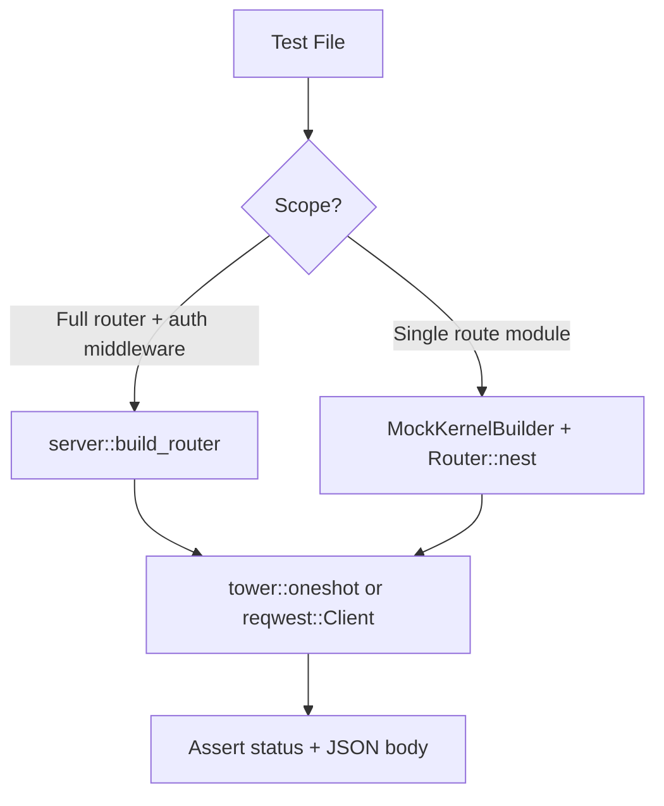

# Other — librefang-api-tests

# librefang-api-tests

Integration test suite for the LibreFang HTTP API layer. Tests exercise real route registration, middleware wiring, and handler logic — no mocks at the HTTP boundary. Each test file targets a specific route family or cross-cutting concern.

## Running

```sh
# All integration tests
cargo test -p librefang-api

# Single test file
cargo test -p librefang-api --test agents_routes_integration

# Tests requiring real LLM credentials (GROQ_API_KEY)
cargo test -p librefang-api --test api_integration_test -- --nocapture
```

All tests use `#[tokio::test(flavor = "multi_thread")]` because kernel boot spawns background tasks that require a multi-threaded runtime.

## Architecture

Tests use two complementary harness patterns depending on what's being exercised:



### Full-router harness (`server::build_router`)

Used by `a2a_routes_integration`, `agents_routes_integration`, `api_deny_unknown_fields_test`, and parts of `api_integration_test`. Boots a real `LibreFangKernel` with a temp directory and constructs the production router via `server::build_router(kernel, addr)`. This exercises the complete middleware stack (auth, logging, CORS).

Requests are sent via `tower::ServiceExt::oneshot` — no TCP listener is bound. The kernel's registry cache is pre-populated via `registry_sync::sync_registry` to avoid network access during boot.

### Partial-router harness (`MockKernelBuilder`)

Used by `access_log_agent_id_test`, `access_log_session_id_test`, `agent_kv_authz_integration`, and other focused tests. Constructs a `MockKernelBuilder` → `TestAppState` → `Arc<AppState>`, then nests only the route module under test into a minimal `Router`. This avoids booting subsystems unrelated to the test surface.

```rust
let test = TestAppState::with_builder(MockKernelBuilder::new().with_config(|cfg| {
    cfg.default_model.provider = "ollama".to_string();
    // ...
}));
let state: Arc<AppState> = test.state.clone();
let app = Router::new()
    .nest("/api", routes::agents::router())
    .with_state(state);
```

### TCP-listener harness

Used by `agent_identity_registry_test` and the spawn/kill flow in `api_integration_test`. Binds a real `TcpListener` on `127.0.0.1:0`, spawns `axum::serve` in a background task, and hits endpoints with `reqwest::Client`. Necessary when the test surface depends on real HTTP connection metadata (e.g., `ConnectInfo` for loopback detection).

## Test harness conventions

Every harness struct holds:

| Field | Purpose |
|-------|---------|
| `app: Router` | The axum router to send requests through |
| `state: Arc<AppState>` | Shared state for direct kernel assertions |
| `_tmp: TempDir` | Keeps the temp dir alive for the test's duration |

The `Drop` impl on harness structs calls `state.kernel.shutdown()` to clean up background tasks.

### The `send` helper

Most files define a `send(harness, method, path, body, authed)` function that:

1. Builds an `axum::http::Request<Body>`
2. Optionally attaches `Authorization: Bearer <api_key>`
3. Calls `app.clone().oneshot(req).await`
4. Returns `(StatusCode, serde_json::Value)`

## Test files and their coverage

### `agents_routes_integration.rs`

Route family: `GET/PATCH/DELETE /api/agents`, `GET /api/agents/{id}`, `POST /api/agents/{id}/message`.

Key scenarios:
- **List agents** — empty filter, populated list, invalid sort field rejection
- **Get agent** — happy path, invalid UUID → 400, unknown UUID → 404
- **PATCH agent** — name/description update with read-after-write, invalid `mcp_servers` payload → 400, auth gate → 401
- **Schedule field** (`ScheduleMode`) — reactive/continuous/periodic update, malformed schedule rejection, unrelated PATCH preserving schedule, background loop start/stop
- **DELETE idempotency** — double-delete returns 200 with `already-deleted`, unknown UUID is also 200
- **Workspace path security** — absolute path inside root accepted, outside root rejected, `..` traversal rejected
- **Thinking blocks** — `ContentBlock::Thinking` surfaced in session endpoint, omitted when absent, thinking-only turns preserved
- **Incognito mode** — `incognito: true` deserializes without 422, defaults to false when omitted

### `a2a_routes_integration.rs`

Route family: `/a2a/agents` (public federation), `/api/a2a/agents`, `/api/a2a/agents/{id}`, `/api/a2a/discover`, `/api/a2a/send`, `/api/a2a/tasks/{id}/status`, `/api/a2a/agents/{id}/approve`.

Outbound HTTP is **not** exercised — tests cover only validation, trust-gate, and error paths:

- SSRF guard rejects `localhost` URLs before any network call
- Trust gate blocks `/send` and `/tasks/{id}/status` against unapproved targets
- Federation endpoint returns `PaginatedResponse` envelope without legacy `agents` field
- Auth gates verified per route

### `access_log_agent_id_test.rs`

Cross-cutting: `AgentIdField` extension marker on `Response::extensions`.

Tests assert the marker is present even on error responses (404 for unknown agent) so the access-log middleware can emit a non-empty `agent_id` field. Malformed UUIDs that fail extraction produce no marker — that's the documented contract.

### `access_log_session_id_test.rs`

Cross-cutting: `SessionIdField` extension marker.

- Successful session lookup → marker present
- Unknown agent → marker absent (no session was resolved)
- SSE stream endpoint 404 → marker absent

### `agent_identity_registry_test.rs`

Agent UUID identity lifecycle:

- Spawn registers canonical UUID via `AgentId::from_name`
- DELETE without `?confirm=true` → 409 `delete_confirmation_required` (registry preserved)
- DELETE with `?confirm=true` → 200, identity purged, respawn recovers the same deterministic UUID
- `GET /api/agents/identities` lists registered entries
- `POST /api/agents/identities/{name}/reset` gated on `?confirm=true`

### `agent_kv_authz_integration.rs`

Owner-scoping on per-agent KV store (`/api/memory/agents/{id}/kv*`, `/api/agents/{id}/memory/export|import`).

Uses `AuthenticatedApiUser` extensions to simulate different caller roles:

| Caller | Own agent | Other agent |
|--------|-----------|-------------|
| Admin | 200 | 200 (passes owner check, may 404 on missing key) |
| Owner (viewer role) | 200 | 404 |
| Non-owner (viewer role) | 200 | 404 |
| Anonymous (no extension) | 200 | 200 (fails open; global middleware enforces auth) |

Tests cover list, single-key get/set/delete, and bulk export/import.

### `api_deny_unknown_fields_test.rs`

Regression for typo'd JSON fields being silently dropped. After `#[serde(deny_unknown_fields)]` on `CreateWebhookRequest`:

- `{"evnts": ["message_received"]}` → 400 (typo rejected)
- Correctly spelled request → 201, webhook persisted

### `api_integration_test.rs`

Broad end-to-end coverage:

- **Health/Status** — `/api/health` returns redacted info; `/api/status` returns detailed state
- **API versioning** — `/api/v1/*` aliases, `x-api-version` header on all responses including 401
- **Locale serving** — `/locales/{lang}.json` files for i18n
- **Providers** — `/api/providers` marks local providers with `is_local: true`
- **Config reload** — proxy changes hot-reloaded without restart
- **Migration** — OpenClaw import writes to daemon home
- **Session isolation** — cross-agent session read rejected (agent A cannot read agent B's session)
- **Web search** — `WebSearchAugmentationMode` configuration on agent spawn

## Kernel configuration for tests

All tests configure the default model as `ollama` / `test-model` to avoid requiring real LLM credentials:

```rust
DefaultModelConfig {
    provider: "ollama".to_string(),
    model: "test-model".to_string(),
    api_key_env: "OLLAMA_API_KEY".to_string(),
    base_url: None,
    message_timeout_secs: 300,
    extra_params: HashMap::new(),
    cli_profile_dirs: Vec::new(),
}
```

The registry cache is synced into the temp directory before boot so the kernel doesn't need network access to enumerate available models.

## Auth patterns in tests

When `api_key` is set to `""` (empty string), the auth middleware enters "dev mode" — all dashboard-read routes are accessible without a token. When a non-empty key is configured, tests attach `Authorization: Bearer <key>` headers.

The `tower::oneshot` path has no `ConnectInfo`, so the loopback fast-path for auth does **not** apply. Requests are treated as remote, which is the stricter and more useful test configuration.

## Key types used across tests

| Type | Source crate | Role |
|------|-------------|------|
| `AppState` | `librefang-api::routes` | Shared router state wrapping the kernel |
| `AgentId` | `librefang-types::agent` | UUID identifying an agent |
| `AgentManifest` | `librefang-types::agent` | TOML-deserialized agent definition |
| `AuthenticatedApiUser` | `librefang-api::middleware` | Simulated caller identity for authz tests |
| `UserRole` | `librefang-kernel::auth` | Admin / Viewer role discrimination |
| `MockKernelBuilder` | `librefang-testing` | Kernel builder that skips network-bound subsystems |
| `TestAppState` | `librefang-testing` | Harness producing `Arc<AppState>` from a mock kernel |
| `AgentIdField` / `SessionIdField` | `librefang-api::extensions` | Response extension markers for access logging |

## Contributing new tests

1. Pick the harness pattern:
   - **Full router** if the test involves auth middleware, multiple route families, or the production middleware stack
   - **Partial router** if testing a single route module in isolation
   - **TCP listener** if `ConnectInfo` or real HTTP connection metadata matters

2. Use `tempfile::TempDir` for the kernel home directory. Never write to the real filesystem.

3. Assert on `(StatusCode, serde_json::Value)` tuples. Use `body` in assertion messages for diagnosability:
   ```rust
   assert_eq!(status, StatusCode::OK, "body: {body}");
   ```

4. For mutating endpoints that trigger real outbound HTTP (A2A discover/send), only test validation and trust-gate paths — never require a live external server.

5. Gate tests requiring real LLM credentials behind an env-var check. The majority of tests must pass without any external credentials.