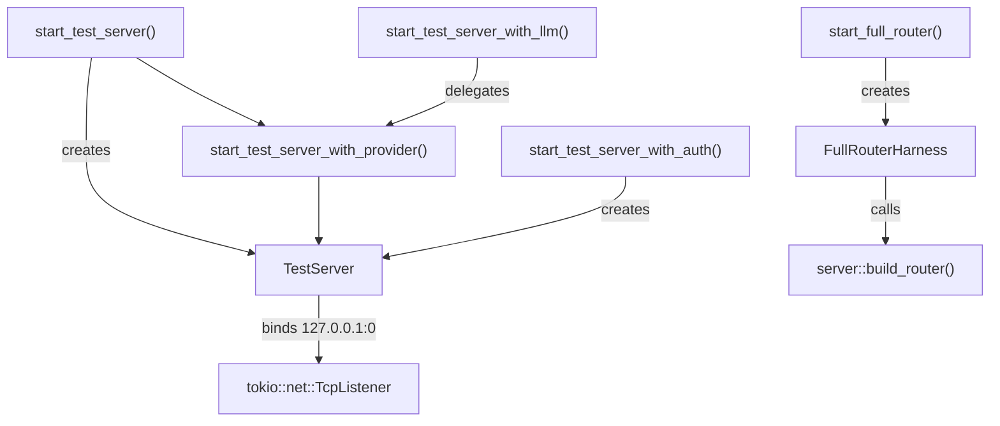

# Other — librefang-api-tests

# librefang-api-tests

Integration, lifecycle, load, and spec-generation tests for the LibreFang HTTP API. These tests boot a real `LibreFangKernel`, bind axum to a random port, and exercise endpoints over actual HTTP using `reqwest`. No mocking layers are involved.

## Running

```bash
# All tests in this crate
cargo test -p librefang-api --test api_integration_test -- --nocapture
cargo test -p librefang-api --test daemon_lifecycle_test -- --nocapture
cargo test -p librefang-api --test load_test -- --nocapture
cargo test -p librefang-api --test openapi_spec_test -- --nocapture

# Tests that call a real LLM (requires GROQ_API_KEY in environment)
GROQ_API_KEY=... cargo test -p librefang-api --test api_integration_test test_send_message_with_llm -- --nocapture

# Skip the flaky concurrent-spawn/cycle tests (marked #[ignore])
cargo test -p librefang-api --test load_test -- --nocapture --ignored
```

## Architecture

Each test file builds its own server harness tailored to what it needs to verify:

```
┌─────────────────────────────────────────────────────────────────┐
│  Test Files                                                      │
│                                                                  │
│  api_integration_test.rs                                         │
│    ├── TestServer        (subset of routes, raw axum Router)     │
│    ├── FullRouterHarness (server::build_router — full stack)     │
│    └── start_test_server_with_auth() (auth middleware enabled)   │
│                                                                  │
│  daemon_lifecycle_test.rs                                        │
│    └── Minimal Router (health + status + shutdown only)          │
│                                                                  │
│  load_test.rs                                                    │
│    └── TestServer (extended route set including sessions/models) │
│                                                                  │
│  openapi_spec_test.rs                                            │
│    └── utoipa::OpenApi::openapi() (no server needed)            │
└─────────────────────────────────────────────────────────────────┘
         │
         ▼
┌─────────────────────────────────────────┐
│  Shared dependencies                     │
│  LibreFangKernel  AppState  DaemonInfo   │
│  KernelConfig  DefaultModelConfig        │
└─────────────────────────────────────────┘
```



## Test Harnesses

### `TestServer`

The primary harness used by `api_integration_test.rs` and `load_test.rs`. It constructs a minimal axum `Router` with a specific subset of routes, binds to an ephemeral port, and returns the base URL for `reqwest` calls.

Key fields:
- `base_url` — `http://127.0.0.1:{random_port}`
- `config_path` — path to the temp `config.toml` (used by config-reload tests)
- `state` — `Arc<AppState>` shared with the router, used for direct kernel assertions
- `_tmp` — `tempfile::TempDir` dropped on teardown, cleaning up all temp files

Cleanup: the `Drop` impl calls `state.kernel.shutdown()`.

### `FullRouterHarness`

Used when tests need the full middleware stack that `server::build_router()` provides — API versioning headers (`x-api-version`), dashboard locale serving, provider discovery with `is_local` flags, and migration endpoints. Instead of a hand-built router, it delegates to the production `server::build_router()` function and uses `tower::ServiceExt::oneshot` for in-process requests (no network hop).

### Provider Variants

| Harness function | Provider | API key env | Purpose |
|---|---|---|---|
| `start_test_server()` | ollama | `OLLAMA_API_KEY` | Default; no real LLM needed |
| `start_test_server_with_llm()` | groq | `GROQ_API_KEY` | Real LLM round-trip tests |
| `start_test_server_with_provider(...)` | configurable | configurable | Custom provider setup |
| `start_test_server_with_auth(key)` | ollama | `OLLAMA_API_KEY` | Bearer-token auth enabled |

All variants create a `tempfile::TempDir`, write a `KernelConfig` as TOML, boot the kernel via `LibreFangKernel::boot_with_config`, construct `AppState` manually, and spawn the axum server in a background tokio task.

## Test Coverage by File

### `api_integration_test.rs`

The largest file, covering the full API surface:

**Core endpoints**
- `test_health_endpoint` — `/api/health` returns `{ status: "ok", version: "..." }`, omits sensitive fields (`database`, `agent_count`), and injects `x-request-id`.
- `test_status_endpoint` — `/api/status` returns runtime details: `agent_count`, `uptime_seconds`, `default_provider`, agent list.
- `test_request_id_header_is_uuid` — validates `x-request-id` is a parseable UUID.

**API versioning**
- `test_build_router_exposes_versioned_api_aliases` — both `/api/health` and `/api/v1/health` return `x-api-version: v1`. `/api/versions` lists current and supported versions.
- `test_build_router_path_version_beats_unknown_accept_header` — path-based versioning takes precedence over `Accept: application/vnd.librefang.v99+json`.

**Dashboard and providers**
- `test_build_router_serves_dashboard_locales` — `/locales/{lang}.json` returns translation objects.
- `test_build_router_providers_marks_local_providers` — `/api/providers` marks ollama with `is_local: true`.

**Authentication**
- `test_auth_health_is_public` — health endpoint bypasses auth.
- `test_auth_rejects_no_token` — protected endpoints return 401 with "Missing" in error.
- `test_auth_rejects_wrong_token` — wrong bearer token returns 401 with "Invalid".
- `test_auth_accepts_correct_token` — correct token grants access.
- `test_auth_disabled_when_no_key` — empty `api_key` in config disables auth entirely.
- `test_build_router_unauthorized_responses_include_api_version_header` — even 401s include `x-api-version`.

**Agent lifecycle**
- `test_spawn_list_kill_agent` — full CRUD cycle: POST to create, GET to list, DELETE to kill. Verifies agent count changes correctly (default assistant is always present).
- `test_multiple_agents_lifecycle` — spawns 3 named agents, verifies list count, kills selectively, verifies remaining.
- `test_invalid_agent_id_returns_400` — non-UUID IDs return 400 for message, kill, and session endpoints.
- `test_kill_nonexistent_agent_returns_404` — valid UUID that doesn't exist returns 404.
- `test_spawn_invalid_manifest_returns_400` — malformed TOML returns 400 with "Invalid manifest" error.

**Agent monitoring**
- `test_agent_session_empty` — newly spawned agent has 0 messages.
- `test_agent_monitoring_endpoints` — `/agents/{id}/metrics` returns token usage and tool call stats. `/agents/{id}/logs?level=...&n=...` filters audit log entries by outcome.
- `test_send_message_with_llm` — gated behind `GROQ_API_KEY`. Spawns a groq agent, sends a message, verifies non-empty response and token counts > 0, checks session message count increases.

**Agent list filtering/pagination**
- `test_agent_list_paginated_response_format` — response shape: `{ items, total, offset, limit }`.
- `test_agent_list_invalid_sort_returns_400` — unknown sort field returns 400.
- `test_agent_list_valid_sort_fields` — `name`, `created_at`, `last_active`, `state` all return 200.
- `test_agent_list_limit_clamped_to_max` — `limit=9999` clamps to 100.
- `test_agent_list_pagination` — `offset`/`limit` return correct page slices.
- `test_agent_list_text_search` — `q=` parameter filters by name/description.

**Triggers and workflows**
- `test_trigger_crud` — create, list (unfiltered and filtered by `agent_id`), delete. Verifies `enabled`, `max_fires` fields.
- `test_workflow_crud` — create with steps, list, verify `steps` count.

**Tools**
- `test_list_tools` — returns `{ tools: [...], total: N }` with `total > 0`.
- `test_get_tool_found` — fetches first tool by name, verifies `description` and `input_schema`.
- `test_get_tool_not_found` — nonexistent tool returns 404.

**MCP bridge** (issue #2699 regression guards)
- `test_mcp_http_rehydrates_caller_context_from_agent_header` — `POST /mcp` with `X-LibreFang-Agent-Id` header passes caller identity to tools. Without the header, `cron_list` returns "Agent ID required".
- `test_mcp_http_invalid_agent_header_falls_back_to_unauthenticated` — garbage/unknown agent IDs degrade gracefully (error, not 500).
- `test_mcp_http_unrestricted_agent_can_call_any_tool` — agent with no `[capabilities]` section (unrestricted) can call any tool through the bridge.
- `test_mcp_http_enforces_agent_tool_allowlist` — agent whose manifest only grants `file_read` cannot call `cron_list` through the bridge; gets "Permission denied".

**Config hot-reload**
- `test_config_reload_hot_reloads_proxy_changes` — writes new proxy config to disk, hits `/api/config/reload`, verifies `restart_required: false` and `ReloadProxy` in `hot_actions_applied`.

**Migration**
- `test_run_migrate_uses_daemon_home_when_target_dir_is_empty` — migration with empty `target_dir` writes to daemon's home directory.

**Hands**
- `list_active_hands_includes_definition_metadata` — installs a hand definition, activates it, attaches agent roles via `set_agents`, then verifies `/api/hands/active` returns enriched fields: `hand_name`, `hand_icon`, `coordinator_role`, and `agent_ids` map.

### `daemon_lifecycle_test.rs`

Tests daemon startup, PID file management, and shutdown:

- `test_daemon_info_serde_roundtrip` — `DaemonInfo` serializes to/from JSON correctly.
- `test_read_daemon_info_from_file` — reads a valid `daemon.json`.
- `test_read_daemon_info_missing_file` — returns `None` for missing file.
- `test_read_daemon_info_corrupt_json` — returns `None` for invalid JSON.
- `test_stale_daemon_info_detection` — `read_daemon_info` returns the file content even with a stale PID (PID liveness checking is the caller's responsibility).
- `test_full_daemon_lifecycle` — boots kernel, starts server, writes `daemon.json`, verifies health and status endpoints, triggers shutdown, removes daemon info file.
- `test_server_immediate_responsiveness` — health endpoint responds in <1 second after server start.

### `load_test.rs`

Performance smoke tests with printed throughput/latency statistics:

- `load_endpoint_latency` — measures p50/p95/p99 for 8 GET endpoints over 100 requests each, with 10-request warmup. Gates on p95 < 1 second.
- `load_concurrent_reads` — 50 simultaneous GET requests across 4 endpoints; all must return 200.
- `load_concurrent_agent_spawns` (`#[ignore]`) — 20 parallel POST spawns; allows 2 failures.
- `load_spawn_kill_cycle` (`#[ignore]`) — 10 sequential spawn+kill cycles.
- `load_session_management` — creates 10 sessions, lists them, switches through each.
- `load_workflow_operations` — 15 concurrent workflow creates, then list.
- `load_metrics_sustained` — 200 sequential hits to `/api/metrics`, verifying Prometheus output contains `librefang_agents_active`.

### `openapi_spec_test.rs`

- `generate_openapi_json` — calls `ApiDoc::openapi()`, validates the spec has an `openapi` version, `info.title`, and 100+ paths, then writes `openapi.json` to the repository root for SDK codegen and CI consumption.

## Manifest Constants

Several TOML manifest constants are defined for spawning test agents:

| Constant | Provider | Tools granted | Purpose |
|---|---|---|---|
| `TEST_MANIFEST` | ollama | `file_read` | Default agent for most tests |
| `LLM_MANIFEST` | groq | `file_read` | Real LLM round-trip tests |
| `MCP_TEST_MANIFEST` | ollama | `cron_list`, `cron_create`, `cron_cancel` | MCP bridge caller-context tests |
| `UNRESTRICTED_MANIFEST` | ollama | none (no `[capabilities]`) | MCP unrestricted-access tests |

## Adding New Tests

1. **Pick the right harness.** Use `start_test_server()` for most endpoint tests. Use `start_full_router()` when you need API versioning, locale files, or the full middleware stack. Use `start_test_server_with_auth(key)` for auth-specific tests.

2. **Use `#[tokio::test(flavor = "multi_thread")]`.** The kernel requires a multi-threaded runtime. Single-threaded tests will panic.

3. **Create a unique manifest** if your test needs specific capabilities. Name the agent distinctly to avoid collisions in list assertions.

4. **Clean up agents** if the test spawns them and other tests in the same file share the server. Kill agents at the end of the test to avoid leaking into subsequent assertions.

5. **Gate real LLM tests** behind `std::env::var("GROQ_API_KEY")` with an early return and `eprintln!` message.

6. **Mark flaky tests** with `#[ignore]` and a comment explaining the race condition. Load tests that depend on precise spawn/kill timing are the common case.