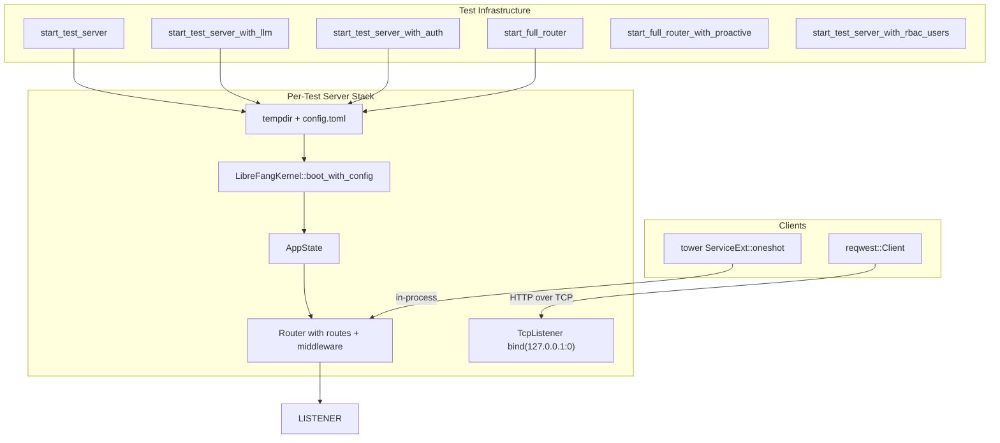

# Other — librefang-api-tests

# librefang-api-tests — HTTP Integration Tests

## Purpose

This test binary (`api_integration_test`) exercises the full LibreFang API stack end-to-end. Each test boots a real `LibreFangKernel`, starts an actual `axum` HTTP server on a random port, and fires real `reqwest` HTTP calls against it. There are **no mocks** — the router, middleware, kernel, and audit chain are all production code.

Tests that require a live LLM response are gated behind the `GROQ_API_KEY` environment variable and skip gracefully when it is absent.



## Running

```bash
# All integration tests (no LLM required)
cargo test -p librefang-api --test api_integration_test -- --nocapture

# Include LLM-gated tests
GROQ_API_KEY=... cargo test -p librefang-api --test api_integration_test -- --nocapture
```

All tests use `#[tokio::test(flavor = "multi_thread")]` because the kernel spawns background tasks during boot.

---

## Test Infrastructure

### `TestServer`

Holds a fully-booted HTTP server listening on a random port. Provides:
- `base_url` — e.g. `http://127.0.0.1:49152`
- `config_path` — path to the written `config.toml` in a temp directory
- `state` — `Arc<AppState>` shared with the running server
- `_tmp` — `tempfile::TempDir` that cleans up on drop

On `Drop`, calls `state.kernel.shutdown()` to tear down the kernel gracefully.

### `FullRouterHarness`

Uses `server::build_router` (the same function production uses) to construct the complete router including versioned API aliases, dashboard assets, and all nested sub-routers. Does **not** bind a TCP listener — tests call `app.clone().oneshot(request)` to exercise the router in-process. This harness is used for tests that need routes not present in the minimal `TestServer` router (e.g. `/api/v1/*`, `/locales/*`, `/api/providers`, `/api/hands/*`, `/api/migrate`, `/api/memory/*`).

### Server Construction Helpers

| Helper | LLM Provider | Auth | Use Case |
|---|---|---|---|
| `start_test_server()` | ollama (no key) | disabled | Most tests — agent lifecycle, pagination, tools, triggers |
| `start_test_server_with_llm()` | groq (needs `GROQ_API_KEY`) | disabled | Real LLM round-trip through kernel |
| `start_test_server_with_provider(provider, model, env)` | configurable | disabled | Internal; called by the two above |
| `start_test_server_with_auth(api_key)` | ollama | Bearer token | Auth rejection/acceptance tests |
| `start_full_router(api_key)` | ollama | via `build_router` | Full production router, in-process |
| `start_full_router_with_proactive(enabled)` | ollama | via `build_router` | Memory endpoint tests |
| `start_test_server_with_rbac_users(api_key, users)` | ollama | Bearer + RBAC roles | Audit, budget, authz, user policy tests |
| `start_test_server_with_full_user_configs(api_key, users)` | ollama | Bearer + RBAC roles | Effective-permissions snapshot tests with full `UserConfig` |

### Utility Functions

- **`loopback_get(uri)`** — Builds a `Request<Body>` with a loopback `ConnectInfo` extension injected. Required for oneshot tests that hit non-public endpoints because `axum` oneshot doesn't populate `ConnectInfo` from a real TCP connection; without it the fail-closed auth branch treats the request as non-loopback and returns 401.
- **`call_mcp_cron_list(server, agent_header)`** — Sends a JSON-RPC `tools/call` for `cron_list` to `/mcp`, optionally with an `X-LibreFang-Agent-Id` header. Returns `(StatusCode, serde_json::Value)`.

### Test Manifests

Four TOML manifest constants are defined for spawning test agents:

| Constant | Provider | Capabilities | Purpose |
|---|---|---|---|
| `TEST_MANIFEST` | ollama | `file_read` | Default test agent |
| `LLM_MANIFEST` | groq | `file_read` | Real LLM test |
| `MCP_TEST_MANIFEST` | ollama | `cron_list`, `cron_create`, `cron_cancel` | MCP bridge caller-context tests |
| `UNRESTRICTED_MANIFEST` | ollama | none (no `[capabilities]`) | Tests that empty tool list = unrestricted |

---

## Test Coverage by Area

### Health & Status

- **`test_health_endpoint`** — `GET /api/health` returns `{ status: "ok", version: "..." }`. Verifies `x-request-id` header injection. Confirms public health is redacted (no `database` or `agent_count`).
- **`test_status_endpoint`** — `GET /api/status` returns `running` status, agent count (1 for the auto-spawned assistant), uptime, default provider, and agent array.

### Router Versioning & Middleware

- **`test_build_router_exposes_versioned_api_aliases`** — Both `/api/health` and `/api/v1/health` resolve, both set `x-api-version: v1`. `/api/versions` returns `{ current: "v1", supported: ["v1"] }`.
- **`test_build_router_path_version_beats_unknown_accept_header`** — Path-based version (`/api/v1/`) takes precedence over an `Accept: application/vnd.librefang.v99+json` header.
- **`test_request_id_header_is_uuid`** — The `x-request-id` middleware emits a valid UUID.

### Dashboard & Locales

- **`test_build_router_serves_dashboard_locales`** — `/locales/en.json`, `/locales/zh-CN.json`, `/locales/ja.json` all return 200 with correct `nav.chat` translations.

### Providers

- **`test_build_router_providers_marks_local_providers`** — `GET /api/providers` includes ollama with `is_local: true`.

### Config Reload

- **`test_config_reload_hot_reloads_proxy_changes`** — `POST /api/config/reload` with a new `[proxy]` section returns `{ restart_required: false, hot_actions_applied: ["ReloadProxy"] }`.

### Agent Lifecycle

- **`test_spawn_list_kill_agent`** — Full CRUD: spawn → verify 201 + agent_id → list (2 agents) → kill → list (1 agent).
- **`test_multiple_agents_lifecycle`** — Spawns 3 agents, verifies list counts at each step, kills them one by one.
- **`test_invalid_agent_id_returns_400`** — Non-UUID path parameters on `/message`, kill, and session endpoints return 400.
- **`test_kill_nonexistent_agent_returns_404`** — Valid UUID that doesn't map to an agent returns 404.
- **`test_spawn_invalid_manifest_returns_400`** — Malformed TOML returns 400 with "Invalid manifest".
- **`test_send_message_with_llm`** — (Gated on `GROQ_API_KEY`) Spawns an agent with Groq, sends a message, asserts non-empty response, positive token counts, and session message count > 0.

### Agent Sessions

- **`test_agent_session_empty`** — Fresh agent session has `message_count: 0`.
- **`test_get_agent_session_rejects_cross_agent_session_id`** — Regression guard for PR #3071: requesting agent A's session endpoint with agent B's `session_id` returns 404. Malformed UUID returns 400. Same-agent round-trip succeeds.
- **`test_agent_session_trajectory_export_empty`** — Default JSON format returns a bundle with `schema_version`, metadata (including `system_prompt_sha256`, `librefang_version`), and empty messages array. JSONL format (`?format=jsonl`) returns `application/x-ndjson` with a metadata header line.
- **`test_agent_session_trajectory_404_on_unknown_session`** — Random UUID returns 404.

### Agent Monitoring

- **`test_agent_monitoring_endpoints`** — `GET /agents/{id}/metrics` returns token usage, tool calls, avg response time. `GET /agents/{id}/logs?level=custom_error&n=10` filters audit entries by outcome.

### Agent List Pagination & Filtering

- **`test_agent_list_paginated_response_format`** — Response shape: `{ items, total, offset, limit }`. `limit` is null when unspecified.
- **`test_agent_list_invalid_sort_returns_400`** — Unknown sort field returns 400 with error mentioning the field.
- **`test_agent_list_valid_sort_fields`** — `name`, `created_at`, `last_active`, `state` all return 200.
- **`test_agent_list_limit_clamped_to_max`** — `limit=9999` is clamped to 100.
- **`test_agent_list_pagination`** — `limit=1&offset=0` and `offset=1` return distinct single-item pages.
- **`test_agent_list_text_search`** — `q=unique-searchable` matches by name/description. Non-matching query returns empty array.

### Workflows & Triggers

- **`test_workflow_crud`** — Create workflow with steps referencing an agent name → list → verify shape.
- **`test_trigger_crud`** — Create lifecycle trigger → list (unfiltered and filtered by `agent_id`) → delete → verify empty.

### Authentication

- **`test_auth_health_is_public`** — `/api/health` accessible without auth even when `api_key` is set.
- **`test_auth_rejects_no_token`** — Protected endpoint without `Authorization` header returns 401 "Missing".
- **`test_auth_rejects_wrong_token`** — Wrong Bearer token returns 401 "Invalid".
- **`test_auth_accepts_correct_token`** — Correct token returns 200.
- **`test_auth_disabled_when_no_key`** — Empty API key = auth disabled; protected endpoints accessible.
- **`test_build_router_unauthorized_responses_include_api_version_header`** — Even 401 responses carry `x-api-version: v1`.

### Tools

- **`test_list_tools`** — Returns `{ tools: [...], total: N }` with `total > 0`.
- **`test_get_tool_found`** — Fetches first tool by name, verifies `description` and `input_schema`.
- **`test_get_tool_not_found`** — Unknown tool name returns 404.

### Hands

- **`list_active_hands_includes_definition_metadata`** — Installs a hand definition, activates it, sets multi-role agents. Verifies `/api/hands/active` includes `hand_name`, `hand_icon`, `coordinator_role`, and `agent_ids` object mapping role names to agent IDs.
- **`hand_runtime_config_patch_supports_tristate_and_404`** — `PATCH /api/agents/{id}/hand-runtime-config` with:
  - **Set override**: `model`, `provider`, `api_key_env`, `base_url`, `max_tokens`, `temperature`, `web_search_augmentation` — all applied.
  - **Preserve (missing field)**: omitting `api_key_env`/`base_url` leaves prior override unchanged.
  - **Clear (empty/whitespace)**: `"api_key_env": "   "` or `"base_url": ""` clears the override without disturbing unrelated fields.
  - **404**: unknown agent ID returns `NOT_FOUND`.

### MCP Bridge

- **`test_mcp_http_rehydrates_caller_context_from_agent_header`** — Regression guard for issue #2699. Without `X-LibreFang-Agent-Id`, `cron_list` returns error ("Agent ID required"). With the header pointing to a registered agent that has `cron_list` in its capabilities, the call succeeds.
- **`test_mcp_http_invalid_agent_header_falls_back_to_unauthenticated`** — Garbage or unknown UUID in the header degrades gracefully to the unauthenticated path (error, not 500).
- **`test_mcp_http_unrestricted_agent_can_call_any_tool`** — An agent with no `[capabilities]` section (unrestricted) can call `cron_list` through the bridge.
- **`test_mcp_http_enforces_agent_tool_allowlist`** — An agent whose manifest only grants `file_read` is denied `cron_list` with "Permission denied".

### Multi-Client SSE Streaming

- **`test_attach_session_stream_fans_out_to_multiple_clients`** — Two concurrent `GET /api/agents/{id}/sessions/{sid}/stream` connections are opened. The test polls `receiver_count` on the broadcast channel until both are subscribed, then publishes a `StreamEvent::TextDelta`. Both clients receive the event.
- **`test_attach_session_stream_404_for_unknown_agent`** — Unknown agent + session returns 404.

### Memory Endpoints

- **`test_memory_list_returns_200_when_proactive_disabled`** — `/api/memory` returns 200 (not 500) with `{ proactive_enabled: false, total: 0, memories: [] }`.
- **`test_memory_stats_returns_200_when_proactive_disabled`** — `/api/memory/stats` returns 200 with `{ proactive_enabled: false, stats: null }`.
- **`test_memory_list_includes_proactive_enabled_when_enabled`** and **`test_memory_stats_includes_proactive_enabled_when_enabled`** — Verify the flag is `true` and existing fields remain.

### Migration

- **`test_run_migrate_uses_daemon_home_when_target_dir_is_empty`** — `POST /api/migrate` with `target_dir: ""` writes to the daemon's home directory. Injects loopback `ConnectInfo` so the auth layer allows the request.

### RBAC — Audit Endpoints

- **`test_audit_query_rejects_anonymous`** — No Bearer header → 401 at middleware.
- **`test_audit_query_rejects_viewer_admin_returns_200`** — Viewer → 403 (in-handler `require_admin` gate). Admin → 200 with `{ entries, count, limit }`.
- **`test_audit_export_csv_emits_documented_headers`** — CSV export returns `Content-Type: text/csv`, `Content-Disposition: attachment; filename=audit.csv`, and the documented header row including `prev_hash` as the final column.

### RBAC — Budget Endpoints

- **`test_user_budget_detail_includes_enforced_true`** — `/api/budget/users/Alice` returns `{ enforced: true, hourly: { spend }, daily: { spend }, monthly: { spend }, alert_breach }`.

### RBAC — Effective Permissions

- **`test_effective_permissions_admin_returns_200_with_full_payload`** — Seeds a user with non-default `tool_policy`, `tool_categories`, `memory_access`, `budget`, `channel_tool_rules`, and `channel_bindings`. Verifies every field round-trips through `/api/authz/effective/Alice`.
- **`test_effective_permissions_viewer_rejected_403`** — Viewer denied by in-handler `require_admin`.
- **`test_effective_permissions_unknown_user_404`** — Unknown user returns 404 (not synthesised defaults).
- **`test_effective_permissions_rejects_anonymous`** — Anonymous → 401 at middleware.
- **`test_effective_permissions_distinguishes_none_from_empty`** — A user with `tool_policy: None` serialises as `null`; a user with `tool_policy: Some(UserToolPolicy::default())` serialises as `{ allowed_tools: [], denied_tools: [] }`. Prevents regressions where the snapshot collapses "not configured" vs "configured empty".

---

## How to Add a New Integration Test

1. Choose the right server helper. Most tests need `start_test_server()`. If you need routes only present in the full production router, use `start_full_router("")`.
2. If testing auth, use `start_test_server_with_auth("your-key")` or `start_test_server_with_rbac_users(...)` for role-based tests.
3. For in-process tests (no TCP), use a `FullRouterHarness` and call `harness.app.clone().oneshot(request)`. Remember to inject `ConnectInfo` via `loopback_get()` for non-public endpoints.
4. Clean up is automatic — `TestServer` and `FullRouterHarness` both call `kernel.shutdown()` on drop, and `TempDir` cleans the filesystem.
5. If the test requires a real LLM, guard it with `if std::env::var("GROQ_API_KEY").is_err() { return; }` and use `start_test_server_with_llm()`.