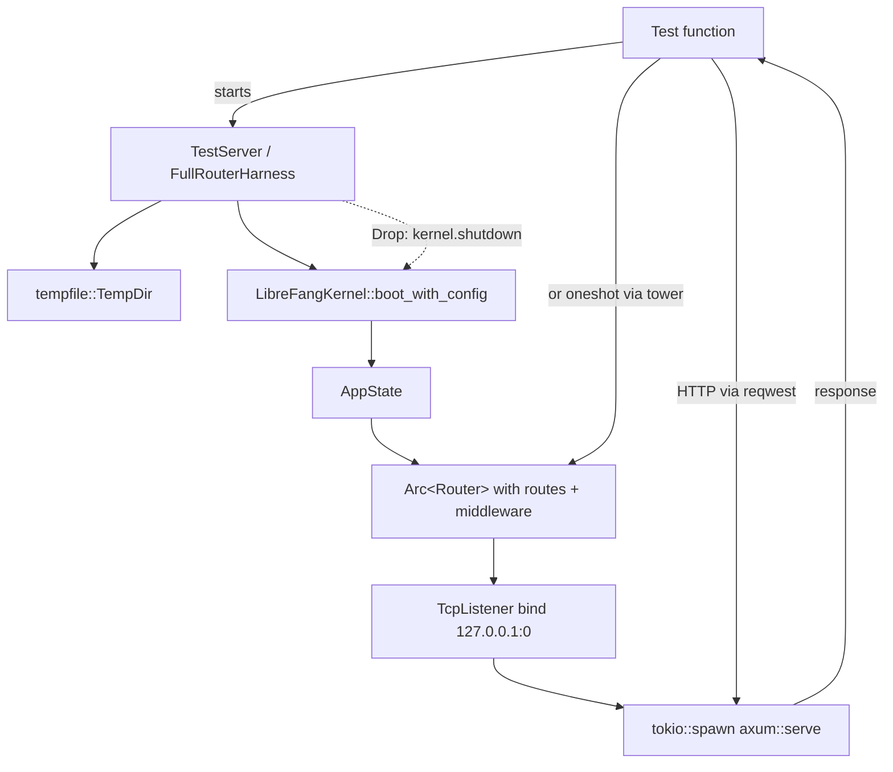

# Other — librefang-api-tests

# librefang-api-tests

Integration and load tests for the LibreFang HTTP API. These tests boot a real `LibreFangKernel`, bind an axum server to a random port, and exercise endpoints via `reqwest` — no mocking.

## Test Files

| File | Purpose | Run command |
|------|---------|-------------|
| `api_integration_test.rs` | End-to-end HTTP tests for every API surface | `cargo test -p librefang-api --test api_integration_test -- --nocapture` |
| `daemon_lifecycle_test.rs` | Daemon startup, PID file, health probe, graceful shutdown | `cargo test -p librefang-api --test daemon_lifecycle_test` |
| `load_test.rs` | Concurrent throughput, latency percentiles, session/workflow stress | `cargo test -p librefang-api --test load_test -- --nocapture` |
| `openapi_spec_test.rs` | Generates and validates the OpenAPI spec to `openapi.json` | `cargo test -p librefang-api --test openapi_spec_test` |

## Test Infrastructure

### TestServer

The primary harness. Creates a temporary directory, boots a `LibreFangKernel` with an ollama provider (no real LLM needed), builds a minimal axum `Router` with the routes under test, binds to `127.0.0.1:0`, and returns the base URL for `reqwest` calls.

```rust
let server = start_test_server().await;
let client = reqwest::Client::new();
let resp = client.get(format!("{}/api/health", server.base_url)).send().await.unwrap();
```

Cleanup: `TestServer::drop` calls `state.kernel.shutdown()`, which stops the runtime. The `tempfile::TempDir` is deleted automatically.

### FullRouterHarness

Uses `server::build_router()` to construct the complete production router — including versioned aliases (`/api/v1/*`), locale files, the dashboard, migration endpoints, and provider lists. Tests that need the full routing stack (version negotiation, locale serving, provider metadata) use this instead of `TestServer`.

```rust
let harness = start_full_router("").await;
let response = harness.app.clone()
    .oneshot(Request::builder().uri("/api/health").body(Body::empty()).unwrap())
    .await.unwrap();
```

### Provider Variants

| Function | LLM provider | Use case |
|----------|-------------|----------|
| `start_test_server()` | ollama (no key) | All tests that don't need a real LLM response |
| `start_test_server_with_llm()` | groq | Tests gated behind `GROQ_API_KEY` env var |
| `start_test_server_with_provider(provider, model, env)` | configurable | Custom provider setups |
| `start_test_server_with_auth(api_key)` | ollama | Tests that enable Bearer-token authentication |

## Architecture



Tests interact with the server in two ways:

1. **Real HTTP** (`TestServer`) — `reqwest::Client` sends requests to the random-bound TCP port. Used for most integration tests.
2. **In-process tower oneshot** (`FullRouterHarness`) — calls `app.clone().oneshot(request)` without network I/O. Used when testing router-level features (version headers, locale files, auth middleware responses).

## Test Coverage by Area

### API Endpoints (`api_integration_test.rs`)

- **Health & Status**: `GET /api/health` (public, redacted), `GET /api/status` (detailed, includes agent count and uptime)
- **Agent Lifecycle**: spawn via `POST /api/agents`, list (paginated with `items`/`total`/`offset`/`limit`), kill via `DELETE /api/agents/{id}`
- **Agent Operations**: send message (`POST /api/agents/{id}/message`), session retrieval, metrics, logs with level filtering
- **Workflows**: create, list
- **Triggers**: create, list (unfiltered and filtered by `agent_id`), delete
- **Tools**: list all, get by name, 404 for nonexistent
- **MCP Bridge**: `POST /mcp` with `X-LibreFang-Agent-Id` header for caller-context rehydration (regression guard for issue #2699)
- **Config Reload**: hot-reload proxy changes without restart
- **Migration**: OpenClaw migration with empty `target_dir` falls back to daemon home
- **Error Handling**: invalid UUID → 400, nonexistent agent → 404, invalid TOML manifest → 400

### Authentication (`api_integration_test.rs`)

Tests using `start_test_server_with_auth()`:

- `GET /api/health` remains public even with auth enabled
- Requests without a token → 401 "Missing"
- Wrong bearer token → 401 "Invalid"
- Correct `Bearer <api_key>` → 200
- Empty API key in config disables auth entirely

### Versioning & Routing (`api_integration_test.rs`)

- `/api/v1/*` aliases serve the same handlers as `/api/*`
- `x-api-version: v1` header on all responses
- Path-based version wins over unknown `Accept` header (`application/vnd.librefang.v99+json`)
- `GET /api/versions` returns current and supported version list
- Unauthorized responses still include `x-api-version`

### Agent List Features (`api_integration_test.rs`)

- **Pagination**: `limit` and `offset` query params, clamped to max 100
- **Sorting**: `sort=name|created_at|last_active|state`, invalid field → 400
- **Text search**: `q=<query>` filters by name/description

### Daemon Lifecycle (`daemon_lifecycle_test.rs`)

- `DaemonInfo` serialization round-trip
- `read_daemon_info()` from file, missing file (→ `None`), corrupt JSON (→ `None`)
- Full lifecycle: boot kernel → write `daemon.json` → verify health/status → call shutdown → verify cleanup
- Server responds to health within 1 second of startup

### Load Tests (`load_test.rs`)

| Test | What it measures |
|------|-----------------|
| `load_concurrent_agent_spawns` | 20 parallel `POST /api/agents` (marked `#[ignore]` — race condition) |
| `load_endpoint_latency` | p50/p95/p99 for 8 read endpoints over 100 iterations each |
| `load_concurrent_reads` | 50 simultaneous GETs across health/agents/status/metrics |
| `load_session_management` | Create 10 sessions, list, rapid-switch |
| `load_workflow_operations` | 15 concurrent workflow creates + list |
| `load_spawn_kill_cycle` | Sequential spawn then kill of 10 agents (marked `#[ignore]`) |
| `load_metrics_sustained` | 200 sequential `GET /api/metrics` requests |

Load tests print throughput numbers to stderr. The p95 threshold is 1 second — these are smoke tests for pathological slowness, not microbenchmarks.

### OpenAPI Spec (`openapi_spec_test.rs`)

`generate_openapi_json` calls `ApiDoc::openapi()`, serializes to JSON, validates that it contains 100+ paths, and writes the result to `<repo_root>/openapi.json` for SDK codegen and CI.

## How to Add a New Test

1. **Decide the harness**: If the test exercises standard agent/workflow/trigger endpoints, use `start_test_server()`. If it needs the full production router (locales, versioning, providers, migration), use `start_full_router()`.

2. **For LLM-dependent tests**, guard with:
   ```rust
   if std::env::var("GROQ_API_KEY").is_err() {
       eprintln!("GROQ_API_KEY not set, skipping LLM integration test");
       return;
   }
   let server = start_test_server_with_llm().await;
   ```

3. **For auth tests**, use `start_test_server_with_auth("your-key")` which layers the `middleware::auth` middleware onto the router.

4. **Cleanup is automatic** — the `TempDir` and kernel shutdown happen in `Drop`. No teardown code needed.

## Manifest Constants

Three TOML manifests are defined as constants for spawning test agents:

- **`TEST_MANIFEST`** — ollama provider, grants `file_read` capability. Used by most tests.
- **`LLM_MANIFEST`** — groq provider, grants `file_read`. Used by `test_send_message_with_llm`.
- **`MCP_TEST_MANIFEST`** — ollama provider, grants `cron_list`, `cron_create`, `cron_cancel`. Used by MCP bridge tests.

## Key Dependencies

- `tempfile` — isolated temporary directories per test
- `reqwest` — HTTP client for real network calls
- `tower::ServiceExt` — in-process `oneshot()` for full-router tests
- `librefang_kernel::LibreFangKernel` — real kernel instance
- `librefang_api::{routes, middleware, server, ws}` — production code under test
- `librefang_runtime::registry_sync` — populates model catalog in `start_full_router`