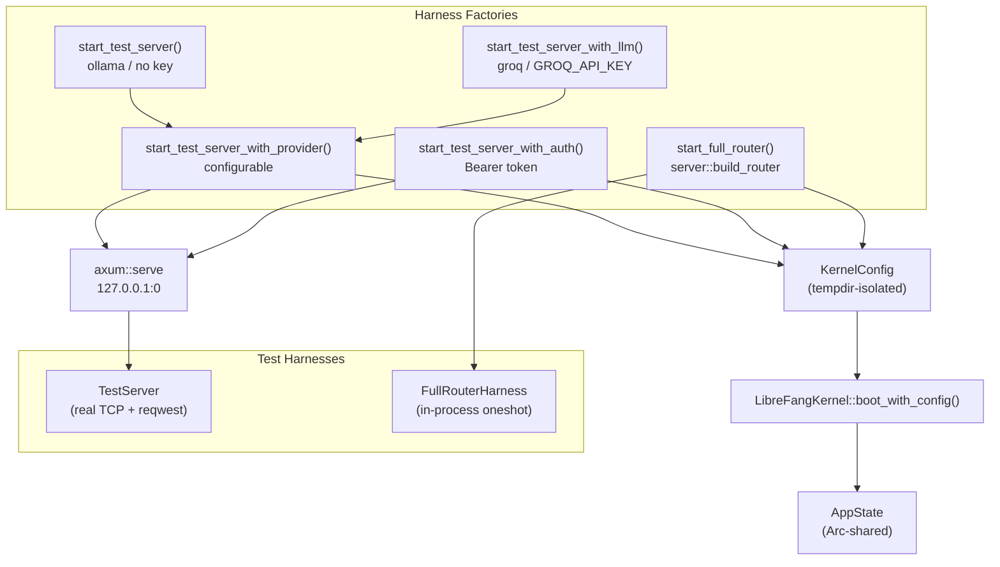

# Other — librefang-api-tests

# librefang-api-tests

Integration, lifecycle, load, and spec-validation tests for the LibreFang HTTP API. These tests boot a real `LibreFangKernel`, bind an axum server to a random port, and exercise endpoints over actual HTTP using `reqwest`. No mocks.

## Running

```bash
# All tests (no LLM key needed for most)
cargo test -p librefang-api --test api_integration_test -- --nocapture
cargo test -p librefang-api --test daemon_lifecycle_test -- --nocapture
cargo test -p librefang-api --test load_test -- --nocapture
cargo test -p librefang-api --test openapi_spec_test -- --nocapture

# LLM-gated tests only (requires a real provider)
GROQ_API_KEY=... cargo test -p librefang-api --test api_integration_test -- --nocapture
```

## Architecture



## Test Harness Types

### `TestServer` — real TCP server

Boots a kernel, constructs an `AppState`, builds a minimal axum `Router` with the subset of routes under test, binds to `127.0.0.1:0` (OS-assigned port), and spawns the server in a background tokio task. Tests use `reqwest::Client` to hit `http://{addr}/...`.

The `Drop` impl calls `state.kernel.shutdown()` to clean up.

**Factory functions:**

| Function | LLM Provider | Auth | Use case |
|---|---|---|---|
| `start_test_server()` | ollama (no key) | none | Most integration tests |
| `start_test_server_with_llm()` | groq | none | Real LLM call tests (gated on `GROQ_API_KEY`) |
| `start_test_server_with_provider(provider, model, env)` | configurable | none | Custom provider setups |
| `start_test_server_with_auth(api_key)` | ollama | Bearer token | Auth middleware tests |

All factories create an isolated `tempfile::TempDir` for `home_dir`/`data_dir` so tests never collide with a real daemon's state.

### `FullRouterHarness` — in-process router

Calls `server::build_router()` to get the full production router (versioned paths, dashboard static files, locale serving, middleware stack). Tests use `app.clone().oneshot(Request<Body>)` instead of TCP — faster for tests that don't need real HTTP.

## Test Files

### `api_integration_test.rs`

The primary integration test suite. Covers:

**Health and status**
- `test_health_endpoint` — public health returns `{ status: "ok", version }` with no sensitive fields; `x-request-id` header injected
- `test_status_endpoint` — detailed status with `agent_count`, `uptime_seconds`, `default_provider`, agent list
- `test_request_id_header_is_uuid` — every response gets a valid UUID in `x-request-id`

**API versioning**
- `test_build_router_exposes_versioned_api_aliases` — both `/api/health` and `/api/v1/health` return `x-api-version: v1`; `/api/versions` lists supported versions
- `test_build_router_path_version_beats_unknown_accept_header` — path-based version wins over malformed `Accept` header

**Dashboard and providers**
- `test_build_router_serves_dashboard_locales` — `/locales/en.json`, `/locales/zh-CN.json`, `/locales/ja.json` return correct i18n keys
- `test_build_router_providers_marks_local_providers` — `/api/providers` marks ollama with `is_local: true`
- `test_build_router_unauthorized_responses_include_api_version_header` — 401 responses still include `x-api-version`

**Agent lifecycle**
- `test_spawn_list_kill_agent` — full CRUD cycle: POST to spawn, GET to list (paginated `{ items, total, offset, limit }`), DELETE to kill
- `test_multiple_agents_lifecycle` — spawn 3 agents, verify count, kill individually, verify cleanup
- `test_agent_session_empty` — newly spawned agent has 0 messages
- `test_agent_monitoring_endpoints` — `/api/agents/{id}/metrics` returns token usage/tool call stats; `/api/agents/{id}/logs` supports level filtering
- `test_invalid_agent_id_returns_400` — non-UUID path params rejected with 400
- `test_kill_nonexistent_agent_returns_404` — valid UUID that doesn't exist returns 404
- `test_spawn_invalid_manifest_returns_400` — broken TOML returns 400 with error message

**Pagination, sorting, search**
- `test_agent_list_paginated_response_format` — verifies `{ items, total, offset, limit }` envelope
- `test_agent_list_invalid_sort_returns_400` — unknown sort field rejected
- `test_agent_list_valid_sort_fields` — `name`, `created_at`, `last_active`, `state` accepted
- `test_agent_list_limit_clamped_to_max` — limit > 100 clamped to 100
- `test_agent_list_pagination` — offset/limit paging across multiple pages
- `test_agent_list_text_search` — `?q=` filters by name/description

**Authentication** (uses `start_test_server_with_auth`)
- `test_auth_health_is_public` — `/api/health` accessible without token
- `test_auth_rejects_no_token` — protected endpoints return 401 "Missing" with no header
- `test_auth_rejects_wrong_token` — wrong Bearer token returns 401 "Invalid"
- `test_auth_accepts_correct_token` — correct token returns 200
- `test_auth_disabled_when_no_key` — empty API key in config disables auth entirely

**Workflows and triggers**
- `test_workflow_crud` — create workflow with steps, list, verify structure
- `test_trigger_crud` — create lifecycle trigger, list (unfiltered and by `agent_id`), delete, verify empty

**Tools**
- `test_list_tools` — returns array with `total > 0`
- `test_get_tool_found` — fetch individual tool by name, verify `input_schema`
- `test_get_tool_not_found` — unknown tool returns 404

**Hot config reload**
- `test_config_reload_hot_reloads_proxy_changes` — POST `/api/config/reload` picks up proxy changes without restart; response includes `hot_actions_applied: ["ReloadProxy"]`

**Migration**
- `test_run_migrate_uses_daemon_home_when_target_dir_is_empty` — POST `/api/migrate` with `target_dir: ""` writes to kernel's home directory; verifies `config.toml`, `agent.toml`, and `migration_report.md`

**Hands / chat-picker grouping**
- `list_active_hands_includes_definition_metadata` — installs a hand definition, activates it, sets agents, then verifies `/api/hands/active` returns enriched fields: `hand_name`, `hand_icon`, `coordinator_role`, `agent_ids` role map

**MCP bridge** (`/mcp` endpoint)
- `test_mcp_http_rehydrates_caller_context_from_agent_header` — regression test for issue #2699: `X-LibreFang-Agent-Id` header rehydrates caller context so CLI drivers can call workspace tools
- `test_mcp_http_invalid_agent_header_falls_back_to_unauthenticated` — garbage/unknown UUID degrades gracefully to unauthenticated path (same error, not a 500)
- `test_mcp_http_unrestricted_agent_can_call_any_tool` — agent with no `[capabilities]` section (unrestricted) can call any tool through the bridge
- `test_mcp_http_enforces_agent_tool_allowlist` — agent whose manifest omits `cron_list` gets "Permission denied" through the bridge

**Real LLM** (gated on `GROQ_API_KEY`)
- `test_send_message_with_llm` — spawns a Groq-backed agent, sends "Say hello in exactly 3 words", verifies non-empty response with `input_tokens > 0` and `output_tokens > 0`, then checks session has messages

### `daemon_lifecycle_test.rs`

Tests the daemon startup/shutdown lifecycle and PID file management.

**Unit tests:**
- `test_daemon_info_serde_roundtrip` — `DaemonInfo` serializes to/from JSON correctly
- `test_read_daemon_info_from_file` — reads a valid `daemon.json` from disk
- `test_read_daemon_info_missing_file` — returns `None` when file absent
- `test_read_daemon_info_corrupt_json` — returns `None` for invalid JSON
- `test_stale_daemon_info_detection` — reads file even with impossible PID (liveness check is upstream's job)

**Integration tests:**
- `test_full_daemon_lifecycle` — boot kernel → start server → write `daemon.json` → verify health/status endpoints → POST `/api/shutdown` → verify cleanup
- `test_server_immediate_responsiveness` — health endpoint responds in <1s from first bind

### `load_test.rs`

Performance and throughput smoke tests. All use `start_test_server()` with ollama (no real LLM calls).

| Test | What it measures | Threshold |
|---|---|---|
| `load_endpoint_latency` | p50/p95/p99 for 8 GET endpoints (100 samples each after warmup) | p95 < 1s |
| `load_concurrent_reads` | 50 simultaneous GETs across health/agents/status/metrics | all succeed |
| `load_concurrent_agent_spawns` | 20 parallel POST `/api/agents` | ≥18 succeed (`#[ignore]` — race condition) |
| `load_session_management` | Create 10 sessions, list, switch between them | at least some created |
| `load_workflow_operations` | 15 concurrent workflow creates, then list | all accounted for |
| `load_spawn_kill_cycle` | Sequential spawn → kill 10 agents | only default assistant remains (`#[ignore]`) |
| `load_metrics_sustained` | 200 sequential GET `/api/metrics`, verify `librefang_agents_active` present | all 200 |

Tests marked `#[ignore]` have known race conditions in concurrent agent lifecycle — run them explicitly with `--ignored` when needed.

### `openapi_spec_test.rs`

- `generate_openapi_json` — calls `ApiDoc::openapi()` via utoipa, serializes to JSON, asserts 100+ paths present, writes to `../../openapi.json` at repo root for SDK codegen and CI.

## Test Manifests

| Constant | Provider | Capabilities | Purpose |
|---|---|---|---|
| `TEST_MANIFEST` | ollama | `file_read`, full memory | Default agent for non-LLM tests |
| `LLM_MANIFEST` | groq | `file_read`, full memory | Real LLM integration tests |
| `MCP_TEST_MANIFEST` | ollama | `cron_list`, `cron_create`, `cron_cancel`, full memory | MCP bridge tests needing cron tools |
| `UNRESTRICTED_MANIFEST` | ollama | none (no `[capabilities]`) | MCP unrestricted agent test |

## Key Dependencies

- `LibreFangKernel::boot_with_config()` — boots the runtime kernel with an isolated config
- `AppState` — shared application state (`Arc`-wrapped), constructed per test
- `server::build_router()` — production router builder (used by `FullRouterHarness`)
- `middleware::request_logging` / `middleware::auth` — injected via `axum::middleware::from_fn`
- `routes::*` — individual route handlers mounted on test routers
- `ws::agent_ws` — WebSocket route (mounted but not exercised over WS in these tests)
- `tempfile::TempDir` — auto-cleaned isolation directories; held alive by the harness struct

## Conventions

- All async tests use `#[tokio::test(flavor = "multi_thread")]` because kernel operations spawn background tasks.
- Temp directories are owned by the harness struct (`_tmp` field) and cleaned up on `Drop`.
- Kernel shutdown is explicit via `Drop` on the harness — not relying on process exit.
- The default assistant agent is auto-spawned by the kernel, so agent counts always include it (+1 to test-spawned agents).
- LLM-dependent tests check `std::env::var("GROQ_API_KEY")` and print a skip message rather than failing when the key is absent.