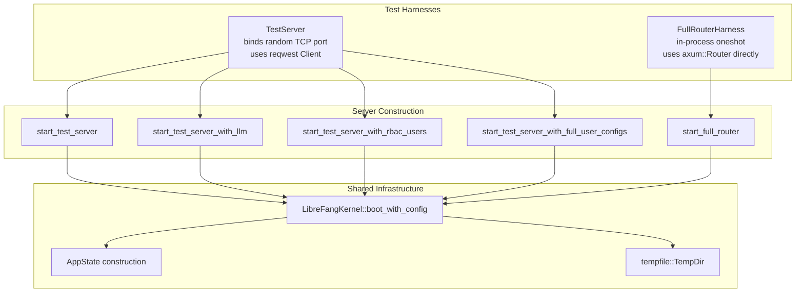

# Other — librefang-api-tests

# librefang-api-tests — HTTP Integration Test Suite

## Purpose

This module contains real-HTTP integration tests for the LibreFang API. Every test boots a live `LibreFangKernel`, binds an axum HTTP server to a random port on `127.0.0.1`, and exercises endpoints through `reqwest` (or axum `oneshot`) with no mocks or stubs. The goal is to verify the full request-to-response path — middleware, routing, handler logic, kernel integration — under realistic conditions.

Tests that make actual LLM calls are gated behind the `GROQ_API_KEY` environment variable and are silently skipped when the key is absent.

**Run command:**
```bash
cargo test -p librefang-api --test api_integration_test -- --nocapture
```

## Architecture Overview



## Test Harnesses

### `TestServer` — Live HTTP Server

Boots a kernel, constructs an `AppState`, builds a minimal or full axum `Router`, binds to `127.0.0.1:0` (OS-assigned port), and returns the base URL. Tests use a `reqwest::Client` to send real HTTP requests.

- **Cleanup:** The `Drop` implementation calls `state.kernel.shutdown()`.
- **Tempdir:** Held alive via `_tmp: tempfile::TempDir` so the kernel's data directory persists for the test lifetime.

**Construction functions:**

| Function | Purpose |
|---|---|
| `start_test_server()` | Uses ollama provider (no API key needed). Suitable for all non-LLM tests. |
| `start_test_server_with_llm()` | Uses Groq provider. Requires `GROQ_API_KEY`. |
| `start_test_server_with_provider(provider, model, api_key_env)` | Generic provider configuration. |
| `start_test_server_with_auth(api_key)` | Enables Bearer-token auth middleware with `middleware::AuthState`. |
| `start_test_server_with_rbac_users(api_key, users)` | Seeds `UserConfig` rows with hashed API keys, wires audit/budget/authz/user routers, enables RBAC middleware. |
| `start_test_server_with_full_user_configs(api_key, users)` | Same as above but accepts pre-built `UserConfig` structs so per-user policy fields (`tool_policy`, `memory_access`, `budget`, `channel_tool_rules`) can be precisely seeded. |

### `FullRouterHarness` — In-Process Router

Calls `server::build_router()` (the production router builder) and exercises it via `axum::Router::oneshot()`. This avoids a TCP round-trip and allows testing routes that aren't manually wired into the `TestServer` harness (versioned API, dashboard locales, providers, migration, hands, etc.).

- **Cleanup:** `Drop` calls `state.kernel.shutdown()`.
- **Registry sync:** Calls `registry_sync::sync_registry` to populate the model catalog before kernel boot.

### `start_full_router_with_proactive(enabled)` — Memory Config Variant

A specialized `FullRouterHarness` builder that sets `proactive_memory.enabled` to a specific boolean. Used for the issue #3070 regression tests.

## Test Manifests

Four TOML manifests are defined as constants, each exercising different agent configurations:

| Constant | Provider | Capabilities | Purpose |
|---|---|---|---|
| `TEST_MANIFEST` | ollama | `tools=["file_read"]` | General agent CRUD tests |
| `TEST_MANIFEST_B` | ollama | `tools=["file_read"]` | Distinct agent for cross-session guard tests |
| `LLM_MANIFEST` | groq | `tools=["file_read"]` | Real LLM round-trip (requires `GROQ_API_KEY`) |
| `MCP_TEST_MANIFEST` | ollama | `tools=["cron_list","cron_create","cron_cancel"]` | `/mcp` bridge caller-context tests |

## Test Categories

### Health & Status

| Test | Endpoint | Asserts |
|---|---|---|
| `test_health_endpoint` | `GET /api/health` | Status `ok`, version present, `x-request-id` header, no sensitive fields leaked |
| `test_status_endpoint` | `GET /api/status` | `running`, agent count, uptime, default provider, agent list |
| `test_request_id_header_is_uuid` | `GET /api/health` | `x-request-id` is a valid UUID |

### API Versioning (FullRouterHarness)

| Test | Asserts |
|---|---|
| `test_build_router_exposes_versioned_api_aliases` | Both `/api/health` and `/api/v1/health` return 200 with `x-api-version: v1`. `/api/versions` returns supported versions. |
| `test_build_router_path_version_beats_unknown_accept_header` | Path-based versioning wins over `Accept: application/vnd.librefang.v99+json` |
| `test_build_router_unauthorized_responses_include_api_version_header` | 401 responses still carry `x-api-version: v1` |

### Dashboard & Static Assets (FullRouterHarness)

| Test | Asserts |
|---|---|
| `test_build_router_serves_dashboard_locales` | `/locales/{en,zh-CN,ja}.json` returns correct translation keys |

### Providers (FullRouterHarness)

| Test | Asserts |
|---|---|
| `test_build_router_providers_marks_local_providers` | `/api/providers` lists ollama with `is_local: true` |

### Migration (FullRouterHarness)

| Test | Asserts |
|---|---|
| `test_run_migrate_uses_daemon_home_when_target_dir_is_empty` | `POST /api/migrate` with empty `target_dir` writes config, agent, and migration report to the daemon's home directory. Injects `ConnectInfo` for loopback auth. |

### Agent CRUD

| Test | Flow |
|---|---|
| `test_spawn_list_kill_agent` | Spawn → verify 201 + `agent_id` → list shows 2 agents → kill → list shows 1 |
| `test_multiple_agents_lifecycle` | Spawn 3 → list shows 4 (incl. default assistant) → kill one → kill rest → only default remains |
| `test_invalid_agent_id_returns_400` | Bad UUID paths return 400 with "Invalid" error |
| `test_kill_nonexistent_agent_returns_404` | Valid but unknown UUID returns 404 |
| `test_spawn_invalid_manifest_returns_400` | Malformed TOML returns 400 with "Invalid manifest" |

### Agent Sessions

| Test | Endpoint | Asserts |
|---|---|---|
| `test_agent_session_empty` | `GET /api/agents/{id}/session` | Fresh agent has 0 messages |
| `test_get_agent_session_rejects_cross_agent_session_id` | `GET /api/agents/{A}/session?session_id={B's}` | Cross-agent read → 404, malformed UUID → 400, same-agent round-trip → 200 |
| `test_agent_session_trajectory_export_empty` | `GET /api/agents/{id}/sessions/{sid}/trajectory` | JSON bundle with schema/metadata/messages. JSONL format returns NDJSON with metadata header line. Correct `content-type` and `content-disposition`. |
| `test_agent_session_trajectory_404_on_unknown_session` | Random session UUID → 404 |

### Agent Monitoring

| Test | Asserts |
|---|---|
| `test_agent_monitoring_endpoints` | `/metrics` returns `token_usage`, `tool_calls`, `avg_response_time_ms`. `/logs?level=custom_error&n=10` filters correctly. |

### Agent List Pagination, Sorting, Search

| Test | Query Params | Asserts |
|---|---|---|
| `test_agent_list_paginated_response_format` | (none) | Response has `items`, `total`, `offset`, `limit` |
| `test_agent_list_invalid_sort_returns_400` | `sort=invalid_field` | 400 with "Invalid sort field" |
| `test_agent_list_valid_sort_fields` | `sort=name\|created_at\|last_active\|state` | All return 200 |
| `test_agent_list_limit_clamped_to_max` | `limit=9999` | Response `limit` clamped to 100 |
| `test_agent_list_pagination` | `limit=1&offset=0` then `offset=1` | Each page returns 1 item, total ≥ 3 |
| `test_agent_list_text_search` | `q=unique-searchable` / `q=nonexistent` | Matches by name; empty result for no match |

### Config Reload

| Test | Asserts |
|---|---|
| `test_config_reload_hot_reloads_proxy_changes` | `POST /api/config/reload` after writing proxy config → `restart_required: false`, `hot_actions_applied` contains `"ReloadProxy"` |

### Tools

| Test | Endpoint | Asserts |
|---|---|---|
| `test_list_tools` | `GET /api/tools` | `tools` array, `total > 0` |
| `test_get_tool_found` | `GET /api/tools/{name}` | Name, description, `input_schema` |
| `test_get_tool_not_found` | `GET /api/tools/nonexistent` | 404 |

### Workflows

| Test | Flow |
|---|---|
| `test_workflow_crud` | Create workflow with one step → list shows 1 workflow with correct shape |

### Triggers

| Test | Flow |
|---|---|
| `test_trigger_crud` | Create lifecycle trigger → list (unfiltered + filtered) → delete → list empty |

### Auth

| Test | Server Config | Asserts |
|---|---|---|
| `test_auth_health_is_public` | api_key set | `/api/health` returns 200 without token |
| `test_auth_rejects_no_token` | api_key set | Protected endpoint → 401 "Missing" |
| `test_auth_rejects_wrong_token` | api_key set | Wrong Bearer → 401 "Invalid" |
| `test_auth_accepts_correct_token` | api_key set | Correct Bearer → 200 |
| `test_auth_disabled_when_no_key` | no api_key | Protected endpoint → 200 without token |

### LLM Integration (requires `GROQ_API_KEY`)

| Test | Asserts |
|---|---|
| `test_send_message_with_llm` | Full round-trip: spawn Groq agent → send message → receive non-empty response with `input_tokens > 0`, `output_tokens > 0` → session has messages |

### MCP Bridge (`/mcp`)

Tests for issue #2699 — the `/mcp` endpoint must rehydrate caller context from the `X-LibreFang-Agent-Id` header.

| Test | Scenario | Expected |
|---|---|---|
| `test_mcp_http_rehydrates_caller_context_from_agent_header` | No header vs. valid header | No header → error "Agent ID required". With header → success (empty cron list). |
| `test_mcp_http_invalid_agent_header_falls_back_to_unauthenticated` | Garbage / unknown UUID | Degrades gracefully to unauthenticated error path (not 500) |
| `test_mcp_http_unrestricted_agent_can_call_any_tool` | Manifest with no `[capabilities]` | `cron_list` succeeds (empty capabilities = unrestricted) |
| `test_mcp_http_enforces_agent_tool_allowlist` | Manifest with only `file_read` | `cron_list` → "Permission denied" |

### Hands

| Test | Asserts |
|---|---|
| `list_active_hands_includes_definition_metadata` | `/api/hands/active` returns `hand_name`, `hand_icon`, `coordinator_role`, `agent_ids` map — not just legacy `agent_id` |
| `hand_runtime_config_patch_supports_tristate_and_404` | `PATCH /api/agents/{id}/hand-runtime-config` with set/preserve/clear semantics. Nullable fields (`api_key_env`, `base_url`) use tri-state: absent = preserve, `null` = preserve, empty/whitespace = clear. Unknown agent → 404. |

### Multi-Client Session Streaming

| Test | Asserts |
|---|---|
| `test_attach_session_stream_404_for_unknown_agent` | Unknown agent/session → 404 |
| `test_attach_session_stream_fans_out_to_multiple_clients` | Two concurrent SSE clients attach to the same session stream. After confirming `receiver_count ≥ 2`, a `StreamEvent::TextDelta` is published via the kernel's session stream hub. Both clients receive it. |

### Memory (Issue #3070)

Regression tests ensuring disabled proactive memory returns 200, not 500.

| Test | Proactive | Asserts |
|---|---|---|
| `test_memory_list_returns_200_when_proactive_disabled` | `false` | `proactive_enabled: false`, `total: 0`, empty `memories` array |
| `test_memory_stats_returns_200_when_proactive_disabled` | `false` | `proactive_enabled: false`, `stats: null` |
| `test_memory_list_includes_proactive_enabled_when_enabled` | `true` | `proactive_enabled: true`, `memories` array, `total` number |
| `test_memory_stats_includes_proactive_enabled_when_enabled` | `true` | `proactive_enabled: true`, numeric fields |

### RBAC — Audit & Budget Endpoints

Tests for admin-only endpoints: `/api/audit/query`, `/api/audit/export`, `/api/budget/users`, `/api/budget/users/{id}`.

| Test | Caller | Asserts |
|---|---|---|
| `test_audit_query_rejects_anonymous` | No Bearer | 401 — middleware rejects before handler |
| `test_audit_query_rejects_viewer_admin_returns_200` | Viewer vs Admin | Viewer → 403 (in-handler `require_admin` gate). Admin → 200 with `entries`, `count`, `limit`. |
| `test_audit_export_csv_emits_documented_headers` | Admin | `Content-Type: text/csv`, `Content-Disposition: attachment; ...audit.csv`, CSV header row includes `prev_hash` as last column |
| `test_user_budget_detail_includes_enforced_true` | Admin | `enforced: true`, hourly/daily/monthly spend numerics, `alert_breach` boolean |

### RBAC — Effective Permissions (`/api/authz/effective/{user_id}`)

| Test | Caller | Asserts |
|---|---|---|
| `test_effective_permissions_admin_returns_200_with_full_payload` | Admin | All seeded policy fields round-trip: `tool_policy`, `tool_categories`, `memory_access` (incl. `pii_access`), `budget`, `channel_tool_rules`, `channel_bindings` |
| `test_effective_permissions_viewer_rejected_403` | Viewer | 403 — in-handler gate |
| `test_effective_permissions_unknown_user_404` | Admin | Unknown user → 404, not a synthesised guest payload |
| `test_effective_permissions_rejects_anonymous` | No Bearer | 401 |
| `test_effective_permissions_distinguishes_none_from_empty` | Admin | `tool_policy: null` (omitted) vs `tool_policy: {allowed_tools: [], denied_tools: []}` (explicit empty). Same for `tool_categories` and `memory_access`. |

### RBAC — Authz Check

| Test | Asserts |
|---|---|
| `test_authz_check_returns_allow_for_permitted_tool` | Permitted tool → `decision: "allow"` |

## Helper Functions

### `loopback_get(uri)`

Constructs a `Request<Body>` with an injected `ConnectInfo` extension set to `127.0.0.1:0`. Required for `oneshot` tests because production axum populates `ConnectInfo` from the connection layer, but `oneshot` bypasses it. Without this, the auth middleware's fail-closed branch would reject requests from what it sees as a non-loopback origin.

### `call_mcp_cron_list(server, agent_header)`

Sends a JSON-RPC `tools/call` for `cron_list` to the `/mcp` endpoint, optionally setting `X-LibreFang-Agent-Id`. Returns `(StatusCode, serde_json::Value)`.

## Key Design Decisions

1. **Real kernel, real HTTP.** No mocks. Every test boots `LibreFangKernel::boot_with_config` with a temp directory, ensuring the API layer is tested against actual kernel behavior.

2. **Temp directory lifecycle.** The `tempfile::TempDir` is stored in the harness struct. When the test completes and the harness drops, the temp directory is cleaned up. The kernel's `shutdown()` is called explicitly in `Drop` before the tempdir vanishes.

3. **Default assistant auto-spawned.** The kernel spawns a default "assistant" agent on boot. Tests account for this — agent counts include this default agent.

4. **Ollama as default test provider.** `start_test_server()` uses ollama with a fake model name, which lets the kernel boot and routes function without any real LLM credentials. Only `test_send_message_with_llm` requires a real API key.

5. **Auth middleware `allow_no_auth: true`.** The test harnesses set this flag so that requests without a Bearer token are allowed through to the handler layer. This lets the in-handler `require_admin` gates be tested directly (returning 403) rather than being short-circuited by middleware 401s. Production sets this based on the server's open/closed configuration.

6. **Two-layer auth testing.** Some endpoints (audit, authz) have both middleware-level and handler-level access control. Tests verify both: middleware rejection for anonymous callers, and in-handler `require_admin` rejection for authenticated but under-privileged callers.