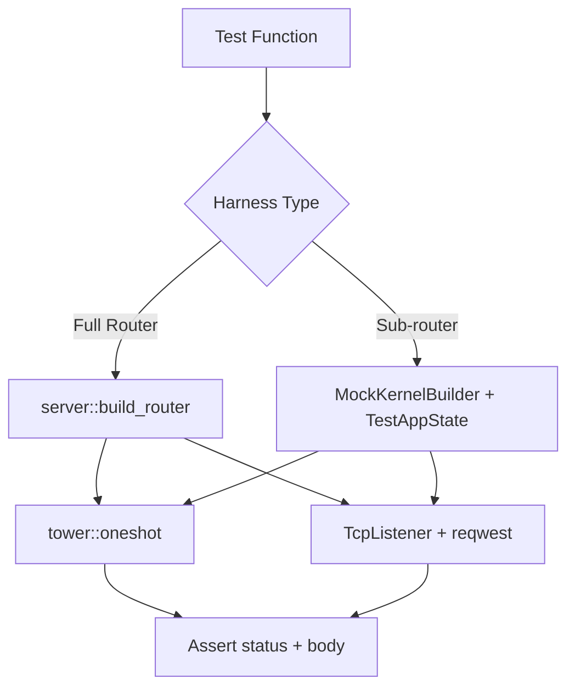

# Other — librefang-api-tests

# librefang-api Tests

Integration test suite for the LibreFang HTTP API layer. Tests exercise the production router, middleware, and handler wiring end-to-end using `tower::oneshot` or real TCP listeners with `reqwest` — no handler-level unit mocks.

## Architecture

Every test boots a kernel (real or mock), constructs an `axum::Router` matching production wiring, and fires HTTP requests through it. Two harness strategies are used depending on what's being tested:



**Full router** (`server::build_router`) — boots `LibreFangKernel` with a temp directory and a fake `ollama` provider. Used when tests need the complete middleware stack (auth, request logging, CORS, API versioning). Found in `a2a_routes_integration.rs`, `agents_routes_integration.rs`, `api_integration_test.rs`.

**Sub-router** (`MockKernelBuilder` + `TestAppState`) — builds only the route module under test, nested under `/api`. Skips the full middleware chain; tests that need auth inject `AuthenticatedApiUser` extensions directly. Found in `access_log_agent_id_test.rs`, `access_log_session_id_test.rs`, `agent_kv_authz_integration.rs`.

**Real TCP server** — binds to `127.0.0.1:0`, spawns `axum::serve` in a tokio task, hits it with `reqwest::Client`. Required for tests that exercise connection-level behavior (WebSocket upgrade, `x-request-id` header injection). Found in `api_integration_test.rs`, `agent_identity_registry_test.rs`.

## Test Files

### `api_integration_test.rs`

Broadest coverage file. Boots a real TCP server via `start_test_server()` and exercises:

| Area | Routes | Key tests |
|------|--------|-----------|
| Health & status | `GET /api/health`, `GET /api/status` | Response shape, `x-request-id` is UUID, agent count |
| API versioning | `/api/v1/*`, `/api/versions` | Path-based versioning, `x-api-version` header |
| Locales | `/locales/*.json` | Dashboard i18n files served correctly |
| Providers | `GET /api/providers` | Local providers flagged with `is_local` |
| Agent CRUD | `POST/GET/DELETE /api/agents` | Spawn, list (paginated), kill, idempotent delete |
| Sessions | `GET /api/agents/{id}/session` | Cross-agent session isolation (404 guard), trajectory export |
| Workflows | `POST/GET /api/workflows` | CRUD, run aggregation fields |
| Triggers | `POST/GET/DELETE /api/triggers` | CRUD, agent-scoped filtering |
| Config reload | `POST /api/config/reload` | Hot-reload of proxy settings |
| Migration | `POST /api/migrate` | OpenClaw import with loopback ConnectInfo |
| Monitoring | `GET /api/agents/{id}/metrics`, `/logs` | Audit log filtering, token usage |

LLM-backed tests gated behind `GROQ_API_KEY` env var (`test_send_message_with_llm`).

### `agents_routes_integration.rs`

Focused on the `/api/agents` family using `tower::oneshot` against the full router:

- **List**: empty filter, populated list, invalid sort field rejection (`?sort=not_a_field` → 400)
- **Get**: happy path, invalid UUID → 400 (`invalid_agent_id`), unknown UUID → 404 (`agent_not_found`)
- **PATCH**: update name/description with read-after-write verification, invalid `mcp_servers` payload, auth gate (401 without Bearer when `api_key` is set)
- **DELETE**: idempotent double-delete (both return 200, second has `status: "already-deleted"`), invalid UUID still 400, `?confirm=true` gate (#4614)
- **Session thinking blocks**: `ContentBlock::Thinking` surfaced in session endpoint (multi-block join with `\n\n`), thinking-only turns not dropped, omission when no thinking present
- **Incognito mode**: `incognito: true` accepted without 422, defaults to false when omitted

### `a2a_routes_integration.rs`

Covers Agent-to-Agent federation routes. Mutating endpoints (`/discover`, `/send`, `/tasks/{id}/status`) are tested only on validation/error paths — happy-path discovery requires a live external A2A server.

- `GET /a2a/agents` — public federation listing, always accessible even with `api_key` set. Asserts canonical `PaginatedResponse` envelope (no legacy `agents` field)
- `GET /api/a2a/agents` — dashboard listing, reachable without auth in dev mode
- `GET /api/a2a/agents/{id}` — 404 for unknown, 401 without auth
- `POST /api/a2a/discover` — 400 for missing URL, invalid URL, localhost (SSRF guard via `is_url_safe_for_ssrf`)
- `POST /api/a2a/send` — 400 for missing `url`/`message`, trust gate blocks unapproved targets (regression guard for #3786)
- `GET /api/a2a/tasks/{id}/status` — 400 for missing `?url=`, trust gate, auth required
- `POST /api/a2a/agents/{id}/approve` — 404 for unknown pending, auth required

### `access_log_agent_id_test.rs`

Verifies that `AgentIdField` is attached to response extensions when a handler resolves an agent ID from the path. The access-log middleware reads this marker to emit a structured `agent_id` tracing field.

- **404 with marker**: unknown agent ID on `PUT /api/auto-dream/agents/{id}/enabled` and `GET /api/budget/agents/{id}` — handler still tags the response because the path was well-formed
- **Malformed path no marker**: `not-a-uuid` rejected by `AgentIdField` extractor at 400 before handler runs, so no marker is set

### `access_log_session_id_test.rs`

Same pattern as the agent ID test, but for `SessionIdField`.

- **Session found**: `GET /api/agents/{id}/session` with a registered agent — marker present
- **Agent not found**: unknown agent ID — marker absent (no session resolved)
- **Stream 404**: `GET /api/agents/{id}/sessions/{session_id}/stream` — error before tagging site, marker absent

### `agent_identity_registry_test.rs`

End-to-end tests for the canonical agent UUID registry (#4614). Uses a real TCP server.

- **Spawn registers**: `spawn_agent` records the canonical UUID in `kernel.agent_identities()`
- **Delete gates**: bare `DELETE` → 409 (`delete_confirmation_required`), `?confirm=true` → 200 with `identity_purged: true`
- **Respawn recovers UUID**: after confirmed delete, re-spawning the same agent name yields the same deterministic UUID via `AgentId::from_name`
- **List identities**: `GET /api/agents/identities` returns registered entries with `canonical_uuid` and `created_at`
- **Reset identity**: `POST /api/agents/identities/{name}/reset` gates on `?confirm=true` (409 without), 200 with `previous_canonical_uuid`, 404 on missing name

### `agent_kv_authz_integration.rs`

Owner-scoping on the per-agent KV store (#3749). Injects `AuthenticatedApiUser` extensions directly to model different roles.

For `GET/PUT/DELETE /api/memory/agents/{id}/kv*` and `GET/POST /api/agents/{id}/memory/{export,import}`:

- **Admin** (`UserRole::Admin`): can read/write any agent's KV
- **Owner** (`UserRole::Viewer` matching agent's author): allowed
- **Non-owner viewer**: 404 (not 403 — prevents agent existence enumeration)
- **Anonymous** (no extension): proceeds (global auth middleware handles the gate elsewhere)

## Harness Patterns

### Booting the Full Router

```rust
async fn boot(api_key: &str) -> Harness {
    let tmp = tempfile::tempdir().expect("tempdir");
    librefang_kernel::registry_sync::sync_registry(tmp.path(), /* ... */);

    let config = KernelConfig {
        home_dir: tmp.path().to_path_buf(),
        api_key: api_key.to_string(),
        default_model: DefaultModelConfig { provider: "ollama", /* ... */ },
        ..KernelConfig::default()
    };

    let kernel = Arc::new(LibreFangKernel::boot_with_config(config).expect("kernel boot"));
    kernel.set_self_handle();

    let (app, state) = server::build_router(kernel, "127.0.0.1:0".parse().unwrap()).await;
    Harness { app, state, _tmp: tmp }
}
```

The `_tmp` field keeps the temp directory alive for the test's duration. `Harness::Drop` calls `state.kernel.shutdown()`.

### Sending Requests

Most tests use `tower::ServiceExt::oneshot` directly:

```rust
let resp = harness.app.clone().oneshot(request).await.unwrap();
let status = resp.status();
let body: serde_json::Value = /* parse response body */;
```

Tests requiring real TCP (WebSocket, connection-level headers) use `reqwest::Client` against a spawned server.

### Auth Simulation

Two approaches:

1. **Bearer token in header** — full router processes it through the production auth middleware. Used when testing the auth gate itself.
2. **Extension injection** — `request.extensions_mut().insert(AuthenticatedApiUser { ... })`. Used in sub-router tests to bypass the middleware and test handler-level authorization logic directly.

## Key Contracts Verified

| Contract | Test file | Description |
|----------|-----------|-------------|
| Idempotent DELETE | `agents_routes_integration.rs` | Double-delete returns 200 both times; malformed UUID still 400 |
| Delete confirmation gate | `agent_identity_registry_test.rs` | Bare DELETE → 409; `?confirm=true` → 200 with purge |
| Cross-agent session isolation | `api_integration_test.rs` | Agent A cannot read Agent B's session by guessing UUID |
| Trust gate on A2A send | `a2a_routes_integration.rs` | Unapproved target rejected before any outbound HTTP |
| SSRF guard on A2A discover | `a2a_routes_integration.rs` | localhost URLs blocked with 400 |
| KV owner-scoping | `agent_kv_authz_integration.rs` | Non-owner viewer gets 404 on get/set/delete/export/import |
| Thinking block persistence | `agents_routes_integration.rs` | `ContentBlock::Thinking` survives session serialization |
| Access log markers | `access_log_*.rs` | `AgentIdField`/`SessionIdField` set on responses even for 404s |
| Canonical envelope shape | `a2a_routes_integration.rs` | `PaginatedResponse` with `items`/`total`/`offset`/`limit`, no legacy fields |
| API versioning | `api_integration_test.rs` | Path version beats unknown Accept header; `x-api-version` always present |

## Running

```bash
# All tests in this directory
cargo test -p librefang-api

# Specific test file
cargo test -p librefang-api --test agents_routes_integration

# LLM-backed test (requires GROQ_API_KEY)
GROQ_API_KEY=... cargo test -p librefang-api --test api_integration_test -- test_send_message_with_llm
```