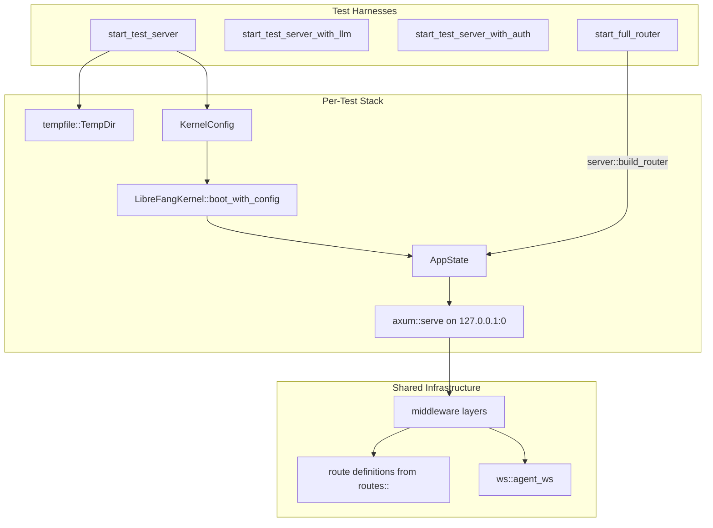

# Other — librefang-api-tests

# librefang-api-tests

Integration and load tests for the LibreFang HTTP API. These tests boot a real `LibreFangKernel`, start an actual axum server on an ephemeral port, and exercise endpoints over HTTP using `reqwest`. No mocks, no test frameworks beyond tokio's test runtime.

## Running

```bash
# All tests (no LLM key needed for most)
cargo test -p librefang-api -- --nocapture

# Single test file
cargo test -p librefang-api --test api_integration_test -- --nocapture

# Tests that call a real LLM (requires Groq)
GROQ_API_KEY=gsk_... cargo test -p librefang-api --test api_integration_test -- --nocapture

# Skipped/flaky tests (concurrent spawn races)
cargo test -p librefang-api --test load_test -- --nocapture --ignored
```

## Architecture



Each test creates an isolated `tempfile::TempDir` holding the kernel's `home_dir` and `data_dir`, boots a fresh `LibreFangKernel`, assembles an `AppState`, and binds an axum server to port 0 (OS-assigned random port). The `TempDir` lives as long as the test's `TestServer` or `FullRouterHarness` struct, ensuring filesystem cleanup on drop. The kernel is shut down in the `Drop` impl.

## Test Files

### `api_integration_test.rs`

The primary integration suite (~30 tests). Covers:

| Category | Tests | Key endpoints |
|---|---|---|
| **Health & Status** | `test_health_endpoint`, `test_status_endpoint` | `/api/health`, `/api/status` |
| **API Versioning** | `test_build_router_exposes_versioned_api_aliases`, `test_build_router_path_version_beats_unknown_accept_header` | `/api/v1/*`, `/api/versions` |
| **Agent Lifecycle** | `test_spawn_list_kill_agent`, `test_multiple_agents_lifecycle`, `test_agent_session_empty` | `/api/agents` |
| **Agent Monitoring** | `test_agent_monitoring_endpoints` | `/api/agents/{id}/metrics`, `/api/agents/{id}/logs` |
| **Pagination & Search** | `test_agent_list_paginated_response_format`, `test_agent_list_pagination`, `test_agent_list_text_search`, `test_agent_list_valid_sort_fields`, `test_agent_list_invalid_sort_returns_400`, `test_agent_list_limit_clamped_to_max` | `/api/agents?q=&sort=&limit=&offset=` |
| **Workflows** | `test_workflow_crud` | `/api/workflows` |
| **Triggers** | `test_trigger_crud` | `/api/triggers` |
| **Tools** | `test_list_tools`, `test_get_tool_found`, `test_get_tool_not_found` | `/api/tools`, `/api/tools/{name}` |
| **Config Reload** | `test_config_reload_hot_reloads_proxy_changes` | `/api/config/reload` |
| **Auth** | `test_auth_health_is_public`, `test_auth_rejects_no_token`, `test_auth_rejects_wrong_token`, `test_auth_accepts_correct_token`, `test_auth_disabled_when_no_key` | Bearer token via `middleware::auth` |
| **MCP Bridge** | `test_mcp_http_rehydrates_caller_context_from_agent_header`, `test_mcp_http_invalid_agent_header_falls_back_to_unauthenticated`, `test_mcp_http_unrestricted_agent_can_call_any_tool`, `test_mcp_http_enforces_agent_tool_allowlist` | `/mcp` with `X-LibreFang-Agent-Id` header |
| **Migration** | `test_run_migrate_uses_daemon_home_when_target_dir_is_empty` | `/api/migrate` |
| **Dashboard** | `test_build_router_serves_dashboard_locales`, `test_build_router_providers_marks_local_providers` | `/locales/*`, `/api/providers` |
| **Hands** | `list_active_hands_includes_definition_metadata` | `/api/hands/active` |
| **Error Handling** | `test_invalid_agent_id_returns_400`, `test_kill_nonexistent_agent_returns_404`, `test_spawn_invalid_manifest_returns_400`, `test_request_id_header_is_uuid` | Various |

### `daemon_lifecycle_test.rs`

Tests daemon startup, PID file management, and shutdown:

- `test_daemon_info_serde_roundtrip` — `DaemonInfo` JSON round-trip.
- `test_read_daemon_info_from_file` — reads `daemon.json` from disk.
- `test_read_daemon_info_missing_file` — returns `None` when absent.
- `test_read_daemon_info_corrupt_json` — returns `None` for invalid JSON.
- `test_full_daemon_lifecycle` — boots kernel, writes `daemon.json`, hits health/status, calls shutdown, cleans up file.
- `test_stale_daemon_info_detection` — verifies file is readable even with a dead PID (liveness check is in `run_daemon`, not `read_daemon_info`).
- `test_server_immediate_responsiveness` — asserts `/api/health` responds in under 1 second.

### `load_test.rs`

Performance benchmarks gated behind `#[ignore]` for flaky tests. All tests print throughput/latency metrics to stderr:

- `load_endpoint_latency` — measures p50/p95/p99 for 8 GET endpoints over 100 requests each, with a 10-request warmup to amortize cold-start costs. Asserts p95 < 1s.
- `load_concurrent_reads` — 50 simultaneous GETs across health/agents/status/metrics.
- `load_concurrent_agent_spawns` (ignored) — 20 parallel POST `/api/agents`.
- `load_spawn_kill_cycle` (ignored) — 10 sequential spawn-then-kill cycles.
- `load_session_management` — creates 10 sessions, lists them, switches through each.
- `load_workflow_operations` — 15 concurrent workflow creates, then lists.
- `load_metrics_sustained` — 200 sequential hits to `/api/metrics`, asserts response contains `librefang_agents_active`.

### `openapi_spec_test.rs`

Single test `generate_openapi_json` that:

1. Calls `ApiDoc::openapi()` via `utoipa::OpenApi`.
2. Serializes to pretty JSON.
3. Asserts 100+ paths exist (regression guard against accidental route removal).
4. Writes the spec to `openapi.json` at the repository root for SDK codegen and CI consumption.

## Test Harness Infrastructure

### `TestServer`

Used by most integration tests. Builds a minimal route table by hand (health, status, agents, triggers, workflows, tools, MCP, shutdown) and attaches middleware explicitly:

```
CorsLayer::permissive()
TraceLayer::new_for_http()
middleware::request_logging
```

The auth variant (`start_test_server_with_auth`) additionally layers in `middleware::auth` with an `AuthState` constructed from the kernel's API key.

### `FullRouterHarness`

Uses `server::build_router` instead of a hand-built route table. This gives the full production middleware stack, API versioning (`/api/v1/*`), dashboard static assets, locale files, provider listing, and migration endpoints. Tests that need the full router (versioning, locales, providers, migration, hands) use this harness.

### `start_test_server_with_provider`

The core factory. Parameters:

- `provider` — LLM provider string (e.g. `"ollama"`, `"groq"`)
- `model` — model identifier
- `api_key_env` — environment variable name for the API key

Creates a `KernelConfig` with `home_dir` and `data_dir` inside a temp directory, boots the kernel, constructs `AppState` with all required fields (caches, session maps, webhook store, shutdown notify), builds the router, binds to `127.0.0.1:0`, and spawns the server in a background tokio task.

## Manifests

Several TOML manifests are defined as constants for spawning test agents:

| Constant | Purpose | Provider | Capabilities |
|---|---|---|---|
| `TEST_MANIFEST` | Default test agent | ollama | `file_read`, full memory |
| `LLM_MANIFEST` | Real LLM calls | groq / llama-3.3-70b-versatile | `file_read`, full memory |
| `MCP_TEST_MANIFEST` | MCP caller-context tests | ollama | `cron_list`, `cron_create`, `cron_cancel` |
| Inline `UNRESTRICTED_MANIFEST` | No tool restrictions | ollama | none (unrestricted) |

## LLM-Gated Tests

Tests requiring a real LLM call check for `GROQ_API_KEY` at startup and gracefully skip if unset:

```rust
if std::env::var("GROQ_API_KEY").is_err() {
    eprintln!("GROQ_API_KEY not set, skipping LLM integration test");
    return;
}
```

`test_send_message_with_llm` is the primary LLM test: spawns a Groq-backed agent, sends `"Say hello in exactly 3 words."`, and asserts non-empty response with positive token counts.

## MCP Caller Context Tests

A critical regression guard for issue #2699. The `/mcp` endpoint must read `X-LibreFang-Agent-Id` from the request header to rehydrate the caller's agent identity. Without this, CLI drivers (claude-code) cannot invoke workspace/cron/media tools because the tool executor has no agent context for permission checks.

The helper `call_mcp_cron_list` sends a JSON-RPC `tools/call` for `cron_list` with an optional agent header. Four tests verify:

1. No header → error ("Agent ID required")
2. Valid header, restricted agent → permission denied (allowlist enforced)
3. Valid header, unrestricted agent → success (empty tools list means "allow all")
4. Invalid/unknown header → graceful fallback to unauthenticated error (not a 500)

## Adding New Tests

1. For endpoint tests that don't need the full router, add a test to `api_integration_test.rs` using `start_test_server()`.
2. If you need the full production middleware stack, versioned routes, or dashboard assets, use `start_full_router()` and `harness.app.clone().oneshot(...)`.
3. For auth-specific tests, use `start_test_server_with_auth("your-api-key")`.
4. For performance benchmarks, add to `load_test.rs`. Use `#[ignore]` if the test is flaky under concurrency.
5. All multi-threaded tests must use `#[tokio::test(flavor = "multi_thread")]` because the kernel spawns background tasks.