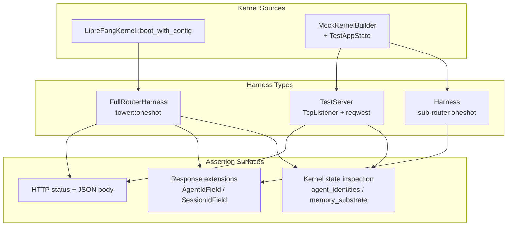

# Other — librefang-api-tests

# librefang-api-tests — API Integration Test Suite

## Purpose

This module houses the integration tests for the `librefang-api` HTTP layer. Tests boot the real `server::build_router` (or targeted sub-routers) and drive requests through `tower::oneshot` or live `TcpListener` + `reqwest` — exercising route registration, auth middleware, handler wiring, and kernel integration end-to-end. No mocks of the HTTP stack; no stubbed handlers. The kernel is real (or a `MockKernelBuilder` variant), and the provider is set to `ollama` with a fake model to avoid real LLM calls unless explicitly opted in via `GROQ_API_KEY`.

These tests are the canonical replacement for the old curl checklist (refs #3721, #3571) and guard against regressions at the API ↔ kernel boundary on every push.

## Test Files and Coverage

| File | Domain | Key Concern |
|------|--------|-------------|
| `api_integration_test.rs` | Full router — health, status, agents CRUD, workflows, triggers, tools, pagination, migration | Broad end-to-end with live HTTP server |
| `agents_routes_integration.rs` | `/api/agents` family — list, get, patch, delete (idempotency #3509), sessions, thinking blocks, incognito (#4073) | `tower::oneshot` against production router |
| `a2a_routes_integration.rs` | A2A federation routes — agent listing, discover, send, task status, approve | Validation/trust-gate paths only (no outbound HTTP) |
| `agent_identity_registry_test.rs` | Canonical UUID registry — spawn registers, delete gates on `?confirm=true` (#4614), respawn recovers deterministic UUID, reset endpoint | Live HTTP server + kernel identity registry |
| `agent_kv_authz_integration.rs` | Owner-scoping on KV store — single-key get/set/delete, bulk export/import | AuthZ helper `assert_kv_owner_or_admin` (#3749) |
| `access_log_agent_id_test.rs` | `AgentIdField` extension marker propagation (#3511) | Response extensions inspection |
| `access_log_session_id_test.rs` | `SessionIdField` extension marker propagation (#3511) | Response extensions inspection |

## Architecture



## Harness Patterns

### FullRouterHarness — `tower::oneshot` against production router

Used by `agents_routes_integration.rs` and `a2a_routes_integration.rs`. Boots `LibreFangKernel` with a temp directory, calls `server::build_router`, and fires `axum::Router::oneshot` requests. No network I/O.

```rust
async fn boot(api_key: &str) -> Harness {
    let tmp = tempfile::tempdir().expect("tempdir");
    librefang_kernel::registry_sync::sync_registry(tmp.path(), ...);
    let kernel = LibreFangKernel::boot_with_config(config).expect("kernel boot");
    let kernel = Arc::new(kernel);
    kernel.set_self_handle();
    let (app, state) = server::build_router(kernel, "127.0.0.1:0".parse().unwrap()).await;
    Harness { app, _tmp: tmp, state, api_key }
}
```

Key properties:
- `api_key` parameter controls whether auth middleware rejects unauthenticated requests. Pass `""` for open-dev-mode tests; pass a non-empty string to exercise 401 gates.
- The kernel's registry cache is synced into the temp dir before boot to avoid network access.
- `kernel.set_self_handle()` is required for internal self-referencing paths.
- Drop calls `kernel.shutdown()` for clean teardown.

### TestServer — Live HTTP on random port

Used by `api_integration_test.rs` and `agent_identity_registry_test.rs`. Binds `TcpListener` to `127.0.0.1:0`, spawns `axum::serve` in a tokio task, and returns a `TestServer` with the `base_url`. Tests use `reqwest::Client` for real HTTP requests.

This pattern is required when testing SSE streams, WebSocket upgrades, or any behavior that depends on actual connection metadata (`ConnectInfo`, etc.).

### Sub-router Harness — Targeted oneshot

Used by `access_log_agent_id_test.rs`, `access_log_session_id_test.rs`, and `agent_kv_authz_integration.rs`. Nests only the relevant route module under `/api`:

```rust
let app = Router::new()
    .nest("/api", routes::agents::router())
    .with_state(state);
```

Uses `MockKernelBuilder` via `TestAppState` for faster boot without full kernel initialization.

## Test Patterns

### Auth Middleware Testing

The auth middleware distinguishes:
1. **No api_key configured** → all routes accessible (dev mode).
2. **api_key set, no Bearer token** → 401 unless route is in `PUBLIC_ROUTES` or `PUBLIC_ROUTES_DASHBOARD_READS` with `require_auth_for_reads == false`.
3. **api_key set, valid Bearer** → proceeds.

The `send()` helper in most harnesses takes an `authed: bool` flag that injects the `authorization: Bearer {api_key}` header when true.

### Extension Marker Testing

The `request_logging` middleware reads `AgentIdField` and `SessionIdField` from response extensions after `next.run().await`. Tests assert directly on `resp.extensions().get::<AgentIdField>()` rather than instrumenting a tracing subscriber — the marker presence is the contract the middleware relies on.

Three cases are tested for each marker:
1. **Happy path** — marker present with correct value.
2. **Unknown agent/session** — marker absent (no resolved id).
3. **Malformed path** — extractor rejects with 400 before handler runs, marker absent.

### Idempotent DELETE (#3509)

`DELETE /api/agents/{id}` is idempotent per RFC 9110 §9.2.2:
- First call on existing agent → `200` with `status: "killed"`.
- Second call on same id → `200` with `status: "already-deleted"`.
- Unknown but well-formed UUID → `200` with `status: "already-deleted"`.
- Malformed UUID → `400` (parse failure short-circuits before idempotent logic).

### Confirmation Gate (#4614)

Destructive operations that purge canonical UUID bindings require `?confirm=true`:
- `DELETE /api/agents/{id}` without confirm → `409` with `code: "delete_confirmation_required"`.
- `POST /api/agents/identities/{name}/reset` without confirm → `409` with `code: "reset_identity_unconfirmed"`.

### Owner-Scoping (AuthZ)

The `assert_kv_owner_or_admin` helper (extracted in #3749) gates per-agent KV operations:
- **Admin** → can read/write any agent's KV.
- **Owner (viewer with matching author)** → can read/write own agent's KV.
- **Non-owner viewer** → 404 (not 403, to avoid information leakage about key existence).
- **No `AuthenticatedApiUser` extension** → proceeds (auth enforced by global middleware at a different layer).

Tests inject `AuthenticatedApiUser` directly into request extensions to model different caller identities without going through the full auth middleware.

### Thinking Blocks in Session History

The session endpoint must surface `ContentBlock::Thinking` blocks so the dashboard can render collapsible reasoning drawers on history reload. Three cases:
1. **Interleaved thinking + text** → `thinking` field contains joined blocks, `content` contains visible text.
2. **No thinking** → `thinking` field absent (not `""`).
3. **Thinking-only turn** (e.g., cancelled response) → `content: ""`, `thinking` field present.

### A2A Trust Gate

Outbound A2A endpoints (`/discover`, `/send`, `/tasks/{id}/status`) exercise only validation and trust-gate paths:
1. Missing required fields → 400.
2. Invalid/non-http URL → 400.
3. SSRF guard (localhost URL) → 400.
4. Unapproved target URL → 400 with trust-gate message.
5. Happy-path discovery/send requires a live external A2A server and is intentionally out of scope.

## Running

```bash
# All integration tests in this module
cargo test -p librefang-api --test a2a_routes_integration
cargo test -p librefang-api --test agents_routes_integration
cargo test -p librefang-api --test api_integration_test
cargo test -p librefang-api --test agent_identity_registry_test
cargo test -p librefang-api --test agent_kv_authz_integration
cargo test -p librefang-api --test access_log_agent_id_test
cargo test -p librefang-api --test access_log_session_id_test

# LLM-dependent test (requires GROQ_API_KEY)
GROQ_API_KEY=... cargo test -p librefang-api --test api_integration_test -- test_send_message_with_llm
```

## Dependencies on Other Crates

| Crate | Role |
|-------|------|
| `librefang-api` | Production router, handlers, middleware, extensions under test |
| `librefang-kernel` | Real kernel (`LibreFangKernel`), registry sync, audit, auth types |
| `librefang-types` | Config types, agent types (`AgentId`, `SessionId`, `AgentManifest`), message types |
| `librefang-testing` | `MockKernelBuilder`, `TestAppState` — lightweight kernel for targeted sub-router tests |
| `axum` + `tower` | `oneshot`, `Body`, request builders |
| `reqwest` | HTTP client for live-server tests |
| `tempfile` | Isolated temp directories for each harness |
| `serde_json` | Request/response serialization |

## Key Invariants Guarded

1. **Route registration completeness** — every documented route returns a non-404 status (either success or a typed error like 400/401/404).
2. **Auth middleware wiring** — public routes remain accessible without auth; protected routes return 401 when api_key is set and no token is provided.
3. **Paginated response envelope** — list endpoints return `{items, total, offset, limit}` shape per #3842; legacy shapes (e.g., `{agents, total}`) are explicitly rejected.
4. **Deterministic UUID recovery** — `AgentId::from_name` re-derives the same v5 UUID after a confirmed delete + respawn.
5. **Cross-agent session isolation** — agent A cannot read agent B's sessions (#3071).
6. **Idempotent deletes** — repeated DELETE on the same agent always returns 200 (#3509).
7. **SSRF protection** — localhost/private-IP URLs are rejected on outbound A2A endpoints.
8. **Trust gate** — unapproved A2A targets are rejected before any outbound HTTP (#3786 regression guard).
9. **Owner-scoped KV** — non-owner viewers get 404 on single-key and bulk KV operations (#3749).
10. **Access-log markers** — `AgentIdField` and `SessionIdField` are present on handler responses where applicable (#3511).